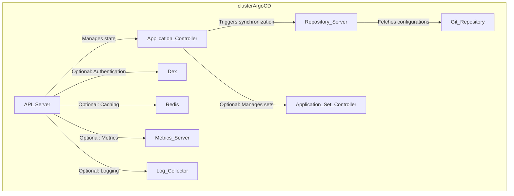

# Chapter 5: Getting Started Argo CD

## Introduction

One of my goals is to simplify the development, deployment, and scaling of complex applications and to bring the full power of Kubernetes to all projects. `ArgoCD` is one of the tools introduced to reach the goals.

With ArgoCD, developers can create application manifests and store them in a Git repository. They can then use ArgoCD to deploy those manifests to a Kubernetes cluster, and it will continuously monitor and reconcile the live environment with the desired state defined in Git.

In this section, we'll take a simple approach to understand Argo CD. We'll explore what it is, how it works, and why it's so useful. Whether you're a tech pro or just starting out, this article aims to explain Argo CD in a way that makes sense. Let's dive in and discover how Argo CD can simplify the way you deploy and manage your applications, especially if you're using Kubernetes.

## Objective

In this exercise we will accomplish & learn following:

- What is GitOps?
- Core components of GitOps
- What is ArgoCD?
- How ArgoCD works?
- Why do we need to use ArgoCD?
- Key features of ArgoCD
- ArgoCD architecture components
- ArgoCD supports tools

Before we explore into hands-on labs, let's lay the groundwork by exploring the fundamental concepts of ArgoCD. Our journey begins with a close look at GitOps, providing a solid understanding before we explore into the specifics of ArgoCD. This foundational knowledge will help for upcoming exercises in practical labs. Let's start by understanding the key principles of GitOps before looking ourselves in to ArgoCD.

## What is GitOps?

GitOps is a modern software development and deployment methodology that uses Git as the single source of truth for the desired state of the system. In GitOps, all configuration changes and updates to the system are made through Git commits and pull requests. This makes it easy to track changes, collaborate with other developers, and manage deployments at scale.

 **GitOps principles**

- Infrastructure as code
- Declarative configuration
- Git as the single source of truth
- Continuous deployment
- Rollback Capabilities:
- Observability
- Security

## Core components of GitOps

The core components of GitOps include:

- **Git repository:** Git is the central source of truth for the desired state of the system. 
- **CI/CD pipeline:** A CI/CD pipeline is used to build, test, and deploy changes to the cluster.
- **Kubernetes cluster:** The Kubernetes cluster is the target environment where the changes are deployed. 
- **Deployment tool:** A deployment tool such as ArgoCD is used to continuously deploy and synchronize the cluster with the Git repository. The tool monitors the Git repository for changes and deploys them to the cluster.
- **Infrastructure as code:** GitOps relies on Infrastructure as Code (IaC) to define the desired state of the system. This means that all infrastructure changes are made through code, which can be stored in a Git repository and version controlled.
- **Observability:** Observability tools are used to monitor and debug the system. By using Git to track changes and version control, it becomes easier to identify issues and roll back changes if necessary.
- **Security:** Security best practices such as RBAC and secrets management are used to secure the system. 

GitOps architecture is designed to promote automation, repeatability, and reliability in the software development and deployment process. By using a GitOps approach, organizations can improve their ability to deliver high-quality software at scale.
<!-- 
## GitOps Operators

GitOps operators are a type of operator that automate GitOps workflows. They enable organizations to implement GitOps principles in their Kubernetes environments, allowing developers to manage infrastructure and application deployments using Git repositories.

Some popular GitOps operators include:

- ArgoCD
- Flux
- Jenkins X
- Keel

GitOps operators simplify and automate GitOps workflows, enabling organizations to improve efficiency and reliability in their development and deployment processes. -->

now let's start talking about ArgoCD here.

## What is ArgoCD?

Argo CD is an open-source declarative GitOps continuous delivery tool designed for Kubernetes. It helps to manage and synchronize application deployments with the desired state specified in the Git repository. ArgoCD allows developers to version control their application configuration and use Git as a single source of truth for deployments, ensuring that the desired state of the applications in the cluster always matches the desired state defined in Git.

Argo CD has gained popularity in the Kubernetes ecosystem due to its simplicity, flexibility, and strong adherence to GitOps practices. It provides a robust solution for managing and automating the continuous delivery of applications in Kubernetes clusters.

## How ArgoCD works?

ArgoCD follows the GitOps pattern of using Git repositories as the source of truth for defining the desired application state. Kubernetes manifests can be specified in several ways:

- kustomize applications
- helm charts
- Plain directory of YAML/json manifests

{:target="_blank"}

<!--  -->

ArgoCD works by continuously monitoring the desired state of applications defined in Git, and comparing that to the actual state of the applications in a target Kubernetes cluster. It uses this comparison to perform automated sync operations that bring the live cluster into the desired state.

Here is a high-level overview of the steps involved in using ArgoCD:

1. Define the desired state of your applications in a Git repository.
1. Connect ArgoCD to the Git repository and target Kubernetes cluster.
1. Create applications in ArgoCD, which are a mapping between the desired state in Git and the target cluster.
1. ArgoCD continuously monitors the state of the applications and compares it to the desired state in Git.
1. When a difference is detected, ArgoCD performs a sync operation, which updates the target cluster to match the desired state in Git.
1. ArgoCD provides a user interface that allows you to view the current state of your applications, perform manual sync operations, and track changes over time.

This GitOps-based approach provides a reliable and consistent way to manage and deploy applications to a Kubernetes cluster, helping to eliminate inconsistencies and minimize errors.

## Why do we need to use ArgoCD?

Here are several reasons why one might choose to use ArgoCD:

1. **Consistency and reliability:** ArgoCD provides a single source of truth for your application deployments, ensuring that the desired state of your applications in the cluster always matches the desired state defined in Git.
1. **Automation:** ArgoCD automates the process of deploying and updating applications, reducing the chance of human error and freeing up time for developers to focus on other tasks.
1. **Version control:** ArgoCD integrates with Git, allowing you to version control your application configurations and track changes over time.
1. **Collaboration:** ArgoCD makes it easier for teams to collaborate on application deployments by providing a common, shared repository for defining the desired state of applications.
1. **Rollback:** ArgoCD provides a way to quickly revert to previous versions of an application if something goes wrong during an update.
1. **Scalability:** ArgoCD can scale to manage multiple applications and multiple clusters, making it easier to manage large-scale deployments.

By using ArgoCD, organizations can ensure consistent, reliable, and automated deployments of their applications to a Kubernetes cluster.

<!-- **Scenarios to use ArgoCD**

- Scenario-1
- Scenario-2 -->

## Key features of ArgoCD

ArgoCD comes with a rich set of features that make it a powerful tool for continuous delivery and GitOps workflows in Kubernetes. Here are some key features of ArgoCD:

1. **GitOps:** ArgoCD uses Git as the single source of truth for your application deployments, ensuring that the desired state of your applications in the cluster always matches the desired state defined in Git.
1. **Continuous monitoring and synchronization:** ArgoCD continuously monitors the state of your applications and compares it to the desired state in Git. When a difference is detected, ArgoCD performs a sync operation to bring the live cluster into the desired state.
1. **User interface:** ArgoCD provides a user interface that allows you to view the current state of your applications, perform manual sync operations, and track changes over time.
1. **Role-based access control:** ArgoCD allows you to control who can access and make changes to your applications, making it easier to manage deployments in large organizations.
1. **Rollback:** ArgoCD provides a way to quickly revert to previous versions of an application if something goes wrong during an update.
Custom resource validation: ArgoCD can validate the custom resource definitions used in your applications, ensuring that your applications are deployed according to your desired state.

1. **Multi-cluster support:** ArgoCD can manage applications across multiple Kubernetes clusters, making it easier to manage large-scale deployments.

These features make ArgoCD a powerful tool for managing and deploying applications in a Kubernetes cluster in a GitOps-based manner.

## ArgoCD architecture components

ArgoCD's architecture consists several components that work together to facilitate continuous delivery and GitOps workflows. Here are the key components of ArgoCD:

- **API server:** The API server is the central component of ArgoCD architecture. It provides a REST API that allows users to manage the lifecycle of applications deployed in Kubernetes clusters.
- **Application controller:** The application controller is responsible for monitoring the Git repository for changes to the desired state and reconciling them with the current state of the cluster. It deploys, updates, and deletes resources in the cluster to match the desired state.
- **Repository server:** The repository server is responsible for authenticating and accessing the Git repository that contains the desired state of the Kubernetes environment. It provides support for multiple Git repositories, including private and public repositories.
- **Redis cache:** Redis is used as an in-memory cache to store application and cluster state information. This helps to improve the performance of the application controller by reducing the number of API requests to the Kubernetes cluster.
- **Prometheus metrics server:** Prometheus is used to collect and store metrics related to the performance and health of the ArgoCD application. These metrics can be used to monitor the application and identify potential issues.
- **Web UI:** ArgoCD provides a web-based UI that allows users to view the state of the Kubernetes environment, manage applications, and perform other administrative tasks.
- **Dex authentication server:** Dex is used to provide single sign-on (SSO) authentication for ArgoCD. It supports multiple identity providers, including azure active directory, GitHub, GitLab, and Google.
- **RBAC:** ArgoCD supports role-based access control (RBAC) to control access to resources and operations within the Kubernetes cluster.

The components of ArgoCD architecture work together to automate the deployment and management of applications in Kubernetes environments. By leveraging GitOps principles, ArgoCD helps to ensure that the desired state of the environment is always in sync with the actual state of the cluster, reducing the likelihood of errors and improving the overall efficiency of the software development lifecycle.

## ArgoCD supports tools

Here is the ArgoCD supports tools in which Kubernetes manifests can be defined:

- **YAML manifests:** YAML manifests are the most common format for defining Kubernetes resources, and ArgoCD supports them out of the box.
- **Kustomize:** Kustomize is a tool for customizing Kubernetes YAML configurations. It allows users to define a base set of resources and then apply overlays to modify them. ArgoCD supports Kustomize out of the box.
- **Helm:** Helm is a package manager for Kubernetes that allows users to define and manage sets of related Kubernetes resources. ArgoCD supports Helm charts and can deploy and manage Helm releases.
- **Jsonnet:** Jsonnet is a data templating language that can be used to generate Kubernetes manifests. ArgoCD supports Jsonnet through the use of the Jsonnet Bundler.
- **Jenkins:** is a popular continuous integration and continuous delivery (CI/CD) tool that can be used to automate the build, test, and deployment of applications. Jenkins has a plugin called the Kubernetes plugin that allows users to define Kubernetes manifests using the Jenkins pipeline syntax. ArgoCD can then be used to deploy and manage these manifests in a GitOps workflow.
- **Ksonnet:** is a command-line tool for defining Kubernetes applications using a higher-level abstraction than raw YAML files. Ksonnet provides a way to define applications using a library of reusable components, making it easier to manage complex applications. ArgoCD supports Ksonnet and can deploy and manage applications defined using this tool.

By supporting multiple formats for defining Kubernetes manifests, ArgoCD allows users to choose the tool that best fits their workflow and preferences. This flexibility is one of the key benefits of using ArgoCD for continuous delivery in Kubernetes environments.

<!-- # Architecture diagram

 -->

## References
- [Argo CD - Overview](https://argo-cd.readthedocs.io/en/stable/){:target="_blank"}

<!-- - <https://www.youtube.com/watch?v=aWDIQMbp1cc&t=64s>
- <https://mohitgoyal.co/2021/04/30/>declarative-gitops-continuous-deployment-for-application-with-kubernetes-argo-cd-helm-kustomize-and-kind-index/> - excellent
- <https://github.com/goyalmohit/argocd-example-apps/tree/master/apps> - Good examples 
- <https://spacelift.io/blog/argocd>
- <https://stackoverflow.com/questions/58984878/multiple-variable-groups-in-azure-devops-yaml-pipelines>
- -->