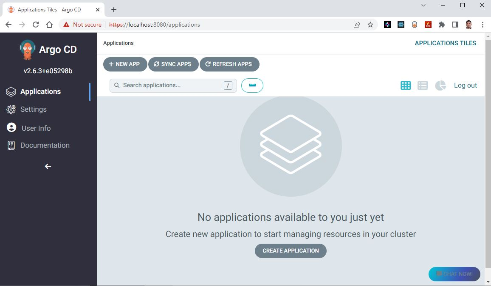

# Install Argo CD in AKS with helm chart using terraform

## Introduction

In this article, we will explore the process of installing Argo CD in Azure Kubernetes Service (AKS) using Helm charts and terraform. 

## Installation types

Argo CD offers two types of installations: multi-tenant and core. Before proceeding with the installation on AKS, let's delve into the differences between multi-tenant and core installations of Argo CD.

### Multi-Tenant Installation

A multi-tenant installation of Argo CD is designed to accommodate larger organizations with multiple teams or users, enabling them to share a common Argo CD instance while maintaining isolation and security. In this setup, each tenant is allocated its dedicated set of resources, including applications, projects, and roles, ensuring separation from resources belonging to other tenants. The use of Kubernetes namespaces and RBAC (Role-Based Access Control) facilitates this segregation, allowing each team to operate independently within their designated environment.

**Key Features:**

- **Resource Isolation:** Tenants enjoy dedicated spaces for applications, projects, and roles, ensuring independence and avoiding interference from other teams.
  
- **RBAC Implementation:** Role-Based Access Control is employed to manage permissions within each tenant's namespace, guaranteeing secure and controlled access.

- **Suitable for Larger Organizations:** Ideal for organizations with diverse teams that necessitate separate environments and distinct permission structures.

### Core Installation

A core installation of Argo CD offers a simpler deployment designed for smaller organizations or individual users, emphasizing ease of use and straightforward management. In this single-tenant setup, there is a unified set of resources, including applications, projects, and roles, all managed by the same user or team. This streamlined approach is well-suited for scenarios where the additional complexity of a multi-tenant environment is unnecessary.

**Key Features:**

- **Single-Tenant Model:** All resources are managed within a single namespace, providing a straightforward and consolidated environment.

- **Simplicity and Quick Deployment:** Core installations are characterized by their simplicity, making them easy to set up and manage. They are particularly suitable for smaller teams or individual users.

- **Ideal for Smaller Organizations:** Suited for scenarios where a single team or individual user oversees the entire continuous delivery process without the need for extensive isolation.

**Choosing the right installation**

The decision between a multi-tenant and core installation hinges on the organizational structure, collaboration requirements, and scale of the continuous delivery environment. Multi-tenant installations are optimal for larger organizations with diverse teams, whereas core installations offer a streamlined approach for smaller teams or individual users who prioritize simplicity and efficiency. Both options retain the robust GitOps capabilities that Argo CD provides.

!!! note
    Here we are going to use the `Multi-tenant installation`

## Non-High Availability vs High Availability

Argo CD can be installed in two different ways in terms of High Availability (HA): `Non-High Availability` and `High Availability`.


### Non-High Availability Installation:

In a Non-High Availability (HA) installation, Argo CD is deployed on a single instance or node. This configuration implies that the entire system relies on a single point of deployment. If the node encounters failure or downtime, the entire system becomes unavailable. Non-High Availability installations are well-suited for development or testing environments where high availability is not a critical requirement.

**Key Characteristics:**

- **Single Node Deployment:** Argo CD is installed on a single instance, making the system dependent on the availability of that specific node.
  
- **Limited Fault Tolerance:** The system lacks redundancy, and if the single node fails, it results in a downtime until the node is restored.

- **Suitable for Development/Testing:** Non-High Availability installations are appropriate for environments where system uptime is less critical, such as development or testing scenarios.

### High Availability Installation:

In a High Availability installation, Argo CD is deployed across multiple instances or nodes. This setup creates a redundant and fault-tolerant system that can withstand failures or outages. High Availability installations are suitable for production environments where continuous availability and uptime are essential requirements.

**Key Characteristics:**

- **Multi-Node Deployment:** Argo CD is distributed across multiple instances, ensuring that the system is not dependent on any single node.
  
- **Enhanced Fault Tolerance:** The redundancy of nodes enhances fault tolerance, making the system resilient to individual node failures.

- **Critical for Production Environments:** High Availability installations are crucial for production environments where uninterrupted service and minimal downtime are most important.

**Considerations for Choosing Installation Type:**

- **Environment Requirements:** Choose the installation type based on the specific requirements of your environment. Production environments often demand High Availability for mission-critical applications.

- **Resource Scaling:** High Availability installations offer scalability and load distribution, making them suitable for managing larger workloads and user bases.

- **Cost Implications:** High Availability setups may involve more resources, potentially affecting infrastructure costs. Evaluate the cost implications against the benefits of improved availability.

Understanding the trade-offs between Non-High Availability and High Availability installations is crucial for aligning Argo CD deployments with the reliability and availability expectations of the target environment.

!!! note
    Here we are going to focus on Non-High Availability installation

**Install ArgCDd using YAML manifest vs helm charts?**

Argo CD can be deployed on Azure Kubernetes Service (AKS) using either YAML manifests or Helm charts. In this lab, we'll leverage the Helm chart approach due to its simplicity and streamlined installation process.

Helm, a Kubernetes package manager, facilitates the installation of Argo CD, providing an efficient and manageable deployment. To enhance automation and maintain Infrastructure as Code (IaC) principles, we'll deploy the Helm chart using terraform. Let's explore the step-by-step process:

[](images/image-12.png){:target="_blank"}

## Technical Scenario


As a `Cloud Engineer`, you've been tasked with configuring ArgoCD within an established Kubernetes cluster. The objective is to leverage ArgoCD for deploying manifests related to a Microservices architecture onto the Kubernetes cluster. ArgoCD's role is crucial in ensuring continuous monitoring and reconciliation, aligning the live environment with the desired state specified in Git. This implementation aims to enhance the efficiency of managing the Microservices architecture by automating deployment processes and maintaining consistency with the defined configurations stored in the version-controlled Git repository.


## Objective

In this exercise we will accomplish & learn how to implement following:

- **Step 1:** Configure terraform providers
- **Step 2.** Create a new namespace for ArgoCD
- **Step 3.** Install ArgoCD in AKS with helm-chart using terraform
- **Step 4.** Verify ArgoCD resources in AKS
- **Step 5.** Configure port forwarding for login screen
- **Step 6.** ArgoCD login with localhost

## Prerequisites

Before proceeding with the installation of Argo CD in AKS using terraform, ensure you have the following prerequisites in place:

1. **Azure Subscription:** [Sign up for an Azure subscription](https://azure.microsoft.com/en-us/free/), if not already done.

2. **terraform:** [Install and configure terraform](https://www.terraform.io/downloads) on your local machine, including the Helm, Kubernetes, and Azure providers.

3. **Azure CLI:** [Install Azure CLI](https://learn.microsoft.com/en-us/cli/azure/install-azure-cli) for Azure service interaction.

4. **Kubectl:** [Install and set up kubectl](https://kubernetes.io/docs/tasks/tools/install-kubectl-windows/) for managing Kubernetes clusters.

5. **Kubernetes Cluster:** Ensure you have a running Kubernetes cluster available for ArgoCD deployment.

6. **Git Repository:** Maintain a Git repository storing manifests for your applications, serving as ArgoCD's deployment source.

## Implementation Details

Let's delve into the step-by-step implementation details:

**login to Azure**

Verify that you are logged into the right Azure subscription before start anything in visual studio code

``` sh
# Login to Azure
az login 

# Shows current Azure subscription
az account show

# Lists all available Azure subscriptions
az account list

# Sets Azure subscription to desired subscription using ID
az account set -s "anji.keesari"
```

**Connect to Cluster**
``` sh
# Azure Kubernetes Service Cluster User Role
az aks get-credentials -g "rg-aks-dev" -n "aks-cluster1-dev"

# Azure Kubernetes Service Cluster Admin Role
az aks get-credentials -g "rg-aks-dev" -n "aks-cluster1-dev" --admin

# get nodes
kubectl get no
kubectl get namespace -A
```

## Step-1: Configure terraform providers

Launch Visual Studio Code and open your current terraform repository to begin working on your terraform configuration.

In order to install any Helmcharts using terraform configuration we need to have following terraform providers.

- helm provider
- Kubernetes provider
- Kubectl provider 


**terraform providers**

You can install the necessary providers by adding the following code in your Terraform configuration file:

Let's update our existing `provider.tf` file with new kubernetes, helm and kubectl providers:

``` tf title="provider.tf"
terraform {

  required_version = ">=0.12"

  required_providers {
    azurerm = {
      source  = "hashicorp/azurerm"
      version = "~>2.0"
    }

    azuread = {
      version = ">= 2.26.0" // https://github.com/terraform-providers/terraform-provider-azuread/releases
    }
     kubernetes = {
      source  = "hashicorp/kubernetes"
      version = ">= 2.0.3"
    }
    helm = {
      source  = "hashicorp/helm"
      version = ">= 2.1.0"
    }
    
     kubectl = {
      source  = "gavinbunney/kubectl"
      version = ">= 1.7.0"
    }
  }
}

provider "kubernetes" {
  host                   = azurerm_kubernetes_cluster.aks.kube_admin_config.0.host
  client_certificate     = base64decode(azurerm_kubernetes_cluster.aks.kube_admin_config.0.client_certificate)
  client_key             = base64decode(azurerm_kubernetes_cluster.aks.kube_admin_config.0.client_key)
  cluster_ca_certificate = base64decode(azurerm_kubernetes_cluster.aks.kube_admin_config.0.cluster_ca_certificate)
  #load_config_file       = false
}

provider "helm" {
  debug = true
  kubernetes {
    host                   = azurerm_kubernetes_cluster.aks.kube_admin_config.0.host
    client_certificate     = base64decode(azurerm_kubernetes_cluster.aks.kube_admin_config.0.client_certificate)
    client_key             = base64decode(azurerm_kubernetes_cluster.aks.kube_admin_config.0.client_key)
    cluster_ca_certificate = base64decode(azurerm_kubernetes_cluster.aks.kube_admin_config.0.cluster_ca_certificate)

  }
}
provider "kubectl" {
  host                   = azurerm_kubernetes_cluster.aks.kube_admin_config.0.host
  client_certificate     = base64decode(azurerm_kubernetes_cluster.aks.kube_admin_config.0.client_certificate)
  client_key             = base64decode(azurerm_kubernetes_cluster.aks.kube_admin_config.0.client_key)
  cluster_ca_certificate = base64decode(azurerm_kubernetes_cluster.aks.kube_admin_config.0.cluster_ca_certificate)
  load_config_file       = false
}
```

## Step-2: Create namespace for argocd

Create a separate namespace for argocd where all argocd related resources will be created. let's create a new file called argocd.tf and copy the following configuration.

``` tf title="argocd.tf"
resource "kubernetes_namespace" "argocd" {  
  metadata {
    name = "argocd"
  }
}
```

run terraform validate & format

``` sh
terraform validate
terraform fmt
```

run terraform plan

``` sh
terraform plan -out=dev-plan -var-file="./environments/dev-variables.tfvars"
```
output

``` sh
 + create

terraform will perform the following actions:

  # kubernetes_namespace.argocd will be created
  + resource "kubernetes_namespace" "argocd" {
      + id = (known after apply)

      + metadata {
          + generation       = (known after apply)
          + name             = "argocd"
          + resource_version = (known after apply)
          + uid              = (known after apply)
        }
    }

Plan: 1 to add, 0 to change, 0 to destroy.
```
run terraform apply
```
terraform apply dev-plan
```
``` sh
Apply complete! Resources: 1 added, 0 changed, 0 destroyed.

Outputs:
```

## Step-3: Install argocd in AKS with helm-chart using terraform

Visit the official Argo CD Helm chart on the ArtifactHUB website: [Argo CD Helm Chart](https://artifacthub.io/packages/helm/argo/argo-cd).

Click on the "Install" button to retrieve the necessary details for the Argo CD Helm chart installation.

<!--
https://argo-cd.readthedocs.io/en/stable/getting_started/ - only for reading instruction 
https://artifacthub.io/packages/helm/argo/argo-cd - click on Install button and get the helm-chart details, like name and version
https://github.com/argoproj/argo-helm - helm repo - information only
https://github.com/argoproj/argo-cd - argocd repo - information only
-->


``` sh
repository = "https://argoproj.github.io/argo-helm"
chart      = "argo-cd"
version    = "5.24.1"
```

``` tf title="argocd.tf"
# Install argocd helm chart using terraform
resource "helm_release" "argocd" {
  name       = "argocd"
  repository = "https://argoproj.github.io/argo-helm"
  chart      = "argo-cd"
  version    = "5.24.1"
  namespace  = kubernetes_namespace.argocd.metadata.0.name
  depends_on = [
    kubernetes_namespace.argocd
  ]
}
```

run terraform plan

```
terraform validate
terraform fmt
terraform plan -out=dev-plan -var-file="./environments/dev-variables.tfvars"
```
output
``` sh
  + create

terraform will perform the following actions:
.
.
.
Plan: 1 to add, 0 to change, 0 to destroy.
```

run terraform apply

```
terraform apply dev-plan
```
``` sh
helm_release.argocd: Creating...
helm_release.argocd: Still creating... [10s elapsed]
helm_release.argocd: Still creating... [20s elapsed]
helm_release.argocd: Still creating... [30s elapsed]
helm_release.argocd: Still creating... [40s elapsed]
helm_release.argocd: Still creating... [50s elapsed]
helm_release.argocd: Still creating... [1m0s elapsed]
helm_release.argocd: Creation complete after 1m5s [id=argocd]

Apply complete! Resources: 1 added, 0 changed, 0 destroyed.

Outputs
```

## Step 4. Verify ArgoCD resources in AKS.

Run the following `kubectl` commands to verify the Argo CD installation in the AKS cluster.

```
kubectl get all --namespace argocd
```

or

```
kubectl get namespace argocd
kubectl get deployments -n argocd
kubectl get pods -n argocd
kubectl get services -n argocd
```
expected output

```
NAME                                                    READY   STATUS    RESTARTS   AGE
pod/argocd-application-controller-0                     1/1     Running   0          2m21s
pod/argocd-applicationset-controller-848fc4dcfb-vp5rs   1/1     Running   0          2m21s
pod/argocd-dex-server-56888697cd-5vnlw                  1/1     Running   0          2m21s
pod/argocd-notifications-controller-5cd6fc4886-p6wr4    1/1     Running   0          2m21s
pod/argocd-redis-b54b4ccd8-kdmdv                        1/1     Running   0          2m21s
pod/argocd-repo-server-78998f9d78-xv64h                 1/1     Running   0          2m21s
pod/argocd-server-c799cf854-9pnbw                       1/1     Running   0          2m21s

NAME                                       TYPE        CLUSTER-IP      EXTERNAL-IP   PORT(S)             AGE
service/argocd-applicationset-controller   ClusterIP   10.25.250.229   <none>        7000/TCP            2m21s
service/argocd-dex-server                  ClusterIP   10.25.247.199   <none>        5556/TCP,5557/TCP   2m21s
service/argocd-redis                       ClusterIP   10.25.211.159   <none>        6379/TCP            2m21s
service/argocd-repo-server                 ClusterIP   10.25.233.23    <none>        8081/TCP            2m21s
service/argocd-server                      ClusterIP   10.25.115.123   <none>        80/TCP,443/TCP      2m21s

NAME                                               READY   UP-TO-DATE   AVAILABLE   AGE
deployment.apps/argocd-applicationset-controller   1/1     1            1           2m21s
deployment.apps/argocd-dex-server                  1/1     1            1           2m21s
deployment.apps/argocd-notifications-controller    1/1     1            1           2m21s
deployment.apps/argocd-redis                       1/1     1            1           2m21s
deployment.apps/argocd-repo-server                 1/1     1            1           2m21s
deployment.apps/argocd-server                      1/1     1            1           2m21s

NAME                                                          DESIRED   CURRENT   READY   AGE
replicaset.apps/argocd-applicationset-controller-848fc4dcfb   1         1         1       2m21s
replicaset.apps/argocd-dex-server-56888697cd                  1         1         1       2m21s
replicaset.apps/argocd-notifications-controller-5cd6fc4886    1         1         1       2m21s
replicaset.apps/argocd-redis-b54b4ccd8                        1         1         1       2m21s
replicaset.apps/argocd-repo-server-78998f9d78                 1         1         1       2m21s
replicaset.apps/argocd-server-c799cf854                       1         1         1       2m21s

NAME                                             READY   AGE
statefulset.apps/argocd-application-controller   1/1     2m21s
```

```kubectl get configmaps -n argocd```

```
NAME                        DATA   AGE
argocd-cm                   6      3m6s
argocd-cmd-params-cm        29     3m6s
argocd-gpg-keys-cm          0      3m6s
argocd-notifications-cm     1      3m6s
argocd-rbac-cm              3      3m6s
argocd-ssh-known-hosts-cm   1      3m6s
argocd-tls-certs-cm         0      3m6s
kube-root-ca.crt            1      11m
```
```kubectl get secrets -n argocd```
```
NAME                           TYPE                 DATA   AGE
argocd-initial-admin-secret    Opaque               1      3m7s
argocd-notifications-secret    Opaque               0      3m23s
argocd-secret                  Opaque               5      3m23s
sh.helm.release.v1.argocd.v1   helm.sh/release.v1   1      3m24s
```

```kubectl get ingress -n argocd```

output

```
No resources found in argocd namespace.
```

## Step-5. port forwarding for login screen

<!--
Note: argo-cd-  - this is added additional in the name when we install using helm chart terraform.
-->


To perform local login testing for Argo CD, you can use port forwarding. Here are the steps:

1. Connect to your AKS cluster using kubectl
2. Forward the Argo CD server port to your local machine:
```
kubectl port-forward svc/argocd-server -n argocd 8080:443
```
output
```
Forwarding from 127.0.0.1:8080 -> 8080
Forwarding from [::1]:8080 -> 8080
Handling connection for 8080
```
3. Access the Argo CD web interface by visiting <https://localhost:8080> in your web browser.
!!! Note
    Use this URL for before patching - <https://localhost:8080>
    Use this URL for after patching - <http://localhost:8080/>


!!! Note
    The port forwarding can be stopped by cancelling the command with CTRL + C.

## Step-6. ArgoCD login with localhost

**how to get argocd-initial-admin-secret?**

The default username is `admin` and the password is auto generated and stored as clear text. You can retrieve this password using the following command:

PowerShell

```
kubectl get secret -n argocd argocd-initial-admin-secret -o json | ConvertFrom-Json | select -ExpandProperty data | % { $_.PSObject.Properties | % { $_.password + [System.Text.Encoding]::UTF8.GetString([System.Convert]::FromBase64String($_.Value)) } }
```
output
```
nJYQaAQnb8wldLZ9
```
Bash

```
kubectl -n argocd get secret argocd-initial-admin-secret -o jsonpath="{.data.password}" | base64 -d; echo
```
You can use the following credentials for the first-time login into argocd website.

- Username - default argocd username is **admin**
- Password - get default argocd password from aks-> configuration->secrets-> argocd-initial-admin-secret

```
Username- admin
Password- nJYQaAQnb8wldLZ9
```
once you are able to successfully login into ArgoCD you will see the following screen.



**Change the password**

To change the password in Argo CD, you can login to argocd portal -> user Info -> Update Password.

!!! note
    If your password is saved in the Azure Key vault then keep this password same as Key Vault.

<!-- Test1234t -->


**Change the password using Kubectl** 

1. Connect to the Argo CD server using kubectl:
```
kubectl exec -it <argocd-pod-name> -n argocd -- argocd login <argocd-server>
```
1. Change the password for the admin user:
```
kubectl exec -it <argocd-pod-name> -n argocd -- argocd account update-password --current-password <current-password> --new-password <new-password>
```


## Reference
- [Argo CD Installation](https://argo-cd.readthedocs.io/en/stable/operator-manual/installation/){:target="_blank"}

<!-- - https://stackoverflow.com/questions/74231224/how-to-add-a-command-flag-in-kubernetes-deployment-using-json-patch-command
- https://github.com/argoproj/argo-cd/issues/2953  - ERR_TOO_MANY_REDIRECTS
- https://pet2cattle.com/2022/03/argocd-redirect-loop
- https://stackoverflow.com/questions/49856754/nginx-ingress-too-many-redirects-when-force-ssl-is-enabled -->
