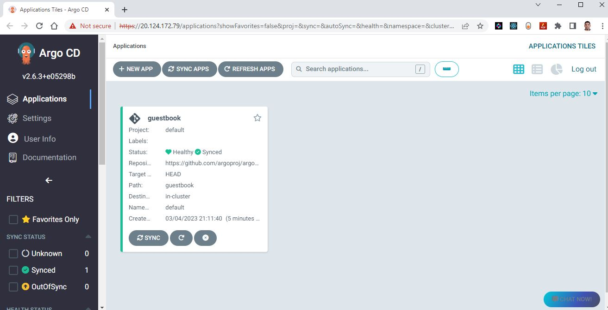
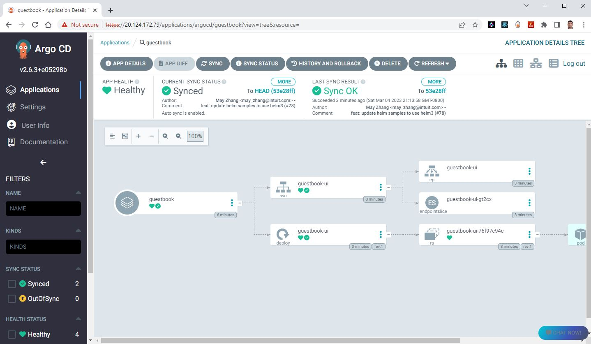

Argo CD Applications can be configured in three different ways: 

- Using the Web UI
- Using the ArgoCD CLI
- Using Kubernetes Manifest files
 
In this lab we will see all three methods.

In this exercise we will accomplish & learn how to implement following:

- **Task-1:** Creating application using ArgoCD CLI
- **Task-2:** Creating application using ArgoCD Web UI
- **Task-3:** Creating ArgoCD application using YAML


## Prerequisites
- ArgoCD CLI
- AKS Cluster
 


## Task-1: Creating argocd application using ArgoCD CLI

To create an application with Argo CD using the argocd CLI, follow these steps:

- First, you need to install the argocd CLI. - already completed in previous lab
- Next, you need to log in to your Argo CD instance using the CLI.
```
argocd login --insecure --port-forward-namespace argocd 20.124.172.79
```
output
``` sh
Username: admin
Password: 
Password: 
'admin:login' logged in successfully
Context '20.124.172.79' updated
```


In this example I am going to start with guestbook application container created by ArgoCD team for testing.

An example repository containing a guestbook application is available at <https://github.com/argoproj/argocd-example-apps.git> to demonstrate how Argo CD works.

Run following command to create application with ArgoCD.

```
argocd app create guestbook --repo https://github.com/argoproj/argocd-example-apps.git --path guestbook --dest-server https://kubernetes.default.svc --dest-namespace default
```
output 
```
application 'guestbook' created
```
Now login into ArgoCD with following URL - <http://20.124.172.79/>

Use following ArgoCD credentials for login.

```
Username- admin
Password- nJYQaAQnb8wldLZ9
```
By default you will notice the application is **outofsync** status, we have to enable the auto-sync policy which is present inside the APP DETAILS by clicking on this demo application. after the Login to argocd.

[{:style="border: 1px solid black; border-radius: 10px;"}](images/image-7.jpg){:target="_blank"}

Detailed view of the application 

[{:style="border: 1px solid black; border-radius: 10px;"}](images/image-8.jpg){:target="_blank"}

## Task-2: Creating argocd application using argocd UI

To create an application with Argo CD using the Web UI, follow these steps:

- Log in to the Argo CD web UI by entering the URL of your Argo CD server into your web browser.
- Click on the "New App" button in the top-right corner of the screen.
- Fill out the application details, including the application name, project, source repository, and target cluster. 
    - Application Name: A unique name for your application.
    - Project: The project that this application belongs to.
    - Repository URL: The URL of the Git repository that contains your application code.
    - Revision: The Git revision to use for this deployment.
    - Path: The path within the Git repository where your application manifests are located.
    - Cluster: The Kubernetes cluster where your application will be deployed.
- Configure your application's deployment settings, such as the container image, resource limits, and environment variables.
- Click on the "Create" button to create your application.
- Wait for Argo CD to synchronize your application with the target Kubernetes cluster. You can monitor the synchronization progress by clicking on the application in the Argo CD web UI.
- Once your application is synchronized, you can view its status and perform additional actions such as rolling back to a previous version, scaling up or down, or deploying to additional environments.
  


[{:style="border: 1px solid black; border-radius: 10px;"}](images/image-9.jpg){:target="_blank"}


That's it! You have now created an Argo CD application using the web UI. You can use the web UI to manage and monitor your applications, as well as perform other tasks such as configuring continuous delivery pipelines or integrating with external tools.

Uou can now use some of the ArgoCD command for testing your ArgoCD CLI tool.

``` sh
argocd cluster list
argocd repo list
argocd app list
argocd app get guestbook.
argocd app sync guestbook
argocd logout 52.159.112.67
```

## Task-3: Creating argocd application using YAML manifest

Above two methods will be used only for quick testing but in real scenario you will actually create ArgoCD applications using YAML manifest by committing source code in Git repo.

<!-- https://opensource.com/article/21/7/automating-argo-cd - excellent article -->

Create a YAML file containing the application configuration. Here's an example YAML manifest:

``` yaml title="aspnet-api.yaml"
apiVersion: argoproj.io/v1alpha1
kind: Application
metadata:
  name: aspnet-api
  finalizers: []
spec:
  destination:
    name: ''
    namespace: sample
    server: 'https://kubernetes.default.svc'
  source:
    path: sample/aspnet-api
    repoURL: 'https://dev.azure.com/keesari/microservices/_git/argocd'
    targetRevision: develop
    kustomize:
      images: []
  project: default
  syncPolicy:
    automated:
      prune: true
      selfHeal: true
```

This YAML manifest defines an Argo CD application called `aspnet-api` that is sourced from a Git repository at <https://dev.azure.com/keesari/microservices/_git/argocd>. The application is configured to deploy to the default namespace of the Kubernetes cluster, and the synchronization policy is set to automated with pruning and self-healing enabled.

Apply YAML file

```
kubectl apply -f aspnet-api.yaml
```
This will create the Argo CD application on your Kubernetes cluster.

Verify that the application has been created by running kubectl command:

Wait for Argo CD to synchronize the application with your target Kubernetes cluster. You can monitor the synchronization progress by checking the application status using the Argo CD web UI.

That's it! You have now created an Argo CD application using a YAML manifest. You can modify the YAML manifest to configure additional settings for your application, such as environment variables, resource limits, or deployment strategies.

## Reference:

- <https://techcommunity.microsoft.com/t5/apps-on-azure-blog/getting-started-with-gitops-argo-and-azure-kubernetes-service/ba-p/3288595> - MSDN site
- <https://github.com/argoproj/argocd-example-apps>
- <https://argo-cd.readthedocs.io/en/stable/getting_started/> - official argocd website
<!-- - <https://blog.knoldus.com/how-to-create-applications-in-argocd/> -->
