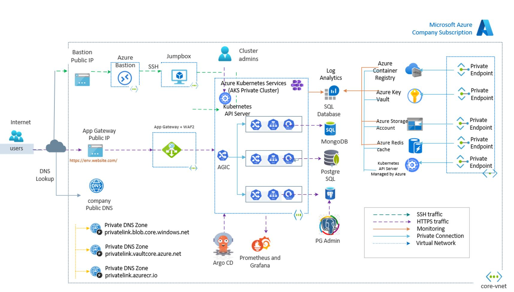

To host and deploy the containerized microservices and databases created in the first chapter, we will utilize various Azure resources. These resources will be provisioned using the Infrastructure as Code (IaC) tool, Terraform. Additionally, we will explore the deployment process using Azure DevOps pipelines, Helm charts, and ArgoCD.

We will establish a scalable and resilient infrastructure for hosting our containerized microservices applications. The combination of Azure resources, Terraform for infrastructure provisioning, Azure DevOps pipelines for deployment automation, Helm charts for application packaging, and ArgoCD for continuous delivery simplifies the management and deployment of our Microservices Architecture.

Let's look into the details of each component and explore how they come together to create a robust and efficient Microservices Architecture on Azure Kubernetes Service (AKS).

## High Level Architecture

The high-level architecture of the Azure resources, which serves as a reference architecture in our labs, is visualized in the diagram below. This diagram provides an overview of the essential components and how they interact within the Microservices Architecture on AKS.

**Azure High Level Architecture**

{:target="_blank"}

**DevOps High Level Architecture**

{:target="_blank"}

## Azure Reference Architecture Components

**Log Analytics workspace:**

A Log Analytics workspace enables us to store and analyze log data from various sources within the Microservices architecture. We will utilize this resource for centralized logging and monitoring of our services.

**Virtual network:**

All the services created in our labs will be secured within a private Virtual Network. We will demonstrate the Hub & Spoke VNet model in the lab, which provides a scalable and isolated network environment for our microservices.

**Azure Container Registry (ACR):**

We will use Azure Container Registry to store our private Docker images, which will be deployed to the cluster. AKS can authenticate with ACR using its Azure AD identity, ensuring secure and controlled access to our container images.

**Application Gateway:**

The Application Gateway serves as the entry point for client requests from the public DNS. It acts as a reverse proxy and load balancer, routing requests to the appropriate backend services. With features like SSL/TLS termination and backend pool configuration, the Application Gateway helps to decouple clients from services.

**Azure Kubernetes Service (AKS):**

AKS is a fully managed Kubernetes service that offers a platform for deploying and scaling containerized applications. It provides a scalable, resilient, and easy-to-manage environment for deploying microservices. We will utilize AKS for deploying all our microservices in the lab.

**Azure Database:**

Azure Database for PostgreSQL - Flexible Server is a fully managed database service for running PostgreSQL on the Azure platform. We will create a PostgreSQL - Flexible Server instance to easily create, configure, and manage PostgreSQL databases on Azure.

**Azure Key Vault:**

We will leverage Azure Key Vault, a cloud-based service, to securely store and manage cryptographic keys, certificates, and other secrets related to our microservices applications. Azure Key Vault ensures the secure storage and access of sensitive information.

**Azure Redis Cache:**

Azure Redis Cache is a fully managed, in-memory data store based on the open-source Redis cache. We will utilize this service for caching application-specific data, enabling fast data access and low latency for improved performance.

**Azure Storage account:**

Azure Storage account is a Microsoft cloud storage service that allows us to store and retrieve large amounts of unstructured data. We will use Blob Storage, a component of Azure Storage, for various purposes. Further details about Blob Storage will be covered during the labs.

**Azure Active Directory (AAD):**

AAD will be used for managing identity and authentication between different services. It provides a secure and centralized approach for authentication and access control, ensuring that only authorized users and services can access our microservices.

**Azure Pipelines** 

Azure Pipelines are part of the Azure DevOps Services and run automated builds, tests, and deployments.

**Helm Chart** 

Helm is a package manager for Kubernetes, we will use helm charts for deploying our Microservices into AKS.

**ArgoCD** 

ArgoCD is continuous delivery tool for Kubernetes applications. It provides a simple and automated way to manage and deploy applications to a Kubernetes cluster by using GitOps methodology. we will use the ArgoCD for deploying our Microservices into AKS.

**Azure Security & Governance**

Apart from above services we will also focus on following services:

- `Azure Policy`: a service that allows us to create, assign, and manage policies for our Azure resources, ensuring that they comply with organizational standards and regulatory requirements.

- `Azure Active Directory (AAD)`: a service that provides identity and access management (IAM) capabilities, enabling us to secure access to out Azure resources.

- `Azure Monitor`: a service that allows us to collect, analyze, and act on telemetry data from our Azure resources and applications, enabling us to detect and diagnose security issues.

!!! Important
    Each lab in this chapter covers only implementation details therefore it is always recommended to read the relevant MSDN documentation on particular azure service before start any lab so that is supper easy for you to work on these labs. you will see the links end of each lab for your reference.

## Reference
- [Microsoft MSDN - Microservices architecture on Azure Kubernetes Service](https://learn.microsoft.com/en-us/azure/architecture/reference-architectures/containers/aks-microservices/aks-microservices){:target="_blank"}