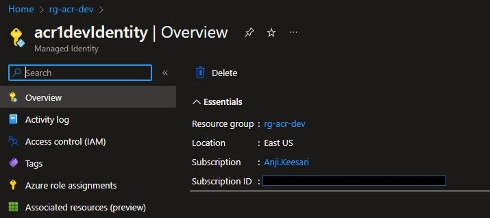
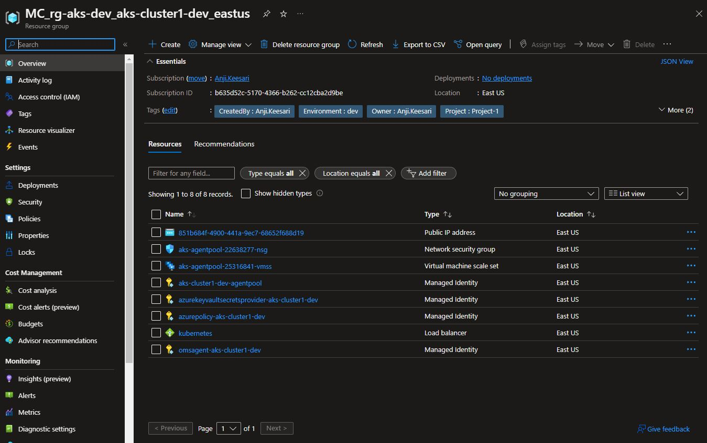
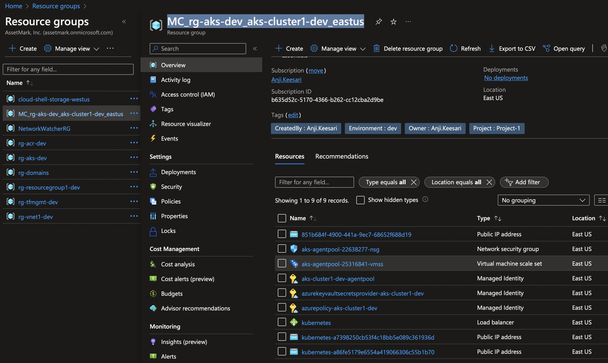
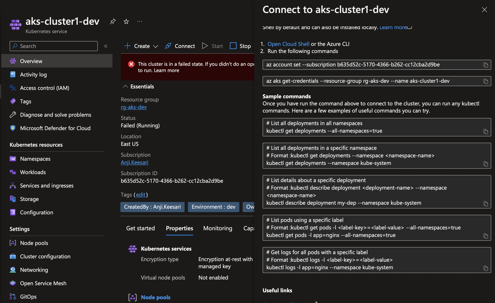

## Introduction

Azure Kubernetes Service (AKS) is a fully managed container orchestration service provided by Microsoft Azure. It allows you to easily deploy, scale, and manage containerized applications using Kubernetes.

In this lab, I will walk you through the steps to create an Azure Kubernetes Service (AKS) using Terraform. Additionally, I will show you how to confirm its successful deployment through the Azure portal and provide insights on how to utilize it effectively. We will also cover how to validate your AKS cluster using Kubectl and set up access to Azure Container services.

AKS provides a number of benefits, including:

- **Autoscaling:** AKS automatically scales your cluster up or down based on the demand for your applications, so you only pay for what you use.

- **High availability:** AKS provides a highly available Kubernetes control plane, which ensures that the cluster remains operational even in the event of a failure.

- **Simplified deployment:** You can deploy a fully functional Kubernetes cluster with just a few clicks or commands, and AKS automatically provisions and manages the underlying infrastructure.

- **Seamless integration:** AKS integrates with other Azure services, such as Azure Active Directory, Azure Monitor, and Azure Virtual Networks, making it easy to incorporate AKS into your existing workflows.

- **Security and compliance:** AKS provides built-in security features, such as role-based access control, network security, and encryption at rest, to help you meet your security and compliance requirements.

- **Monitoring and logging:** AKS provides built-in monitoring and logging capabilities, allowing developers to quickly identify and troubleshoot issues in the cluster.

- **Hybrid and multi-cloud support:** AKS is built on open source Kubernetes, so you can run your workloads on any cloud or on-premises environment that supports Kubernetes.

To get started with AKS, we are going to use terraform to create a new Kubernetes cluster. Once you have a cluster, you can deploy containerized applications to it using Kubernetes manifests or Helm charts, and scale and manage your applications using the Kubernetes API or a variety of third-party tools.

## Technical Scenario

As a `Cloud Engineer`, you have been asked to create a new Azure Kubernetes services (AKS) cluster so that you can deploy containerized Microservice applications to it using Kubernetes manifests or Helm charts.

## Objective

In this exercise we will accomplish & learn how to implement following:

- Task-1: Configure variables for AKS
- Task-2: Create a new resource group for AKS
- Task-3: Create AKS user assigned identity
- Task-3: Create a new AKS cluster using terraform
   <!-- - privately enabled
   - Managed Identity enabled
   - Auto Scaling enabled
   - configure log analytics workspace
   - Azure CNI networking -->
- Task-5: Create diagnostics settings for AKS
- Task-6: Review AKS Cluster resource in the portal
- Task-7: Validate AKS cluster running Kubectl
- Task-8: Allow AKS Cluster access to Azure Container
- Task-9: Lock AKS cluster resource group

## Architecture diagram

Here is the reference architecture diagram of Azure Kubernetes services.


## Prerequisites
  - Download & Install Terraform
  - Download & Install Azure CLI
  - Azure subscription
  - Visual studio code
  - Azure DevOps Project & repo
  - Terraform Foundation Setup
  - Log Analytics workspace
  - Virtual Network with subnet for AKS
  - Azure Container Registry (ACR)
  
## Implementation details

Open the terraform project folder in Visual Studio code and creating new file named `aks.tf` for Azure Kubernetes services (AKS) specific azure resources;


**login to Azure**

Verify that you are logged into the right Azure subscription before start anything in visual studio code

``` sh
# Login to Azure
az login 

# Shows current Azure subscription
az account show

# Lists all available Azure subscriptions
az account list

# Sets Azure subscription to desired subscription using ID
az account set -s "anji.keesari"
```

## Task-1: Define and declare AKS variables

This section covers list of variables used to create  Azure Kubernetes services (AKS) with detailed description and purpose of each variable with default values.

| Variable Name                        | Description                                                          | Type                | Default Value        |
|-------------------------------------|----------------------------------------------------------------------|---------------------|-----------------------|
| aks_rg_name                          | The name of the resource group in which to create the AKS            | string              |                       |
| aks_rg_location                      | Location in which to deploy the AKS                                  | string              | East US               |
| cluster_name                         | Specifies the name of the AKS cluster                                | string              |                       |
| dns_prefix                           | DNS prefix specified when creating the managed cluster               | string              |                       |
| private_cluster_enabled               | Should this Kubernetes Cluster have its API server only exposed on internal IP addresses | bool | false |
| azure_rbac_enabled                   | Is Role Based Access Control based on Azure AD enabled                | bool                | true                  |
| admin_group_object_ids               | A list of Object IDs of Azure Active Directory Groups which should have Admin Role on the Cluster | list(string) | ["c63746fd-eb61-xx"] |
| role_based_access_control_enabled     | Is Role Based Access Control Enabled?                                  | bool                | true                  |
| automatic_channel_upgrade             | The upgrade channel for this Kubernetes Cluster                        | string              | stable                |
| aks_sku_tier                         | The SKU Tier that should be used for this Kubernetes Cluster          | string              | Free                  |
| kubernetes_version                   | Specifies the AKS Kubernetes version                                  | string              | 1.23.12               |
| default_node_pool_vm_size            | Specifies the vm size of the default node pool                        | string              | Standard_B4ms         |
| default_node_pool_availability_zones  | Specifies the availability zones of the default node pool             | list(string)         | ["1", "2", "3"]        |
| network_docker_bridge_cidr           | Specifies the Docker bridge CIDR                                      | string              | 172.17.0.1/16         |
| network_dns_service_ip               | Specifies the DNS service IP                                           | string              | 10.25.0.10            |
| network_service_cidr                 | Specifies the service CIDR                                             | string              | 10.25.0.0/16          |
| network_plugin                       | Specifies the network plugin of the AKS cluster                         | string | azure |
| network_policy                       | Specifies the network policy of the AKS cluster                         | string | azure |
| outbound_type                        | The outbound (egress) routing method which should be used for this Kubernetes Cluster | string | userDefinedRouting |
| default_node_pool_name               | Specifies the name of the default node pool                             | string | agentpool           |
| default_node_pool_subnet_name         | Specifies the name of the subnet that hosts the default node pool       | string | SystemSubnet        |
| default_node_pool_subnet_address_prefix | Specifies the address prefix of the subnet that hosts the default node pool | list(string) | ["10.0.0.0/20"] |
| default_node_pool_enable_auto_scaling | Whether to enable auto-scaler                                             | bool | true |
| default_node_pool_enable_host_encryption | Should the nodes in this Node Pool have host encryption enabled       | bool | false |
| default_node_pool_enable_node_public_ip | Should each node have a Public IP Address                                | bool | false |
| default_node_pool_max_pods           | The maximum number of pods that can run on each agent                   | number | 110 |
| default_node_pool_node_labels         | A list of Kubernetes taints which should be applied to nodes in the agent pool | map(any) | {} |
| default_node_pool_node_taints         | A map of Kubernetes labels which should be applied to nodes in this Node Pool | list(string) | [] |
| default_node_pool_os_disk_type       | The type of disk which should be used for the Operating System            | string | Ephemeral |
| default_node_pool_max_count           | The maximum number of nodes which should exist within this Node Pool     | number | 5 |
| default_node_pool_min_count           | The minimum number of nodes which should exist within this Node Pool     | number | 2 |
| default_node_pool_node_count          | The initial number of nodes which should exist within this Node Pool    | number | 2 |
| aks_log_analytics_retention_days     | Specifies the number of days of the retention policy                   | number              | 30                    |
| azure_policy                         | Specifies the Azure Policy addon configuration                          | object | { enabled = false } |
| http_application_routing              | Specifies the HTTP Application Routing addon configuration               | object | { enabled = false } |
| kube_dashboard                       | Specifies the Kubernetes Dashboard addon configuration                    | object | { enabled = false } |
| admin_username                       | Specifies the Admin Username for the AKS cluster worker nodes            | string | azadmin |
| ssh_public_key                       | Specifies the SSH public key used to access the cluster                   | string | -|
| aks_tags                             | Specifies the tags of the AKS                                             | map(any) | {} |

**Variables Prefixes**

Here is the list of new prefixes used in this lab, read the description and default values.

``` tf title="variables_prefix.tf"
variable "aks_prefix" {
  type        = string
  default     = "aks"
  description = "Prefix of the AKS name that's combined with name of the AKS"
}
variable "diag_prefix" {
  type        = string
  default     = "diag"
  description = "Prefix of the Diagnostic Settings resource."
}

```

**Declare Variables**

Here is the list of new variables used in this lab,  read the description and default values carefully. 

!!! Important
     There are lot of variables here, make sure that you read the MSDN documentation carefully on each property before using it.

``` tf title="variables.tf"

// ========================== Azure Kubernetes services (AKS) ==========================
variable "aks_rg_name" {
  description = "(Required) The name of the resource group in which to create the AKS. Changing this forces a new resource to be created."
  type        = string
}

variable "aks_rg_location" {
  description = "Location in which to deploy the AKS"
  type        = string
  default     = "East US"
}

variable "cluster_name" {
  description = "(Required) Specifies the name of the AKS cluster."
  type        = string
}

variable "dns_prefix" {
  description = "(Optional) DNS prefix specified when creating the managed cluster. Changing this forces a new resource to be created."
  type        = string
}

variable "private_cluster_enabled" {
  description = "Should this Kubernetes Cluster have its API server only exposed on internal IP addresses? This provides a Private IP Address for the Kubernetes API on the Virtual Network where the Kubernetes Cluster is located. Defaults to false. Changing this forces a new resource to be created."
  type        = bool
  default     = false
}

variable "azure_rbac_enabled" {
  description = "(Optional) Is Role Based Access Control based on Azure AD enabled?"
  default     = true
  type        = bool
}

variable "admin_group_object_ids" {
  description = "(Optional) A list of Object IDs of Azure Active Directory Groups which should have Admin Role on the Cluster."
  default     = ["c63746fd-eb61-4733-b7ed-c7de19c17901"]
  type        = list(string)
}

variable "role_based_access_control_enabled" {
  description = "(Required) Is Role Based Access Control Enabled? Changing this forces a new resource to be created."
  default     = true
  type        = bool
}

variable "automatic_channel_upgrade" {
  description = "(Optional) The upgrade channel for this Kubernetes Cluster. Possible values are patch, rapid, and stable."
  default     = "stable"
  type        = string

  validation {
    condition     = contains(["patch", "rapid", "stable"], var.automatic_channel_upgrade)
    error_message = "The upgrade mode is invalid."
  }
}

variable "aks_sku_tier" {
  description = "(Optional) The SKU Tier that should be used for this Kubernetes Cluster. Possible values are Free and Paid (which includes the Uptime SLA). Defaults to Free."
  default     = "Free"
  type        = string

  validation {
    condition     = contains(["Free", "Paid"], var.aks_sku_tier)
    error_message = "The sku tier is invalid."
  }
}

variable "kubernetes_version" {
  description = "Specifies the AKS Kubernetes version"
  default     = "1.23.12"
  type        = string
}

variable "default_node_pool_vm_size" {
  description = "Specifies the vm size of the default node pool"
  default     = "Standard_B4ms"
  type        = string
}

variable "default_node_pool_availability_zones" {
  description = "Specifies the availability zones of the default node pool"
  default     = ["1", "2", "3"]
  type        = list(string)
}

variable "network_docker_bridge_cidr" {
  description = "Specifies the Docker bridge CIDR"
  default     = "172.17.0.1/16"
  type        = string
}

variable "network_dns_service_ip" {
  description = "Specifies the DNS service IP"
  default     = "10.25.0.10"
  type        = string
}

variable "network_service_cidr" {
  description = "Specifies the service CIDR"
  default     = "10.25.0.0/16"
  type        = string
}

variable "network_plugin" {
  description = "Specifies the network plugin of the AKS cluster"
  default     = "azure"
  type        = string //kubnet -//CNI-azure 
}

variable "network_policy" {
  description = "Specifies the network policy of the AKS cluster"
  default     = "azure"
  type        = string //azure or calico
}

variable "outbound_type" {
  description = "(Optional) The outbound (egress) routing method which should be used for this Kubernetes Cluster. Possible values are loadBalancer and userDefinedRouting. Defaults to loadBalancer."
  type        = string
  default     = "userDefinedRouting"

  validation {
    condition     = contains(["loadBalancer", "userDefinedRouting"], var.outbound_type)
    error_message = "The outbound type is invalid."
  }
}

variable "default_node_pool_name" {
  description = "Specifies the name of the default node pool"
  default     = "agentpool"
  type        = string
}

variable "default_node_pool_subnet_name" {
  description = "Specifies the name of the subnet that hosts the default node pool"
  default     = "SystemSubnet"
  type        = string
}

variable "default_node_pool_subnet_address_prefix" {
  description = "Specifies the address prefix of the subnet that hosts the default node pool"
  default     = ["10.0.0.0/20"]
  type        = list(string)
}

variable "default_node_pool_enable_auto_scaling" {
  description = "(Optional) Whether to enable auto-scaler. Defaults to false."
  type        = bool
  default     = true
}

variable "default_node_pool_enable_host_encryption" {
  description = "(Optional) Should the nodes in this Node Pool have host encryption enabled? Defaults to false."
  type        = bool
  default     = false
}

variable "default_node_pool_enable_node_public_ip" {
  description = "(Optional) Should each node have a Public IP Address? Defaults to false. Changing this forces a new resource to be created."
  type        = bool
  default     = false
}

variable "default_node_pool_max_pods" {
  description = "(Optional) The maximum number of pods that can run on each agent. Changing this forces a new resource to be created."
  type        = number
  default     = 110
}

variable "default_node_pool_node_labels" {
  description = "(Optional) A list of Kubernetes taints which should be applied to nodes in the agent pool (e.g key=value:NoSchedule). Changing this forces a new resource to be created."
  type        = map(any)
  default     = {}
}

variable "default_node_pool_node_taints" {
  description = "(Optional) A map of Kubernetes labels which should be applied to nodes in this Node Pool. Changing this forces a new resource to be created."
  type        = list(string)
  default     = []
}

variable "default_node_pool_os_disk_type" {
  description = "(Optional) The type of disk which should be used for the Operating System. Possible values are Ephemeral and Managed. Defaults to Managed. Changing this forces a new resource to be created."
  type        = string
  default     = "Ephemeral"
}

variable "default_node_pool_max_count" {
  description = "(Required) The maximum number of nodes which should exist within this Node Pool. Valid values are between 0 and 1000 and must be greater than or equal to min_count."
  type        = number
  default     = 5
}

variable "default_node_pool_min_count" {
  description = "(Required) The minimum number of nodes which should exist within this Node Pool. Valid values are between 0 and 1000 and must be less than or equal to max_count."
  type        = number
  default     = 2
}

variable "default_node_pool_node_count" {
  description = "(Optional) The initial number of nodes which should exist within this Node Pool. Valid values are between 0 and 1000 and must be a value in the range min_count - max_count."
  type        = number
  default     = 2
}

# variable "log_analytics_workspace_id" {
#   description = "(Optional) The ID of the Log Analytics Workspace which the OMS Agent should send data to. Must be present if enabled is true."
#   type        = string
# }

# variable "tenant_id" {
#   description = "(Required) The tenant id of the system assigned identity which is used by master components."
#   type        = string
# }

variable "aks_log_analytics_retention_days" {
  description = "Specifies the number of days of the retention policy"
  type        = number
  default     = 30
}

# variable "ingress_application_gateway" {
#   description = "Specifies the Application Gateway Ingress Controller addon configuration."
#   type = object({
#     enabled      = bool
#     gateway_id   = string
#     gateway_name = string
#     subnet_cidr  = string
#     subnet_id    = string
#   })
#   default = {
#     enabled      = false
#     gateway_id   = null
#     gateway_name = null
#     subnet_cidr  = null
#     subnet_id    = null
#   }
# }

variable "azure_policy" {
  description = "Specifies the Azure Policy addon configuration."
  type = object({
    enabled = bool
  })
  default = {
    enabled = false
  }
}

variable "http_application_routing" {
  description = "Specifies the HTTP Application Routing addon configuration."
  type = object({
    enabled = bool
  })
  default = {
    enabled = false
  }
}

variable "kube_dashboard" {
  description = "Specifies the Kubernetes Dashboard addon configuration."
  type = object({
    enabled = bool
  })
  default = {
    enabled = false
  }
}

variable "admin_username" {
  description = "(Required) Specifies the Admin Username for the AKS cluster worker nodes. Changing this forces a new resource to be created."
  type        = string
  default     = "azadmin"
}

variable "ssh_public_key" {
  description = "(Required) Specifies the SSH public key used to access the cluster. Changing this forces a new resource to be created."
  type        = string
  default     = "ssh_pub_keys/azureuser.pub"
}

variable "aks_tags" {
  description = "(Optional) Specifies the tags of the AKS"
  type        = map(any)
  default     = {}
}
```
**Define variables**

Here is the list of new variables used in this lab.

`dev-variables.tfvar` - update this existing file for AKS values for development environment. These values will be different for each environments and it may be different for your requirements too.

``` tf title="dev-variables.tfvar"
# Azure Kubernetes Service (AKS) 
aks_rg_name                         = "aks"
aks_rg_location                     = "East US"
cluster_name                        = "cluster1"
dns_prefix                          = "cluster1-dns"
private_cluster_enabled             = false
aks_sku_tier                        = "Free"
default_node_pool_node_count        = 2
default_node_pool_vm_size           = "Standard_B4ms"
```


**output variables**

Here is the list of output variables used in this lab 

``` tf title="output.tf"
// ========================== Azure Kubernetes services (AKS) ==========================
output "aks_name" {
  value       = azurerm_kubernetes_cluster.aks.name
  description = "Specifies the name of the AKS cluster."
}

output "aks_id" {
  value       = azurerm_kubernetes_cluster.aks.id
  description = "Specifies the resource id of the AKS cluster."
}


# output "aks_identity_principal_id" {
#   value       = azurerm_user_assigned_identity.aks_identity.principal_id
#   description = "Specifies the principal id of the managed identity of the AKS cluster."
# }

output "kubelet_identity_object_id" {
  value       = azurerm_kubernetes_cluster.aks.kubelet_identity.0.object_id
  description = "Specifies the object id of the kubelet identity of the AKS cluster."
}

output "kube_config_raw" {
  value       = azurerm_kubernetes_cluster.aks.kube_config_raw
  sensitive   = true
  description = "Contains the Kubernetes config to be used by kubectl and other compatible tools."
}

output "aks_private_fqdn" {
  value       = azurerm_kubernetes_cluster.aks.private_fqdn
  description = "The FQDN for the Kubernetes Cluster when private link has been enabled, which is only resolvable inside the Virtual Network used by the Kubernetes Cluster."
}

output "aks_node_resource_group" {
  value       = azurerm_kubernetes_cluster.aks.node_resource_group
  description = "Specifies the resource id of the auto-generated Resource Group which contains the resources for this Managed Kubernetes Cluster."
}
```

## Task-2: Create a resource group for AKS

We will create separate resource group for AKS and related resources. add following terraform configuration in `aks.tf` file for creating AKS resource group.

In this task, we will create Azure resource group by using the terraform 

``` tf title="aks.tf"

# Create a new resource group
resource "azurerm_resource_group" "aks" {
  name     = lower("${var.rg_prefix}-${var.aks_rg_name}-${local.environment}")
  location = var.aks_rg_location
  tags     = merge(local.default_tags)
  lifecycle {
    ignore_changes = [
      tags
    ]
  }
}
```
run terraform validate & format

``` sh
terraform validate
terraform fmt
```

run terraform plan & apply

``` sh
terraform plan -out=dev-plan -var-file="./environments/dev-variables.tfvars"
terraform apply dev-plan
```


## Task-3: Create AKS user assigned identity

Use the following terraform configuration for creating user assigned identity which is going be used in AKS

User assigned managed identities enable Azure resources to authenticate to cloud services (e.g. Azure Key Vault) without storing credentials in code. 

User Assigned Identity in Azure Container Registry provides improved security, simplified management, better integration with Azure services, RBAC, and better compliance, making it a beneficial feature for organizations that use AKS.

``` tf title="aks.tf"
# Create User Assigned Identity used in AKS
resource "azurerm_user_assigned_identity" "aks_identity" {
  resource_group_name = azurerm_resource_group.aks.name
  location            = azurerm_resource_group.aks.location
  tags                = merge(local.default_tags)

  name = "${var.cluster_name}Identity}"

  lifecycle {
    ignore_changes = [
      tags
    ]
  }
}
```

<!--  -->

## Task-4: Create Azure Kubernetes Services (AKS) using terraform

To create an Azure Kubernetes Service (AKS) cluster using Terraform, you can can use the following terraform configuration:

``` tf title="aks.tf"
# Create a new Azure Kubernetes Service (Cluster)
resource "azurerm_kubernetes_cluster" "aks" {
  name                             = lower("${var.aks_prefix}-${var.cluster_name}-${local.environment}")
  resource_group_name              = azurerm_resource_group.aks.name
  location                         = azurerm_resource_group.aks.location
  kubernetes_version               = var.kubernetes_version
  dns_prefix                       = var.dns_prefix
  private_cluster_enabled          = var.private_cluster_enabled
  automatic_channel_upgrade        = var.automatic_channel_upgrade
  sku_tier                         = var.aks_sku_tier
  azure_policy_enabled             = true
  enable_pod_security_policy       = false
  http_application_routing_enabled = false
  local_account_disabled           = false // true
  open_service_mesh_enabled        = false

  linux_profile {
    admin_username = var.admin_username

    ssh_key {
      key_data = file("${var.ssh_public_key}")
    }
  }

  auto_scaler_profile {
    balance_similar_node_groups      = false
    empty_bulk_delete_max            = "10"
    expander                         = "random"
    max_graceful_termination_sec     = "600"
    max_node_provisioning_time       = "15m"
    max_unready_nodes                = 3
    max_unready_percentage           = 45
    new_pod_scale_up_delay           = "0s"
    scale_down_delay_after_add       = "10m"
    scale_down_delay_after_delete    = "10s"
    scale_down_delay_after_failure   = "3m"
    scale_down_unneeded              = "10m"
    scale_down_unready               = "20m"
    scale_down_utilization_threshold = "0.5"
    scan_interval                    = "10s"
    skip_nodes_with_local_storage    = false
    skip_nodes_with_system_pods      = true
  }

  azure_active_directory_role_based_access_control {
    admin_group_object_ids = ["c63746fd-eb61-4733-b7ed-c7de19c17901"]
    tenant_id              = data.azurerm_subscription.current.tenant_id
    azure_rbac_enabled     = var.role_based_access_control_enabled
    managed                = true
  }

  default_node_pool {
    name       = var.default_node_pool_name
    node_count = var.default_node_pool_node_count
    vm_size    = var.default_node_pool_vm_size
    # availability_zones           = var.default_node_pool_availability_zones // TODO:Anji, need to discuss this later
    enable_auto_scaling          = var.default_node_pool_enable_auto_scaling
    enable_host_encryption       = var.default_node_pool_enable_host_encryption
    enable_node_public_ip        = var.default_node_pool_enable_node_public_ip
    fips_enabled                 = false
    kubelet_disk_type            = "OS"
    max_count                    = var.default_node_pool_max_count
    max_pods                     = var.default_node_pool_max_pods
    min_count                    = var.default_node_pool_min_count
    node_labels                  = var.default_node_pool_node_labels
    node_taints                  = var.default_node_pool_node_taints
    only_critical_addons_enabled = false
    os_disk_size_gb              = 128
    os_sku                       = "Ubuntu"
    vnet_subnet_id               = azurerm_subnet.aks.id
  }

  identity {
    type = "SystemAssigned"
    # user_assigned_identity_id = azurerm_user_assigned_identity.aks_identity.id
  }

  oms_agent {
    log_analytics_workspace_id = azurerm_log_analytics_workspace.workspace.id
  }

  tags = merge(local.default_tags, var.aks_tags)
  lifecycle {
    ignore_changes = [
      tags,
      # kube_admin_config,
      # kube_config,
      linux_profile,
      # ingress_application_gateway
    ]
  }

  # https://docs.microsoft.com/en-us/azure/aks/use-network-policies
  network_profile {
    load_balancer_sku = "standard"
    network_plugin    = var.network_plugin
    network_policy    = var.network_policy
    # outbound_type     = var.outbound_type
    # pod_cidr           = var.pod_cidr
    service_cidr       = var.network_service_cidr
    dns_service_ip     = var.network_dns_service_ip
    docker_bridge_cidr = var.network_docker_bridge_cidr
  }

  # ingress_application_gateway {
  #   gateway_id = azurerm_application_gateway.appgtw.id
  # }

  key_vault_secrets_provider {
    secret_rotation_enabled = true
    # secret_rotation_interval = 2
  }

  depends_on = [
    azurerm_log_analytics_workspace.workspace,
    azurerm_subnet.aks,
    # azurerm_user_assigned_identity.aks_identity
    # azurerm_application_gateway.appgtw,
  ]
}
```

run terraform validate & format

``` sh
terraform validate
terraform fmt
```

run terraform plan & apply

``` sh
terraform plan -out=dev-plan -var-file="./environments/dev-variables.tfvars"
terraform apply dev-plan
```


**ssh_public_key**

If you notice, we are using ssh_public_key here in our script.

When you create an AKS cluster, you can specify an SSH public key to use for authentication to the nodes in the cluster. This allows you to securely connect to the nodes using SSH, which can be useful for tasks such as troubleshooting and debugging.

This assumes that your SSH key pair is stored in the default location (~/.ssh/id_rsa and ~/.ssh/id_rsa.pub). If your key pair is stored in a different location, adjust the path accordingly.


## Task-5: Create Diagnostics Settings for AKS

we are going to use diagnostics settings for all kind of azure resources to manage logs and metrics etc... Let's create diagnostics settings for AKS for storing Logs and Metric with default retention of 30 days or as per the requirements.


``` tf title="aks.tf"

# Create Diagnostics Settings for AKS
resource "azurerm_monitor_diagnostic_setting" "diag_aks" {
  name                       = "DiagnosticsSettings"
  target_resource_id         = azurerm_kubernetes_cluster.aks.id
  log_analytics_workspace_id = azurerm_log_analytics_workspace.workspace.id

  log {
    category = "kube-apiserver"
    enabled  = true

    retention_policy {
      enabled = true
      days    = var.aks_log_analytics_retention_days
    }
  }

  log {
    category = "kube-audit"
    enabled  = true

    retention_policy {
      enabled = true
      days    = var.aks_log_analytics_retention_days
    }
  }

  log {
    category = "kube-audit-admin"
    enabled  = true

    retention_policy {
      enabled = true
      days    = var.aks_log_analytics_retention_days
    }
  }

  log {
    category = "kube-controller-manager"
    enabled  = true

    retention_policy {
      enabled = true
      days    = var.aks_log_analytics_retention_days
    }
  }

  log {
    category = "kube-scheduler"
    enabled  = true

    retention_policy {
      enabled = true
      days    = var.aks_log_analytics_retention_days
    }
  }

  log {
    category = "cluster-autoscaler"
    enabled  = true

    retention_policy {
      enabled = true
      days    = var.aks_log_analytics_retention_days
    }
  }

  log {
    category = "guard"
    enabled  = true

    retention_policy {
      enabled = true
      days    = var.aks_log_analytics_retention_days
    }
  }
  log {
    category = "cloud-controller-manager"
    enabled  = true

    retention_policy {
      days    = var.aks_log_analytics_retention_days
      enabled = true
    }
  }
  log {
    category = "csi-azuredisk-controller"
    enabled  = true

    retention_policy {
      days    = var.aks_log_analytics_retention_days
      enabled = true
    }
  }
  log {
    category = "csi-azurefile-controller"
    enabled  = true

    retention_policy {
      days    = var.aks_log_analytics_retention_days
      enabled = true
    }
  }
  log {
    category = "csi-snapshot-controller"
    enabled  = true

    retention_policy {
      days    = var.aks_log_analytics_retention_days
      enabled = true
    }
  }

  metric {
    category = "AllMetrics"

    retention_policy {
      enabled = true
      days    = var.aks_log_analytics_retention_days
    }
  }
}
```

!!! Important
     Make sure that you will properly review your requirements before enable Diagnostics setting, you may want to toggle off some of them which are not needed for your project so that you can save Log Analytics workspace cost here. 

run terraform validate & format

``` sh
terraform validate
terraform fmt
```

run terraform plan & apply

``` sh
terraform plan -out=dev-plan -var-file="./environments/dev-variables.tfvars"
terraform apply dev-plan
```


##  Task-6: Review AKS Cluster resource in the portal

Now it time to review all the azure resource created in the given resource group. Login into the azure portal and select the resource group. you will notice following resource in the resource group you've selected.



**MC_ resource group**

In Azure Kubernetes Service (AKS), the MC_ resource group is an automatically created resource group that contains the Azure resources that are created as part of an AKS cluster. The MC_ prefix stands for "Managed Cluster".

When you create an AKS cluster, you specify a name and a resource group for the cluster. For example, you might create a cluster named aks-cluster1-dev in a resource group named rg-aks-dev. When the cluster is created, Azure creates a new resource group with the name MC_rg-aks-dev_aks-cluster1-dev_<location>. The <location> part of the name is the Azure region where the resources are deployed.

The MC_ resource group contains a variety of Azure resources that are created as part of the AKS cluster, including virtual machines. These resources are used to support the operation of the cluster and its workloads.

It's worth noting that the MC_ resource group is managed by Azure and should not be modified or deleted directly. If you need to modify the resources in the MC_ resource group, you should do so through the AKS cluster itself or through the Azure Portal or Azure CLI.

Here are the list of resource created automatically for you in the resource group:




##  Task-7: Validate AKS cluster running Kubectl

As a beginner the best way to start interacting AKS is selecting your cluster and click on connect in the overview blade, you will notice bunch of kubectl commands which you can use to start.



``` sh
# Azure Kubernetes Service Cluster User Role
az aks get-credentials -g "rg-aks-dev" -n "aks-cluster1-dev"

# Azure Kubernetes Service Cluster Admin Role
az aks get-credentials -g "rg-aks-dev" -n "aks-cluster1-dev" --admin
```
get nodes

```
kubectl get no
```
output
```
NAME                                STATUS   ROLES   AGE     VERSION
aks-agentpool-25316841-vmss000000   Ready    agent   5d20h   v1.23.12
aks-agentpool-25316841-vmss000001   Ready    agent   5d20h   v1.23.12
```
get namespaces
```
 kubectl get namespace -A
```
output
```
NAME                STATUS   AGE
default             Active   5d20h
gatekeeper-system   Active   5d20h
kube-node-lease     Active   5d20h
kube-public         Active   5d20h
kube-system         Active   5d20h
```

get pods
```
 kubectl get pods -A
```
output
```
NAMESPACE           NAME                                                READY   STATUS    RESTARTS   AGE
gatekeeper-system   gatekeeper-audit-584d598c78-chx8v                   1/1     Running   0          14d
gatekeeper-system   gatekeeper-controller-8684d59cc8-4wtgh              1/1     Running   0          14d
gatekeeper-system   gatekeeper-controller-8684d59cc8-rtrgx              1/1     Running   0          14d
kube-system         aks-secrets-store-csi-driver-4vlfk                  3/3     Running   0          14d
kube-system         aks-secrets-store-csi-driver-w6fcv                  3/3     Running   0          14d
kube-system         aks-secrets-store-provider-azure-glh4r              1/1     Running   0          18d
kube-system         aks-secrets-store-provider-azure-v2vrl              1/1     Running   0          18d
kube-system         azure-ip-masq-agent-gjz65                           1/1     Running   0          18d
kube-system         azure-ip-masq-agent-lf45m                           1/1     Running   0          18d
kube-system         azure-npm-fktnn                                     1/1     Running   0          18d
kube-system         azure-npm-n4qmq                                     1/1     Running   0          18d
kube-system         azure-policy-587845b8b9-72tws                       1/1     Running   0          14d
kube-system         azure-policy-webhook-77b5f89f7b-hc2zb               1/1     Running   0          14d
kube-system         cloud-node-manager-5qshr                            1/1     Running   0          17d
kube-system         cloud-node-manager-n8gd4                            1/1     Running   0          17d
kube-system         coredns-7959db464c-52ltx                            1/1     Running   0          17d
kube-system         coredns-7959db464c-7bjjn                            1/1     Running   0          17d
kube-system         coredns-autoscaler-5589fb5654-dbpcz                 1/1     Running   0          18d
kube-system         csi-azuredisk-node-8dwns                            3/3     Running   0          14d
kube-system         csi-azuredisk-node-qn52k                            3/3     Running   0          14d
kube-system         csi-azurefile-node-qrvls                            3/3     Running   0          18d
kube-system         csi-azurefile-node-wzt2j                            3/3     Running   0          18d
kube-system         konnectivity-agent-cd99df756-l6gqp                  1/1     Running   0          18d
kube-system         konnectivity-agent-cd99df756-pm4xs                  1/1     Running   0          18d
kube-system         kube-proxy-7v5hf                                    1/1     Running   0          17d
kube-system         kube-proxy-8vvzp                                    1/1     Running   0          17d
kube-system         metrics-server-87c5578c4-j9gsg                      2/2     Running   0          17d
kube-system         metrics-server-87c5578c4-tr8s8                      2/2     Running   0          17d
```

get all resource

```
kubectl get all -A 
```


##  Task-8: Allow AKS Cluster access to Azure Container

AKS cluster needs access to the ACR to pull your Microservices container images from the ACR.  you can allow an AKS cluster access to an Azure Container Registry (ACR) using role assignment. Here is the terraform configuration for this creating role assignment.

``` tf title="aks.tf"
# Allow AKS Cluster access to Azure Container Registry
resource "azurerm_role_assignment" "role_acrpull" {
  principal_id                     = azurerm_kubernetes_cluster.aks.kubelet_identity[0].object_id
  role_definition_name             = "AcrPull"
  scope                            = azurerm_container_registry.acr.id
  skip_service_principal_aad_check = true
  depends_on = [
    azurerm_container_registry.acr,
    azurerm_kubernetes_cluster.aks
  ]
}
```
run terraform validate & format

``` sh
terraform validate
terraform fmt
```

run terraform plan & apply

``` sh
terraform plan -out=dev-plan -var-file="./environments/dev-variables.tfvars"
terraform apply dev-plan
```


## Task-9: Lock the resource group

Finally, it is time to lock the resource group created part of this exercise, so that we can avoid the accidental deletion of the azure resources created here.

``` tf title="aks.tf"
# Lock the resource group
resource "azurerm_management_lock" "aks" {
  name       = "CanNotDelete"
  scope      = azurerm_resource_group.aks.id
  lock_level = "CanNotDelete"
  notes      = "This resource group can not be deleted - lock set by Terraform"
  depends_on = [
    azurerm_resource_group.aks,
    azurerm_monitor_diagnostic_setting.diag_aks,
  ]
}
```
run terraform validate & format

``` sh
terraform validate
terraform fmt
```

run terraform plan & apply

``` sh
terraform plan -out=dev-plan -var-file="./environments/dev-variables.tfvars"
terraform apply dev-plan
```

That's it! You now have a new AKS cluster deployed in Azure and ready for deploying deployment YAML files for your Microservices.

## Reference
- [Microsoft MSDN - Azure Kubernetes Service (AKS) documentation](https://learn.microsoft.com/en-us/azure/aks/){:target="_blank"}
- [Microsoft MSDN - Network concepts for applications in Azure Kubernetes Service (AKS)](https://learn.microsoft.com/en-us/azure/aks/concepts-network){:target="_blank"}
- [Deploying a Kubernetes Cluster Using Azure Kubernetes Service](https://www.pluralsight.com/)
- [Terraform Registry - azurerm_resource_group](https://registry.terraform.io/providers/hashicorp/azurerm/latest/docs/resources/resource_group){:target="_blank"}
- [Terraform Registry - azurerm_user_assigned_identity](https://registry.terraform.io/providers/hashicorp/azurerm/latest/docs/resources/user_assigned_identity)applicationkube{:target="_blank"}
- [Terraform Registry - azurerm_kubernetes_cluster](https://registry.terraform.io/providers/hashicorp/azurerm/latest/docs/resources/kubernetes_cluster){:target="_blank"}
- [Terraform Registry - azurerm_role_assignment](https://registry.terraform.io/providers/hashicorp/azurerm/latest/docs/resources/role_assignment){:target="_blank"}
- [Terraform Registry - azurerm_monitor_diagnostic_setting](https://registry.terraform.io/providers/hashicorp/azurerm/latest/docs/resources/monitor_diagnostic_setting){:target="_blank"}
- [Terraform Registry - azurerm_management_lock](https://registry.terraform.io/providers/hashicorp/azurerm/latest/docs/resources/management_lock){:target="_blank"}
- [Azure Terraform Quickstart/301-aks-private-cluster](https://github.com/Azure/terraform/tree/master/quickstart/301-aks-private-cluster){:target="_blank"}