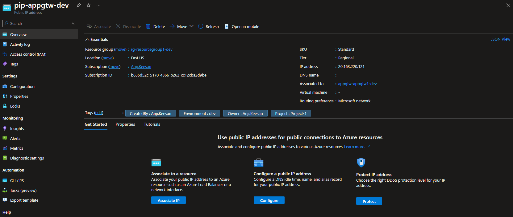
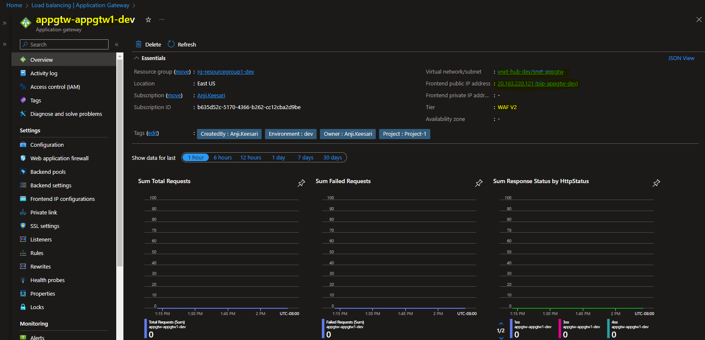

## Introduction

Azure Application Gateway is like the traffic cop of your web applications. Azure Application Gateway is a web traffic load balancer provided by Microsoft Azure. It acts as a central point for managing and optimizing the traffic to web applications, ensuring they are secure, highly available, and performant. 

In this lab, I will take a detailed walk-through to create an Azure Application Gateway using Terraform. I will also create a Public IP address for the Application Gateway using Terraform. Then, I will configure diagnostic settings to ensure robust monitoring and troubleshooting. Finally, I will validate these resources within the Azure portal to confirm that everything is functioning as expected.

Here are some key features of Azure Application Gateway:

1. **Load Balancing**: It distributes incoming network traffic across multiple servers to ensure even utilization and prevent overloading any single server. This results in better performance and fault tolerance.

2. **Web Application Firewall (WAF)**: Azure Application Gateway comes with a built-in web application firewall that helps protect web applications from common web exploits and vulnerabilities. It acts as a security guard, monitoring and filtering incoming traffic.

3. **SSL Termination**: It handles SSL/TLS encryption and decryption on behalf of web servers, relieving them of the computational load involved in these processes.

4. **URL-Based Routing**: You can configure Application Gateway to route traffic based on the URL path, making it versatile for directing requests to different services or applications.

5. **Session Affinity**: This feature ensures that client requests from the same user are directed to the same backend server. It's essential for applications that require user sessions, like online shopping carts.

6. **Auto Scaling**: Application Gateway can automatically adjust its capacity based on changes in web traffic. This means it can handle traffic spikes during high-demand periods.

7. **Health Probing**: It continually checks the health of backend servers. If a server becomes unhealthy, it stops sending traffic to that server until it recovers.

8. **Path-Based Routing**: You can route traffic to different backend pools based on the URL path. This is useful for hosting multiple services under the same domain.

9. **Multi-Site Hosting**: You can host multiple websites or applications on a single Application Gateway, providing an economical way to serve multiple applications.

10. **Custom Error Pages**: It allows you to create custom error pages, providing a better user experience when something goes wrong.


**Web application firewall**
A Web Application Firewall (WAF) is a security solution designed to protect web applications from various online threats and attacks such as `SQL injection` and `cross-site scripting`. It acts as a filter, monitoring and controlling the traffic between a web application and the clients (typically web browsers). The primary purpose of a WAF is to identify and block malicious traffic and unauthorized access attempts, ensuring the security and integrity of web applications.


## Technical Scenario

As a `Cloud Architect`, you've been tasked with enhancing the security and performance of a critical web application hosted in the Azure cloud environment. The application is the backbone of our business operations, handling sensitive customer data and serving as the primary touchpoint for our clients. To ensure its reliability and resilience in the face of evolving cyber threats, you're considering the implementation of Azure Application Gateway with a Web Application Firewall (WAF).

Azure Application Gateway, combined with a Web Application Firewall (WAF), offers an ideal solution to address these concerns. 

## Objective

In this exercise we will accomplish & learn how to implement following:

- **Task-1:** Define and declare variables for  Application Gateway
- **Task-2:** Create Public IP address for Application Gateway using Terraform
- **Task-3:** Create Azure Application Gateway using Terraform
- **Task-4:** Configure diagnostic settings for Application Gateway using Terraform


## Architecture diagram

The following diagram illustrates the high level architecture of Application Gateway components:


## Prerequisites

Before proceeding with this lab, make sure you have the following prerequisites in place:

1. Download and Install Terraform.
2. Download and Install Azure CLI.
3. Azure subscription.
4. Visual Studio Code.
5. Log Analytics workspace - for configuring diagnostic settings.
6. Virtual Network with subnet
7. Basic knowledge of Terraform and Azure concepts.

## Implementation details

Let's delve into the step-by-step implementation details:


**login to Azure**

Verify that you are logged into the right Azure subscription before start anything in visual studio code

```bash
# Login to Azure
az login 

# Shows current Azure subscription
az account show

# Lists all available Azure subscriptions
az account list

# Sets Azure subscription to desired subscription using ID
az account set -s "anji.keesari"
```
## Task-1: Define and declare variables for  Application Gateway

In this task, we will define and declare the necessary variables for creating the Azure Application Gateway. These variables will be used to specify the Application Gateway's settings and customize the values as per the environment requirements.

Here's the table with the variable names, their descriptions, variable type and their default values:

| Variable Name               | Description                                                        | Type        | Default Value      |
|-----------------------------|--------------------------------------------------------------------|-------------|---------------------|
| appgtw_name                 | (Required) Specifies the name of the Application Gateway.         | string       |  appgtw-appgtw1-dev  |
| appgtw_rg_name              | (Required) The name of the resource group.                        | string       |  rg-resourcegroup1-dev  |
| appgtw_location             | (Required) The Azure region for the Application Gateway.          | string       | North Central US    |
| appgtw_sku_size             | (Required) Name of the SKU for the Application Gateway.           | string       | Standard_v2         |
| appgtw_sku_tier             | (Required) The tier of the SKU for the Application Gateway.       | string       | Standard_v2         |
| appgtw_sku_capacity         | (Required) The capacity of the SKU for the Application Gateway.   | string       | 1                   |
| appgtw_pip_name             | (Required) Specifies the name of the Public IP.                   | string       | pip-appgtw-dev      |
| pip_allocation_method       | (Required) Defines the allocation method for the IP address.      | string       | Static              |
| pip_sku                     | (Optional) The SKU of the Public IP.                              | string       | Basic               |


*Variable declaration:*

``` bash title="variables.tf"

// Public IP
variable "public_ip_prefix" {
  type        = string
  default     = "pip"
  description = "Prefix of the public ip prefix resource."
}
variable "appgtw_pip_name" {
  description = "(Required) Specifies the name of the Public IP."
  type        = string
}
variable "pip_allocation_method" {
  description = " (Required) Defines the allocation method for this IP address."
  type        = string
  default     = "Static"
  validation {
    condition     = contains(["Static", "Dynamic"], var.pip_allocation_method)
    error_message = "The allocation method is invalid."
  }
}
variable "pip_sku" {
  description = "(Optional) The SKU of the Public IP. Accepted values are Basic and Standard. Defaults to Basic."
  type        = string
  default     = "basic"
  validation {
    condition     = contains(["basic", "Standard"], var.pip_sku)
    error_message = "The sku is invalid."
  }
}
// Application Gateway
variable "appgtw_prefix" {
  type        = string
  default     = "appgtw"
  description = "Prefix of the Application Gateway prefix resource."
}
variable "appgtw_name" {
  description = "(Required) Specifies the name of the Application Gateway."
  type        = string
}
variable "appgtw_rg_name" {
  description = "(Required) The name of the resource group in which to the Application Gateway should exist."
  type        = string
  default     = ""
}
variable "appgtw_location" {
  description = "(Required) The Azure region where the Application Gateway should exist."
  type        = string
  default     = "North Central US"
}
variable "appgtw_sku_size" {
  description = "(Required) The Name of the SKU to use for this Application Gateway. Possible values are Standard_Small, Standard_Medium, Standard_Large, Standard_v2, WAF_Medium, WAF_Large, and WAF_v2."
  type        = string
  default     = "Standard_v2"
  validation {
    condition     = contains(["Standard_Small", "Standard_Medium", "Standard_Large", "Standard_v2", "WAF_Medium", "WAF_Large", "WAF_v2"], var.appgtw_sku_size)
    error_message = "The sku size is invalid."
  }
}
variable "appgtw_sku_tier" {
  description = "(Required) The Tier of the SKU to use for this Application Gateway. Possible values are Standard, Standard_v2, WAF and WAF_v2."
  type        = string
  default     = "Standard_v2"
  validation {
    condition     = contains(["Standard", "Standard_v2", "WAF", "WAF_v2"], var.appgtw_sku_tier)
    error_message = "The sku tier is invalid."
  }
}
variable "appgtw_sku_capacity" {
  description = "(Required) The Capacity  of the SKU to use for this Application Gateway. When using a V1 SKU this value must be between 1 and 32, and 1 to 125 for a V2 SKU. This property is optional if autoscale_configuration is set."
  type        = string
  default     = "1"
}
variable "waf_config_firewall_mode" {
  description = "(Required) The Web Application Firewall Mode. Possible values are Detection and Prevention."
  type        = string
  default     = "Detection"
  validation {
    condition     = contains(["Detection", "Prevention"], var.waf_config_firewall_mode)
    error_message = "The Web Application Firewall Mode is invalid."
  }
}
variable "waf_config_enable" {
  description = "(Required) Is the Web Application Firewall enabled?"
  type        = bool
  default     = true
}
```

*Variable Definition:*

``` bash title="dev-variables.tfvars"
# application gateway
appgtw_name                         = "appgtw1"
appgtw_sku_size                     = "WAF_v2"
appgtw_sku_tier                     = "WAF_v2"
appgtw_sku_capacity                 = 2
appgtw_pip_name                     = "appgtw"
pip_allocation_method               = "Static"
pip_sku                             = "Standard"

```

## Task-2: Create Public IP address for Application Gateway using Terraform

In this task, we will create a Public IP address to be used by the Application Gateway.

``` bash title="appgateway.tf"
# Create public ip address for Application Gateway
resource "azurerm_public_ip" "appgtw_pip" {
  name                = lower("${var.public_ip_prefix}-${var.appgtw_pip_name}-${local.environment}")
  resource_group_name = azurerm_resource_group.rg.name
  location            = var.location
  allocation_method   = var.pip_allocation_method
  sku                 = var.pip_sku

  tags = merge(local.default_tags)
  lifecycle {
    ignore_changes = [
      tags
    ]
  }
  depends_on = [
    azurerm_resource_group.rg,
  ]
}
```
run terraform validate & format

``` bash
terraform validate
terraform fmt
```

run terraform plan & apply

``` bash
terraform plan -out=dev-plan -var-file="./environments/dev-variables.tfvars"
terraform apply dev-plan
```

Azure Application Gateway - Public IP address




## Task-3: Create Azure Application Gateway using Terraform

In this task, we will use Terraform to create the Azure Application Gateway with the specified configuration.

Create local variables for Application Gateway

``` bash title="appgateway.tf"
# Create local variables for Application Gateway
locals {
  gateway_ip_configuration_name  = "${var.appgtw_name}-configuration"
  frontend_port_name             = "${var.appgtw_name}-feport"
  frontend_ip_configuration_name = "${var.appgtw_name}-feip"
  backend_address_pool_name      = "${var.appgtw_name}-beap"
  backend_http_settings_name     = "${var.appgtw_name}-be-http"
  http_listener_name             = "${var.appgtw_name}-http-listner"
  request_routing_rule_name      = "${var.appgtw_name}-rqrt-rule"
  # redirect_configuration_name    = "${var.appgtw_name}-rdrcfg"
  # diag_appgtw_logs = [
  #   "ApplicationGatewayAccessLog",
  #   "ApplicationGatewayPerformanceLog",
  #   "ApplicationGatewayFirewallLog",
  # ]
  # diag_appgtw_metrics = [
  #   "AllMetrics",
  # ]
}

```

Create Application Gateway using terraform

``` bash title="appgateway.tf"
# Create Application Gateway using terraform
resource "azurerm_application_gateway" "appgtw" {
  name                = lower("${var.appgtw_prefix}-${var.appgtw_name}-${local.environment}")
  resource_group_name = azurerm_resource_group.rg.name
  location            = azurerm_resource_group.rg.location

  sku {
    name     = var.appgtw_sku_size
    tier     = var.appgtw_sku_tier
    capacity = var.appgtw_sku_capacity
  }
  waf_configuration {
    firewall_mode    = var.waf_config_firewall_mode
    enabled          = var.waf_config_enable
    rule_set_version = 3.1
  }
  gateway_ip_configuration {
    name      = local.gateway_ip_configuration_name
    subnet_id = azurerm_subnet.appgtw.id
  }
  frontend_port {
    name = local.frontend_port_name
    port = 80
  }
  frontend_port {
    name = "httpsPort"
    port = 443
  }
  frontend_ip_configuration {
    name                 = local.frontend_ip_configuration_name
    public_ip_address_id = azurerm_public_ip.appgtw_pip.id
  }

  backend_address_pool {
    name = local.backend_address_pool_name
  }

  backend_http_settings {
    name                  = local.backend_http_settings_name
    cookie_based_affinity = "Disabled"
    path                  = "/path1/"
    port                  = 80
    protocol              = "Http"
    request_timeout       = 60
    # connection_draining { //TODO: review this
    #   enabled = true
    #   drain_timeout_sec = 30
    # }
  }

  http_listener {
    name                           = local.http_listener_name
    frontend_ip_configuration_name = local.frontend_ip_configuration_name
    frontend_port_name             = local.frontend_port_name
    protocol                       = "Http"
  }

  request_routing_rule {
    name                       = local.request_routing_rule_name
    rule_type                  = "Basic"
    http_listener_name         = local.http_listener_name
    backend_address_pool_name  = local.backend_address_pool_name
    backend_http_settings_name = local.backend_http_settings_name
    priority                   = 1
  }
  tags = merge(local.default_tags)
  lifecycle {
    ignore_changes = [
      tags,
      tags["ingress-for-aks-cluster-id"],
      tags["managed-by-k8s-ingress"],
      backend_address_pool,
      backend_http_settings,
      frontend_ip_configuration,
      gateway_ip_configuration,
      frontend_port,
      http_listener,
      probe,
      request_routing_rule,
      redirect_configuration,
      ssl_certificate,
      ssl_policy,
      waf_configuration,
      autoscale_configuration,
      url_path_map,
      rewrite_rule_set
    ]
  }
  depends_on = [
    azurerm_resource_group.rg,
    azurerm_subnet.appgtw,
    azurerm_public_ip.appgtw_pip
  ]
}
```
Run Terraform validation and formatting:

``` bash
terraform validate
terraform fmt
```

run terraform plan & apply

``` bash
terraform plan -out=dev-plan -var-file="./environments/dev-variables.tfvars"
terraform apply dev-plan
```

Application gateway - Overview blade 



Application gateway - Configuration


Application gateway - Web application firewall (WAF)


## Task-4: Configure diagnostic settings for Application Gateway using terraform

In this task, we will configure diagnostic settings to monitor and analyze the performance and behavior of the Application Gateway.

``` bash title="appgateway.tf"

# Create Diagnostic Settings for Application Gateway
resource "azurerm_monitor_diagnostic_setting" "diag_apptw" {
  name                       = "${var.diag_prefix}-${azurerm_application_gateway.appgtw.name}"
  target_resource_id         = azurerm_application_gateway.appgtw.id
  log_analytics_workspace_id = azurerm_log_analytics_workspace.workspace.id
  # dynamic "log" {
  #   for_each = local.diag_appgtw_logs
  #   content {
  #     category = log.value

  #     retention_policy {
  #       enabled = false
  #     }
  #   }
  # }

  log {
    category = "ApplicationGatewayAccessLog"
    enabled  = true
  }

  log {
    category = "ApplicationGatewayFirewallLog"
    enabled  = true
  }

  log {
    category = "ApplicationGatewayPerformanceLog"
    enabled  = false
  }

  # dynamic "metric" {
  #   for_each = local.diag_appgtw_metrics
  #   content {
  #     category = metric.value

  #     retention_policy {
  #       enabled = false
  #     }
  #   }
  # }

  metric {
    category = "AllMetrics"
    enabled  = false
  }
}
```

run terraform validate & format

``` bash
terraform validate
terraform fmt
```

run terraform plan & apply

``` bash
terraform plan -out=dev-plan -var-file="./environments/dev-variables.tfvars"
terraform apply dev-plan
```


Application gateway - Diagnostic settings


## Reference

   - [Web Application Firewall documentation](https://learn.microsoft.com/en-us/azure/web-application-firewall/)
  - [Tutorial: Create an application gateway with a web application firewall using Terraform](https://learn.microsoft.com/en-us/azure/web-application-firewall/ag/application-gateway-web-application-firewall-portal)
   - [Azure Terraform QuickStart Templates](https://github.com/Azure/terraform/tree/master/quickstart)
   - [Azure Application Gateway Terraform Provider](https://registry.terraform.io/providers/hashicorp/azurerm/latest/docs/resources/application_gateway)
   - [Create Public IP address for Application Gateway using Terraform](https://registry.terraform.io/providers/hashicorp/azurerm/latest/docs/resources/public_ip) 
   - [Create Diagnostic Settings using terraform](https://registry.terraform.io/providers/hashicorp/azurerm/latest/docs/resources/monitor_diagnostic_setting)