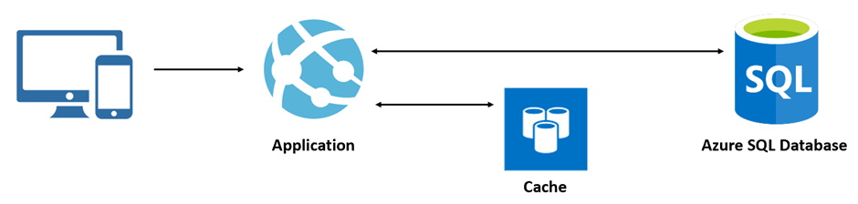
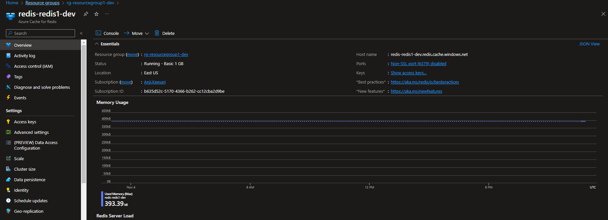
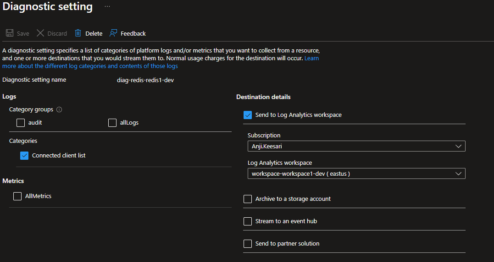
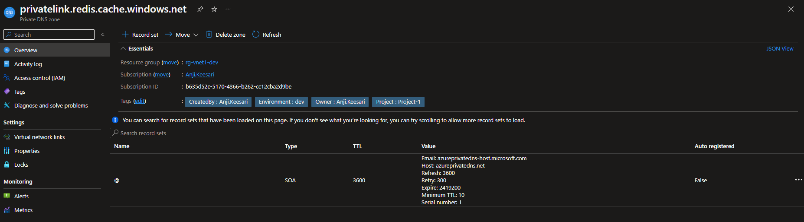
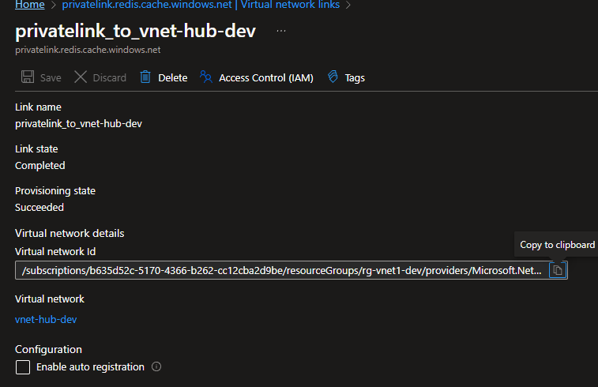
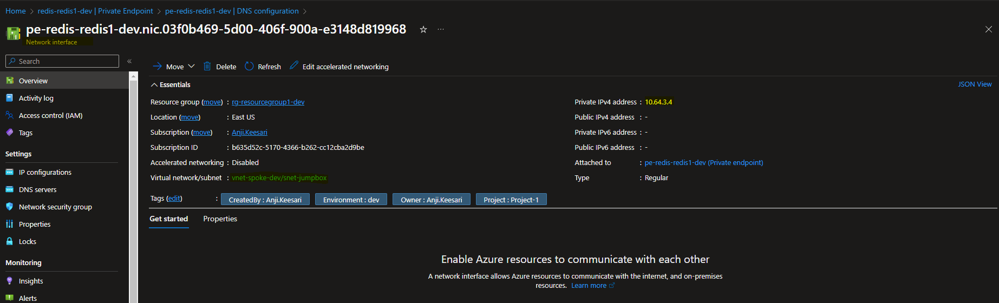

## Introduction

Azure Cache for Redis is a fully managed, in-memory data store that offers high throughput and low-latency access to cached data. In this guide, we'll utilize Terraform's Infrastructure as Code (IaC) capabilities to provision and configure an Azure Cache for Redis resource.

In this lab, I will walk through the steps to create an Azure Cache for Redis using Terraform. I'll also configure diagnostic settings to monitor its performance effectively. To ensure the security of our Azure Cache for Redis, I'll establish a private endpoint, thereby securing it from public access. Finally, we'll validate these resources within the Azure portal to confirm that everything is functioning as expected.

## Technical Scenario

As a `Cloud Architect`, you've been tasked with providing a caching mechanism to enhance performance and reduce the database load in a Microservices Architecture. Azure Cache for Redis offers an ideal solution by enabling us to store frequently accessed data in memory for rapid retrieval.

## Objective

In this exercise we will accomplish & learn how to implement following:

- **Task-1:** Define and declare Azure Cache for Redis variables.
- **Task-2:** Create Azure Cache for Redis using Terraform.
- **Task-3:** Configure diagnostic settings for Azure Cache for Redis using Terraform.
- **Task-4:** Create a private DNS zone for Redis Cache using Terraform.
- **Task-5:** Create a virtual network link to associate the Redis private DNS zone with a VNet.
- **Task-6:** Configure a private endpoint for Azure Cache for Redis using Terraform.

## Architecture diagram

The following diagram illustrates the high level architecture of redis usage:



## Prerequisites

Before proceeding with this lab, make sure you have the following prerequisites in place:

1. Download and Install Terraform.
2. Download and Install Azure CLI.
3. Azure subscription.
4. Visual Studio Code.
5. Log Analytics workspace - for configuring diagnostic settings.
6. Virtual Network with subnet - for configuring a private endpoint.
7. Basic knowledge of Terraform and Azure concepts.

## Implementation details

Now, let's delve into the step-by-step implementation details:


**login to Azure**

Verify that you are logged into the right Azure subscription before start anything in visual studio code

```bash
# Login to Azure
az login 

# Shows current Azure subscription
az account show

# Lists all available Azure subscriptions
az account list

# Sets Azure subscription to desired subscription using ID
az account set -s "anji.keesari"
```

## Task-1: Define and declare Azure Cache for Redis variables

In this task, we will define and declare the necessary variables for creating the Azure Cache for Redis resource. These variables will be used to specify the Azure Redis Cache resource settings and customize the values according to our requirements in each environment.

This table presents the variables along with their descriptions, data types, and default values:

| Variable Name                  | Description                                                                                                       | Type  | Default Value |
| ----------------------------- | ----------------------------------------------------------------------------------------------------------------- | ----- | ------------- |
| redis_cache_enabled            | (Optional) Whether to enable or disable redis_cache resource creations.                                                     | bool  | true          |
| redis_cache_prefix             | Prefix of the Redis cache name that's combined with the name of the Redis Cache.                                | string| redis         |
| redis_cache_name               | (Required) The name of the Redis instance.                                                                                  | string|  redis1      |
| redis_cache_sku                | (Required) The SKU of Redis to use. Possible values are Basic, Standard, and Premium.                                       | string| Basic         |
| redis_cache_capacity           | (Required) The size of the Redis cache to deploy. Valid values for a SKU family of C (Basic/Standard) are 0-6, and for P (Premium) family are 1-5. | string| 1            |
| redis_cache_family             | (Required) The SKU family/pricing group to use. Valid values are C (for Basic/Standard SKU family) and P (for Premium). | string| C           |
| request_message                | (Optional) Specifies a message passed to the owner of the remote resource when the private endpoint attempts to establish the connection to the remote resource. | string| null |
| redis_public_network_access_enabled | (Optional) Whether or not public network access is allowed for this Redis Cache. true means this resource could be accessed by both the public and private endpoint. false means only private endpoint access is allowed. Defaults to false. | bool | false |
| redis_enable_authentication      | (Optional) If set to false, the Redis instance will be accessible without authentication. Defaults to true. | bool | true |
| redis_pe_core_enabled             | (Optional) Enable core subscription private endpoint. | bool | false |
| private_endpoint_prefix           | Prefix of the Private Endpoint name that's combined with the name of the Private Endpoint. | string | pe |


*Variable declaration:*

``` bash title="variables.tf"
variable "redis_cache_enabled" {
  description = "(Optional) Whether to enable or disable redis_cache resource creations"
  type        = bool
  default     = true
}
variable "redis_cache_prefix" {
  type        = string
  default     = "redis"
  description = "Prefix of the Redis cache name that's combined with name of the Redis Cache."
}

variable "redis_cache_name" {
  description = "(Required) The name of the Redis instance."
  type        = string
}

variable "redis_cache_sku" {
  description = " (Required) The SKU of Redis to use. Possible values are Basic, Standard and Premium."
  type        = string
}

variable "redis_cache_capacity" {
  description = "(Required) The size of the Redis cache to deploy. Valid values for a SKU family of C (Basic/Standard) are 0, 1, 2, 3, 4, 5, 6, and for P (Premium) family are 1, 2, 3, 4, 5."
  type        = string
}

variable "redis_cache_family" {
  description = " (Required) The SKU family/pricing group to use. Valid values are C (for Basic/Standard SKU family) and P (for Premium)"
  type        = string
}
variable "request_message" {
  description = "(Optional) Specifies a message passed to the owner of the remote resource when the private endpoint attempts to establish the connection to the remote resource."
  type        = string
  default     = null
}

variable "redis_public_network_access_enabled" {
  description = " (Optional) Whether or not public network access is allowed for this Redis Cache. true means this resource could be accessed by both public and private endpoint. false means only private endpoint access is allowed. Defaults to true."
  type        = bool
  default     = false
}
variable "redis_enable_authentication" {
  description = " (Optional) If set to false, the Redis instance will be accessible without authentication. Defaults to true."
  type        = bool
  default     = true
}
variable "redis_pe_core_enabled" {
  description = " (Optional) Enable core subscription private endpoint"
  type        = bool
  default     = false
}
variable "private_endpoint_prefix" {
  type        = string
  default     = "pe"
  description = "Prefix of the Private Endpoint name that's combined with name of the Private Endpoint."
}
```

*Variable Definition:*

``` bash title="dev-variables.tfvars"
# Redis Cache
redis_cache_name                   = "redis1"
redis_cache_capacity               = 1
redis_cache_family                 = "C" 
redis_cache_sku                    = "Basic"
redis_public_network_access_enabled= true
redis_enable_authentication        = true
redis_pe_core_enabled              = true
```

## Task-2: Create Azure Cache for Redis using terraform

In this task, we will use Terraform to create the Azure Cache for Redis instance with the desired configuration.

``` bash title="redis_cache.tf"
# Create Azure Cache for Redis using terraform
resource "azurerm_redis_cache" "redis" {
  # count                         = var.redis_cache_enabled ? 1 : 0
  name                          = lower("${var.redis_cache_prefix}-${var.redis_cache_name}-${local.environment}")
  resource_group_name           = azurerm_resource_group.rg.name
  location                      = azurerm_resource_group.rg.location
  capacity                      = var.redis_cache_capacity
  family                        = var.redis_cache_family
  sku_name                      = var.redis_cache_sku
  enable_non_ssl_port           = false
  minimum_tls_version           = "1.2"
  public_network_access_enabled = var.redis_public_network_access_enabled
  # subnet_id = azurerm_subnet.redis.id
  tags = merge(local.default_tags)
  redis_configuration {
    enable_authentication = var.redis_enable_authentication
  }
  lifecycle {
    ignore_changes = [
      tags
    ]
  }
  depends_on = [
    azurerm_resource_group.rg,
  ]
}
```
Run Terraform validation and formatting:

``` bash
terraform validate
terraform fmt
```

run terraform plan & apply

``` bash
terraform plan -out=dev-plan -var-file="./environments/dev-variables.tfvars"
terraform apply dev-plan
```

azure cache for redis creation takes close to 30 mins.

```bash
azurerm_redis_cache.redis[0]: Creation complete after 25m14s
```
Azure Cache for Redis - Overview blade 


Azure Cache for Redis - Console


Azure Cache for Redis - Console command

## Task-3: Configure diagnostic settings for Azure Cache for Redis using terraform

By configuring diagnostic settings, we can monitor and analyze the performance and behavior of the Azure Cache for Redis instance, helping us optimize its usage.

``` bash title="redis_cache.tf"
# Create diagnostic settings for Azure Cache for Redis
resource "azurerm_monitor_diagnostic_setting" "diag_redis" {
  name                       = lower("${var.diag_prefix}-${azurerm_redis_cache.redis.name}")
  target_resource_id         = azurerm_redis_cache.redis.id
  log_analytics_workspace_id = azurerm_log_analytics_workspace.workspace.id

  log {
    category = "ConnectedClientList"
    enabled  = true
  }

  metric {
    category = "AllMetrics"
    enabled  = false

  }
  lifecycle {
    ignore_changes = [
      log
    ]
  }

  depends_on = [
    azurerm_redis_cache.redis,
    azurerm_log_analytics_workspace.workspace
  ]
}

```

run terraform validate & format

``` bash
terraform validate
terraform fmt
```

run terraform plan & apply

``` bash
terraform plan -out=dev-plan -var-file="./environments/dev-variables.tfvars"
terraform apply dev-plan
```


Azure Cache for Redis - Diagnostic settings from left nav


Azure Cache for Redis - Diagnostic settings


## Securing an Azure Cache for Redis instance

Securing an Azure Cache for Redis instance from public access involves creating a private endpoint and restricting access to only a specific virtual network or networks. Here are step-by-step instructions to achieve this:

For more details: [Azure Cache for Redis with Azure Private Link](https://docs.microsoft.com/en-us/azure/azure-cache-for-redis/cache-private-link)

**Private Endpoint**

Azure Private Endpoint is a network interface that connects you privately and securely to Azure Cache for Redis powered by Azure Private Link.

You can restrict public access to the private endpoint of your cache by disabling the PublicNetworkAccess flag.

Private endpoint is supported on cache tiers Basic, Standard, Premium, and Enterprise. We recommend using private endpoint instead of VNets. Private endpoints are easy to set up or remove, are supported on all tiers, and can connect your cache to multiple different VNets at once.

before creating private endpoint we need to make sure that following variable is updated to false.

```bash
redis_public_network_access_enabled= false
```

Here are step-by-step instructions to achieve this:

## Task-4: Create private DNS zone for Redis Cache using terraform

This private DNS zone will enable us to access the Redis Cache using a custom domain name within our virtual network.

``` bash title="private_dns.tf"
# Create private DNS zone for Redis Cache
resource "azurerm_private_dns_zone" "pdz_redis" {
  name                = "privatelink.redis.cache.windows.net"
  resource_group_name = azurerm_virtual_network.vnet.resource_group_name
  tags                = merge(local.default_tags)
  lifecycle {
    ignore_changes = [
      tags
    ]
  }
  depends_on = [
    azurerm_virtual_network.vnet
  ]
}
```
run terraform validate & format

``` bash
terraform validate
terraform fmt
```

run terraform plan & apply

``` bash
terraform plan -out=dev-plan -var-file="./environments/dev-variables.tfvars"
terraform apply dev-plan
```


Azure Cache for Redis - Private DNS zone



## Task-5: Create virtual network link to associate redis private DNS zone to vnet

In this task, we will create a virtual network link to associate the Redis private DNS zone with our virtual network. This link enables DNS resolution for the Redis Cache within the virtual network.


``` bash title="private_dns.tf"
# Create private virtual network link to vnet
resource "azurerm_private_dns_zone_virtual_network_link" "redis_pdz_vnet_link" {
  name                  = "privatelink_to_${azurerm_virtual_network.hub_vnet.name}"
  resource_group_name   = azurerm_resource_group.vnet.name
  virtual_network_id    = azurerm_virtual_network.hub_vnet.id
  private_dns_zone_name = azurerm_private_dns_zone.pdz_redis.name

  lifecycle {
    ignore_changes = [
      tags
    ]
  }
  depends_on = [
    azurerm_resource_group.vnet,
    azurerm_virtual_network.hub_vnet,
    azurerm_private_dns_zone.pdz_redis
  ]
}

```
run terraform validate & format

``` bash
terraform validate
terraform fmt
```

run terraform plan & apply

``` bash
terraform plan -out=dev-plan -var-file="./environments/dev-variables.tfvars"
terraform apply dev-plan
```

Azure Cache for Redis - Private DNS zone - Virtual network links


Azure Cache for Redis - Private DNS zone - Virtual network links details


By creating a virtual network link, we enable DNS resolution for the Redis Cache within our virtual network, allowing seamless communication.


## Task-5: Configure private endpoint for Azure Cache for Redis using terraform

By configuring a private endpoint, we ensure that the Azure Cache for Redis instance is accessible securely within the virtual network, minimizing exposure to the public internet.

``` bash title="redis_cache.tf"
# Create private endpoint for Azure Cache for Redis
resource "azurerm_private_endpoint" "pe_redis_core" {
  name                = lower("${var.private_endpoint_prefix}-${azurerm_redis_cache.redis.name}")
  location            = azurerm_redis_cache.redis.location
  resource_group_name = azurerm_redis_cache.redis.resource_group_name
  subnet_id           = azurerm_subnet.jumpbox.id
  tags                = merge(local.default_tags)

  private_service_connection {
    name                           = "pe-${azurerm_redis_cache.redis.name}"
    private_connection_resource_id = azurerm_redis_cache.redis.id
    is_manual_connection           = false
    subresource_names              = ["redisCache"]
    request_message                = try(var.request_message, null)
  }

  private_dns_zone_group {
    name                 = "default"
    private_dns_zone_ids = [azurerm_private_dns_zone.pdz_redis.id]
  }

  lifecycle {
    ignore_changes = [
      tags
    ]
  }
  depends_on = [
    azurerm_subnet.jumpbox,
    azurerm_redis_cache.redis,
    azurerm_private_dns_zone.pdz_redis
  ]
}
```
run terraform validate & format

``` bash
terraform validate
terraform fmt
```

run terraform plan & apply

``` bash
terraform plan -out=dev-plan -var-file="./environments/dev-variables.tfvars"
terraform apply dev-plan
```

Azure Cache for Redis - Private endpoint


Azure Cache for Redis - Private endpoint


Azure Cache for Redis - Private endpoint - Network interface


By following these steps, we've secured your Azure Cache for Redis instance from public access. It's now only accessible through the private endpoint in our specified Virtual Network.

## key features

Azure Cache for Redis is a fully managed, in-memory data store service provided by Microsoft Azure. It offers several key features that make it a valuable tool for caching and enhancing the performance of your applications. Here are some of the key features of Azure Cache for Redis:

1. **High Performance**: Azure Cache for Redis is designed for high throughput and low-latency access to cached data. It's based on the popular open-source Redis cache, making it extremely fast and efficient.

2. **In-Memory Data Store**: It stores data in memory, which allows for lightning-fast data retrieval. This is particularly useful for caching frequently accessed data to reduce latency.

3. **Fully Managed Service**: Azure Cache for Redis is a fully managed service. Azure takes care of tasks like patching, monitoring, and backups, so you can focus on your application.

4. **Data Persistence**: It offers both non-persistent and persistent caching options. You can configure it to store data on disk for data durability.

5. **Scaling**: Azure Cache for Redis provides the ability to scale your cache horizontally by adding or removing cache nodes to handle increased load.

6. **Security**: It supports various security features, including Virtual Network service endpoints, SSL encryption, and Azure AD integration, to keep your data secure.

7. **Advanced Data Structures**: Redis supports various data structures like strings, hashes, lists, sets, sorted sets, bitmaps, and geospatial indexes, making it versatile for different types of data.

8. **Pub/Sub Messaging**: Redis supports publish/subscribe messaging patterns, allowing applications to communicate in real-time.

9. **Geo-Replication**: Azure Cache for Redis supports geo-replication, enabling you to replicate your cache across multiple Azure regions for high availability.

10. **Diagnostic and Monitoring**: It integrates with Azure Monitor and Azure Diagnostics, providing detailed insights into cache usage and performance.

Azure Cache for Redis is a powerful tool for optimizing application performance, reducing the load on your primary data sources, and enabling real-time data processing. It's commonly used in web applications, microservices, and various scenarios where low-latency data access is crucial.


## Reference

Here are some references related to Azure Cache for Redis &  securing using private endpoints with Terraform:

**Microsoft Azure Documentation:**

1. [Azure Cache for Redis Documentation](https://learn.microsoft.com/en-us/azure/azure-cache-for-redis/)

2. [Tutorial: Secure access to an Azure Cache for Redis instance from a virtual network](https://docs.microsoft.com/en-us/azure/azure-cache-for-redis/cache-private-link)

3. [Azure Private DNS Zone Overview](https://docs.microsoft.com/en-us/azure/private-link/private-endpoint-dns)

**Terraform Resources:**

1. [Documentation on creating a azure cache for redis with Terraform.](https://registry.terraform.io/providers/hashicorp/azurerm/latest/docs/resources/redis_cache)
   
2. [Documentation on creating a private DNS zone with Terraform.](https://registry.terraform.io/providers/hashicorp/azurerm/latest/docs/resources/private_dns_zone)

3. [Documentation on creating a virtual network link to associate a private DNS zone to a VNet in Terraform.](https://registry.terraform.io/providers/hashicorp/azurerm/latest/docs/resources/private_dns_zone_virtual_network_link)
  
4. [Information on creating a private endpoint for Azure Cache for Redis using Terraform.](https://registry.terraform.io/providers/hashicorp/azurerm/latest/docs/resources/private_endpoint)


<!-- - https://registry.terraform.io/providers/hashicorp/azurerm/latest/docs/resources/redis_cache.html
- https://stackoverflow.com/questions/73544491/how-to-implement-in-terraform-azure-for-redis-with-private-endpoint
- https://www.youtube.com/watch?v=WexiwCm33Qs
- https://learn.microsoft.com/en-us/azure/azure-cache-for-redis/cache-private-link
- https://stackoverflow.com/questions/62556733/private-endpoint-for-redis-cache
- https://www.youtube.com/watch?v=WexiwCm33Qs 
- https://www.red-gate.com/simple-talk/development/dotnet-development/overview-of-azure-cache-for-redis/
- -->