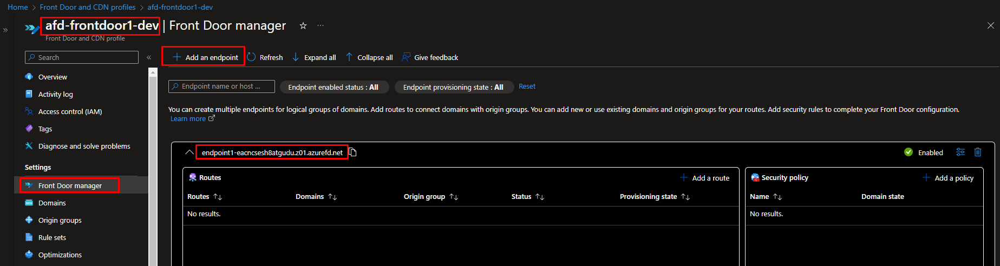

## Introduction

Azure Front Door and Azure CDN (Content Delivery Network) services are provided by Microsoft Azure

**Azure Front Door**

`Azure Front Door`is a global, scalable entry-point service that optimizes and secures web applications. It acts as a load balancer with routing, providing global load balancing, SSL termination, and application acceleration. Azure Front Door improves the performance, availability, and security of web applications.

**Key Features:**

1. **Global Load Balancing:** Distributes user traffic across multiple endpoints globally, ensuring users are directed to the closest and healthiest server.
  
2. **Web Application Firewall (WAF):** Provides protection against common web vulnerabilities and exploits through customizable security policies.

3. **SSL/TLS Termination:** Terminates SSL/TLS at the edge to reduce the load on backend servers and enhance performance.

4. **Acceleration of Dynamic and Static Content:** Optimizes content delivery by caching static content at edge locations and accelerating dynamic content.

5. **Session Affinity:** Supports sticky sessions to direct user requests to the same backend server, ensuring a consistent user experience.

6. **Custom Domains:** Allows the use of custom domain names and certificates for secure communication.

7. **Health Probing:** Monitors the health of backend servers and automatically routes traffic away from unhealthy servers.

8. **Routing Rules:** Enables flexible routing based on criteria such as path, host, query string, and client IP address.

9. **Backend Pools:** Groups endpoints (backend servers) into pools for better organization and management.

10. **Analytics and Monitoring:** Provides insights into user traffic, performance, and security through analytics and monitoring tools.

**Azure CDN Profile:**

Azure CDN is a distributed network of servers that delivers web content (such as images, videos, and scripts) to users based on their geographical location. It helps reduce latency and improves content delivery by caching and serving content from `edge locations` that are closer to the end-users.

**Key Features:**

1. **Content Caching:** Distributes and caches content at edge locations to reduce latency and improve performance.

2. **Dynamic Site Acceleration:** Optimizes delivery of dynamic content by using advanced caching techniques.

3. **HTTPS Support:** Provides secure content delivery over HTTPS.

4. **Origin Fetch Optimization:** Minimizes the need to fetch content from the origin server by serving it directly from the edge.

5. **Compression:** Compresses content to reduce file sizes and improve delivery speed.

6. **Content Purging:** Allows manual purging of cached content to ensure updated content is delivered.

7. **Rules Engine:** Enables customization of content delivery rules based on various criteria.

8. **Analytics and Monitoring:** Provides insights into content delivery performance and user behavior.

`Azure Front Door` is primarily focused on application optimization, global load balancing, and security, while `Azure CDN` is focused on efficiently delivering and caching content to improve overall performance. 

In this lab, I will walk through the steps to create an Azure Front Door & CDN profile using Terraform. We'll also configure frontend URL of Azure Front Door and backend origin group and origin with route and custom domain.  I'll also configure diagnostic settings to monitor its performance effectively. Finally, we'll validate these resources within the Azure portal to confirm that everything is functioning as expected.

## Technical Scenario

As a `Cloud Architect`, your mission is to architect a solution for optimizing the caching of static and dynamic web content globally, elevating user experiences, and ensuring the creation of a high-performance, globally accessible, and secure website. Leveraging the capabilities of Azure Front Door and CDN profile is key to achieving these goals efficiently.

## Objective

In this exercise we will accomplish & learn how to implement following:

- **Task-1:** Define and Declare Azure Front Door & CDN variables.
- **Task-2:** Create a Front Door CDN profile using Terraform.
- **Task-3:** Create a Front Door Endpoint using using Terraform - (frontend).
- **Task-4:** Create a Front Door Origin Group using Terraform - (backend).
- **Task-5:** Create a Front Door Origin using Terraform - (backend).
- **Task-6:** Create Custom Domains for the Front Door using Terraform.
- **Task-7:** Create a Front Door Route using Terraform.
- **Task-8:** Create a DNS TXT (temporary) record in DNS Zone
- **Task-9:** Create DNS CNAME records in DNS Zone
- **Task-10:** Configure diagnostic settings for CDN profile
- **Task-10:** Apply lock on Front Door Profile
<!-- - **Task-7:** Create an App Service plan using Terraform.
- **Task-8:** Create an App Service app using Terraform. -->

## Architecture diagram

The following diagram illustrates the high level architecture of Azure Front Door & CDN:

<!--  -->

## Prerequisites

Before proceeding with this lab, make sure you have the following prerequisites in place:

- Download and Install Terraform.
- Download and Install Azure CLI.
- Azure subscription.
- Visual Studio Code.
- Log Analytics workspace - for configuring diagnostic settings.
- Azure Public DNS zone - for custom domain
- Basic knowledge of Terraform and Azure concepts.

## Implementation details

Step-by-step implementation details will be covered here.


**login to Azure**

Verify that you are logged into the right Azure subscription before start anything in visual studio code

```bash
# Login to Azure
az login 

# Shows current Azure subscription
az account show

# Lists all available Azure subscriptions
az account list

# Sets Azure subscription to desired subscription using ID
az account set -s "anji.keesari"
```

## Task-1: Define and Declare Azure Front Door & CDN variables.

In this task, we will define and declare the necessary variables for creating the Azure Front Door & CDN resources. These variables will be used to specify the Azure Front Door & CDN resources settings and customize the values according to our requirements in each environment.

This table presents the variables along with their descriptions, data types, and default values:


| Variable Name                                      | Description                                                                                                      | Type         | Default Value | 
| --------------------------------------------------- | ---------------------------------------------------------------------------------------------------------------- | ------------ | ------------- |
| `cdn_frontdoor_prefix`                             | Prefix of the Front Door & CDN name.                                                                              | `string`     | `"afd"`       |
| `cdn_frontdoor_tags`                               | Specifies a mapping of tags for the Front Door Endpoint.                                                          | `map(any)`   | `{}`          |
| `cdn_frontdoor_profile_name`                        | Specifies the name of the Front Door Profile.                                                                     | `string`     | `"afd-cdn_frontdoor1-dev"` |
| `cdn_frontdoor_profile_sku_name`                    | The SKU for the Front Door profile. Possible values include: `Standard_AzureFrontDoor`, `Premium_AzureFrontDoor`.  | `string`     | `"Standard_AzureFrontDoor"` |
| `cdn_frontdoor_endpoint_name`                       | The name for the Front Door Origin.                    | `string`     | `"endpoint1"` |
| `cdn_frontdoor_endpoint_enabled`                    | Specifies if this Front Door Endpoint is enabled. Defaults to `true`.                                             | `bool`       | `true`        |
| `cdn_frontdoor_origin_group_name`                  | The name for the Front Door Origin Group.                                                                         | `string`     | `"origingroup1"` |
| `session_affinity_enabled`                          | Specifies whether session affinity should be enabled on this host. Defaults to `true`.                            | `bool`       | `true`        |
| `restore_traffic_time_to_healed_or_new_endpoint_in_minutes` | Time before shifting traffic to another endpoint when a healthy endpoint becomes unhealthy or a new endpoint is added. | `number` | `10` |
| `cdn_frontdoor_origin_name`                        | The name for the Front Door Origin.                                                                               | `string`     | `"origin1"`   |
| `cdn_frontdoor_origin_host_ip`                     | The IPv4 address, IPv6 address, or Domain name of the Origin.                                                     | `string`     | `"20.125.213.106"` |
| `cdn_frontdoor_origin_host_name`                   | The host name of the domain. The `host_name` field must be the FQDN of your domain.                              | `string`     | `"sitename.mydomain.com"` |
| `cdn_frontdoor_origin_host_header`                 | The host header value which is sent to the origin with each request.                                               | `string`     | `"sitename.mydomain.com"` |
| `cdn_frontdoor_route_name`                         | The name for the Front Door Route. Valid values must begin with a letter or number and may only contain letters, numbers, and hyphens with a maximum length of 90 characters. | `string` | `"route1"` |
| `content_types_to_compress`                        | (Optional) An array of strings that indicates a content types on which compression will be applied. The value for the elements should be MIME types.                                                     | `list(string)` | See default values in the code |
| `public_dns_zone_name`                             | The name of the DNS Zone. Must be a valid domain name.                                                             | `string`     | `"mydomain.com"` |
| `public_dns_zone_rg_name`                          | Specifies the resource group where the resource exists.                                                           | `string`     | `"rg-mydomains-dev"` |
| `cdn_frontdoor_custom_domain_name`                 | The name for the Front Door Custom Domain. Must be between 2 and 260 characters in length.                         | `string`     | `"sitename"` |
| `dns_txt_record`                                   | The name of the DNS TXT Record.                                                                                    | `string`     | `"sitename"` |
| `dns_cname_record`                                 | The name of the DNS CNAME Record.                                                                                  | `string`     | `"sitename"` |

*Variable declaration:*

```tf title="variables.tf"
// ========================== Azure Front Door & CDN profile ==========================
# Task-1: Define and Declare Azure Front Door & CDN variables.
# cdn_profile
variable "cdn_frontdoor_prefix" {
  type        = string
  default     = "afd"
  description = "Prefix of the Front Door & CDN name."
}
variable "cdn_frontdoor_tags" {
  description = "(Optional) Specifies a mapping of tags which should be assigned to the Front Door Endpoint."
  type        = map(any)
  default     = {}
}
variable "cdn_frontdoor_profile_name" {
  type        = string
  default     = "afd-cdn_frontdoor1-dev"
  description = "(Required) Specifies the name of the Front Door Profile."
}
variable "cdn_frontdoor_profile_sku_name" {
  type        = string
  description = "The SKU for the Front Door profile. Possible values include: Standard_AzureFrontDoor, Premium_AzureFrontDoor"
  default     = "Standard_AzureFrontDoor"
  validation {
    condition     = contains(["Standard_AzureFrontDoor", "Premium_AzureFrontDoor"], var.cdn_frontdoor_profile_sku_name)
    error_message = "The SKU value must be one of the following: Standard_AzureFrontDoor, Premium_AzureFrontDoor."
  }
}
# endpoint
variable "cdn_frontdoor_endpoint_name" {
  type        = string
  default     = "endpoint1"
  description = "(Required) The name which should be used for this Front Door Origin. Changing this forces a new Front Door Origin to be created."
}
variable "cdn_frontdoor_endpoint_enabled" {
  description = " (Optional) Specifies if this Front Door Endpoint is enabled? Defaults to true."
  default     = true
  type        = bool
}
# origin_group
variable "cdn_frontdoor_origin_group_name" {
  type        = string
  default     = "origingroup1"
  description = "(Required) The name which should be used for this Front Door Origin Group."
}
variable "session_affinity_enabled" {
  description = "(Optional) Specifies whether session affinity should be enabled on this host. Defaults to true."
  default     = true
  type        = bool
}
variable "restore_traffic_time_to_healed_or_new_endpoint_in_minutes" {
  description = "(Optional) Specifies the amount of time which should elapse before shifting traffic to another endpoint when a healthy endpoint becomes unhealthy or a new endpoint is added. Possible values are between 0 and 50 minutes (inclusive). Default is 10 minutes."
  default     = 10
  type        = number
}
# origin
variable "cdn_frontdoor_origin_name" {
  type        = string
  default     = "origin1"
  description = "(Required) The name which should be used for this Front Door Origin."
}
variable "cdn_frontdoor_origin_host_ip" {
  type        = string
  default     = "20.125.213.106"
  description = "(Required) The IPv4 address, IPv6 address or Domain name of the Origin."
}
variable "cdn_frontdoor_origin_host_name" {
  type        = string
  default     = "sitename.mydomain.com"
  description = "(Required) The host name of the domain. The host_name field must be the FQDN of your domain(e.g. contoso.fabrikam.com)."
}
variable "cdn_frontdoor_origin_host_header" {
  type        = string
  default     = "sitename.mydomain.com"
  description = "(Optional) The host header value (an IPv4 address, IPv6 address or Domain name) which is sent to the origin with each request."
}
# route
variable "cdn_frontdoor_route_name" {
  type        = string
  default     = "route1"
  description = "(Required) The name which should be used for this Front Door Route. Valid values must begin with a letter or number, end with a letter or number and may only contain letters, numbers and hyphens with a maximum length of 90 characters."
}
variable "content_types_to_compress" {
  description = "Specifies the address space of the hub virtual virtual network"
  type        = list(string)
  default = [
    "application/eot",
    "application/font",
    "application/font-sfnt",
    "application/javascript",
    "application/json",
    "application/opentype",
    "application/otf",
    "application/pkcs7-mime",
    "application/truetype",
    "application/ttf",
    "application/vnd.ms-fontobject",
    "application/x-font-opentype",
    "application/x-font-truetype",
    "application/x-font-ttf",
    "application/x-httpd-cgi",
    "application/x-javascript",
    "application/x-mpegurl",
    "application/x-opentype",
    "application/x-otf",
    "application/x-perl",
    "application/x-ttf",
    "application/xhtml+xml",
    "application/xml",
    "application/xml+rss",
    "font/eot",
    "font/opentype",
    "font/otf",
    "font/ttf",
    "image/svg+xml",
    "text/css",
    "text/csv",
    "text/html",
    "text/javascript",
    "text/js",
    "text/plain",
    "text/richtext",
    "text/tab-separated-values",
    "text/x-component",
    "text/x-java-source",
    "text/x-script",
    "text/xml",
  ]
}
# custom_domain
variable "public_dns_zone_name" {
  type        = string
  default     = "mydomain.com"
  description = "(Required) The name of the DNS Zone. Must be a valid domain name. "
}
variable "public_dns_zone_rg_name" {
  type        = string
  default     = "rg-mydomains-dev"
  description = "(Required) Specifies the resource group where the resource exists."
}
variable "cdn_frontdoor_custom_domain_name" {
  type        = string
  default     = "sitename"
  description = "(Required) The name which should be used for this Front Door Custom Domain. Possible values must be between 2 and 260 characters in length, must begin with a letter or number, end with a letter or number and contain only letters, numbers and hyphens."
}
variable "dns_txt_record" {
  type        = string
  default     = "sitename"
  description = "(Required) The name of the DNS TXT Record."
}
variable "dns_cname_record" {
  type        = string
  default     = "sitename"
  description = " (Required) The name of the DNS CNAME Record."
}
```

*Variable Definition:*

```tf title="dev-variables.tfvars"
# Azure Front Door & CDN profile
cdn_frontdoor_profile_name          = "frontdoor1"
cdn_frontdoor_profile_sku_name      = "Standard_AzureFrontDoor"
```

## Task-2: Create a Front Door CDN profile using Terraform.

In this task, you will use Terraform to create an Azure CDN profile. The provided Terraform code demonstrates how to configure the CDN profile, including its name, resource group, SKU, and tags. This profile is the foundation of your content delivery network (CDN).

CDN Profile which contains a collection of endpoints and origin groups which we will discuss in next steps.

```tf title="cdn-frontdoor.tf"
# Task-2: Create a Front Door CDN profile using Terraform.
resource "azurerm_cdn_frontdoor_profile" "cdn_frontdoor_profile" {
  name                = lower("${var.cdn_frontdoor_prefix}-${var.cdn_frontdoor_profile_name}-${local.environment}")
  resource_group_name = azurerm_resource_group.rg.name
  sku_name            = var.cdn_frontdoor_profile_sku_name
  tags                = merge(local.default_tags)
  depends_on = [
    azurerm_resource_group.rg,
  ]
  lifecycle {
    ignore_changes = [
      # tags
    ]
  }
}
```

run terraform validate & format

``` bash
terraform validate
terraform fmt
```

run terraform plan & apply

``` bash
terraform plan -out=dev-plan -var-file="./environments/dev-variables.tfvars"
terraform apply dev-plan
```
Azure Front Door and CDN profile - Overview blade 


## Task-3: Create a Front Door Endpoint using Terraform.


In Azure Front Door, an "Endpoint" represents a specific destination to which incoming requests are routed. Endpoints are critical components of the routing and load balancing capabilities provided by Azure Front Door. Each endpoint points to a backend resource, such as an Azure Web App, an Azure API Management instance, a custom domain, or any other service that you want to expose through Azure Front Door.

For example, suppose you have created an endpoint named `myendpoint`. The endpoint domain name might be `myendpoint-mdjf2jfgjf82mnzx.z01.azurefd.net`.

for more information - <https://learn.microsoft.com/en-us/azure/frontdoor/endpoint?tabs=azurecli> 


```tf title="cdn-frontdoor.tf"
# Task-3: Create a Front Door endpoint using Terraform. - (frontend) 
resource "azurerm_cdn_frontdoor_endpoint" "cdn_frontdoor_endpoint" {
  name                     = var.cdn_frontdoor_endpoint_name
  cdn_frontdoor_profile_id = azurerm_cdn_frontdoor_profile.cdn_frontdoor_profile.id
  enabled                  = var.cdn_frontdoor_endpoint_enabled
  tags                     = merge(local.default_tags, var.cdn_frontdoor_tags)
  depends_on = [
    azurerm_cdn_frontdoor_profile.cdn_frontdoor_profile,
  ]
  lifecycle {
    ignore_changes = [
      # tags
    ]
  }
}

```

run terraform validate & format

``` bash
terraform validate
terraform fmt
```

run terraform plan & apply

``` bash
terraform plan -out=dev-plan -var-file="./environments/dev-variables.tfvars"
terraform apply dev-plan
```




## Task-4: Create a Front Door Origin Group using Terraform.


An Origin Group, also known as a Backend Pool, is a logical grouping of multiple backend resources (usually web servers or application instances) that serve the same content or application but may be distributed across different geographic locations or data centers. The primary purpose of an Origin Group is to ensure high availability and load balancing.

more information - <https://learn.microsoft.com/en-us/azure/frontdoor/origin?pivots=front-door-standard-premium>

```tf title="cdn-frontdoor.tf"

# Task-4: Create a Front Door origin group using Terraform. (backend)
resource "azurerm_cdn_frontdoor_origin_group" "cdn_frontdoor_origin_group" {
  name                                                      = var.cdn_frontdoor_origin_group_name
  cdn_frontdoor_profile_id                                  = azurerm_cdn_frontdoor_profile.cdn_frontdoor_profile.id
  session_affinity_enabled                                  = var.session_affinity_enabled
  restore_traffic_time_to_healed_or_new_endpoint_in_minutes = var.restore_traffic_time_to_healed_or_new_endpoint_in_minutes

  load_balancing {
    additional_latency_in_milliseconds = 50
    sample_size                        = 4
    successful_samples_required        = 3
  }

  # health_probe {
  #   path                = "/"
  #   request_type        = "HEAD"
  #   protocol            = "Http"
  #   interval_in_seconds = 100
  # }
  depends_on = [
    azurerm_cdn_frontdoor_profile.cdn_frontdoor_profile,
  ]
  lifecycle {
    ignore_changes = [
      # tags
    ]
  }
}
```

run terraform validate & format

``` bash
terraform validate
terraform fmt
```

run terraform plan & apply

``` bash
terraform plan -out=dev-plan -var-file="./environments/dev-variables.tfvars"
terraform apply dev-plan
```


## Task-5: Create a Front Door Origin using Terraform.

Origins are the destinations where Front Door forwards user traffic

An origin can be any service or resource that you want to expose through Azure Front Door. This includes Azure Web Apps, API Management instances, custom domains, or other backend services.

Origins are part of Origin Groups in Azure Front Door.

for more information - <https://learn.microsoft.com/en-us/azure/frontdoor/origin?pivots=front-door-standard-premium>

```tf title="cdn-frontdoor.tf"
# Task-5: Create a Front Door origin using Terraform. (backend)
resource "azurerm_cdn_frontdoor_origin" "cdn_frontdoor_origin" {
  name                          = var.cdn_frontdoor_origin_name
  cdn_frontdoor_origin_group_id = azurerm_cdn_frontdoor_origin_group.cdn_frontdoor_origin_group.id

  enabled                        = true
  host_name                      = "20.125.213.106" # azurerm_public_ip.appgtw_pip.ip_address
  http_port                      = 80
  https_port                     = 443
  origin_host_header             = "sitename.mydomain.com" # azurerm_public_ip.appgtw_pip.ip_address
  priority                       = 1
  weight                         = 1000
  certificate_name_check_enabled = false

  depends_on = [
    azurerm_cdn_frontdoor_origin_group.cdn_frontdoor_origin_group,
  ]
  lifecycle {
    ignore_changes = [
      # tags
    ]
  }
}
```

Here's a bit more detail:

- **Origin Group:** An Origin Group is a logical grouping of multiple backend Origins. It allows you to specify a collection of backend endpoints, often geographically distributed, that host the same content or service. These endpoints are used to serve traffic for your application. An Origin Group can be used for redundancy, load balancing, or traffic distribution based on your configuration.

- **Origin:** An Origin, within an Origin Group, is a specific backend endpoint or server that hosts the content you want to serve. You might have multiple Origins within an Origin Group to provide high availability and fault tolerance. Azure Front Door automatically balances and routes traffic to these Origins.


run terraform validate & format

``` bash
terraform validate
terraform fmt
```

run terraform plan & apply

``` bash
terraform plan -out=dev-plan -var-file="./environments/dev-variables.tfvars"
terraform apply dev-plan
```


## Task-6: Create custom domains for the Front Door using Terraform.

This Terraform configuration is used to define and create a custom domain for an Azure Front Door profile, associating it with the provided Azure CDN Front Door profile and specifying details related to TLS for secure communication. The custom domain allows you to map your own domain name to the Front Door, enabling users to access your services via a user-friendly domain, such as www.example.com, while benefiting from the performance and security features of Azure Front Door.


```tf title="cdn-frontdoor.tf"

data "azurerm_dns_zone" "dns_zone" {
  name                = var.public_dns_zone_name
  resource_group_name = var.public_dns_zone_rg_name
}

# Task-6: Create custom domains for the Front Door
resource "azurerm_cdn_frontdoor_custom_domain" "cdn_frontdoor_custom_domain" {
  name                     = var.cdn_frontdoor_custom_domain_name
  cdn_frontdoor_profile_id = azurerm_cdn_frontdoor_profile.cdn_frontdoor_profile.id
  dns_zone_id              = data.azurerm_dns_zone.dns_zone.id
  host_name                = var.cdn_frontdoor_origin_host_name
  tls {
    certificate_type    = "ManagedCertificate"
    minimum_tls_version = "TLS12"
  }
  depends_on = [
    azurerm_cdn_frontdoor_profile.cdn_frontdoor_profile,
    data.azurerm_dns_zone.dns_zone,
  ]
  lifecycle {
    ignore_changes = [
      # tags
    ]
  }
}
```
for more information - <https://learn.microsoft.com/en-us/azure/frontdoor/domain>

run terraform validate & format

``` bash
terraform validate
terraform fmt
```

run terraform plan & apply

``` bash
terraform plan -out=dev-plan -var-file="./environments/dev-variables.tfvars"
terraform apply dev-plan
```

<!--  -->

## Task-7: Create a Front Door Route using Terraform


In the context of Azure Front Door and similar content delivery or load balancing services, a `Route` typically refers to the configuration or rule that defines how incoming requests are directed to specific backend Origins or Origin Groups.


```tf title="cdn-frontdoor.tf"
# Task-7: Create Route in Origin of the Origin Group
resource "azurerm_cdn_frontdoor_route" "cdn_frontdoor_route" {
  name                            = var.cdn_frontdoor_route_name
  cdn_frontdoor_endpoint_id       = azurerm_cdn_frontdoor_endpoint.cdn_frontdoor_endpoint.id
  cdn_frontdoor_origin_group_id   = azurerm_cdn_frontdoor_origin_group.cdn_frontdoor_origin_group.id
  cdn_frontdoor_origin_ids        = [azurerm_cdn_frontdoor_origin.cdn_frontdoor_origin.id]
  cdn_frontdoor_custom_domain_ids = [azurerm_cdn_frontdoor_custom_domain.cdn_frontdoor_custom_domain.id]

  supported_protocols = ["Http", "Https"]
  patterns_to_match   = ["/*", "/"]
  forwarding_protocol    = "MatchRequest"
  link_to_default_domain = true
  https_redirect_enabled = true
  cache {
    query_string_caching_behavior = "UseQueryString"
    # Content won't be compressed when the requested content is smaller than 1 KB or larger than 8 MB(inclusive).
    compression_enabled       = true
    content_types_to_compress = var.content_types_to_compress
  }
  depends_on = [
    azurerm_cdn_frontdoor_endpoint.cdn_frontdoor_endpoint,
    azurerm_cdn_frontdoor_origin_group.cdn_frontdoor_origin_group,
    azurerm_cdn_frontdoor_origin.cdn_frontdoor_origin,
    azurerm_cdn_frontdoor_custom_domain.cdn_frontdoor_custom_domain,
  ]
  lifecycle {
    ignore_changes = [
      # tags
    ]
  }
}

```
run terraform validate & format

``` bash
terraform validate
terraform fmt
```

run terraform plan & apply

``` bash
terraform plan -out=dev-plan -var-file="./environments/dev-variables.tfvars"
terraform apply dev-plan
```

## Task-8: Create a DNS TXT (temporary) record in DNS Zone

The provided Terraform configuration is used to create a DNS TXT record in an Azure DNS zone. The primary purpose of this DNS TXT record is to validate ownership and control of a custom domain for Azure Front Door. 


```tf title="cdn-frontdoor.tf"
# Task-8: Create a DNS TXT (temporary) record in DNS Zone
resource "azurerm_dns_txt_record" "dns_txt_record_validation" {
  name                = join(".", ["_dnsauth", var.dns_txt_record])
  zone_name           = data.azurerm_dns_zone.dns_zone.name
  resource_group_name = data.azurerm_dns_zone.dns_zone.resource_group_name
  ttl                 = 3600

  record {
    value = azurerm_cdn_frontdoor_custom_domain.cdn_frontdoor_custom_domain.validation_token
  }
  depends_on = [
    azurerm_cdn_frontdoor_custom_domain.cdn_frontdoor_custom_domain,
    data.azurerm_dns_zone.dns_zone
  ]
}
```

run terraform validate & format

``` bash
terraform validate
terraform fmt
```

run terraform plan & apply

``` bash
terraform plan -out=dev-plan -var-file="./environments/dev-variables.tfvars"
terraform apply dev-plan
```

<!--  -->
This Terraform configuration creates a DNS TXT record in an Azure DNS zone with specific content, and it associates it with Azure Front Door for domain ownership validation. It's an essential step when setting up a custom domain to point to Azure Front Door, as it proves that you have control over the domain you're configuring.

## Task-9: Create DNS CNAME records in DNS Zone

 This Terraform task facilitates the automated setup of DNS CNAME records, linking your custom domain or subdomain to an Azure CDN Front Door endpoint for streamlined access to your application.

```tf title="cdn-frontdoor.tf"
# Task-9: Create DNS CNAME records in DNS Zone
resource "azurerm_dns_cname_record" "dns_cname_record" {
  name                = var.dns_cname_record
  zone_name           = data.azurerm_dns_zone.dns_zone.name
  resource_group_name = data.azurerm_dns_zone.dns_zone.resource_group_name
  ttl                 = 3600
  record              = azurerm_cdn_frontdoor_endpoint.cdn_frontdoor_endpoint.host_name

  depends_on = [
    data.azurerm_dns_zone.dns_zone,
    azurerm_cdn_frontdoor_endpoint.cdn_frontdoor_endpoint,
    # azurerm_cdn_frontdoor_security_policy.example
  ]
}

```

run terraform validate & format

``` bash
terraform validate
terraform fmt
```

run terraform plan & apply

``` bash
terraform plan -out=dev-plan -var-file="./environments/dev-variables.tfvars"
terraform apply dev-plan
```

<!--  -->
## Task-10: Configure diagnostic settings for CDN profile

By configuring diagnostic settings, we can monitor and analyze the performance and behavior of the Azure Front Door & CDN profile instance.

``` bash title="redis_cache.tf"
# Task-10: Create Diagnostic Settings for Azure Front Door
resource "azurerm_monitor_diagnostic_setting" "cdn_frontdoor_diag" {  
  name                       = "DiagnosticsSettings"
  target_resource_id         = azurerm_cdn_frontdoor_profile.cdn_frontdoor_profile.id
  log_analytics_workspace_id = azurerm_log_analytics_workspace.workspace.id

  log {
    category_group = "allLogs"
  }

  log {
    category_group = "audit"
  }

  metric {
    category = "AllMetrics"
  }
  lifecycle {
    ignore_changes = [
      log_analytics_destination_type,
    ]
  }
  depends_on = [
    azurerm_cdn_frontdoor_profile.cdn_frontdoor_profile,
    azurerm_log_analytics_workspace.workspace
  ]
}
```

run terraform validate & format

``` bash
terraform validate
terraform fmt
```

run terraform plan & apply

``` bash
terraform plan -out=dev-plan -var-file="./environments/dev-variables.tfvars"
terraform apply dev-plan
```

## Task-11: Apply lock on Front Door Profile

The purpose of applying a lock to an Azure resource, in this case, the Azure Front Door profile, is to prevent accidental deletion. By setting a "CanNotDelete" lock, you are ensuring that the resource remains in place and operational, which is particularly useful for critical resources in production environments to avoid data loss or service disruption caused by accidental deletion. It provides an additional layer of protection for important resources.

```tf title="cdn-frontdoor.tf"
# Task-10: Apply lock on Front Door Profile
resource "azurerm_management_lock" "cdn_frontdoor_lock" {
  name       = "afd-profile"
  scope      = azurerm_cdn_frontdoor_profile.cdn_frontdoor_profile.id
  lock_level = "CanNotDelete"
  notes      = "This resource can not be deleted - lock set by Terraform"
  depends_on = [
    azurerm_cdn_frontdoor_endpoint.cdn_frontdoor_endpoint,
    azurerm_cdn_frontdoor_origin_group.cdn_frontdoor_origin_group,
    azurerm_cdn_frontdoor_origin.cdn_frontdoor_origin,
    azurerm_cdn_frontdoor_custom_domain.cdn_frontdoor_custom_domain,
    azurerm_cdn_frontdoor_route.cdn_frontdoor_route
  ]
}
```

run terraform validate & format

``` bash
terraform validate
terraform fmt
```

run terraform plan & apply

``` bash
terraform plan -out=dev-plan -var-file="./environments/dev-variables.tfvars"
terraform apply dev-plan
```

<!--  -->

## Reference

Here are some references related to Azure Front Door and CDN:

- [Microsoft MSDN - Azure Front Door and CDN documentation](https://learn.microsoft.com/en-us/azure/frontdoor/){:target="_blank"}
- [Microsoft MSDN - What is Azure Front Door?](https://learn.microsoft.com/en-us/azure/frontdoor/front-door-overview){:target="_blank"}
- [Microsoft MSDN - Create an Azure Front Door Standard/Premium profile using Terraform](https://learn.microsoft.com/en-us/azure/frontdoor/create-front-door-terraform){:target="_blank"}
- [Microsoft MSDN - Decision tree for load balancing in Azure](https://learn.microsoft.com/en-us/azure/architecture/guide/technology-choices/load-balancing-overview){:target="_blank"}
- [Terraform Registry - azurerm_cdn_frontdoor_profile](https://registry.terraform.io/providers/hashicorp/azurerm/latest/docs/resources/cdn_frontdoor_profile){:target="_blank"}
- [Terraform Registry - azurerm_cdn_frontdoor_endpoint](https://registry.terraform.io/providers/hashicorp/azurerm/latest/docs/resources/cdn_frontdoor_endpoint){:target="_blank"}
- [Terraform Registry - azurerm_cdn_frontdoor_origin_group](https://registry.terraform.io/providers/hashicorp/azurerm/latest/docs/resources/cdn_frontdoor_origin_group){:target="_blank"}
- [Terraform Registry - azurerm_cdn_frontdoor_origin](https://registry.terraform.io/providers/hashicorp/azurerm/latest/docs/resources/cdn_frontdoor_origin){:target="_blank"}
- [Terraform Registry - azurerm_cdn_frontdoor_route](https://registry.terraform.io/providers/hashicorp/azurerm/latest/docs/resources/cdn_frontdoor_route){:target="_blank"}
- [Terraform Registry - azurerm_cdn_frontdoor_custom_domain](https://registry.terraform.io/providers/hashicorp/azurerm/latest/docs/resources/cdn_frontdoor_custom_domain){:target="_blank"}
- [Terraform Registry - azurerm_dns_txt_record](https://registry.terraform.io/providers/hashicorp/azurerm/latest/docs/resources/dns_txt_record){:target="_blank"}
- [Terraform Registry - azurerm_dns_cname_record](https://registry.terraform.io/providers/hashicorp/azurerm/latest/docs/resources/dns_cname_record){:target="_blank"}
- [Azure Terraform Quickstart/101-front-door-standard-premium](https://github.com/Azure/terraform/tree/master/quickstart/101-front-door-standard-premium){:target="_blank"}

<!-- 
- https://intellipaat.com/blog/azure-front-door/ 
-->