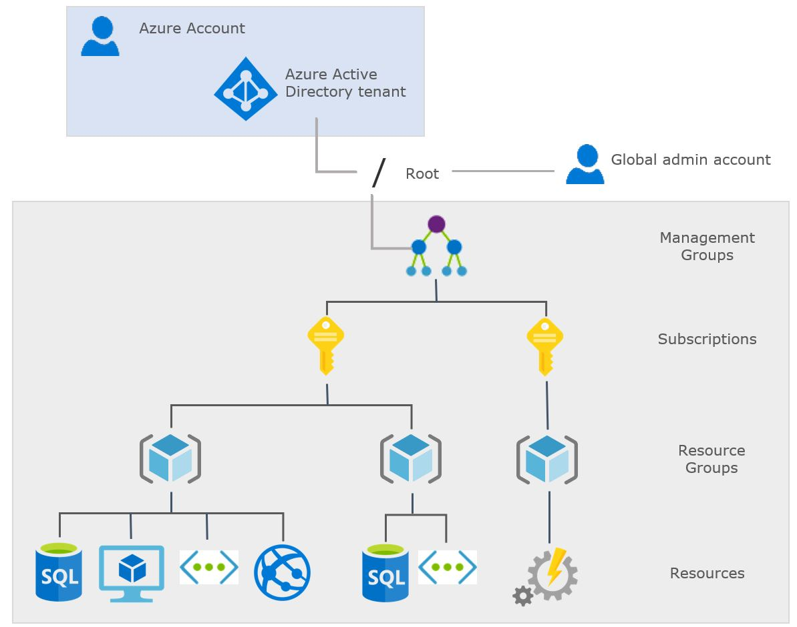

<!-- # Chapter 2.1: Create Azure Free Account -->

In this lab you will learn how to create new azure account & new azure subscription so that you can accomplish rest of the labs.

**Azure Account:**
   - An Azure account is essentially a user account that is associated with Microsoft Azure. This account allows individuals or organizations to access Azure services and resources.
   - An Azure account can be created using an email address provided by Microsoft , or it can be associated with an organization's domain if they are using Azure Active Directory (Azure AD).

**Azure Subscription:**
   - An Azure subscription is a logical container that holds the Azure resources and services used by an organization or an individual.
   - It is tied to the billing and payment of Azure services. Azure resources are billed based on usage, and all usage is linked to a specific subscription.   

**Azure Active Directory (Azure AD):**
   - Azure Active Directory is Microsoft's cloud-based identity and access management service. It is often referred to as Azure AD.
   - It serves as a directory service, storing information about users, groups, and applications, including their access permissions.

**Azure Subscription Management Hierarchy**

[{:style="border: 1px solid black; border-radius: 10px;"}](images/image-38.jpg){:target="_blank"}

## Prerequisites

- You need a Credit Card
- Valid email address
- Working phone number

## Create new azure account

Follow these steps to create new free azure account:

**Step-1:** Go to the following URL - [Azure free account](https://azure.microsoft.com/en-us/free/){:target="_blank"}

**Step-2:** Click on start Free.

**Step-3:** If you already have Microsoft Account, then Sign-in using existing email address and password. else Sign-up for a Microsoft account using your personal email address.

**Step-4:** Enter your Country/Region and Date of Birth and click next.

**Step-5:** Enter the verification code received on the email address and click next.

**Step-6:** Type the captcha you see on your screen and click on next.

**Step-7:** Enter details in your profile screen 

**Step-7:** Enter payment details

**Step-8:** Check the Terms and Conditions and click Sign-up.

Once your account is created, you will be taken to the Azure portal where you can start creating and managing resources.

## Create new Subscription

**Prerequisites** 

- Azure Account or Tenant
- Azure subscription creator role

There are different subscription types available in Azure, creating new subscription steps are completely different depending on type of the subscription you want to create.

read the information from following Microsoft documentation before creating any new subscription to make sure that you select the right one.

[Create a subscription](https://learn.microsoft.com/en-us/azure/cost-management-billing/manage/create-subscription#create-a-subscription){:target="_blank"}
[Create an Enterprise Agreement subscription](https://learn.microsoft.com/en-us/azure/cost-management-billing/manage/create-enterprise-subscription){:target="_blank"}
[Create a subscription for a partner's customer](https://learn.microsoft.com/en-us/azure/cost-management-billing/manage/create-customer-subscription){:target="_blank"}

To create a new Azure subscription, you can follow these steps:

**Step-1:** Login into Azure portal - [Azure portal login](https://portal.azure.com/){:target="_blank"}

**Step-2:** Click on Subscriptions in the left nav and click Add button

**Step-3:** On the Subscriptions page, click on the "+New Subscription" button.

**Step-4:** On the "Create a subscription" page, select the type of subscription you want to create. This can be a "Pay-As-You-Go" subscription, a "Free Trial" subscription, or an "Enterprise Agreement" subscription.

**Step-5:** Enter all the required details in the Basic and Advance tabs

**Step-6:** Review all the details and finally click on Review + Create button

After a few minutes, your new subscription will be created and will be listed on the Subscriptions page in the Azure portal.

## Reference

- [YouTube - Chapter-1.1: Create New Azure Portal Account](https://www.youtube.com/watch?v=cX0ikhVkCcY&t=35s){:target="_blank"}
- [Microsoft- Azure free account](https://azure.microsoft.com/en-us/free/){:target="_blank"}
- [Microsoft- Create a subscription](https://learn.microsoft.com/en-us/azure/cost-management-billing/manage/direct-ea-administration?WT.mc_id=Portal-Microsoft_Azure_Ea#create-a-subscription){:target="_blank"}