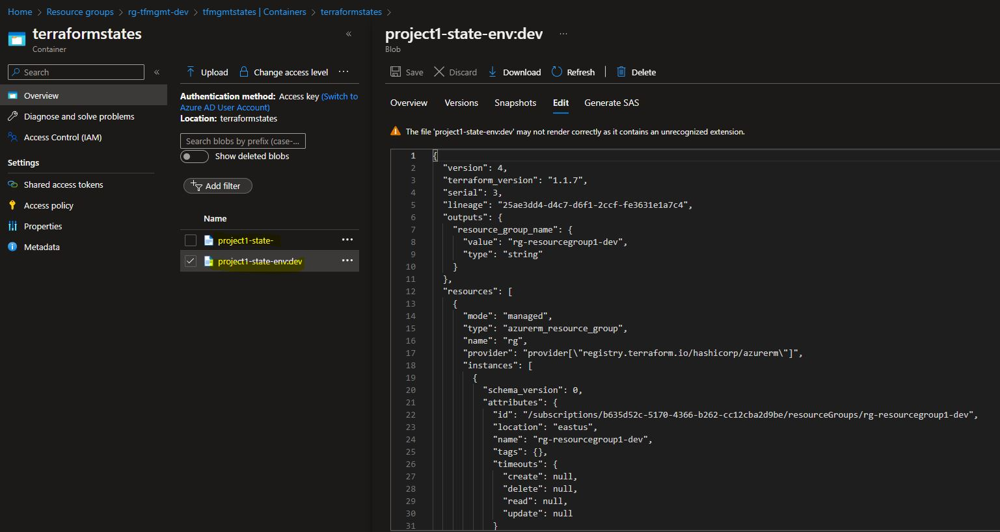

## Introduction

This is part-2 of the terraform foundation, in this module we will setup the terraform project and folder structure for running any kind of terraform configuration. this folder structure and terraform source code created as part of this lab is the minimum requirements for creating any kind of azure resources using terraform.

## Technical Scenario
As a `Cloud Engineer`, you have been asked to start working on infrastructure as code (IaC) setup using terraform for your organization so that you can create any kind of azure cloud resources using the source code written in terraform language. As part of the terraform project structure we will be creating our first resource group so that we can test the basic terraform setup or files created in this module.

we will start with bare minimum terraform configuration in this module and update the same files while creating more and more resources in the future modules.


## Prerequisites
  - Download & Install Terraform
  - Download & Install Azure CLI
  - Azure subscription
  - Visual studio code
  - Azure DevOps project & repo
  - Terraform Management setup (part-1)

## Objective

The objective of this lab is to accomplish the following tasks in order to set up the Terraform environment and successfully provision Azure resources:

- Task-1: Create terraform environment variables
- Task-2: Create terraform providers
- Task-3: Configure terraform backend state
- Task-4: Create terraform variables
- Task-5: Create locals file
- Task-6: Create azure resource group
- Task-7: Store Terraform commands
- Task-8: Initialize Terraform
- Task-9: Setup Terraform workspace
- Task-10: Create a Terraform execution plan
- Task-11: Apply a Terraform execution plan
- Task-12: Verify the results
- Task-12: Verify terraform statefile

## Architecture diagram


## Implementation details

Before proceeding with the tasks, make sure to clone the Terraform Git repository from the Azure DevOps portal. This repository should have been created in the previous module. Once the repository is cloned, open the VS Code text editor and navigate to the Terraform folder to access the Terraform configuration files.

Here are the step-by-step instructions to perform each task:

## Task-1: Create terraform environment variables

Terraform allows you to use environment variables to define variables that are used in your Terraform configuration. Environment variables are a convenient way to pass values to Terraform, without having to hard-code them in your configuration files. 

By using environment variables in Terraform, you can more easily customize your Terraform configuration based on your environment, without having to modify your configuration files directly. This can be useful when working with multiple environments, such as development, testing, and production.

Let's create new folder called `environments` and add following files in it. here we are creating *.tfvar files for each environment, these *.tfvar files will contains environment specific values in it.

We are going to use these files for controlling your environment specific setting in future labs;

let's start with adding service principle credentials in environment variables and later use these files for adding more environment specific variable as and when needed while creating new azure resources.

environments folder structure will look like below:
```
environments
  |_ dev-variables.tfvar 
  |_ test-variables.tfvar 
  |_ prod-variables.tfvar 
```

!!! important
    Replace these values with your environment specific values

```  tf title="dev-variables.tf"
sp-subscription-id = "test-6c89-4044-8a23-test"
sp-client-id = "test-645b-48f5-b586-test"
sp-client-secret = "test~oFskcGH6bno8kS~tet"
sp-tenant-id = "test-f87d-46ad-b4be-test"

```

```  tf title="test-variables.tf"
sp-subscription-id = "value will be replaced by key vault value"
sp-client-id = "value will be replaced by key vault value"
sp-client-secret = "value will be replaced by key vault value"
sp-tenant-id = "value will be replaced by key vault value"
```

```  tf title="prod-variables.tf"
sp-subscription-id = "value will be replaced by key vault value"
sp-client-id = "value will be replaced by key vault value"
sp-client-secret = "value will be replaced by key vault value"
sp-tenant-id = "value will be replaced by key vault value"
```


!!! Best-Practice
    We are going to use lowercase for all the files and folders in the terraform. 

## Task-2: Create terraform providers

Terraform providers are plugins that allow Terraform to interact with different resources in different infrastructure providers (Azure, AWS, GCP) Here are the steps to create a provider in Terraform:

The `azurerm` Terraform Provider allows managing resources within Azure Resource Manager. 

Here we will create a new file called `provider.tf` and register all the required providers for terraform to create required resources.

```  tf title="provider.tf"
terraform {

  required_version = ">=0.12"

  required_providers {
    azurerm = {
      source  = "hashicorp/azurerm"
      version = "~>3.31.0" //"~>2.0"
    }

    azuread = {
      version = ">= 2.26.0" // https://github.com/terraform-providers/terraform-provider-azuread/releases
    }
  }
}

provider "random" {}

provider "azurerm" {
  features {}
  skip_provider_registration = true
  subscription_id            = var.sp-subscription-id
  client_id                  = var.sp-client-id
  client_secret              = var.sp-client-secret
  tenant_id                  = var.sp-tenant-id
}

```

!!! note
    It's important to keep your provider versions up to date and ensure compatibility with your other Terraform modules and configurations.

## Task-3: Configure terraform backend state

By default, Terraform state is stored locally, which isn't ideal, rather we should be storing using remote state which is in azure storage account so that multiple team members can work on the terraform project. here we will configure the terraform backend for remote state.

use the azure storage account created in part-1 of the terraform foundation and configure terraform backed state.

To configure the backend state, you need the following information:

- `resource_group_name`: The name of the azure resource group where Storage account is created.
- `storage_account_name`: The name of the Azure Storage account.
- `container_name`: The name of the blob container.
- `key`: The name of the state store file to be created.

Create a new file called `backend.tf` in your Terraform project directory.

In the `backend.tf` file, add the following configuration to define the Azure Storage Account as the backend:

```  tf title="backend.tf"
terraform {
  backend "azurerm" {
    resource_group_name  = "rg-tf-mgmt-project1"
    storage_account_name = "sttfstatesdev"
    container_name       = "terraformstates"
    key                  = "project1-state-"
  }
}
```

## Task-4: Create terraform variables

Terraform variables allow you to define reusable values in your Terraform configuration, which can be used to parameterize your Terraform code.

In terraform, variables are divided into inputs and outputs. let's create separate file for each one of them here.

**input variables**

`variables.tf` - use this file for input variables

```  tf title="variables.tf"
# Service Principal
variable "sp-subscription-id" {
  description = "Id of the azure subscription where all resources will be created"
  type        = string
}
variable "sp-client-id" {
  description = "Client Id of A Service Principal or Azure Active Directory application registration used for provisioning azure resources."
  type        = string
}
variable "sp-client-secret" {
  description = "Secret of A Service Principal or Azure Active Directory application registration used for provisioning azure resources."
  type        = string
}
variable "sp-tenant-id" {
  description = "Tenant Id of the azure account."
  type        = string
}
# Azure resources
variable "rg_name" {
  description = "Name of the main resource rroup name for project-1"
  type        = string
}

variable "location" {
  description = "Specifies the location for the resource group and all the resources"
  type        = string
  default     = "East US"
}

variable "default_tags" {
  type = map(any)
  default = {
    "Project"   = "Project-1"
    "Owner"     = "Anji.Keesari"
    "CreatedBy" = "Anji.Keesari"
  }
}
```

**output variables** 

`output.tf` - use this files for output variables

``` tf title="output.tf"
output "resource_group_name" {
  value = azurerm_resource_group.rg.name
}

```

**variables prefix**

I am also going to create one more file for azure resource names naming conventions or standards across my organization. This file contains prefix of all the frequently used azure resource names as per the standards.

Let's begin with resource group prefix and keep updating this files in the future labs as per the new resource added.

`variables_prefix.tf`


``` tf title="variables_prefix.tf"

variable "rg_prefix" {
  type        = string
  default     = "rg"
  description = "Prefix of the resource group name that's combined with name of the resource group."
}

```

## Task-5: Create locals file

In Terraform, `locals` is a block used to define values that are derived from other values in your configuration. These values are typically used for convenience or to improve readability of your configuration.

This is optional but it is recommended to keep all the locals in single files, we are going to use this file in the future labs.

Use this file for storing all the locals in one place together for entire terraform project.


``` tf title="locals.tf"

locals {
  default_tags = merge(var.default_tags, { "Environment" = "${terraform.workspace}" })
  environment  = terraform.workspace != "default" ? terraform.workspace : ""
}

```

Note: - don't worry about `terraform.workspace` will talk more on this in the future labs.

## Task-6: Create azure resource group

Finally let's create one sample azure resource group to make sure that all the terraform configuration we created above is actually working as expected.


``` tf  title="resource_group.tf"
# Create the resource group
resource "azurerm_resource_group" "rg" {
  name     = lower("${var.rg_prefix}-${var.rg_name}-${local.environment}")
  location = var.location
  tags = merge(local.default_tags,
    {
      "CreatedBy" = "Anji.Keesari"
  })
  lifecycle {
    ignore_changes = [
      tags,
    ]
  }
}

```

## Task-7: Store terraform commands

Create a separate file for storing all terraform commands here, so that anyone working on this project can use them for running commands quickly.

This task is optional, but it will be really helpful especially new team members working on the same project.


``` tf  title="tf_commands.ps1"

# azure login related
az login

az account list --output table

az account set -s "anji.keesari"

az account show --output table

# terraform related
terraform init
# terraform init -reconfigure

terraform validate
terraform fmt
terraform plan -out=dev-plan -var-file="./environments/dev-variables.tfvars"
terraform apply dev-plan

terraform state list

# workspaces related
terraform workspace list

terraform workspace new dev

terraform workspace select dev

```

## Task-8: Initialize Terraform

Run `terraform init` to initialize the Terraform deployment. This command downloads the Azure modules required to manage your Azure resources.

**terraform init**

``` tf 
Initializing the backend...

Initializing provider plugins...
- Finding latest version of hashicorp/azurerm...
- Installing hashicorp/azurerm v3.40.0...
- Installed hashicorp/azurerm v3.40.0 (signed by HashiCorp)

Terraform has created a lock file .terraform.lock.hcl to record the provider
selections it made above. Include this file in your version control repository
any changes that are required for your infrastructure. All Terraform commands
should now work.

If you ever set or change modules or backend configuration for Terraform,
rerun this command to reinitialize your working directory. If you forget, other
commands will detect it and remind you to do so if necessary.
```

You will notice this new folder created when you run `terraform init` command executed


Also see the folder structure of the terraform project.

!!! important
    Verify to make sure that new state file got created in azure storage account blob container 

**terraform validate**

validate terraform code for syntax

```
Success! The configuration is valid.
```

**terraform fmt**

Formats terraform source code as per HCL canonical standard


## Task-9: Setup Terraform workspace

Terraform workspace is a feature in Terraform that allows you to manage multiple instances of the same Terraform configuration in a single Terraform state. Each workspace is effectively a separate and isolated environment, with its own state and variables. Here are the steps to create and manage workspaces in Terraform:

default workspace

```
Terraform workspace
```
output

```
* default
```
Create a new workspace

```
terraform workspace new dev
```

```
Created and switched to workspace "dev"!

You're now on a new, empty workspace. Workspaces isolate their state,
so if you run "terraform plan" Terraform will not see any existing state
for this configuration.

```
```
terraform workspace list   
```
output

```
  default
* dev

```
Use this to switch between workspaces

```
terraform workspace select dev
```


## Task-10: Create a Terraform execution plan

Run `terraform plan` to create an execution plan.


Here are the key points to keep in mind when running terraform plan:

- The terraform plan command creates an execution plan by evaluating your Terraform configuration files. It determines what actions are necessary to achieve the desired state specified in your configuration.
- The plan provides a detailed summary of the changes that Terraform will make to your infrastructure. It shows additions, modifications, and deletions of resources, as well as any dependencies or potential issues.
- Running terraform plan allows you to review and verify the execution plan before applying any changes to the actual resources. This step is crucial for understanding the impact of the changes and ensuring they align with your expectations.
- By default, the execution plan is displayed in the terminal. However, you can also save the plan to a file using the optional -out parameter. This ensures that the plan you reviewed is exactly what will be applied when you proceed with the terraform apply command.
  
**Terraform plan**

```
terraform plan -out=dev-plan -var-file="./environments/dev-variables.tfvars"
```
output

``` tf 

Terraform used the selected providers to generate the following execution plan. Resource actions are indicated with the following symbols:
  + create

Terraform will perform the following actions:

  # azurerm_resource_group.rg will be created
  + resource "azurerm_resource_group" "rg" {
      + id       = (known after apply)
      + location = "northcentralus"
      + name     = "rg-resourcegroup1-dev"
      + tags     = {
          + "CreatedBy"   = "Anji.Keesari"
          + "Environment" = "dev"
          + "Owner"       = "Anji.Keesari"
          + "Project"     = "Project-1"
        }
    }

Plan: 1 to add, 0 to change, 0 to destroy.

Changes to Outputs:
  + resource_group_name = "rg-resourcegroup1-dev"

Saved the plan to: dev-plan

To perform exactly these actions, run the following command to apply:
    terraform apply "dev-plan"

```

## Task-11: Apply a Terraform execution plan

Run `terraform apply` to apply the execution plan to your cloud infrastructure.

**Terraform apply**

```
terraform apply dev-plan
```

output
```
azurerm_resource_group.rg: Creating...
azurerm_resource_group.rg: Creation complete after 2s [id=/subscriptions/test-5170-4366-b262-test/resourceGroups/rg-resourcegroup1-dev]

Apply complete! Resources: 1 added, 0 changed, 0 destroyed.

Outputs:

resource_group_name = "rg-resourcegroup1-dev"
```

## Task-12: Verify the results


Login into azure portal and validate azure resources created from terraform configuration.

Finally commit terraform source code to git repo before start next module.


```
git add .
git commit -am "initial setup"
git push --set-upstream origin develop
```

## Task-13: Verify terraform state file.

Azure storage account container should have two files created and stored the terraform state file in JSON format.



We are fully ready with terraform development for creating any azure resources using this foundation, we are going to learn more about terraform configuration while creating new azure resources in the future labs.

## Reference

- <https://learn.microsoft.com/en-us/azure/developer/terraform/create-resource-group?source=recommendations&tabs=azure-cli>
- <https://learn.microsoft.com/en-us/azure/developer/terraform/store-state-in-azure-storage?tabs=azure-cli>
