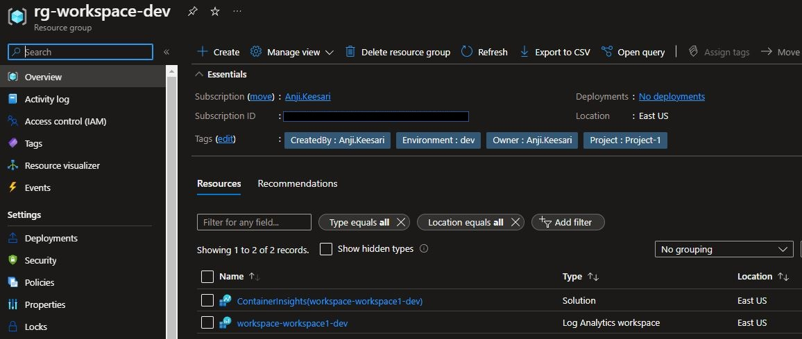

### Introduction

A Log Analytics workspace allows you to log data from Azure Monitor and other Azure services.

In this lab, I will guide you through the process of creating a Log Analytics workspace using Terraform and demonstrate how to verify its successful creation in the Azure portal.

### Technical Scenario

As a `Cloud Engineer`, you have been asked to collect all the monitoring data, azure resources logs from azure services for your organization so that you can use the log queries to retrieve and analyze data from a Log Analytics workspace.

### Prerequisites
  - Download & Install Terraform
  - Download & Install Azure CLI
  - Azure subscription
  - Visual studio code
  - Azure DevOps Project & repo
  - Terraform Foundation Setup


### Architecture diagram

The following diagram shows Log Analytics Workspace high level components used in this lab.

[](images/image-78.png){:target="_blank"}

<!--  -->


### Implementation Details

In this exercise we will accomplish & learn following:

- Task-1: Configure terraform variables for Log Analytics workspace 
- Task-2: Create new resource group for Log Analytics workspace
- Task-3: Create Log Analytics workspace using terraform
- Task-4: Validate Log Analytics workspace in the portal
- Task-5: Lock the Log Analytics workspace resource group

Through these tasks, you will gain practical experience on azure Log Analytics workspace.


This is our first azure resource that will be created using Terraform configuration, open the terraform folder in VS core and start creating new files or update existing files for Log Analytics specific resources to provision in azure cloud.


**login to Azure**

Verify that you are logged into the right Azure subscription before start anything in visual studio code

``` sh
# Login to Azure
az login 

# Shows current Azure subscription
az account show

# Lists all available Azure subscriptions
az account list

# Sets Azure subscription to desired subscription using ID
az account set -s "anji.keesari"
```

### Task-1: Configure terraform variables for Log Analytics workspace 

Here's the table with the variable names, their descriptions, variable type and their default values:

| Variable Name                        | Description                                                                                           | Type          | Default Value   |
|--------------------------------------|-------------------------------------------------------------------------------------------------------|---------------|-----------------|
| log_analytics_workspace_rg_name      | (Required) Specifies the resource group name of the log analytics workspace                         | string        | "rg-workspace-dev" |
| log_analytics_workspace_name          | (Required) Specifies the name of the log analytics workspace                                          | string        | "workspace-workspace1-dev" |
| log_analytics_workspace_location      | (Required) Specifies the location of the log analytics workspace                                      | string        | "East US"       |
| log_analytics_workspace_sku           | (Optional) Specifies the sku of the log analytics workspace                                           | string        | "PerGB2018"     |
| solution_plan_map                    | (Required) Specifies solutions to deploy to log analytics workspace                                    | map(any)       | See default value |
| log_analytics_retention_days          | (Optional) Specifies the workspace data retention in days.                                            | number        | 30              |
| log_analytics_tags                    | (Optional) Specifies the tags of the log analytics                                                   | map(any)       | {}              |

#### define variables

Here is the list of variable used in log analytics workspace creation; we are going to update existing `variable.tf` file with following variables. read the `description` provided in this source code to understand the purpose of each variable. also look into the variable `type` and `default` value of each variable.


```bash title="variable.tf" linenums="1"

variable "log_analytics_workspace_rg_name" {
  description = "(Required) Specifies the resource group name of the log analytics workspace"
  type        = string
  default     = "rg-workspace-dev"
}

variable "log_analytics_workspace_name" {
  description = "(Required) Specifies the name of the log analytics workspace"
  type        = string
  default     = "workspace-workspace1-dev"
}

variable "log_analytics_workspace_location" {
  description = "(Required) Specifies the location of the log analytics workspace"
  type        = string
  default     = "East US"
}

variable "log_analytics_workspace_sku" {
  description = "(Optional) Specifies the sku of the log analytics workspace"
  type        = string
  default     = "PerGB2018"

  validation {
    condition     = contains(["Free", "Standalone", "PerNode", "PerGB2018"], var.log_analytics_workspace_sku)
    error_message = "The log analytics sku is incorrect."
  }
}

variable "solution_plan_map" {
  description = "(Required) Specifies solutions to deploy to log analytics workspace"
  type        = map(any)
  default = {
    ContainerInsight   product   = "OMSGallery/ContainerInsights"
      publisher = "Microsoft"
    }
  }
}

variable "log_analytics_retention_days" {
  description = " (Optional) Specifies the workspace data retention in days. Possible values are either 7 (Free Tier only) or range between 30 and 730."
  type        = number
  default     = 30
}

variable "log_analytics_tags" {
  description = "(Optional) Specifies the tags of the log analytics"
  type        = map(any)
  default     = {}
}
   
```

#### declare variables

Here I am going to update existing `dev-variable.tfvar` file for the list of variable different for each environment.

``` tf title="dev-variable.tfvar"
log_analytics_workspace_rg_name     = "workspace"
log_analytics_workspace_name        = "workspace1"
```

Let's create a new file `log_analytics.tf` for log analytics workspace specific azure resources. 

### Task-2: Create new resource group for Log Analytics workspace

We will be maintaining separate resource group for Log analytics workspace related resources.

``` tf title="log_analytics.tf"
# Create the resource group
resource "azurerm_resource_group" "workspace" {
  name     = lower("${var.rg_prefix}-${var.log_analytics_workspace_rg_name}-${local.environment}")
  location = var.log_analytics_workspace_location
  tags     = merge(local.default_tags, var.log_analytics_tags)
  lifecycle {
    ignore_changes = [
      tags
    ]
  }
}
```
`Notes:`

-  `var.rg_prefix` - this variable is coming from `naming_conventions.tf` file. all the azure resource prefix naming conventions are listed in this file, keep this in mind for rest of the labs too.

- `local.environment` - this is coming from local.tf file, terraform workspace value is nothing but environment value like dev, test, prod.

``` tf title="locals.tf"
locals {
  environment   = terraform.workspace != "default" ? terraform.workspace : ""
}
```

run terraform plan & apply and create new resource group.

```
terraform plan -out=dev-plan -var-file="./environments/dev-variables.tfvars"
terraform apply dev-plan
```
[](images/law/image-1.png){:target="_blank"}

### Task-3: Create Log Analytics workspace using terraform

Use the above resource group and create a new log analytics workspace using following terraform configuration. 


```  tf title="variables_prefix.tf"
variable "log_analytics_workspace_prefix" {
  type        = string
  default     = "workspace"
  description = "Prefix of the log analytics workspace prefix resource."
}
```

```  tf title="log_analytics.tf"
# Create Log Analytics Workspace 
resource "azurerm_log_analytics_workspace" "workspace" {
  name                = lower("${var.log_analytics_workspace_prefix}-${var.log_analytics_workspace_name}-${local.environment}")
  resource_group_name = azurerm_resource_group.workspace.name
  location            = var.log_analytics_workspace_location
  sku                 = var.log_analytics_workspace_sku
  retention_in_days   = var.log_analytics_retention_days != "" ? var.log_analytics_retention_days : null
  tags                = merge(local.default_tags, var.log_analytics_tags)
  lifecycle {
    ignore_changes = [
      tags
    ]
  }
  depends_on = [
    azurerm_resource_group.workspace,
  ]
}

# Create log analytics workspace solution
resource "azurerm_log_analytics_solution" "workspace_solution" {
  for_each              = var.solution_plan_map
  solution_name         = each.key
  resource_group_name   = azurerm_resource_group.workspace.name
  location              = var.log_analytics_workspace_location
  workspace_resource_id = azurerm_log_analytics_workspace.workspace.id
  workspace_name        = azurerm_log_analytics_workspace.workspace.name
  plan {
    product   = each.value.product
    publisher = each.value.publisher
  }
  tags = merge(local.default_tags, var.log_analytics_tags)
  lifecycle {
    ignore_changes = [
      tags
    ]
  }
  depends_on = [
    azurerm_log_analytics_workspace.workspace,
  ]
}
```

``` tf title="output.tf"
output "log_analytics_workspace_id" {
  value       = azurerm_log_analytics_workspace.workspace.id
  description = "Specifies the resource id of the log analytics workspace"
}

output "log_analytics_workspace_location" {
  value       = azurerm_log_analytics_workspace.workspace.location
  description = "Specifies the location of the log analytics workspace"
}

output "log_analytics_workspace_name" {
  value       = azurerm_log_analytics_workspace.workspace.name
  description = "Specifies the name of the log analytics workspace"
}

output "log_analytics_workspace_resource_group_name" {
  value       = azurerm_log_analytics_workspace.workspace.resource_group_name
  description = "Specifies the name of the resource group that contains the log analytics workspace"
}

output "log_analytics_workspace_workspace_id" {
  value       = azurerm_log_analytics_workspace.workspace.workspace_id
  description = "Specifies the workspace id of the log analytics workspace"
}

output "log_analytics_workspace_primary_shared_key" {
  value       = azurerm_log_analytics_workspace.workspace.primary_shared_key
  description = "Specifies the workspace key of the log analytics workspace"
  sensitive   = true
}
```
#### Terraform validate

```sh
terraform validate
```
output

```sh
Success! The configuration is valid.
```

run terraform plan & apply again here.


#### Terraform plan 

```sh
terraform plan -out=dev-plan -var-file="./environments/dev-variables.tfvars"
```

``` tf
azurerm_resource_group.rg: Refreshing state... [id=/subscriptions/b635d52c-5170-4366-b262-cc12cba2d9be/resourceGroups/rg-resourcegroup1-dev]

Terraform used the selected providers to generate the following execution plan. Resource actions are indicated with the following symbols:
  + create

Terraform will perform the following actions:

  # azurerm_log_analytics_solution.workspace_solution["ContainerInsights"] will be created
  + resource "azurerm_log_analytics_solution" "workspace_solution" {
      + id                    = (known after apply)
      + location              = "eastus"
      + resource_group_name   = "rg-workspace-dev"
      + solution_name         = "ContainerInsights"
      + tags                  = {
          + "CreatedBy"   = "Anji.Keesari"
          + "Environment" = "dev"
          + "Owner"       = "Anji.Keesari"
          + "Project"     = "Project-1"
        }
      + workspace_name        = "workspace-workspace1-dev"
      + workspace_resource_id = (known after apply)

      + plan {
          + name      = (known after apply)
          + product   = "OMSGallery/ContainerInsights"
          + publisher = "Microsoft"
        }
    }

  # azurerm_log_analytics_workspace.workspace will be created
  + resource "azurerm_log_analytics_workspace" "workspace" {
      + daily_quota_gb                     = -1
      + id                                 = (known after apply)
      + internet_ingestion_enabled         = true
      + internet_query_enabled             = true
      + location                           = "eastus"
      + name                               = "workspace-workspace1-dev"
      + primary_shared_key                 = (sensitive value)
      + reservation_capacity_in_gb_per_day = (known after apply)
      + resource_group_name                = "rg-workspace-dev"
      + retention_in_days                  = 30
      + secondary_shared_key               = (sensitive value)
      + sku                                = "PerGB2018"
      + tags                               = {
          + "CreatedBy"   = "Anji.Keesari"
          + "Environment" = "dev"
          + "Owner"       = "Anji.Keesari"
          + "Project"     = "Project-1"
        }
      + workspace_id                       = (known after apply)
    }

  # azurerm_resource_group.workspace will be created
  + resource "azurerm_resource_group" "workspace" {
      + id       = (known after apply)
      + location = "eastus"
      + name     = "rg-workspace-dev"
      + tags     = {
          + "CreatedBy"   = "Anji.Keesari"
          + "Environment" = "dev"
          + "Owner"       = "Anji.Keesari"
          + "Project"     = "Project-1"
        }
    }

Plan: 3 to add, 0 to change, 0 to destroy.

Changes to Outputs:
  + log_analytics_workspace_id                  = (known after apply)
  + log_analytics_workspace_location            = "eastus"
  + log_analytics_workspace_name                = "workspace-workspace1-dev"
  + log_analytics_workspace_primary_shared_key  = (sensitive value)
  + log_analytics_workspace_resource_group_name = "rg-workspace-dev"
  + log_analytics_workspace_workspace_id        = (known after apply)

```

#### terraform apply

```sh
terraform apply dev-plan
```

output

```sh
azurerm_resource_group.workspace: Creating...
azurerm_resource_group.workspace: Creation complete after 1s [id=/subscriptions/b635d52c-5170-4366-b262-cc12cba2d9be/resourceGroups/rg-workspace-dev]
azurerm_log_analytics_workspace.workspace: Creating...
azurerm_log_analytics_workspace.workspace: Still creating... [10s elapsed]
azurerm_log_analytics_workspace.workspace: Still creating... [20s elapsed]
azurerm_log_analytics_workspace.workspace: Still creating... [30s elapsed]
azurerm_log_analytics_workspace.workspace: Creation complete after 37s [id=/subscriptions/b635d52c-5170-4366-b262-cc12cba2d9be/resourceGroups/rg-workspace-dev/providers/Microsoft.OperationalInsights/workspaces/workspace-workspace1-dev]
azurerm_log_analytics_solution.workspace_solution["ContainerInsights"]: Creating...
azurerm_log_analytics_solution.workspace_solution["ContainerInsights"]: Creation complete after 4s [id=/subscriptions/b635d52c-5170-4366-b262-cc12cba2d9be/resourceGroups/rg-workspace-dev/providers/Microsoft.OperationsManagement/solutions/ContainerInsights(workspace-workspace1-dev)]

Apply complete! Resources: 3 added, 0 changed, 0 destroyed.

Outputs:

log_analytics_workspace_id = "/subscriptions/b635d52c-5170-4366-b262-cc12cba2d9be/resourceGroups/rg-workspace-dev/providers/Microsoft.OperationalInsights/workspaces/workspace-workspace1-dev"
log_analytics_workspace_location = "eastus"
log_analytics_workspace_name = "workspace-workspace1-dev"
log_analytics_workspace_primary_shared_key = <sensitive>
log_analytics_workspace_resource_group_name = "rg-workspace-dev"
log_analytics_workspace_workspace_id = "d66de214-064b-4745-abcf-e8a8060fce1f"
resource_group_name = "rg-resourcegroup1-dev"
```

[](images/law/image-2.png){:target="_blank"}

### Task-4: Validate Log Analytics workspace in the Azure portal

Once azure resources are created, login into azure portal and validate new those new resources.

[](images/image-16.jpg){:target="_blank"}

### Task-5: Lock the resource group

Locking the resource group is the final steps once all the resources are created. this will prevent unexpected resource deletions by any kind of manual or automation script.


``` tf title="log_analytics.tf"

# Lock the resource group
resource "azurerm_management_lock" "rg_workspace_lock" {
  name       = "CanNotDelete"
  scope      = azurerm_resource_group.workspace.id
  lock_level = "CanNotDelete"
  notes      = "This resource group can not be deleted - lock set by Terraform"
  depends_on = [
    azurerm_resource_group.workspace,
    azurerm_log_analytics_workspace.workspace,
    azurerm_log_analytics_solution.workspace_solution,
  ]
}
```

run terraform validate & format

```
terraform validate
terraform fmt
```
Log Analytics
run terraform plan & apply

```
terraform plan -out=dev-plan -var-file="./environments/dev-variables.tfvars"
terraform apply dev-plan
```

[](images/law/image-3.png){:target="_blank"}

That's it, now we've fully working azure Log analytics workspace which we are going to use for future labs.

### Reference

- [Microsoft MSDN - Log Analytics workspace overview](https://learn.microsoft.com/en-us/azure/azure-monitor/logs/log-analytics-workspace-overview){:target="_blank"}
- [Terraform Registry - azurerm_resource_group](https://registry.terraform.io/providers/hashicorp/azurerm/latest/docs/resources/resource_group){:target="_blank"}
- [Terraform Registry - azurerm_log_analytics_solution](https://registry.terraform.io/providers/hashicorp/azurerm/latest/docs/resources/log_analytics_solution){:target="_blank"}
- [Terraform Registry - azurerm_log_analytics_workspace](https://registry.terraform.io/providers/hashicorp/azurerm/latest/docs/resources/log_analytics_workspace.html)
{:target="_blank"}
- [Terraform Registry - azurerm_management_lock](https://registry.terraform.io/providers/hashicorp/azurerm/latest/docs/resources/management_lock){:target="_blank"}
- [Azure Terraform Quickstart/201-aks-log-analytics](https://github.com/Azure/terraform/tree/master/quickstart/201-aks-log-analytics){:target="_blank"}
