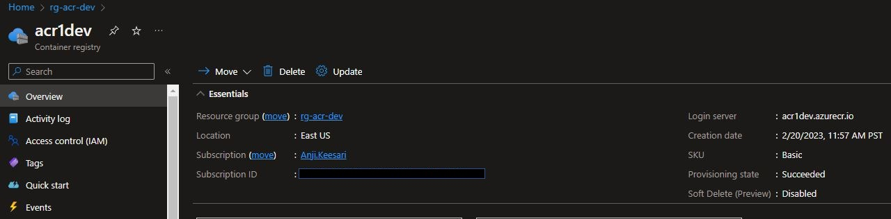
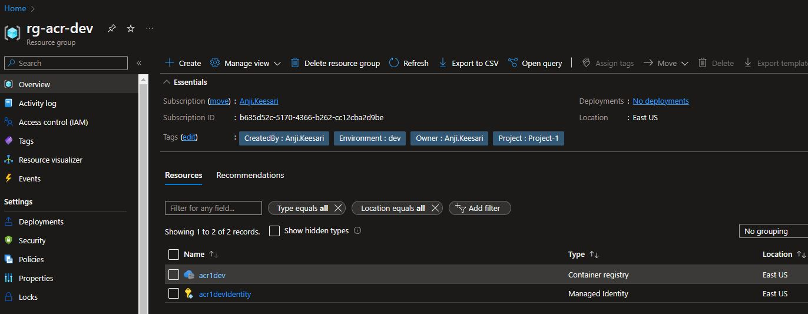
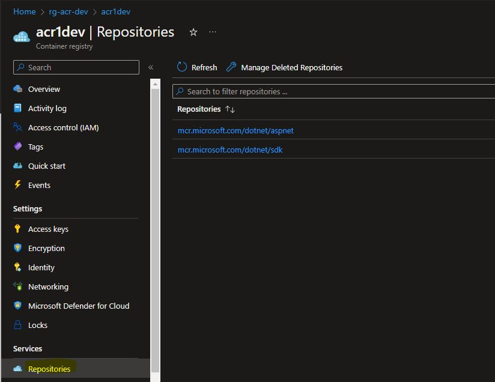

## Introduction

Azure Container Registry (ACR) is a managed Docker registry service provided by Microsoft Azure. It allows you to store and manage container images for your applications in a secure and private environment.

In this lab, I will guide you through the process of creating an Azure Container Registry using Terraform. Furthermore, I will demonstrate how to verify its successful deployment within the Azure portal and provide insights on how to utilize it effectively post-creation.

ACR provides a number of benefits, including:

- **Private repository:** ACR provides a private Docker registry, which means that you can store your Docker images securely and privately, and only authorized users or services can access them.

- **High availability:** ACR is built on Azure, so it benefits from Azure's global network and high availability features. This means that your container images are always available, and you can easily replicate them across regions for disaster recovery.

- **Integration with Azure services:** ACR integrates seamlessly with other Azure services, such as Azure Kubernetes Service (AKS), Azure Web Apps, and Azure DevOps, making it easy to incorporate ACR into your existing workflows.

- **Security and compliance:** ACR provides built-in security features, such as role-based access control, network security, and encryption at rest, to help you meet your security and compliance requirements.

- **Geo-replication:** ACR allows you to replicate your container images across multiple regions for improved performance and disaster recovery.

To get started with ACR, we are going to use terraform to create a new Azure Container Registry. Once you have a registry, you can push your Docker images to it using the Docker CLI, Azure CLI, or other tools, and manage your images using the Azure portal or a variety of third-party tools.

## Technical Scenario

As a `Cloud Engineer`, you have been asked to store and manage organization application development private container images and helm charts in secure way in cloud so that these are not directly accessible outside of the company network. also, make sure that azure Container Registry should provide organization users with direct control of their container content, with integrated authentication.

## Objective

In this exercise we will accomplish & learn how to implement following:

- Task-1: Create ACR resource group 
- Task-2: Configure variables for ACR
- Task-3: Create ACR user assigned identity
- Task-4: Create Azure Container Registry (ACR) using terraform
- Task-5: Create Diagnostics Settings for ACR
- Task-6: Lock ACR resource group
- Task-7: Validate ACR resource
    - Task-7.1: Log in to registry
    - Task-7.2: Push image to registry
    - Task-7.3: Pull image from registry
    - Task-7.4: List container images
    <!-- - Task-7.5: Push and pull Helm charts to an Azure container registry -->

## Architecture diagram

Here is the reference architecture diagram of Azure container registry.


<!-- Here is the reference architecture diagram from MSDN on registries, repositories, and container images and related artifacts.

 

reference- <https://learn.microsoft.com/en-us/azure/container-registry/container-registry-concepts>
-->

## Prerequisites
  - Download & Install Terraform
  - Download & Install Azure CLI
  - Azure subscription
  - Visual studio code
  - Azure DevOps Project & repo
  - Terraform Foundation
  - Log Analytics workspace

## Implementation details

Open the terraform project folder in Visual Studio code and creating new file named `acr.tf` for Azure container registry specific azure resources;


**login to Azure**

Verify that you are logged into the right Azure subscription before start anything in visual studio code

``` sh
# Login to Azure
az login 

# Shows current Azure subscription
az account show

# Lists all available Azure subscriptions
az account list

# Sets Azure subscription to desired subscription using ID
az account set -s "anji.keesari"
```

## Task-1: Define and declare ACR variables

This section covers list of variables used to create  Azure container registry with detailed description and purpose of each variable with default values.


| Variable Name                 | Description                                                                                              | Type          | Default Value   |
|-------------------------------|----------------------------------------------------------------------------------------------------------|---------------|-----------------|
| acr_name                      | (Required) Specifies the name of the Container Registry. Changing this forces a new resource to be created. | string        | acr1dev             |
| acr_rg_name                   | (Required) The name of the resource group in which to create the Container Registry. Changing this forces a new resource to be created. | string        | acr1               |
| acr_location                  | Location in which to deploy the Container Registry                                                      | string        | "East US"       |
| acr_admin_enabled             | (Optional) Specifies whether the admin user is enabled. Defaults to false.                                 | bool          | false           |
| acr_sku                       | (Optional) The SKU name of the container registry. Possible values are Basic, Standard, and Premium. Defaults to Basic | string | "Basic"         |
| acr_georeplication_locations  | (Optional) A list of Azure locations where the container registry should be geo-replicated. | list(string) | ["Central US", "East US"] |
| acr_log_analytics_retention_days | Specifies the number of days of the retention policy                                  | number        | 7               |
| acr_tags                      | (Optional) Specifies the tags of the ACR                                                               | map(any)      | {}              |
| data_endpoint_enabled         | (Optional) Whether to enable dedicated data endpoints for this Container Registry? Defaults to false. This is only supported on resources with the Premium SKU. | bool | true |


**Variables Prefixed**

Here is the list of new prefixes used in this lab

``` tf title="variables_prefix.tf"
variable "acr_prefix" {
  type        = string
  default     = "acr"
  description = "Prefix of the Azure Container Registry (ACR) name that's combined with name of the ACR"
}
```

**Declare Variables**

Here is the list of new variables used in this lab

``` tf title="variables.tf"
// ========================== Azure Container Registry (ACR) ==========================

variable "acr_name" {
  description = "(Required) Specifies the name of the Container Registry. Changing this forces a new resource to be created."
  type        = string
}

variable "acr_rg_name" {
  description = "(Required) The name of the resource group in which to create the Container Registry. Changing this forces a new resource to be created."
  type        = string
}

variable "acr_location" {
  description = "Location in which to deploy the Container Registry"
  type        = string
  default     = "East US"
}

variable "acr_admin_enabled" {
  description = "(Optional) Specifies whether the admin user is enabled. Defaults to false."
  type        = string
  default     = false
}

variable "acr_sku" {
  description = "(Optional) The SKU name of the container registry. Possible values are Basic, Standard and Premium. Defaults to Basic"
  type        = string
  default     = "Basic"

  validation {
    condition     = contains(["Basic", "Standard", "Premium"], var.acr_sku)
    error_message = "The container registry sku is invalid."
  }
}
variable "acr_georeplication_locations" {
  description = "(Optional) A list of Azure locations where the container registry should be geo-replicated."
  type        = list(string)
  default     = ["Central US", "East US"]
}

variable "acr_log_analytics_retention_days" {
  description = "Specifies the number of days of the retention policy"
  type        = number
  default     = 7
}
variable "acr_tags" {
  description = "(Optional) Specifies the tags of the ACR"
  type        = map(any)
  default     = {}
}
variable "data_endpoint_enabled" {
  description = "(Optional) Whether to enable dedicated data endpoints for this Container Registry? Defaults to false. This is only supported on resources with the Premium SKU."
  default     = true
  type        = bool
}
variable "pe_acr_subresource_names" {
  description = "(Optional) Specifies a subresource names which the Private Endpoint is able to connect to ACR."
  type        = list(string)
  default     = ["registry"]
}
```
**Define variables**

Here is the list of new variables used in this lab

`dev-variables.tfvar` - update this existing file for ACR values for development environment.
``` tf title="dev-variables.tfvar"
# container registry
acr_rg_name                         = "acr"
acr_name                            = "acr1dev"
acr_sku                             = "Basic"
acr_admin_enabled                   = true
data_endpoint_enabled               = false
```


**output variables**

Here is the list of output variables used in this lab 

``` tf title="output.tf"
// ========================== Azure Container Registry (ACR) ==========================

output "acr_name" {
  description = "Specifies the name of the container registry."
  value       = azurerm_container_registry.acr.name
}

output "acr_id" {
  description = "Specifies the resource id of the container registry."
  value       = azurerm_container_registry.acr.id
}

output "acr_resource_group_name" {
  description = "Specifies the name of the resource group."
  value       = azurerm_container_registry.acr.resource_group_name
}

output "acr_login_server" {
  description = "Specifies the login server of the container registry."
  value       = azurerm_container_registry.acr.login_server
}

output "acr_login_server_url" {
  description = "Specifies the login server url of the container registry."
  value       = "https://${azurerm_container_registry.acr.login_server}"
}

output "acr_admin_username" {
  description = "Specifies the admin username of the container registry."
  value       = azurerm_container_registry.acr.admin_username
}
```

## Task-2: Create a resource group for ACR

We will create separate resource group for ACR and related resources. add following terraform configuration in `acr.tf` file for creating ACR resource group.

In this task, we will create Azure resource group by using the terraform 

``` tf title="acr.tf"
# Create the resource group
resource "azurerm_resource_group" "rg_acr" {
  name     = lower("${var.rg_prefix}-${var.acr_rg_name}-${local.environment}")
  location = var.acr_location
  tags     = merge(local.default_tags)
  lifecycle {
    ignore_changes = [
      tags
    ]
  }
}
```
run terraform validate & format

``` sh
terraform validate
terraform fmt
```

run terraform plan & apply

``` sh
terraform plan -out=dev-plan -var-file="./environments/dev-variables.tfvars"
terraform apply dev-plan
```


## Task-3: Create ACR user assigned identity

Use the following terraform configuration for creating user assigned identity which is going be used in ACR

User assigned managed identities enable Azure resources to authenticate to cloud services (e.g. Azure Key Vault) without storing credentials in code. 

User Assigned Identity in Azure Container Registry provides improved security, simplified management, better integration with Azure services, RBAC, and better compliance, making it a beneficial feature for organizations that use ACR.

``` tf title="acr.tf"
# Create ACR user assigned identity
resource "azurerm_user_assigned_identity" "acr_identity" {  
  resource_group_name = azurerm_resource_group.rg_acr.name
  location            = azurerm_resource_group.rg_acr.location
  tags                = merge(local.default_tags, var.acr_tags)

  name = "${var.acr_name}Identity"
  depends_on = [
    azurerm_resource_group.rg_acr,
  ]
  lifecycle {
    ignore_changes = [
      tags
    ]
  }
}

```


## Task-4: Create Azure Container Registry (ACR) using terraform

Use the following terraform configuration for creating ACR.

``` tf title="acr.tf"

# Create the Container Registry
resource "azurerm_container_registry" "acr" {  
  name                = var.acr_name
  resource_group_name = azurerm_resource_group.rg_acr.name
  location            = azurerm_resource_group.rg_acr.location
  sku                 = var.acr_sku
  admin_enabled       = var.acr_admin_enabled
  # zone_redundancy_enabled = true
  data_endpoint_enabled = var.data_endpoint_enabled
  identity {
    type = "UserAssigned"
    identity_ids = [
      azurerm_user_assigned_identity.acr_identity.id
    ]
  }

  # dynamic "georeplications" {
  #   for_each = var.acr_georeplication_locations

  #   content {
  #     location = georeplications.value
  #     tags     = merge(local.default_tags, var.acr_tags)
  #   }
  # }
  tags = merge(local.default_tags, var.acr_tags)
  lifecycle {
    ignore_changes = [
      tags
    ]
  }
  depends_on = [
    azurerm_resource_group.rg_acr,
    azurerm_log_analytics_workspace.workspace
  ]
}

```

run terraform validate & format

``` sh
terraform validate
terraform fmt
```

run terraform plan & apply

``` sh
terraform plan -out=dev-plan -var-file="./environments/dev-variables.tfvars"
terraform apply dev-plan
```



## Task-5: Create Diagnostics Settings for ACR

we are going to use diagnostics settings for all kind of azure resources to manage logs and metrics etc... Let's create diagnostics settings for ACR for storing Logs and Metric with default retention of 30 days or as per the requirements.


``` tf title="acr.tf"

# create Diagnostics Settings for ACR
resource "azurerm_monitor_diagnostic_setting" "diag_acr" {  
  name                       = "DiagnosticsSettings"
  target_resource_id         = azurerm_container_registry.acr.id
  log_analytics_workspace_id = azurerm_log_analytics_workspace.workspace.id

  log {
    category = "ContainerRegistryRepositoryEvents"
    enabled  = true

    retention_policy {
      enabled = true
      days    = var.acr_log_analytics_retention_days
    }
  }

  log {
    category = "ContainerRegistryLoginEvents"
    enabled  = true

    retention_policy {
      enabled = true
      days    = var.acr_log_analytics_retention_days
    }
  }

  metric {
    category = "AllMetrics"

    retention_policy {
      enabled = true
      days    = var.acr_log_analytics_retention_days
    }
  }
}

```
run terraform validate & format

``` sh
terraform validate
terraform fmt
```

run terraform plan & apply

``` sh
terraform plan -out=dev-plan -var-file="./environments/dev-variables.tfvars"
terraform apply dev-plan
```


## Task-6: Lock the resource group

Finally, it is time to lock the resource group created part of this exercise, so that we can avoid the accidental deletion of the azure resources created here.

``` tf title="acr.tf"
# Lock the resource group
resource "azurerm_management_lock" "rg_acr" {  
  name       = "CanNotDelete"
  scope      = azurerm_resource_group.rg_acr.id
  lock_level = "CanNotDelete"
  notes      = "This resource group can not be deleted - lock set by Terraform"
  depends_on = [
    azurerm_resource_group.rg_acr,
    azurerm_monitor_diagnostic_setting.diag_acr,    
  ]
}


```
run terraform validate & format

``` sh
terraform validate
terraform fmt
```

run terraform plan & apply

``` sh
terraform plan -out=dev-plan -var-file="./environments/dev-variables.tfvars"
terraform apply dev-plan
```
list of resources in this ACR resource group



## Task-7: Validate ACR resource

### Task-7.1: Log in to registry

``` sh
az acr login --name acr1dev

```
### Task-7.2: Push image to registry

``` sh
az acr login --name acr1dev
docker tag sample/aspnet-api:20230226.1 acr1dev.azurecr.io/sample/aspnet-api:20230226.1
docker push acr1dev.azurecr.io/sample/aspnet-api:20230226.1
or
az acr push --name acr1dev sample/aspnet-api:20230226.1
```
### Task-7.3: Pull image from registry

``` sh
az acr login --name acr1dev
docker pull acr1dev.azurecr.io/sample/aspnet-api:20230226.1
```
### Task-7.4: List container images

``` sh
az acr login --name acr1dev
az acr repository list --name acr1dev
```

for more information look into the az acr cheat-sheet [az-acr-cheat-sheet](./../miscellaneous/az-acr-cheat-sheet.md)



## Task-8: Restrict Access Using Private Endpoint

To enhance security and limit access to an Azure Container Registry (ACR), you can utilize private endpoints and Azure Private Link. This approach assigns virtual network private IP addresses to the registry endpoints, ensuring that network traffic between clients on the virtual network and the registry's private endpoints traverses a secure path on the Microsoft backbone network, eliminating exposure from the public internet.

Additionally, you can configure DNS settings for the registry's private endpoints, allowing clients and services in the network to access the registry using its fully qualified domain name, such as `myregistry.azurecr.io`.

This section guides you through configuring a private endpoint for your ACR using Terraform. Note that this feature is available in the Premium container registry service tier.

### Task-8.1: Configure the Private DNS Zone

**acr.tf:**
```hcl
# Create private DNS zone for Azure container registry
resource "azurerm_private_dns_zone" "pdz_acr" {
  name                = "privatelink.azurecr.io"
  resource_group_name = azurerm_virtual_network.vnet.resource_group_name
  tags                = merge(local.default_tags)

  lifecycle {
    ignore_changes = [
      tags
    ]
  }
  depends_on = [
    azurerm_virtual_network.vnet
  ]
}
```

run terraform validate & format

``` sh
terraform validate
terraform fmt
```

run terraform plan & apply

``` sh
terraform plan -out=dev-plan -var-file="./environments/dev-variables.tfvars"
terraform apply dev-plan
```

Confirm the Private DNS zone configuration by navigating to `rg-vnet1-dev -> privatelink.azurecr.io -> Overview blade`.

### Task-8.2: Create a Virtual Network Link

**acr.tf:**
```hcl
# Create private virtual network link to Virtual Network
resource "azurerm_private_dns_zone_virtual_network_link" "acr_pdz_vnet_link" {
  name                  = "privatelink_to_${azurerm_virtual_network.vnet.name}"
  resource_group_name   = azurerm_resource_group.rg.name
  virtual_network_id    = azurerm_virtual_network.vnet.id
  private_dns_zone_name = azurerm_private_dns_zone.pdz_acr.name

  lifecycle {
    ignore_changes = [
      tags
    ]
  }
  depends_on = [
    azurerm_resource_group.rg,
    azurerm_virtual_network.vnet,
    azurerm_private_dns_zone.pdz_acr
  ]
}
```

run terraform validate & format

``` sh
terraform validate
terraform fmt
```

run terraform plan & apply

``` sh
terraform plan -out=dev-plan -var-file="./environments/dev-variables.tfvars"
terraform apply dev-plan
```

Confirm the Virtual network links configuration by navigating to `rg-vnet1-dev -> privatelink.azurecr.io -> Virtual network links`.

### Task-8.3: Create a Private Endpoint Using Terraform

**acr.tf:**
```hcl
# Create private endpoint for Azure container registry
resource "azurerm_private_endpoint" "pe_acr" {  
  name                = lower("${var.private_endpoint_prefix}-${azurerm_container_registry.acr.name}")
  location            = azurerm_container_registry.acr.location
  resource_group_name = azurerm_container_registry.acr.resource_group_name
  subnet_id           = azurerm_subnet.jumpbox.id
  tags                = merge(local.default_tags, var.acr_tags)

  private_service_connection {
    name                           = "pe-${azurerm_container_registry.acr.name}"
    private_connection_resource_id = azurerm_container_registry.acr.id
    is_manual_connection           = false
    subresource_names              = var.pe_acr_subresource_names
    request_message                = try(var.request_message, null)
  }

  private_dns_zone_group {
    name                 = "default" //var.pe_acr_private_dns_zone_group_name
    private_dns_zone_ids = [azurerm_private_dns_zone.pdz_acr.id]
  }

  lifecycle {
    ignore_changes = [
      tags,
    ]
  }
  depends_on = [
    azurerm_container_registry.acr,
    azurerm_private_dns_zone.pdz_acr
  ]
}

```

run terraform validate & format

``` sh
terraform validate
terraform fmt
```

run terraform plan & apply

``` sh
terraform plan -out=dev-plan -var-file="./environments/dev-variables.tfvars"
terraform apply dev-plan
```

Confirm the endpoint configuration by navigating to `Container registry -> Networking -> Private access` — you will see the new private endpoint details.

Navigate to `Private endpoint -> Overview` to verify the Virtual network/subnet and Network interface.

Navigate to `Private endpoint -> DNS Configuration` to verify the Network Interface and Configuration name.

Navigate to `Network interface -> Overview` to verify the private IP address attached to properties.


## References
- [Microsoft MSDN - Azure Container Registry documentation](https://learn.microsoft.com/en-us/azure/container-registry/){:target="_blank"}
- [Microsoft MSDN - Connect privately to an Azure container registry using Azure Private Link](https://learn.microsoft.com/en-us/azure/container-registry/container-registry-private-link){:target="_blank"}
- [Microsoft MSDN - Quickstart: Create an Azure container registry using the Azure portal](https://learn.microsoft.com/en-us/azure/container-registry/container-registry-get-started-portal?tabs=azure-cli){:target="_blank"}
- [Microsoft MSDN - Push your first image to your Azure container registry using the Docker CLI](https://learn.microsoft.com/en-us/azure/container-registry/container-registry-get-started-docker-cli?tabs=azure-cli){:target="_blank"}
- [Microsoft MSDN - Push and pull Helm charts to an Azure container registry](https://learn.microsoft.com/en-us/azure/container-registry/container-registry-helm-repos){:target="_blank"}
- [Terraform Registry - azurerm_resource_group](https://registry.terraform.io/providers/hashicorp/azurerm/latest/docs/resources/resource_group){:target="_blank"}
- [Terraform Registry - azurerm_management_lock](https://registry.terraform.io/providers/hashicorp/azurerm/latest/docs/resources/management_lock){:target="_blank"}
- [Terraform Registry - azurerm_container_registry](https://registry.terraform.io/providers/hashicorp/azurerm/latest/docs/resources/container_registry){:target="_blank"}
- [Terraform Registry - azurerm_user_assigned_identity](https://registry.terraform.io/providers/hashicorp/azurerm/latest/docs/resources/user_assigned_identity){:target="_blank"}
- [Terraform Registry - azurerm_monitor_diagnostic_setting](https://registry.terraform.io/providers/hashicorp/azurerm/latest/docs/resources/monitor_diagnostic_setting){:target="_blank"}
- [Terraform Registry - azurerm_private_dns_zone](https://registry.terraform.io/providers/hashicorp/azurerm/latest/docs/resources/private_dns_zone){:target="_blank"}
- [Terraform Registry - azurerm_private_dns_zone_virtual_network_link](https://registry.terraform.io/providers/hashicorp/azurerm/latest/docs/resources/private_dns_zone_virtual_network_link){:target="_blank"}
- [Terraform Registry - azurerm_private_endpoint](https://registry.terraform.io/providers/hashicorp/azurerm/latest/docs/resources/private_endpoint){:target="_blank"}


- [Azure-Samples/private-aks-cluster-terraform-devop](https://github.com/Azure-Samples/private-aks-cluster-terraform-devops/blob/main/terraform/modules/container_registry/main.tf){:target="_blank"}

<!-- 
- https://github.com/kumarvna/terraform-azurerm-container-registry
- https://github.com/avinor/terraform-azurerm-container-registry 
-->