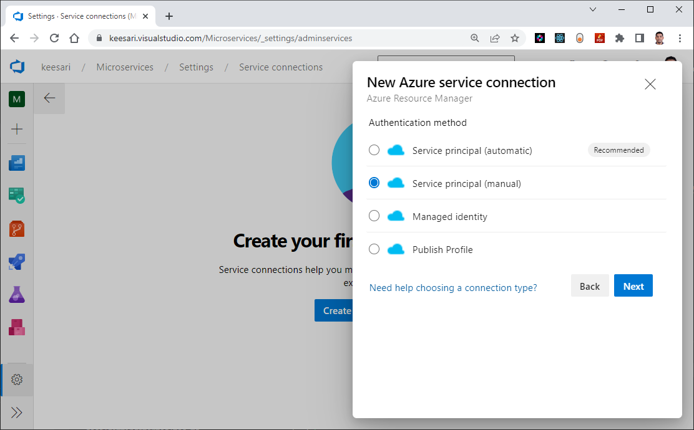
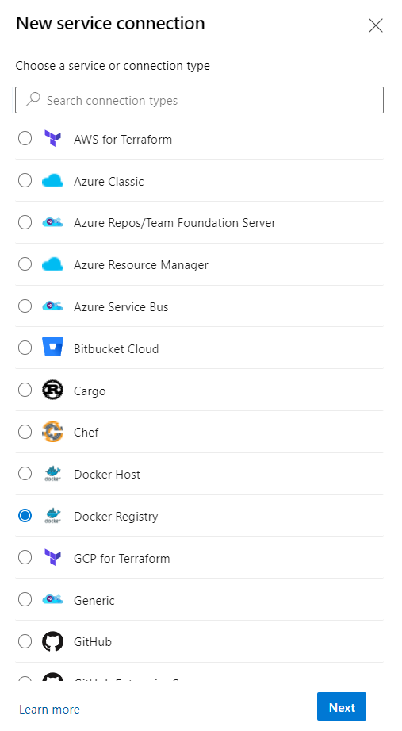
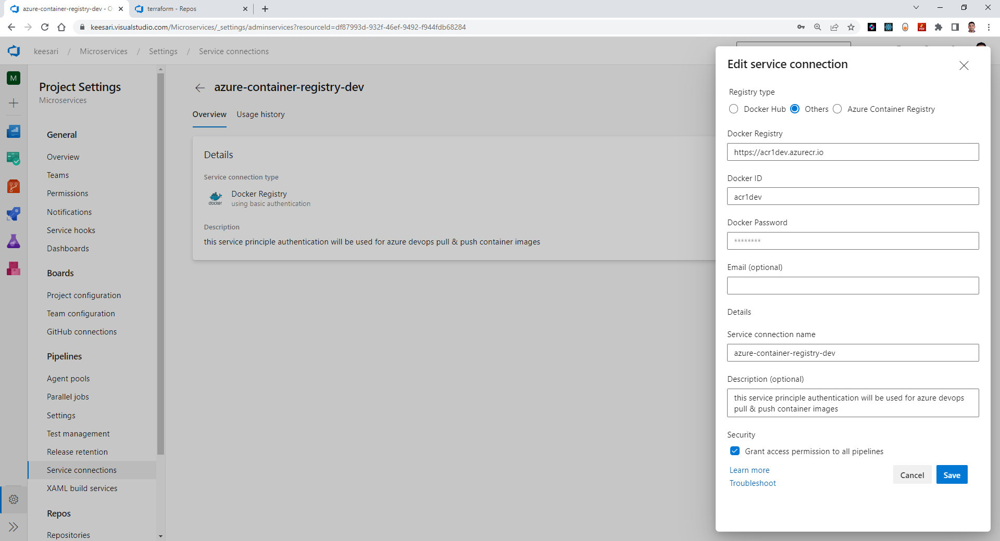
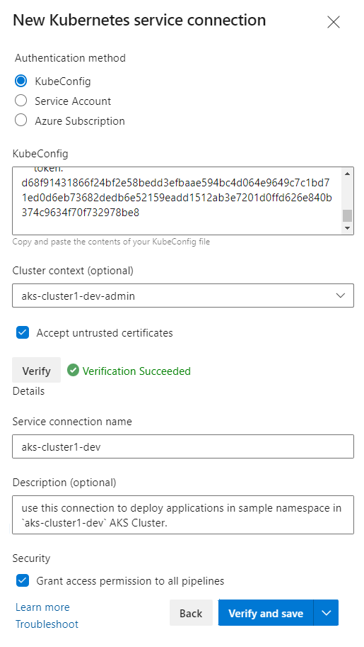
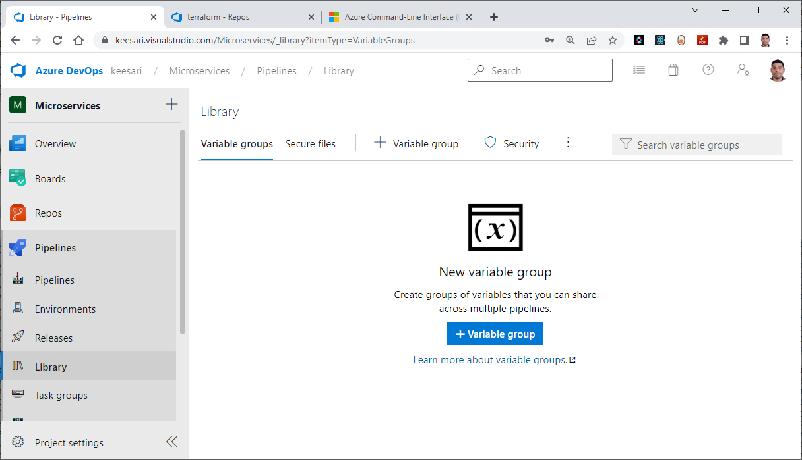
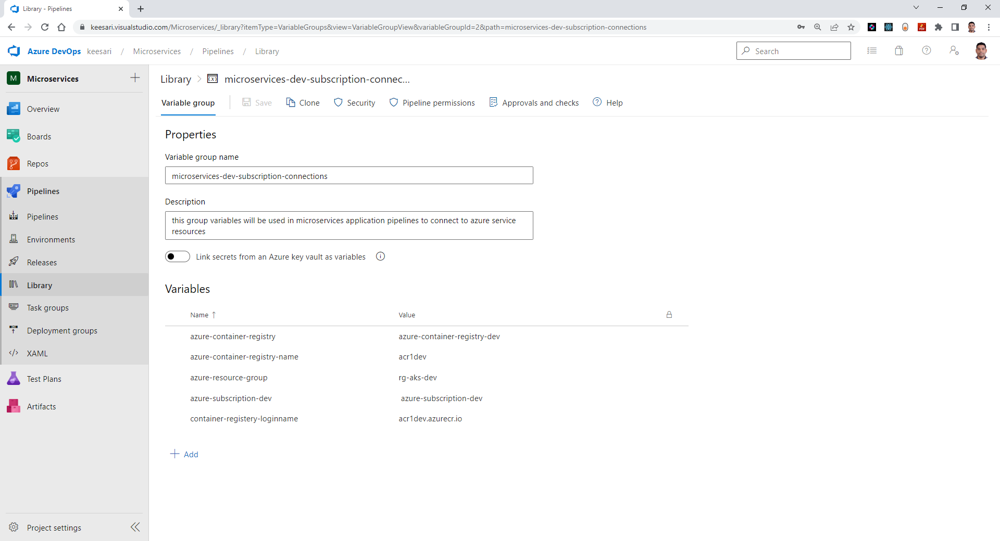

# Create new service connections & variable groups in Azure DevOps

## Introduction

The purpose of creating new service connections in Azure DevOps is to allow Azure DevOps and Azure DevOps Pipeline to interact with Azure core services that are required for our application deployment activities. By creating these service connections, you can manage the integration between Azure DevOps and connected azure core services, such as:

- **Azure Resource Manager**: Allows you to manage your Azure resources, such as virtual machines and databases.

- **Docker Registry:** Allows you to store, manage, and distribute Docker images.

- **Kubernetes:** Allows you to manage your containers and applications running in a Kubernetes cluster.


Key purposes of a service connection for Azure subscription access include:

1. **Deployment:** Service connections enable automated deployments of applications and infrastructure to Azure resources using Azure DevOps pipelines. This ensures consistency and repeatability in the deployment process.

2. **Integration:** They allow seamless integration between Azure DevOps and Azure services, such as Azure Kubernetes Service (AKS), Azure Functions, Azure App Service, and more. This integration simplifies CI/CD workflows.

3. **Resource Management:** Service connections facilitate the management of Azure resources, including provisioning, scaling, and configuration changes, directly from Azure DevOps pipelines.

4. **Security:** They enhance security by securely storing credentials and access tokens, reducing the need to expose sensitive information within pipeline scripts.

5. **Auditing:** Service connections provide an auditable trail of actions performed on Azure resources, helping teams track changes and troubleshoot issues effectively.

In summary, a service connection for Azure subscription access serves as a bridge between Azure DevOps and Azure resources, enabling streamlined and secure DevOps processes.

## Technical Scenario

As a `DevSecOps Engineer`, you have been asked to create new service connections in azure DevOps before start creating any azure devops pipelines to ensure that the right resources and services are available to your pipelines.

## Objective

In this lab you will create and learn how to create new azure DevOps service connections, in the background these new service connections will create the new Service Principles in the Azure AD.

- **Task-1:** Create new service connection for Azure subscription Access
- **Task-2:** Create new service connection for Azure container registry (ACR)
- **Task-3:** Create new service connection for Azure Kubernetes services (AKS)
- **Task-4:** Create new Library - variable group

## Architecture diagram

This diagram depicts the end to end connection between Azure DevOps and external services or resources such as Azure, Docker registry and AKS.


## Implementation Details


In this module, I will demonstrate how to create service connections for specific Azure resources. Please note that the same process can be applied to other resources as well.

## Task-1: Create new service connection for Azure subscription Access

To create a new service connection in Azure DevOps, follow these steps:

1. Go to Project settings in Azure DevOps.
1. In the Project Settings, select the "**Service connections**" section.
1. Click the "**New Service connection**" button.
   
1. Select the **Azure Resource Manager**.
   
1. Select the **Service principal (manual)**.
  
1. Provide the necessary information for the service connection, such as the name, description, and access credentials.
   
1. Click the "Verify connection" button to test the connection.
   
1. If the connection is successful, click the "Save" button.

Once you've created a service connection, you can use it in your pipelines for tasks that need to access the connected service.

!!! Important
    Here we've selected the existing **Terraform service principle** which was created as part of the Terraform Foundation Labs.


## Task-2: Create new service connection for Azure container registry (ACR)

To create a new service connection for an Azure Container Registry (ACR) in Azure DevOps, follow these steps:

1. Go to **Project settings** in Azure DevOps.
1. In the Project Settings, select the "**Service connections**" section.
1. Click the "**New Service connection**" button.
1. Select "**Docker Registry**" as the type of service connection.

1. Select `Other` or "**Azure Container Registry**" as registry type.
1. In the "Azure Container Registry" section, select your ACR from the **dropdown list**.
1. Provide a **name** and **description** for the service connection.

1. if you select `Others` then collect the details from here in Azure ACR

1. Click the "Save" button to test the connection and create the service connection.

Once you've created the service connection, you can use it in your pipelines to perform tasks that require access to your ACR, such as pushing and pulling Docker images.


## Task-3: Create new service connection for Azure Kubernetes services (AKS)


To create a new service connection for AKS in Azure DevOps, you can follow these steps:

1. Go to your Azure DevOps organization and navigate to the `Project Settings` page.
1. In the Project Settings page, select the `Service Connections` section.
1. Click on the `New Service Connection` button.
1. In the "New Service Connection" menu, select `Kubernetes` as the connection type.

1. Fill in the connection details, such as the Connection name, AKS cluster name, and the Kubernetes API server URL.

1. Click on `Verify connection` to ensure that the details you have entered are correct.
1. Finally, click on the `Create` button to create the new service connection for your AKS cluster in Azure DevOps.

Once you have created the service connection, you can use it to automate tasks such as deploying applications to your AKS cluster, managing cluster configurations, and monitoring cluster health.

``` sh
Name: aks-cluster1-dev
Description: use this connection to deploy applications in sample namespace in `aks-cluster1-dev` AKS Cluster.
```

Here is the list of new service connections you've created so far.


## Step-4: Create new Library - variable group


Follow these steps to create a new Library Variable Group in Azure DevOps:

- Go to your Azure DevOps project and navigate to the project settings page.
- In the settings page, select the `Pipelines` option and then click on "Variable groups".
- Click the `New` button to create a new variable group.
- Give your new variable group a name and description.
- Add variables to your group by clicking the `Add` button and specifying a name, value, and any other relevant details.
- Once you have added all of the variables you need, click the `Create` button to save your new variable group.



```
Azure DevOps  / Keesari / Microservices / Pipelines / Library
```



``` sh
Name: microservices-dev-subscription-connections
Description: this group variables will be used in microservices application pipelines to connect to azure service resources
```

Your new variable group will now be available for use in your Azure DevOps pipelines and releases. You can also share the variable group with other projects or teams in your organization by granting them access to it.

Creating a new Library Variable Group for Service Connections or any other variables in Azure DevOps before creating pipelines offers several benefits:

1. **Centralized Management:** Variable groups allow you to centralize the management of variables that are shared across multiple pipelines. When you create variable groups for service connections, you keep all the relevant variables in one place, making it easier to update and maintain them.

2. **Reusability:** Variables defined in a variable group can be reused across different pipelines. This eliminates the need to redefine the same variables in multiple places, reducing redundancy and ensuring consistency.

3. **Security:** Variable groups allow you to secure sensitive information, such as secrets and connection strings, by defining them as secret variables. These values are securely stored and can only be accessed by authorized users or services. We can also integrate Azure Key vault service here.

4. **Versioning:** Variable groups support versioning, enabling you to maintain different versions of the same variable group. This is useful when you need to make changes to variables while preserving the existing definitions for running pipelines.

5. **Scalability:** As your DevOps environment grows, managing variables in a centralized manner becomes crucial. Variable groups can scale with your organization, ensuring that variables are organized and accessible as needed.

6. **Consistency:** Using variable groups for service connections ensures that the same set of variables is available consistently across all your pipelines. This promotes standardization and helps prevent configuration errors.

7. **Ease of Updates:** When you need to update variables related to service connections (e.g., API keys, access tokens, or connection strings), you can update them in the variable group once, and the changes will automatically propagate to all pipelines that use that group.

8. **Audit Trail:** Variable groups provide an audit trail of changes, making it easier to track who made modifications to variables and when those changes occurred.

9. **Role-Based Access Control:** Azure DevOps allows you to control who has access to view or edit variable groups. This enables role-based access control to ensure that only authorized users can manage sensitive configuration information.

10. **Simplified Pipeline Configuration:** Using variable groups reduces the complexity of pipeline configurations. Instead of defining variables directly within each pipeline, you reference the variables from the shared variable group, making pipeline definitions cleaner and more concise.

In summary, creating a Library Variable Group for Service Connections in Azure DevOps is a best practice that enhances the organization, security, and maintainability of your pipelines, promoting efficiency and consistency in your DevOps workflows.

## References:
- <https://learn.microsoft.com/en-us/azure/devops/pipelines/library/connect-to-azure?view=azure-devops>
<!-- - <https://azuredevopslabs.com/labs/devopsserver/azureserviceprincipal/> -->
