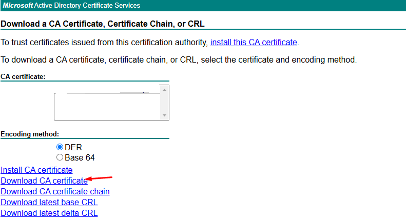

# **Install ADCS Issuer Helmchart in Azure Kubernetes Services (AKS)**

## **Introduction**

In this article, we will go over how to install the ADCS (Active Directory Certificate Services) Issuer Helm chart on an Azure Kubernetes Service (AKS) cluster. ADCS is a Windows-based Certificate Authority (CA) that is used to issue digital certificates. The ADCS Issuer integrates with Kubernetes and provides an option to issue certificates directly from Active Directory. 

ADCS Issuer is a cert-manager’s CertificateRequest controller that uses MS Active Directory Certificate Service to sign certificates. ADCS provides HTTP GUI that can be normally used to request new certificates or see status of existing requests.

The ADCS Issuer allows us to configure Kubernetes to request certificates from an ADCS certificate authority and manage the certificates with Kubernetes resources. It simplifies the process of obtaining certificates, especially in a corporate environment where Active Directory is already in use.

## **Objective**

The objective of this guide is to show you how to:

1.  Install the ADCS Issuer Helm chart on AKS.
2.  Request a certificate from an ADCS server.
3.  Configure an Ingress resource to use the issued certificate.
4.  Verify that the certificates are correctly issued and used.

## **Prerequisites**

Before proceeding, make sure you have the following prerequisites in place:

*   **Azure Account**: An active Azure account with necessary permissions to manage resources.
*   **Azure CLI**: Installed and configured on your local machine.
*   **kubectl**: Installed and configured to interact with your AKS cluster.
*   **Helm**: Helm is installed and configured to manage Kubernetes applications.
*   **Cert-Manager**: Cert-manager is required for managing certificates in Kubernetes. It will be used as the controller to handle certificate requests, issuance, and renewal.
*   **Active Directory Certificate Services (ADCS)**: Access to an ADCS server for issuing certificates.
*   **AKS Cluster**: An existing AKS cluster that can be connected to from your local machine.

## **Step 1: Login into Azure**

First, log into your Azure account using the Azure CLI.

```
# Login to Azure
az login 

# Shows current Azure subscription
az account show

# Lists all available Azure subscriptions
az account list

# Sets Azure subscription to desired subscription using ID
az account set -s "anji.keesari"
```
Follow the on-screen instructions to complete the login process.    

## **Step 2: Connect to AKS Cluster**

Next, ensure that you are connected to your AKS cluster using the `kubectl` command. Replace `<resource-group>` and `<aks-cluster-name>` with your actual resource group and AKS cluster name.

```
# Azure Kubernetes Service Cluster User Role
az aks get-credentials -g "rg-aks-dev" -n "aks-cluster1-dev"

# Azure Kubernetes Service Cluster Admin Role
az aks get-credentials -g "rg-aks-dev" -n "aks-cluster1-dev" --admin

# get nodes
kubectl get no
kubectl get namespace -A
```

## **Step 3: Add the Helm Repository**

Now, we need to add the Helm chart repository that contains the ADCS Issuer chart. In this case, we will add the `    djkormo-adcs-issuer` repository, which provides the `adcs-issuer` Helm charts.

```
# add helm repo
helm repo add djkormo-adcs-issuer https://djkormo.github.io/adcs-issuer/

# update 
helm repo update djkormo-adcs-issuer

# check all versions 
helm search repo adcs-issuer  --versions

# download values file for some version

helm show values djkormo-adcs-issuer/adcs-issuer --version 3.0.0 > adcs-issuer-values.yaml
```
    

## **Step 4: Install ADCS-Issuer Helm Chart**

Now that you have the necessary repositories added, you can install the ADCS Issuer Helm chart. Replace `<namespace>` with the namespace where you want to install it.

**Install via commands**
```
# test installation
helm install adcs-issuer  djkormo-adcs-issuer/adcs-issuer --version 2.1.1 \
  --namespace adcs-issuer --values values.yaml  --dry-run

#  install
helm install adcs-issuer  djkormo-adcs-issuer/adcs-issuer --version 2.1.1 \
  --namespace adcs-issuer --values values.yaml  --dry-run

# upgrade
helm upgrade project-operator djkormo-adcs-issuer/adcs-issuer  --version 2.1.1 \
  --namespace adcs-issuer --values values.yaml

# uninstall 
helm uninstall adcs-issuer  --namespace  adcs-issuer

```    

**Install via terraform**

```
locals {
  adcsissuer_values = "adcsissuer/values.yaml"
}

resource "kubernetes_namespace" "adcsissuer" {
  metadata {
    name = "adcs-issuer"
  }

  depends_on = [
    data.azurerm_kubernetes_cluster.main
  ]
  lifecycle {
    ignore_changes = [
      metadata
    ]
  }
}

resource "helm_release" "adcsissuer" {
  name       = "adcs-issuer"
  namespace  = kubernetes_namespace.adcsissuer.metadata[0].name
  repository = "https://djkormo.github.io/adcs-issuer/"
  chart      = "adcs-issuer"
  version    = var.helm_chart_adcsissuer_version

  values = [
    "${file(local.adcsissuer_values)}"
  ]

  depends_on = [
    kubernetes_namespace.adcsissuer,
    data.azurerm_kubernetes_cluster.main,
  ]

  lifecycle {
    ignore_changes = [
      # metadata
    ]
  }
}

```

    

## **Step 5: Verify ADCS-Issuer Resources in AKS**

To ensure that the ADCS Issuer was installed correctly, list the resources in your Kubernetes cluster:

    kubectl get customresourcedefinitions | grep adcs
    

This should show the `adcsissuer` resource type, which is used to define the ADCS issuer.
Additionally, check if the deployment and other resources are correctly created in the specified namespace:

    
```
helm list -aA
helm list --namespace adcs-issuer

kubectl get deployments -n adcs-issuer
kubectl get pods -n adcs-issuer
kubectl get services -n adcs-issuer

kubectl get all,secret,configmap -n adcs-issuer

# check the pod logs
kubectl logs pod/adcs-issuer-controller-manager-957fc79bf-8cg52 -n adcs-issuer
```

This should show the ADCS Issuer pods and related resources in the AKS cluster.

## **Step 6: Create Certificate Resources in AKS**

Now we need to create the resources needed by the ADCS Issuer to request certificates from Active Directory.

### **Step 6.1: Create Credentials for ADCS**

In this step, we will create a service account in Active Directory (AD) that will be used to authenticate and interact with the Active Directory Certificate Services (ADCS) to issue certificates.

example:

```
username: svcd_aks_adcs
password: xxxx
```
Then we need to use base64encoding these credentials and use it in aks secret object.

We need to create a Kubernetes secret to store the credentials required to connect to the ADCS CA. The secret should contain the necessary certificates, credentials, and configurations.

```
apiVersion: v1
kind: Secret
metadata:
  name: adcs-issuer-credentials
  namespace: adcs-issuer
type: Opaque
data:
  password: M2kxUkVuMTNBSW9TZ1piR3RYXzlgfH18dUFV
  username: a3ZjZF9ha3NfYWRjcw==
```

Apply the configuration:

```
kubectl apply -f adcsissuer/adcs-issuer-credentials.yaml
``` 

This will create a secret named `adcs-issuer-credentials` that stores your ADCS credentials.

### **Step 6.2: Create ADCS-Issuer Object**

Next, create an `ADCSIssuer` custom resource that specifies the ADCS server details and credentials. This resource will allow Kubernetes to request certificates from ADCS.
Create a file called `adcs-issuer.yaml` and define the `ADCSIssuer` object:

The ADCS service data can be configured in `AdcsIssuer` or `ClusterAdcsIssuer` CRD objects e.g.:


```
apiVersion: adcs.certmanager.csf.nokia.com/v1
kind: ClusterAdcsIssuer
metadata:
  name: adcs-cluster-issuer
spec:
  caBundle: REDACTED # ca certificate
  credentialsRef:
    name: adcs-issuer-credentials # secret with username and password
  statusCheckInterval: 5m
  retryInterval: 5m
  url: https://adcs-host/ # external host
  templateName: adcsTemplate # external template

```

- The `caBundle` parameter is BASE64-encoded CA certificate which is used by the ADCS server itself.

- The `statusCheckInterval` indicates how often the status of the request should be tested. Typically, it can take a few hours or even days before the certificate is issued.

- The `retryInterval` says how long to wait before retrying requests that errored.

- The `credentialsRef.name` is name of a secret that stores user credentials used for NTLM authentication. The secret must be `Opaque` and contain `password` and `username` fields only 

Apply the configuration:

```
kubectl apply -f adcsissuer/dev/clusterissuer-adcs.yaml
``` 
Note: download the certificate from AD and base64encode

[{:style="border: 1px solid black; border-radius: 10px;"}](images/adcs-issuer-1.png){:target="_blank"}

Validate ClusterAdcsIssuer 

```
kubectl get ClusterAdcsIssuer -n adcs-issuer

kubectl describe ClusterAdcsIssuer/adcs-cluster-issuer
kubectl edit ClusterAdcsIssuer/adcs-cluster-issuer
```

## **Step 7: Request Certificate for a Custom Domain**

Once the ADCS Issuer is configured, you can request a certificate for your custom domain. The certificate request is initiated by creating a `Certificate` resource that references the ADCS Issuer.
For example, create a `certificate.yaml` file:

```
apiVersion: cert-manager.io/v1
kind: Certificate
metadata:
  annotations:
  name: adcs-cert
  namespace: <namespace>
spec:
  commonName: example.com
  dnsNames:
  - service1.example.com
  - service2.example.com
  issuerRef:
    group: adcs.certmanager.csf.nokia.com
    kind: AdcsIssuer
    name: test-adcs
  organization:
  - Your organization
  secretName: adcs-cert
```
    

Apply the file:
```
kubectl apply -f certificate.yaml
``` 

This will request a certificate from the ADCS server. Cert-manager is responsible for creating the `Secret` with a key and `CertificateRequest` with proper CSR data.

ADCS Issuer creates `AdcsRequest` CRD object that keep actual state of the processing. Its name is always the same as the corresponding `CertificateRequest` object

Validate Certificate objects

```
kubectl get AdcsRequest -n adcs-issuer
kubectl get Certificate -n adcs-issuer

kubectl describe Certificate/adcs-cert -n adcs-issuer

kubectl get CertificateRequest -n adcs-issuer
kubectl describe CertificateRequest/adcs-cert-1 -n adcs-issuer`
```

## **Step 8: Configure Ingress for a Domain**

After the certificate is issued, you need to configure an Ingress resource to use this certificate for your domain.

```
apiVersion: networking.k8s.io/v1
kind: Ingress
metadata:
  annotations:
    cert-manager.io/issuer: argocd-adcs-issuer # issuser name
    cert-manager.io/issuer-kind: AdcsIssuer # ClusterAdcsIssuer or AdcsIssuer
    cert-manager.io/issuer-group: adcs.certmanager.csf.nokia.com # api group, here adcs.certmanager.csf.nokia.com
    cert-manager.io/renew-before: 48h # renew 48 hour before

  name: argo-cd-argocd-server
  namespace: argocd
 
spec:
  ingressClassName: nginx
  rules:
  - host: argocd.sample.host
    http:
      paths:
      - backend:
          service:
            name: argocd-server
            port:
              number: 443
        path: /(.*)
        pathType: Prefix
  tls:
  - hosts:
    - argocd.sample.host
    secretName: argocd-tls-certificate # secret for storing certificate
```


## **Step 9: Validate New Certificate Object**

To ensure the certificate is successfully issued, check the status of the `Certificate` resource:

```
kubectl -n argocd get certificate,certificaterequests

# check logs
kubectl logs -n cert-manager -l app=cert-manager
```  

The status should show that the certificate is ready and has been issued by the ADCS Issuer.

## Conclusion

In this tutorial, we learned how to deploy ADCS-Issue on Azure Kubernetes Services using Helm charts. We have learned how to set up the ADCS Issuer, request a certificate, and configure an Ingress resource to use the issued certificate for new domain.

## **Reference**
-   [djkormo - Documentation](https://djkormo.github.io/adcs-issuer/)
-   [djkormo - Github](https://github.com/djkormo/adcs-issuer)
-   [nokia/adcs-issuer- Github](https://github.com/nokia/adcs-issuer)
-   [artifacthub](https://artifacthub.io/packages/helm/adcs-issuer/adcs-issuer)
-   [Cert-Manager](https://cert-manager.io/docs/)
-   [Azure Kubernetes Service (AKS) Documentation](https://learn.microsoft.com/en-us/azure/aks/)

