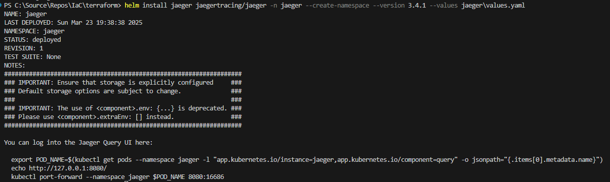

# **Install Jaeger Helmchart in Azure Kubernetes Services (AKS)**

## **Introduction**

Distributed tracing is a critical component in modern observability, especially when we're working with microservices architectures. Jaeger is one of the most popular open-source distributed tracing tools, and with Helm, it’s easy to deploy and manage on Kubernetes.

In this article, we will walk through how to install the Jaeger Helm Chart in Azure Kubernetes Service (AKS). Helm simplifies application deployment on Kubernetes, and combining it with Jaeger allows you to get valuable insights into your services' latency, dependencies, and performance metrics.

## **Objective**

The objective of this article is to provide step-by-step instructions to install Jaeger on an Azure Kubernetes Service (AKS) cluster using Helm, access the Jaeger UI locally, expose it through Ingress, and use Jaeger for distributed tracing. 

In this exercise we will accomplish & learn how to implement following:

- **Step 1:** Login into Azure
- **Step 2.** Connect to AKS Cluster
- **Step 3.** Add the Jaeger Helm Chart Repository
- **Step 4.** Install Jaeger with Helm
- **Step 5.** Install Jaeger Helmchart using terraform
- **Step 6.** Verify Jaeger Installation in AKS
- **Step 7.** Access Jaeger Locally - port forwarding
- **Step 8.** Configure Ingress for Jaeger UI
- **Step 9.** Jaeger Integration with OpenTelemetry
- **Step 10.** Uninstalling the Chart

## **Prerequisites**


Before proceeding with the installation of Jaeger in AKS, ensure that you have the following prerequisites:

-  **Azure CLI** – Ensure that the Azure CLI is installed on your local machine.  [Install Azure CLI](https://docs.microsoft.com/en-us/cli/azure/install-azure-cli)
-  **kubectl** – Kubernetes command-line tool installed.  [Install kubectl](https://kubernetes.io/docs/tasks/tools/install-kubectl/)
-  **Helm** – Helm should be installed for managing Kubernetes applications.   [Install Helm](https://helm.sh/docs/intro/install/)
-  **Azure Subscription** – You need an Azure account and sufficient permissions to create AKS clusters.    
-  **Terraform (Optional)** – If you choose to install Jaeger via Terraform, ensure Terraform is installed.  [Install Terraform](https://www.terraform.io/downloads)
-  **AKS Cluster** – An existing AKS cluster should be available, or you can create one using the Azure CLI.
    

## **Step 1: Login into Azure**

Ensure that you are logged into the correct Azure subscription before proceeding.

``` sh
# Login to Azure
az login 

# Shows current Azure subscription
az account show

# Lists all available Azure subscriptions
az account list

# Sets Azure subscription to desired subscription using ID
az account set -s "anji.keesari"
```

Follow the on-screen instructions to complete the login process.

## **Step 2: Connect to AKS Cluster**

Once logged in and set your subscription then connect to your AKS cluster. with your AKS cluster name:

Use the `az aks get-credentials` command to connect to the AKS cluster.


``` sh
# Azure Kubernetes Service Cluster User Role
az aks get-credentials -g "rg-aks-dev" -n "aks-cluster1-dev"

# Azure Kubernetes Service Cluster Admin Role
az aks get-credentials -g "rg-aks-dev" -n "aks-cluster1-dev" --admin

# get nodes
kubectl get no
kubectl get namespace -A
```

## **Step 3: Add the Jaeger Helm Chart Repository**

Jaeger’s Helm chart is hosted in the GitHub / Artifact. To begin, add the Jaeger Helm repository to your Helm setup:

- [GitHub reference](https://github.com/jaegertracing/helm-charts)
- [Artifact Hub reference](https://artifacthub.io/packages/helm/jaegertracing/jaeger)

List all added Helm repositories:

```bash
helm repo list
```

Add the Jaeger Helm repository:

```bash
helm repo add jaegertracing https://jaegertracing.github.io/helm-charts
```

Update the Helm repositories:

```bash
helm repo update jaegertracing
```


## **Step 4: Install Jaeger Helmchart**

Now, you can install Jaeger using Helmchart. Execute the following command:

Let's first search the helm chart which we want to install. here I am installing official jaegertracing helmchart.

Search for available charts and versions in the Jaeger repository:

```sh
helm search repo jaegertracing
```

output

```sh
NAME                            CHART VERSION   APP VERSION     DESCRIPTION
jaegertracing/jaeger            3.4.1           1.53.0          A Jaeger Helm chart for Kubernetes       
jaegertracing/jaeger-operator   2.57.0          1.61.0          jaeger-operator Helm chart for Kubernetes
```


Let's first see the values:

```sh
helm show values jaegertracing/jaeger --version 3.4.1 > jaeger\values.yaml
```

Customize the values.yaml file for OpenTelemetry Integration later.

```sh
# before 
cassandra: true
# after
cassandra: false

# before 
allInOne:
  enabled: false

# after
allInOne:
  enabled: true

# before 
storage:  
  type: cassandra
# after
storage:  
  type: memory

# before 
agent:
  enabled: true
# after
agent:
  enabled: false

# before 
collector:
  enabled: true

# after
collector:
  enabled: false

# before 
query:
  enabled: true
# after
query:
  enabled: false
```


Install : use this command if you need to create namespace along with helm install

```bash
helm install jaeger jaegertracing/jaeger -n jaeger --create-namespace --version 3.4.1 --values jaeger1\values.yaml
```

Upgrade : use this command if you already have namespace created

```bash
helm upgrade --install jaeger jaegertracing/jaeger -n jaeger --version 3.4.1
```

[{:style="border: 1px solid black; border-radius: 10px;"}](images/jaeger/image-1.png){:target="_blank"}

This command installs Jaeger in your AKS cluster. You can customize the installation by providing values files or using Helm chart options.

## **Step 5. Install Jaeger Helmchart using terraform**

**Declare Variables for Jaeger Installation**


To begin with, we’ll define a few Terraform variables that will control whether Jaeger is enabled and specify the version of Jaeger we want to install.

    # declare variables section
    variable "jaeger_enabled" {
      description = "Use this variable to skip the Jaeger Helm install"
      type        = bool
      default     = true
    }
    
    variable "jaeger_version" {
      type    = string
      default = "3.4.1"
    }

*   `jaeger_enabled`: This boolean variable allows you to control whether Jaeger should be installed. Set it to `true` to install Jaeger, or `false` to skip the installation.
*   `jaeger_version`: This specifies the version of the Jaeger Helm chart to install. In this example, we’re using version `3.4.0`.

**Create a Namespace for Jaeger Resources**


Next, we need to create a dedicated namespace for Jaeger resources in the Kubernetes cluster. We'll ensure that the namespace is created only if Jaeger installation is enabled (`jaeger_enabled` is `true`).

    # create a new namespace for Jaeger resources 
    resource "kubernetes_namespace" "jaeger" {
      count = var.jaeger_enabled ? 1 : 0
      metadata {
        name = "jaeger"
      }
      depends_on = [
        azurerm_kubernetes_cluster.aks
      ]
    }
    

This step ensures that all Jaeger-related resources are deployed in a dedicated `jaeger` namespace, which keeps the cluster organized. The `depends_on` ensures the Kubernetes cluster is available before the namespace creation.

**Install Jaeger Using Helm Chart**

Now, we will use the `helm_release` resource in Terraform to install the Jaeger Helm chart into the Kubernetes cluster.

    # Install Jaeger Helm chart using Terraform
    resource "helm_release" "jaeger" {
      count      = var.jaeger_enabled ? 1 : 0
      name       = "jaeger"
      repository = "https://jaegertracing.github.io/helm-charts"
      chart      = "jaeger"
      version    = var.jaeger_version
      namespace  = kubernetes_namespace.jaeger[0].metadata.0.name
      values = [
        "jaeger1/values.yaml"
      ]
      depends_on = [
        azurerm_kubernetes_cluster.aks,
        kubernetes_namespace.jaeger
      ]
    }
    

*   **name**: Defines the name of the Helm release, in this case, `jaeger`.
*   **repository**: Specifies the repository URL where the Jaeger Helm chart is hosted.
*   **chart**: The name of the chart you want to install, which is `jaeger`.
*   **version**: This is set to the version you declared earlier (`3.4.0`).
*   **namespace**: This specifies the `jaeger` namespace where the release will be installed.
*   **values**: The path to your `values.yaml` file, which can be customized as per your Jaeger configuration needs.
*   **depends_on**: Ensures that the Kubernetes cluster and namespace are created before deploying Jaeger.

**Apply the Terraform Configuration**

Once you’ve defined your Terraform configuration, you can run the following commands to apply the changes and install Jaeger in your Kubernetes cluster.

    terraform init
    terraform plan
    terraform apply
    

*   `terraform init`: Initializes your Terraform configuration.
*   `terraform plan`: plan your Terraform configuration.
*   `terraform apply`: Applies the configuration, provisioning the Jaeger Helm chart on your Kubernetes cluster.

## **Step 6: Verify Jaeger Resources in AKS**

To verify that Jaeger has been successfully installed, you can list the Kubernetes resources:

```bash
helm list --namespace jaeger
```
output

```sh
NAME    NAMESPACE       REVISION        UPDATED                                 STATUS          CHART           APP VERSION
jaeger  jaeger          1               2025-03-23 19:38:38.1348651 -0700 PDT   deployed        jaeger-3.4.1    1.53.0
```


```bash
kubectl get pods -n jaeger
# List all pods in the default namespace
kubectl get all -n jaeger
kubectl get configmap,secret,ingress,all -n jaeger
```

output

```sh
NAME                         DATA   AGE
configmap/kube-root-ca.crt   1      12m

NAME                                  TYPE                 DATA   AGE
secret/sh.helm.release.v1.jaeger.v1   helm.sh/release.v1   1      3m32s

NAME                         READY   STATUS    RESTARTS   AGE
pod/jaeger-bb7764c48-4bfbb   1/1     Running   0          3m31s

NAME                       TYPE        CLUSTER-IP   EXTERNAL-IP   PORT(S)                                                    AGE
service/jaeger-agent       ClusterIP   None         <none>        5775/UDP,5778/TCP,6831/UDP,6832/UDP                        3m32s
service/jaeger-collector   ClusterIP   None         <none>        9411/TCP,14250/TCP,14267/TCP,14268/TCP,4317/TCP,4318/TCP   3m32s
service/jaeger-query       ClusterIP   None         <none>        16686/TCP,16685/TCP                                        3m32s

NAME                     READY   UP-TO-DATE   AVAILABLE   AGE
deployment.apps/jaeger   1/1     1            1           3m32s

NAME                               DESIRED   CURRENT   READY   AGE
replicaset.apps/jaeger-bb7764c48   1         1         1       3m32s
```
You should see Jaeger pods and services running in your cluster.

Describe Jaeger pod for more details

```sh
kubectl describe pod/jaeger-bb7764c48-4bfbb -n jaeger
```

Describe Jaeger pod logs for more details

```sh
kubectl logs pod/jaeger-bb7764c48-4bfbb -n jaeger
```


## **Step 7: Access Jaeger Locally - port forwarding**

To connect to your Jaeger server using a client, you need to create a port forward:

```bash
kubectl port-forward service/jaeger-query -n jaeger 16686:16686
or
kubectl port-forward service/jaeger-query -n jaeger 80:16686
```

To access the Jaeger web UI:

```bash
http://localhost:16686/search
# or
http://localhost:80
```

Now, you can access Jaeger by opening your web browser. Use the default username (admin) to log in.

After running the above commands, you should be able to access Jaeger  in your web browser. 

[http://localhost:16686/search](http://localhost:16686/search)


Jaeger > Login page

[{:style="border: 1px solid black; border-radius: 10px;"}](images/jaeger/image-2.png){:target="_blank"}


## **Step 8: Configure Ingress for Jaeger**

If you want to access Jaeger externally, you can configure Ingress. First, create an Ingress resource:

```yaml
apiVersion: networking.k8s.io/v1
kind: Ingress
metadata:
  name: jaeger-ingress
  namespace: jaeger
spec:
  rules:
  - host: jaeger.example.com  # Replace with your domain
    http:
      paths:
      - path: /
        pathType: Prefix
        backend:
          service:
            name: jaeger-query
            port:
              number: 16686
```

Apply the Ingress configuration:

```bash
kubectl apply -f jaeger-ingress.yaml
```


## **Step 9: Jaeger Integration with OpenTelemetry**

When integrating **Jaeger** with **OpenTelemetry (OTEL)** and deploying it on Azure Kubernetes Service (AKS), there are some specific adjustments you'll need to make to your setup. The **OpenTelemetry Operator** and **OpenTelemetry Collector** play key roles in this integration, and the configuration of Jaeger needs to be aligned with the OpenTelemetry ecosystem.
Here’s an updated version of the `values.yaml` and the overall architecture, with the changes aligned to the OpenTelemetry Operator and OpenTelemetry Collector integration:

*   **OpenTelemetry Operator** manages OpenTelemetry resources like the OpenTelemetry Collector, which is a vendor-agnostic component that can receive, process, and export telemetry data from your applications.  The OpenTelemetry Operator helps deploy and manage the OpenTelemetry Collector and other OpenTelemetry components in Kubernetes.

*   **OpenTelemetry Collector** will receive trace data from your microservices and forward it to Jaeger for storage and visualization.   The OpenTelemetry Collector will act as the intermediary between your applications and Jaeger. The collector receives telemetry data from OpenTelemetry-instrumented services (using the OpenTelemetry SDK or auto-instrumentation) and forwards that data to Jaeger.

*   **Jaeger** will act as the trace storage backend, which stores and visualizes trace data collected by the OpenTelemetry Collector.
In this setup:


**Customization of `values.yaml` Aligned with OpenTelemetry Integration**

Given that we're using **OpenTelemetry** along with **Jaeger**, the `values.yaml` customizations should reflect the fact that OpenTelemetry will handle the tracing and then forward it to Jaeger.
Here’s the corrected and aligned configuration:

**1. Disable Cassandra Storage for Jaeger**

    # before 
    cassandra: true
    # after 
    cassandra: false
    

Explanation: By default, Jaeger is configured to use Cassandra as its storage backend. However, in an OpenTelemetry setup, you might not want to use Cassandra due to scalability or configuration complexities, especially in a simple setup. For OpenTelemetry, we are likely configuring Jaeger to use a more lightweight storage solution (such as memory) instead of Cassandra, or you may have already set up an external storage solution for OpenTelemetry traces (like Elasticsearch, or other cloud-native backends). Disabling Cassandra is necessary to avoid unnecessary resource usage and conflicts.


**2. Enable All-in-One Jaeger Mode**

    # before 
    allInOne:
      enabled: true
    
    # after 
    allInOne:
      enabled: false
    

Explanation: In the default setup, Jaeger runs in a distributed fashion, with separate components for the agent, collector, and query services. In contrast, when integrating Jaeger with OpenTelemetry in a simpler environment (such as for development, testing, or small-scale usage), you often use the all-in-one deployment. This enables Jaeger's agent, collector, and query components to run together in a single pod, which simplifies the setup and eliminates the need for complex network configurations between components. This change is particularly useful when deploying Jaeger for OpenTelemetry in a Kubernetes environment where managing multiple components as separate pods can introduce unnecessary complexity.


**3. Use In-Memory Storage (instead of Cassandra)**

    # before 
    storage:  
      type: memory 
    # after 
    storage:  
      type: cassandra
    

Explanation:   OpenTelemetry usually works with simpler backends, particularly during testing or smaller environments. In-memory storage is a lightweight and easy-to-use storage option, where traces are stored temporarily in memory. This is ideal when working with OpenTelemetry for short-term or small-scale trace collection without the overhead of persistent storage like Cassandra. By using memory storage, traces will not be saved long-term, but it helps avoid setting up complex storage backends and simplifies the deployment, especially in development or evaluation environments.


**4. Disable Jaeger Agent**

    # before 
    agent:
      enabled: true
    
    # after
    agent:
      enabled: false
    

Explanation: The Jaeger agent is typically used to collect traces from client applications and forward them to the Jaeger collector. In an OpenTelemetry setup, OpenTelemetry Collector usually takes over the role of the agent. Therefore, disabling Jaeger's native agent is essential because OpenTelemetry already provides an agent (the OpenTelemetry Collector) that performs this functionality. This change ensures that there is no conflict or duplication of trace collection tasks, and that the OpenTelemetry Collector properly handles trace data.


**5. Enable Jaeger Collector**

Now that you’re disabling the Jaeger agent, you need to ensure that the **Jaeger collector** is enabled, as the OpenTelemetry Collector will forward the trace data to it.

    # before 
    collector:
      enabled: true
    
    # after
    collector:
      enabled: false
    

Explanation: allInOne covers this


**6. Enable Jaeger Query UI**

The **Jaeger query UI** is essential for visualizing trace data, and it should be enabled so that your team can access the data.

    # before 
    query:
      enabled: true
    
    # after
    query:
      enabled: false
    

Explanation: allInOne covers this

## **Step 10: Uninstalling the Chart**

Once you're done experimenting, you can delete the Jaeger deployment and associated resources from AMK:

To uninstall/delete the jaeger helm deployment run:

```sh
helm list --namespace jaeger
helm delete jaeger -n jaeger
kubectl delete namespace jaeger
```
The command removes all the Kubernetes components associated with the chart and deletes the release.


Uninstall helm chart

```bash
helm uninstall jaeger -n jaeger
```


## **Conclusion**

In this guide, we have walked through the process of installing Jaeger in an Azure Kubernetes Service (AKS) cluster using Helm. We covered verifying the installation, accessing the Jaeger UI locally and through Ingress, and using Jaeger for distributed tracing in your applications. 

Jaeger is a powerful tool for gaining observability into your microservices architecture, and deploying it in AKS can help you monitor and troubleshoot your applications effectively.

## **Reference**
-   [Jaeger Helm Charts](https://github.com/jaegertracing/helm-charts)
-   [Azure Kubernetes Service Documentation](https://docs.microsoft.com/en-us/azure/aks/)
-   [Jaeger Official Documentation](https://www.jaegertracing.io/docs/)
-   [Helm Documentation](https://helm.sh/docs/)
-   [Terraform Helm Provider](https://registry.terraform.io/providers/hashicorp/helm/latest/docs)
-   [troubleshooting](https://www.jaegertracing.io/docs/1.23/troubleshooting/)


<!-- here is the list of all the resources used while working on this technical story 
- https://artifacthub.io/packages/helm/jaegertracing/jaeger - helm chart details are available here
- https://github.com/hashicorp/terraform-provider-helm
- https://www.youtube.com/watch?v=FikF0DtxZno&t=2170s - explained integration with k8s apps example.
- https://www.jaegertracing.io/docs/1.15/operator/ - integration with k8s apps example
- https://www.youtube.com/watch?v=aMZoUIG-mgY&t=1s - introduction
- https://masroorhasan.medium.com/tracing-infrastructure-with-jaeger-on-kubernetes-6800132a677
- https://github.com/jaegertracing/jaeger-client-go - environment variables are here

## OpenTelemetry

- https://medium.com/@akashjoffical08/implement-distributed-tracing-with-jaeger-opentelemetry-on-kubernetes-3e35cb77b536
- https://www.meziantou.net/monitoring-a-dotnet-application-using-opentelemetry.htm
- https://jessitron.com/2022/08/22/run-the-opentelemetry-collector-in-kubernetes-for-front-end-tracing/
- https://partlycloudy.blog/2022/08/22/asp-net-custom-metrics-with-opentelemetry-collector-prometheus-grafana/ -->
