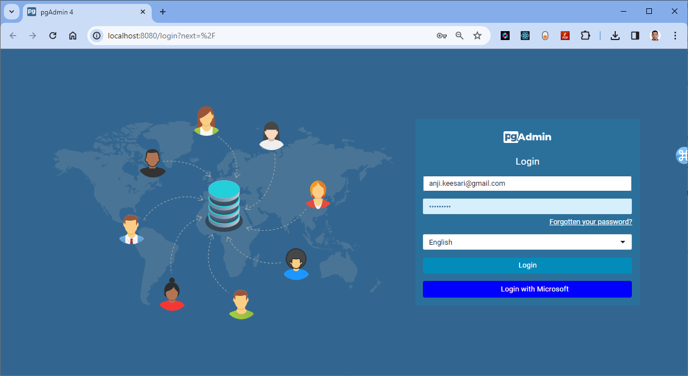
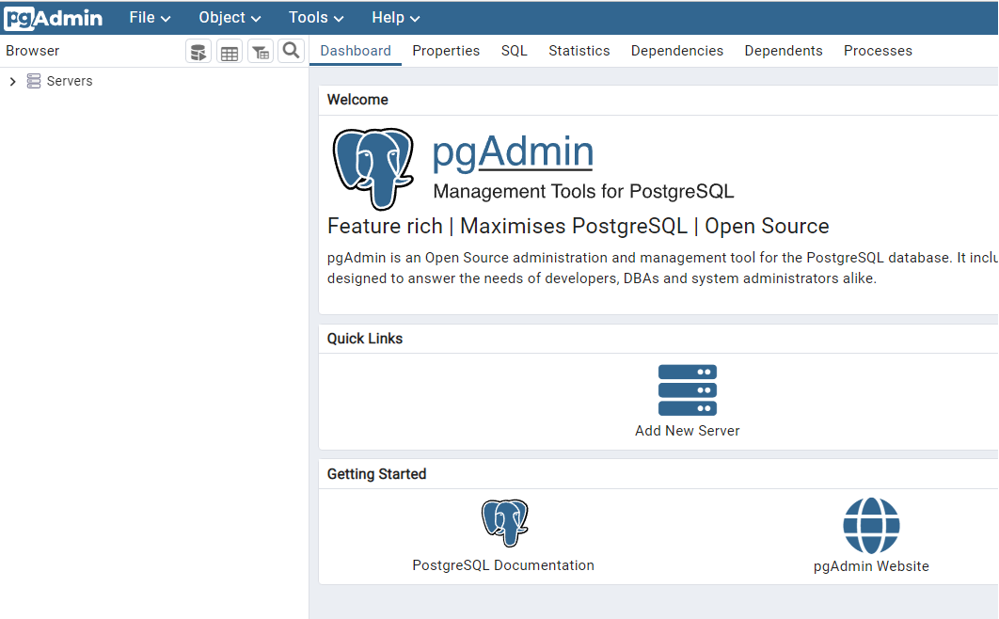

# Install pgadmin4 in Azure Kubernetes Services (AKS) with Helmchart using Terraform

## Introduction


PostgreSQL is a powerful, open-source object-relational database management system (ORDBMS) that we use in most of our microservices architecture. Managing databases is always crucial in any development environment. PgAdmin4 plays a very important role here in managing the PostgreSQL database.


In this session, we'll explore how to set up pgAdmin4 on a Azure Kubernetes Service (AKS). We'll use tools like Helmcharts and Terraform to make the deployment process smooth and manageable. By end of this session, you'll have a clear understanding of how to deploy pgAdmin4 effectively using IaC tools, making database management in your Kubernetes environment. 


**pgAdmin**

pgAdmin is a free and open-source administration and management tool for the PostgreSQL database. It provides a graphical user interface (GUI) for managing and interacting with PostgreSQL databases, allowing users to perform tasks such as creating and modifying tables, managing users and permissions, and running SQL queries. 


**PostgreSQL**

PostgreSQL is a powerful, open-source object-relational database management system (ORDBMS) PostgreSQL is developed by a global community of contributors. It is available for multiple platforms such as Windows, Linux, and MacOS.

**pgAdmin vs. PostgreSQL**

While there are other ways to manage a PostgreSQL database, the simplest approach is to use a GUI tool to make interactions more visual and user-friendly. 

pgAdmin was created to help PostgreSQL users get the most out of their database. The purpose is to provide a graphical administration tool to make it easier to manipulate schema and data in PostgreSQL

## Objective

In this exercise we will accomplish & learn how to implement following:

- **Step 1:** Setup terraform configure for pgadmin4 Install
- **Step 2.** Create a new namespace for pgadmin4
- **Step 3.** Install pgadmin4 helmchart using terraform
- **Step 4.** Verify pgadmin4 resources in AKS
- **Step 5.** Verify pgadmin4 resources in AKS Cluster
- **Step 6.** Access pgadmin4 locally - port forwarding
- **Step 7.** Configure Ingress for pgadmin4
- **Step 8.** Troubleshooting

By following these steps, you will have a securely configured pgAdmin4 instance running in AKS, accessible for database management tasks.

## Prerequisites

Before proceeding with the installation of pgadmin4 in AKS using terraform, ensure you have the following prerequisites in place:

- [Azure subscription](https://azure.microsoft.com/en-us/free/){:target="_blank"}
- [Download and Install Terraform](https://www.terraform.io/downloads){:target="_blank"}
- [Install azure CLI](https://learn.microsoft.com/en-us/cli/azure/install-azure-cli){:target="_blank"}
- [Install and set up kubectl](https://kubernetes.io/docs/tasks/tools/install-kubectl-windows/){:target="_blank"}
- AKS cluster - Ensure you have a running Kubernetes cluster available for pgadmin4 deployment
- An Ingress controller installed in your cluster (e.g., application-gateway, nginx-ingress)
<!-- - Setup Ingress controller in AKS
- Cert-Manager and Let's Encrypt Setup on AKS 
- A registered domain
- A DNS provider
- Public IP address -->

<!-- 
1. **Azure Subscription:** [Sign up for an Azure subscription](https://azure.microsoft.com/en-us/free/), if not already done.

2. **terraform:** [Install and configure terraform](https://www.terraform.io/downloads) on your local machine, including the Helm, Kubernetes, and Azure providers.

3. **Azure CLI:** [Install Azure CLI](https://learn.microsoft.com/en-us/cli/azure/install-azure-cli) for Azure service interaction.

4. **Kubectl:** [Install and set up kubectl](https://kubernetes.io/docs/tasks/tools/install-kubectl-windows/) for managing Kubernetes clusters.

5. **Kubernetes Cluster:** Ensure you have a running Kubernetes cluster available for pgadmin4 deployment.

6. **Git Repository:** Maintain a Git repository storing manifests for your applications, serving as pgadmin4's deployment source. -->

## Implementation Details

Let's look into the step-by-step implementation details:

**login to Azure**

Verify that you are logged into the right Azure subscription before start anything in visual studio code

``` sh
# Login to Azure
az login 

# Shows current Azure subscription
az account show

# Lists all available Azure subscriptions
az account list

# Sets Azure subscription to desired subscription using ID
az account set -s "anji.keesari"
```

**Connect to Cluster**

Use the `az aks get-credentials` command to configure kubectl to connect to the AKS cluster.


``` sh
# Azure Kubernetes Service Cluster User Role
az aks get-credentials -g "rg-aks-dev" -n "aks-cluster1-dev"

# Azure Kubernetes Service Cluster Admin Role
az aks get-credentials -g "rg-aks-dev" -n "aks-cluster1-dev" --admin

# get nodes
kubectl get no
kubectl get namespace -A
```

## Step-1: Setup terraform configure for pgadmin4 Install

Launch Visual Studio Code and open your current terraform repository to begin working on your terraform configuration.

In order to install any Helmcharts using terraform configuration we need to have following terraform providers.

- helm provider
- Kubernetes provider
- Kubectl provider 

**Terraform Providers**

You can install the necessary providers by adding the following code in your Terraform configuration file:

Let's update our existing `provider.tf` file with new kubernetes, helm and kubectl providers:

``` tf title="provider.tf"
terraform {

  required_version = ">=0.12"

  required_providers {
    azurerm = {
      source  = "hashicorp/azurerm"
      version = "~>2.0"
    }

    azuread = {
      version = ">= 2.26.0" // https://github.com/terraform-providers/terraform-provider-azuread/releases
    }
     kubernetes = {
      source  = "hashicorp/kubernetes"
      version = ">= 2.0.3"
    }
    helm = {
      source  = "hashicorp/helm"
      version = ">= 2.1.0"
    }
    
     kubectl = {
      source  = "gavinbunney/kubectl"
      version = ">= 1.7.0"
    }
  }
}

provider "kubernetes" {
  host                   = azurerm_kubernetes_cluster.aks.kube_admin_config.0.host
  client_certificate     = base64decode(azurerm_kubernetes_cluster.aks.kube_admin_config.0.client_certificate)
  client_key             = base64decode(azurerm_kubernetes_cluster.aks.kube_admin_config.0.client_key)
  cluster_ca_certificate = base64decode(azurerm_kubernetes_cluster.aks.kube_admin_config.0.cluster_ca_certificate)
  #load_config_file       = false
}

provider "helm" {
  debug = true
  kubernetes {
    host                   = azurerm_kubernetes_cluster.aks.kube_admin_config.0.host
    client_certificate     = base64decode(azurerm_kubernetes_cluster.aks.kube_admin_config.0.client_certificate)
    client_key             = base64decode(azurerm_kubernetes_cluster.aks.kube_admin_config.0.client_key)
    cluster_ca_certificate = base64decode(azurerm_kubernetes_cluster.aks.kube_admin_config.0.cluster_ca_certificate)

  }
}
provider "kubectl" {
  host                   = azurerm_kubernetes_cluster.aks.kube_admin_config.0.host
  client_certificate     = base64decode(azurerm_kubernetes_cluster.aks.kube_admin_config.0.client_certificate)
  client_key             = base64decode(azurerm_kubernetes_cluster.aks.kube_admin_config.0.client_key)
  cluster_ca_certificate = base64decode(azurerm_kubernetes_cluster.aks.kube_admin_config.0.cluster_ca_certificate)
  load_config_file       = false
}
```


**Setting Up pgadmin4 Locally Using Helm Charts**

pgadmin4 can be installed using various methods. Here I will walk through downloading the pgadmin4 Helmchart source code from a Git repository and running it locally from Visual studio code to install it on an AKS cluster.

Downloading pgadmin4 Helmcharts source code

1. Clone the Repository: Clone the Helmchart repository from the following Git repository: [rowanruseler/helm-charts](https://github.com/rowanruseler/helm-charts){:target="_blank"}. This repository contains the necessary Helm chart for deploying pgadmin4.

2. Access pgadmin4 Charts: Navigate to the `pgadmin4` folder within the Helmcharts repository.  URL: [pgadmin4 Helm Chart](https://github.com/rowanruseler/helm-charts/tree/master/charts/pgadmin4){:target="_blank"}.  This folder will contain all pgadmin4 source code and configurations.

3. Configuration Files: Within the `pgadmin4` folder, you will notice the `values.yaml` - this file stores configuration settings for pgadmin4.
 either create a separate file named `pgadmin4.yaml` or use `values.yaml` to store configuration settings.

4. Customizing pgadmin4 Configuration: Once the files are set up, customize pgadmin4 according to your requirements:

**Change-1:** Configure Extra Secret Mounts, see the difference before and after:

```sh
extraSecretMounts:
  - name: config-local
    secret: pgadmin4-config
    subPath: config_local.py
    mountPath: "/pgadmin4/config_local.py"
    readOnly: true
  # - name: pgpassfile
  #   secret: pgpassfile
  #   subPath: pgpassfile
  #   mountPath: "/var/lib/pgadmin/storage/pgadmin/file.pgpass"
  #   readOnly: true
```

<!--  -->

**Change-2:** Update Email & Password

```sh
env:
  # can be email or nickname
  email: <your-emailaddress>
  password: <your-password>
```

**Change-3:** Update config_local.py File

Edit the `config_local.py` file to configure Single Sign-On (SSO) settings for later use:

```python
MASTER_PASSWORD_REQUIRED = True
AUTHENTICATION_SOURCES = ['oauth2', 'internal']
OAUTH2_AUTO_CREATE_USER = True
OAUTH2_CONFIG = [
  {
      'OAUTH2_NAME': 'microsoft',
      'OAUTH2_DISPLAY_NAME': 'Microsoft',
      'OAUTH2_CLIENT_ID': 'your-client-id-here',
      'OAUTH2_CLIENT_SECRET': 'your-client-secret-here',
      'OAUTH2_TOKEN_URL': 'https://login.microsoftonline.com/your-tenant-id-here/oauth2/v2.0/token',
      'OAUTH2_AUTHORIZATION_URL': 'https://login.microsoftonline.com/your-tenant-id-here/oauth2/v2.0/authorize',
      'OAUTH2_API_BASE_URL': 'https://graph.microsoft.com/oidc/',
      'OAUTH2_USERINFO_ENDPOINT': 'userinfo',
      'OAUTH2_ICON': 'fa-microsoft',
      'OAUTH2_BUTTON_COLOR': '#0000ff',
      'OAUTH2_SCOPE': 'openid email profile'
  }
]
```

**Change-4:** Update Chart.yaml

If required, update the `appVersion` field in the `Chart.yaml` file to reflect any changes made to the application version.

Final folder structure

After completing the setup, your folder structure should resemble the following:

```
terraform_project/
└── pgadmin4/
    ├── values.yaml
    ├── config_local.py
    ├── Chart.yaml
    └── ...
```


## Step-2: Create namespace for pgadmin4

Create a separate namespace for pgadmin4 where all pgadmin4 related resources will be created. let's create a new file called pgadmin4.tf and copy the following configuration.

``` tf title="pgadmin4.tf"
resource "kubernetes_namespace" "pgadmin4" {  
  metadata {
    name = "pgadmin4"
  }
}
```

run terraform validate & format

``` sh
terraform validate
terraform fmt
```

run terraform plan

``` sh
terraform plan -out=dev-plan -var-file="./environments/dev-variables.tfvars"
```

[{:style="border: 1px solid black; border-radius: 10px;"}](images/pgadmin4/image-1.png){:target="_blank"}


output

``` sh
Plan: 1 to add, 0 to change, 0 to destroy.
```
run terraform apply

```sh
terraform apply dev-plan
```

``` sh
Apply complete! Resources: 1 added, 0 changed, 0 destroyed.

Outputs:
```

## Step-3: Install pgadmin4 helmchart using terraform

Visit the official pgadmin4 Helm chart on the ArtifactHUB website: [pgadmin4 Helm Chart](https://artifacthub.io/packages/helm/runix/pgadmin4){:target="_blank"}.

Click on the "Install" button to retrieve the necessary details for the pgadmin4 Helmchart installation.

``` sh
repository = "https://helm.runix.net"
chart      = "pgadmin4"
version    = "1.23.3"
```

``` tf title="pgadmin4.tf"
# Install pgadmin4 helm chart using terraform
resource "helm_release" "pgadmin4" {
  name       = "pgadmin4"
  repository = "https://helm.runix.net"
  chart      = "pgadmin4"
  version    = "1.23.3"  
  namespace = kubernetes_namespace.pgadmin4.metadata.0.name
  values = [
    "${file("pgadmin4/pgadmin4.yaml")}"
  ]

  lifecycle {
    ignore_changes = [
      # values,
      version
    ]
  }
  depends_on = [
    kubernetes_namespace.pgadmin4
  ]
}
```

run terraform plan

```
terraform validate
terraform fmt
terraform plan -out=dev-plan -var-file="./environments/dev-variables.tfvars"
```
output
``` sh
Plan: 1 to add, 0 to change, 0 to destroy.
```
[{:style="border: 1px solid black; border-radius: 10px;"}](images/pgadmin4/image-2.png){:target="_blank"}

run terraform apply

```sh
terraform apply dev-plan
```
``` sh
helm_release.pgadmin4: Creating...
helm_release.pgadmin4: Still creating... [10s elapsed]
helm_release.pgadmin4: Still creating... [20s elapsed]
helm_release.pgadmin4: Still creating... [30s elapsed]
helm_release.pgadmin4: Still creating... [40s elapsed]
helm_release.pgadmin4: Still creating... [50s elapsed]
helm_release.pgadmin4: Still creating... [1m0s elapsed]
helm_release.pgadmin4: Creation complete after 1m5s [id=pgadmin4]

Apply complete! Resources: 1 added, 0 changed, 0 destroyed.

Outputs
```

!!!note
    Even though the Helm install was completed successfully, I noticed that the pod was not visible in the AKS cluster. I had to manually execute the following command to view the pod in the AKS cluster.

```sh
helm upgrade pgadmin4 runix/pgadmin4 -n pgadmin4
```

output
```sh
Release "pgadmin4" has been upgraded. Happy Helming!
NAME: pgadmin4
LAST DEPLOYED: Fri Feb 16 12:10:15 2024
NAMESPACE: pgadmin4
STATUS: deployed
REVISION: 7
NOTES:
1. Get the application URL by running these commands:
  export POD_NAME=$(kubectl get pods --namespace pgadmin4 -l "app.kubernetes.io/name=pgadmin4,app.kubernetes.io/instance=pgadmin4" -o jsonpath="{.items[0].metadata.name}")
  echo "Visit http://127.0.0.1:8080 to use your application"
  kubectl port-forward $POD_NAME 8080:80
```

commands for direct install:

```sh
helm install my-release runix/pgadmin4 --set env.password=SuperSecret
helm install my-release runix/pgadmin4 -f values.yaml
```

## Step 4. Verify pgadmin4 resources in AKS

Validate to make sure all the deployments / services created and running as expected. 

Run the following `kubectl` commands to verify the pgadmin4 installation in the AKS cluster.

```sh
kubectl get all -n pgadmin4
# or
kubectl get all,configmaps,secrets -n pgadmin4
```

or

```sh
kubectl get namespace pgadmin4
kubectl get deployments -n pgadmin4
kubectl get pods -n pgadmin4
kubectl get services -n pgadmin4
```

expected output

```sh
NAME                            READY   STATUS    RESTARTS   AGE
pod/pgadmin4-765c7ffd6d-6jmr9   1/1     Running   0          5h11m        

NAME               TYPE        CLUSTER-IP    EXTERNAL-IP   PORT(S)   AGE  
service/pgadmin4   ClusterIP   10.25.44.90   <none>        80/TCP    5h24m

NAME                       READY   UP-TO-DATE   AVAILABLE   AGE
deployment.apps/pgadmin4   1/1     1            1           5h24m

NAME                                  DESIRED   CURRENT   READY   AGE     
replicaset.apps/pgadmin4-57d4c6955d   0         0         0       5h24m   
replicaset.apps/pgadmin4-765c7ffd6d   1         1         1       5h14m 
```

```sh
kubectl get configmaps -n pgadmin4
```

```sh
NAME               DATA   AGE
kube-root-ca.crt   1      6h48m
```

```sh
kubectl get secrets -n pgadmin4
```

```sh
pgadmin4                         Opaque               1      5h26m
pgadmin4-config                  Opaque               1      5h42m
sh.helm.release.v1.pgadmin4.v1   helm.sh/release.v1   1      6h20m
sh.helm.release.v1.pgadmin4.v2   helm.sh/release.v1   1      6h10m
sh.helm.release.v1.pgadmin4.v3   helm.sh/release.v1   1      5h47m
sh.helm.release.v1.pgadmin4.v4   helm.sh/release.v1   1      5h35m
sh.helm.release.v1.pgadmin4.v5   helm.sh/release.v1   1      5h34m
sh.helm.release.v1.pgadmin4.v6   helm.sh/release.v1   1      5h27m
sh.helm.release.v1.pgadmin4.v7   helm.sh/release.v1   1      5h26m
```

```sh
kubectl get ingress -n pgadmin4
```

```
No resources found in argocd namespace.
```

## Step-6. Access pgadmin4 locally - port forwarding


To perform local login testing for pgadmin4, you can use port forwarding. Here are the steps:


```sh
kubectl port-forward service/pgadmin4 -n pgadmin4 8080:80
```

```sh
Forwarding from 127.0.0.1:8080 -> 8080
Forwarding from [::1]:8080 -> 8080
Handling connection for 8080
```
Access the pgadmin4 web interface by visiting <http://localhost:8080> in your web browser.

[{:style="border: 1px solid black; border-radius: 10px;"}](images/pgadmin4/image-3.png){:target="_blank"}

After Login > Dashboard

[{:style="border: 1px solid black; border-radius: 10px;"}](images/pgadmin4/image-4.png){:target="_blank"}


The port forwarding can be stopped by cancelling the command with CTRL + C.

login with following credentials

```sh
username: anjkeesari@gmail.com
Password: StrongPassword@
```

## Step-7. Configure Ingress for pgadmin4

Create an Ingress resource to expose pgAdmin 4 URL use the following yaml manifest 
(pgadmin4-ingress.yaml):

```sh title="pgadmin4-ingress.yaml"
apiVersion: networking.k8s.io/v1
kind: Ingress
metadata:
  name: pgadmin4
  annotations:
    kubernetes.io/ingress.class: azure/application-gateway
    appgw.ingress.kubernetes.io/health-probe-status-codes: "200-499"
    cert-manager.io/cluster-issuer: letsencrypt
    cert-manager.io/acme-challenge-type: http01
spec:
  tls:
  - hosts:
    - dev.pgadmin.mydomain.net
    secretName: tls-secret
  rules:
    - host: dev.pgadmin.mydomain.net
      http:
        paths:
          - path: /
            pathType: Prefix
            backend:
              service:
                name: pgadmin4
                port:   
                  number: 80
status:
  loadBalancer:
    ingress:
      - ip: 20.125.213.106
      
# kubectl apply -f pgadmin4-ingress.yaml -n pgadmin4

```

**Deploy Ingress** YAML file using terraform

```sh
# Create pgadmin4 ingress file
data "kubectl_file_documents" "pgadmin4_ingress" {
  content = file("pgadmin4/pgadmin4-ingress.yaml")
}

# Apply pgadmin4 ingress file
resource "kubectl_manifest" "pgadmin4_ingress" {
  for_each  = data.kubectl_file_documents.pgadmin4_ingress.manifests
  yaml_body = each.value
  depends_on = [
    data.kubectl_file_documents.pgadmin4_ingress
  ]
}
```
Apply the Ingress resource by running terraform plan & apply 

```sh
terraform plan -out=dev-plan -var-file="./environments/dev-variables.tfvars"
terraform apply dev-plan
```

Ensure all resources are correctly deployed and running:

```sh
kubectl get deployments,services,ingress -n pgadmin4
```

**Update DNS Records**

After setting up Ingress, you need to ensure that the domain name you've chosen for pgAdmin 4 points to your Ingress controller's IP address. Here's how to add a new record set in your public DNS zone:

Look for a service that exposes an external IP address. This is the IP address you'll use in your DNS configuration.

Add DNS record & create a new record set

**Verify DNS Propagation**

Before accessing pgAdmin 4, ensure that the DNS changes have propagated and that your domain name resolves to the correct IP address. You can use tools like `nslookup` or `dig` for this purpose.

```sh
nslookup pgadmin.yourdomain.com
```

```sh
Server:  UnKnown
Address:  192.168.1.1

Non-authoritative answer:
Name:    dev.pgadmin.mydomain.com
Address:  20.125.213.200
```

```sh
dig pgadmin.yourdomain.com
```

Check the output to ensure that the domain resolves to the external IP address of your Ingress controller.


## Step-8. Troubleshooting

If you're unable to access pgAdmin4 or face issues:

- **Check Ingress Rules**: Ensure your Ingress resource is correctly configured to route traffic to the pgAdmin 4 service.
- **Verify Pod & Service**: Ensure the pgAdmin4 pod and service is running.
- **Logs**: Check the logs of your pgAdmin4 pod and Ingress controller for any errors or warnings.

Following these steps should help you test and verify that your pgAdmin4 URL is set up correctly and that the application is accessible over the internet.

Helm chart troubleshooting details


```sh
helm repo list
helm ls -aA
helm list --namespace pgadmin4
```

**helm upgrade**

```sh
helm install pgadmin4 runix/pgadmin4 --set env.email=<your-email> --set env.password=<your-password> --namespace=<your-namespace> --create-namespace
helm upgrade pgadmin4 runix/pgadmin4 -f .\pgadmin4\pgadmin4.yaml --create-namespace -n pgadmin4
helm upgrade pgadmin4 runix/pgadmin4 -f .\pgadmin4\pgadmin4.yaml -n pgadmin4
```


```sh
Release "pgadmin4" has been upgraded. Happy Helming!
NAME: pgadmin4
LAST DEPLOYED: Mon Dec  5 07:09:32 2022
NAMESPACE: pgadmin4
STATUS: deployed
REVISION: 11
NOTES:
1. Get the application URL by running these commands:
  export POD_NAME=$(kubectl get pods --namespace pgadmin4 -l "app.kubernetes.io/name=pgadmin4,app.kubernetes.io/instance=pgadmin4" -o jsonpath="{.items[0].metadata.name}")
  echo "Visit http://127.0.0.1:8080 to use your application"
  kubectl port-forward $POD_NAME 8080:80
```

```sh
helm history pgadmin4 -n pgadmin4
```


**helm rollback**

```sh
helm rollback pgadmin4 10 
```

```sh
Rollback was a success! Happy Helming!
```

**helm uninstall**

```sh
helm uninstall pgadmin4 -n pgadmin4
```

**pod logs**

```sh
kubectl logs pods/pgadmin4-765c7ffd6d-6jmr9 -n pgadmin4
```

```sh
postfix/postlog: starting the Postfix mail system
[2024-02-16 20:23:15 +0000] [1] [INFO] Starting gunicorn 20.1.0
[2024-02-16 20:23:15 +0000] [1] [INFO] Listening at: http://[::]:80 (1)
[2024-02-16 20:23:15 +0000] [1] [INFO] Using worker: gthread
[2024-02-16 20:23:15 +0000] [88] [INFO] Booting worker with pid: 88
::ffff:10.64.4.10 - - [16/Feb/2024:20:24:09 +0000] "GET /misc/ping HTTP/1.1" 200 4 "-" "kube-probe/1.27"
::ffff:10.64.4.10 - - [16/Feb/2024:20:24:09 +0000] "GET /misc/ping HTTP/1.1" 200 4 "-" "kube-probe/1.27"
::ffff:10.64.4.10 - - [16/Feb/2024:20:25:09 +0000] "GET /misc/ping HTTP/1.1" 200 4 "-" "kube-probe/1.27"
::ffff:10.64.4.10 - - [16/Feb/2024:20:28:09 +0000] "GET /misc/ping HTTP/1.1" 200 4 "-" "kube-probe/1.27"
```

## Reference

Here is the list of all the resources used while working on this setup 

- [pgAdmin home page](https://www.pgadmin.org/){:target="_blank"}
- [Helm Provider for Terraform](https://github.com/hashicorp/terraform-provider-helm){:target="_blank"}
- [Explore > dpage/pgadmin4](https://hub.docker.com/r/dpage/pgadmin4/tags){:target="_blank"} - get the latest Docker image from here.
- [pgadmin4 Helm Chart](https://artifacthub.io/packages/helm/runix/pgadmin4){:target='_blank'}
- [pgadmin4 Helm Chart - Github](https://github.com/rowanruseler/helm-charts/tree/master/charts/pgadmin4/examples){:target='_blank'} - Helpful for SSO setup
- [pgadmin4 Documentation](https://www.pgadmin.org/docs/pgadmin4/6.15/index.html) {:target='_blank'}

<!-- 
## Step-8. Setup SSO for pgadmin4

Create pgadmin4 oauth2 YAML file for SSO

oauth2-config.yaml

```sh
#
# secrets.yaml
# To setup Google OAUTH
## https://support.google.com/googleapi/answer/6158849?hl=en#
# To setup Github OAUTH
## https://docs.github.com/en/developers/apps/building-oauth-apps/creating-an-oauth-app
# redirect|callback URI to set:
## https://pgadmin4.example.com/oauth2/authorize 
---
kind: Secret
apiVersion: v1
metadata:
  name: pgadmin4-config
type: Opaque
stringData:
  config_local.py: |-
    MASTER_PASSWORD_REQUIRED = True
    AUTHENTICATION_SOURCES = ['oauth2', 'internal']
    OAUTH2_AUTO_CREATE_USER = True
    OAUTH2_CONFIG = [
      {
          'OAUTH2_NAME': 'microsoft',
          'OAUTH2_DISPLAY_NAME': 'Microsoft',
          'OAUTH2_CLIENT_ID': 'your-client-id-here',
          'OAUTH2_CLIENT_SECRET': 'your-client-secret-here',
          'OAUTH2_TOKEN_URL': 'https://login.microsoftonline.com/ff93c4a0-f87d-46ad-b4be-3ee05cefec6b/oauth2/v2.0/token',
          'OAUTH2_AUTHORIZATION_URL': 'https://login.microsoftonline.com/ff93c4a0-f87d-46ad-b4be-3ee05cefec6b/oauth2/v2.0/authorize',
          'OAUTH2_API_BASE_URL': 'https://graph.microsoft.com/oidc/',
          'OAUTH2_USERINFO_ENDPOINT': 'userinfo',
          'OAUTH2_ICON': 'fa-microsoft',
          'OAUTH2_BUTTON_COLOR': '#0000ff',
          'OAUTH2_SCOPE': 'openid email profile'
      }
    ]
# kubectl apply -f .\pgadmin4\oauth2-config.yaml -n pgadmin4
```


Apply pgadmin4 oauth2 file:

terraform apply needs two parts

*data part*

```
data "kubectl_file_documents" "pgadmin4_oauth2" {
  content = file("pgadmin4/pgadmin4-config.yaml")
}
```
*resource part*

```
resource "kubectl_manifest" "pgadmin4_oauth2" {
  for_each  = data.kubectl_file_documents.pgadmin4_oauth2.manifests
  yaml_body = each.value
  depends_on = [
    data.kubectl_file_documents.pgadmin4_oauth2
  ]
}
```
terraform plan & apply at this stage

```
terraform plan -out=dev-plan -var-file="./environments/dev-variables.tfvars"
terraform apply dev-plan
``` 

**Trouble Shooting**


in case Login with Microsoft button is missing or workload not created then run the following from helmcharts repo.

```sh
helm install pgadmin4 runix/pgadmin4 --set env.email=<your-email> --set env.password=<your-password> --namespace=<your-namespace> --create-namespace

helm upgrade pgadmin4 runix/pgadmin4 -f .\pgadmin4\pgadmin4.yaml --create-namespace -n pgadmin4
```

output
```sh

Release "pgadmin4" has been upgraded. Happy Helming!
NAME: pgadmin4
LAST DEPLOYED: Mon Dec  5 07:09:32 2022
NAMESPACE: pgadmin4
STATUS: deployed
REVISION: 11
NOTES:
1. Get the application URL by running these commands:
  export POD_NAME=$(kubectl get pods --namespace pgadmin4 -l "app.kubernetes.io/name=pgadmin4,app.kubernetes.io/instance=pgadmin4" -o jsonpath="{.items[0].metadata.name}")
  echo "Visit http://127.0.0.1:8080 to use your application"
  kubectl port-forward $POD_NAME 8080:80
```
-->