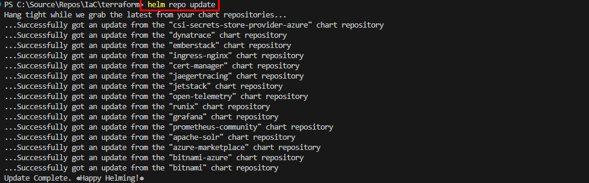
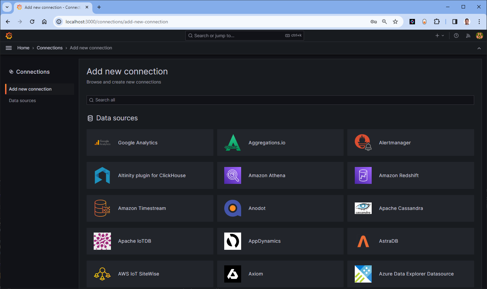
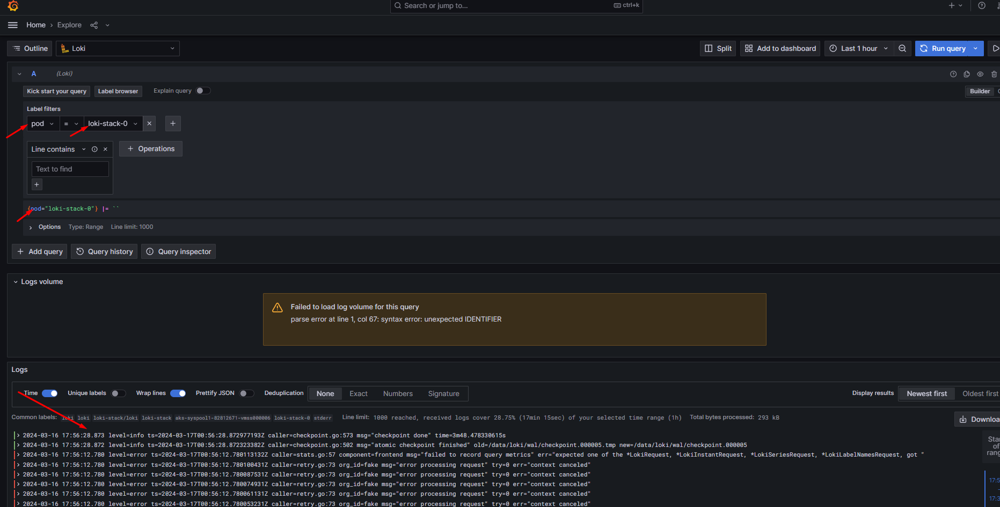

# Install Grafana Loki-Stack Helmchart in Azure Kubernetes Services (AKS)


## Introduction

Grafana Loki is a powerful log aggregation system that allows users to collect, store, and query logs in a highly efficient and scalable manner. When integrated with Kubernetes, Grafana Loki provides a seamless solution for monitoring and analyzing logs within AKS clusters. By leveraging Helm charts, the deployment process becomes streamlined and reproducible, ensuring consistent setups across different environments.

In this tutorial, I will guide you through the process of installing Grafana Loki-Stack using Helmchart in an AKS cluster.

## Objective

In this exercise we will accomplish & learn how to implement following:

- **Step 1:** Login into Azure
- **Step 2.** Connect to AKS Cluster
- **Step 3.** Add Grafana Loki-Stack Helm Repository
- **Step 4.** Install Grafana Loki-Stack Helmchart
- **Step 5.** Verify Grafana Loki-Stack Resources in AKS
- **Step 6.** Access Grafana Loki-Stack Dashboard Locally - port forwarding
- **Step 7.** Configure Ingress for Grafana Loki-Stack

## Prerequisites

Before you begin, ensure you have the following prerequisites:

- An Azure account with access to AKS.
- `Azure CLI` installed on your local machine.
- `kubectl` installed on your local machine.
- `Helm` installed on your local machine.


## Step 1: Login into Azure

Verify that you are logged into the right Azure subscription before start anything in visual studio code

``` sh
# Login to Azure
az login 

# Shows current Azure subscription
az account show

# Lists all available Azure subscriptions
az account list

# Sets Azure subscription to desired subscription using ID
az account set -s "anji.keesari"
```

Follow the on-screen instructions to complete the login process.

## Step 2: Connect to AKS Cluster

Once logged in and set your subscription then connect to your AKS cluster. with your AKS cluster name:

Use the `az aks get-credentials` command to connect to the AKS cluster.


``` sh
# Azure Kubernetes Service Cluster User Role
az aks get-credentials -g "rg-aks-dev" -n "aks-cluster1-dev"

# Azure Kubernetes Service Cluster Admin Role
az aks get-credentials -g "rg-aks-dev" -n "aks-cluster1-dev" --admin

# get nodes
kubectl get no
kubectl get namespace -A
```

## Step 3: Add Grafana Loki-Stack Helm Repository

Before installing Grafana Loki-Stack, you need to add the Helm repository for Grafana Loki-Stack:

```bash
helm repo list
helm repo add grafana https://grafana.github.io/helm-charts
helm repo update
helm search repo grafana
```

[{:style="border: 1px solid black; border-radius: 10px;"}](images/loki/image.png){:target="_blank"}

[{:style="border: 1px solid black; border-radius: 10px;"}](images/loki/image-1.png){:target="_blank"}

[{:style="border: 1px solid black; border-radius: 10px;"}](images/loki/image-2.png){:target="_blank"}


```bash
helm list -aA
helm list --namespace grafana
```

```sh
NAME            NAMESPACE       REVISION        UPDATED                                 STATUS          CHART                   APP VERSION
loki-stack      loki-stack      1               2024-03-16 17:22:22.273156 -0700 PDT    deployed        loki-stack-2.10.2       v2.9.3  
```

## Step 4: Install Grafana Loki-Stack Helmchart

Now, you can install Grafana Loki-Stack using Helmchart. Execute the following command:

Let's first see the values:
```sh
helm show values grafana/loki-stack > C:\Source\Repos\IaC\terraform\loki-stack-values.yaml
```

[{:style="border: 1px solid black; border-radius: 10px;"}](images/loki/image-11.png){:target="_blank"}


```bash
# use this command if you need to create namespace along with helm install
helm upgrade --install loki-stack --values loki-stack-values.yaml grafana/loki-stack --namespace loki-stack --create-namespace --version 2.10.2

# use this command if you already have namespace created
helm upgrade --install loki-stack --values loki-stack-values.yaml grafana/loki-stack --version 2.10.2
```
[{:style="border: 1px solid black; border-radius: 10px;"}](images/loki/image-3.png){:target="_blank"}

This command installs Grafana Loki-Stack in your AKS cluster. You can customize the installation by providing values files or using Helm chart options.

## Step 5: Verify Grafana Loki-Stack Resources in AKS

To verify that Grafana Loki-Stack has been successfully installed, you can list the Kubernetes resources:

```bash
kubectl get all -n loki-stack
kubectl get all,configmap,secret -n loki-stack
kubectl get pods -n loki-stack
```

[{:style="border: 1px solid black; border-radius: 10px;"}](images/loki/image-4.png){:target="_blank"}


You should see Grafana Loki-Stack pods and services running in your cluster.

## Step 6: Access Grafana Loki-Stack Dashboard Locally

To access the Grafana Loki-Stack dashboard locally, you need to create a port forward:

```bash
kubectl port-forward svc/loki-stack -n loki-stack 3100:3100
```

```bash
http://localhost:3100/ready
```

To access the Grafana dashboard locally, you need to create a port forward:

```bash
kubectl port-forward svc/loki-stack-grafana -n loki-stack 3000:3000
```

```bash
http://localhost:3000/login
```

Now, you can access Grafana & Loki-Stack by opening your web browser. Use the default username (admin) to log in.

You need to retrieve the `admin` password by running the following commands:

``` sh
# bash
kubectl get secret --namespace loki-stack grafana -o jsonpath="{.data.admin-password}" | base64 --decode ; echo
# pwsh
kubectl get secret --namespace loki-stack grafana -o jsonpath="{.data.admin-password}" | ForEach-Object { [System.Text.Encoding]::UTF8.GetString([System.Convert]::FromBase64String($_)) }
```

After running the above commands, you should be able to access Grafana Loki-Stack at `http://localhost:3000` in your web browser. Log in using the username admin and the password obtained from the previous command.

Grafana > Login page
[{:style="border: 1px solid black; border-radius: 10px;"}](images/grafana/image-1.png){:target="_blank"}

Grafana > Welcome page
[{:style="border: 1px solid black; border-radius: 10px;"}](images/grafana/image-2.png){:target="_blank"}

Grafana > Connection page
[{:style="border: 1px solid black; border-radius: 10px;"}](images/grafana/image-3.png){:target="_blank"}

Grafana > Dashboard page
[{:style="border: 1px solid black; border-radius: 10px;"}](images/grafana/image-4.png){:target="_blank"}

Loki > ready state

[{:style="border: 1px solid black; border-radius: 10px;"}](images/loki/image-5.png){:target="_blank"}

Loki > Metrics

[{:style="border: 1px solid black; border-radius: 10px;"}](images/loki/image-6.png){:target="_blank"}

Loki > Config

[{:style="border: 1px solid black; border-radius: 10px;"}](images/loki/image-7.png){:target="_blank"}

Loki > Labels

[{:style="border: 1px solid black; border-radius: 10px;"}](images/loki/image-8.png){:target="_blank"}

Grafana > Loki data source - added by default

[{:style="border: 1px solid black; border-radius: 10px;"}](images/loki/image-9.png){:target="_blank"}

Loki > access pod logs

[{:style="border: 1px solid black; border-radius: 10px;"}](images/loki/image-10.png){:target="_blank"}

Other Loki endpoints for testing:

- <http://localhost:3100/ready>
- <http://localhost:3100/log_level>
- <http://localhost:3100/metrics>
- <http://localhost:3100/config>
- <http://localhost:3100/services>
- <http://localhost:3100/loki/api/v1/status/buildinfo>
- <http://localhost:3100/loki/api/v1/format_query>
- <http://localhost:3100/loki/api/v1/labels>
- <http://localhost:3100/loki/api/v1/push>


## Step 7: Configure Ingress for Grafana Loki-Stack

If you want to access Grafana externally, you can configure Ingress. First, create an Ingress resource:

```yaml
apiVersion: networking.k8s.io/v1
kind: Ingress
metadata:
  name: grafana-ingress
spec:
  rules:
  - host: yourdomain.com
    http:
      paths:
      - path: /
        pathType: Prefix
        backend:
          service:
            name: loki-stack-grafana
            port:
              number: 80
```

Apply the Ingress configuration:

```bash
kubectl apply -f grafana-ingress.yaml
```

loki Ingress

```yaml
apiVersion: networking.k8s.io/v1
kind: Ingress
metadata:
  name: loki-ingress
spec:
  rules:
  - host: yourdomain.com
    http:
      paths:
      - path: /
        pathType: Prefix
        backend:
          service:
            name: loki-stack
            port:
              number: 3100
```

Apply the Ingress configuration:

```bash
kubectl apply -f loki-ingress.yaml
```
Replace `yourdomain.com` with your actual domain name.

clean up resources:

```sh
helm delete loki-stack -n loki-stack
helm delete grafana -n grafana
```
## Conclusion

You have successfully installed Grafana Loki-Stack using Helmchart in Azure Kubernetes Services. The integration of Grafana Loki into Azure Kubernetes Services using Helm charts simplifies the deployment process and empowers users with powerful log monitoring capabilities, enhancing observability within Kubernetes clusters.

## Reference

- [Grafana Loki-Stack Helm Chart Repository](https://artifacthub.io/packages/helm/grafana/loki-stack){:target='_blank'}
- [Getting started with Azure Kubernetes Service and Loki](https://techcommunity.microsoft.com/t5/apps-on-azure-blog/getting-started-with-azure-kubernetes-service-and-loki/ba-p/3406880){:target='_blank'}