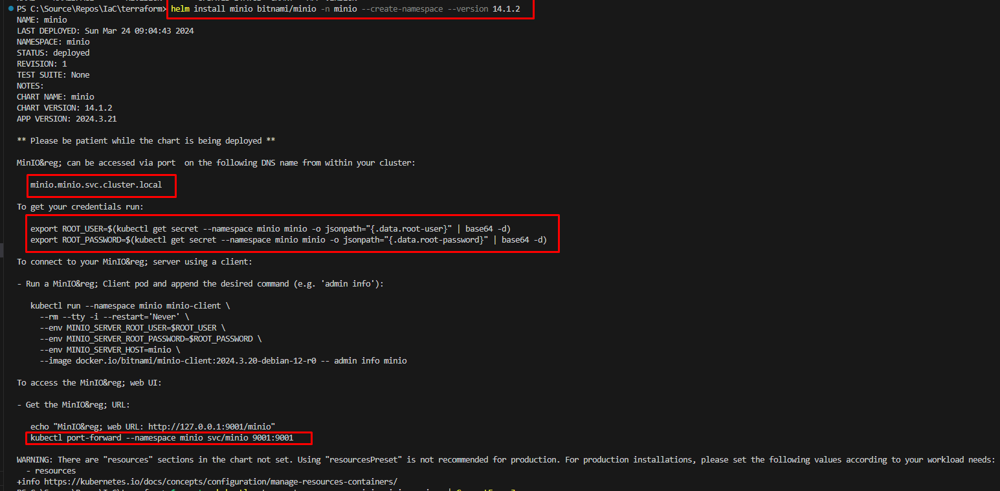

# Install Minio Helmchart in Azure Kubernetes Services (AKS)

## Introduction

Minio is a high-performance object storage server built for cloud-native applications and Kubernetes. It is compatible with Amazon S3 APIs, making it easy to integrate with existing S3-compatible applications. 

Microservices often need to store and retrieve large volumes of data. Minio provides a scalable, distributed, and high-performance object storage solution that can handle large amounts of unstructured data. Microservices can interact with Minio via its S3-compatible APIs to store and retrieve data efficiently.

In this guide, we will explore how to deploy Minio on Azure Kubernetes Services (AKS) using Helm, a package manager for Kubernetes.

## Objective

The objective of this tutorial is to demonstrate how to deploy Minio on Azure Kubernetes Services using Helm charts. By the end of this tutorial, you will have Minio up and running in your AKS environment.

In this exercise we will accomplish & learn how to implement following:

- **Step 1:** Login into Azure
- **Step 2.** Connect to AKS Cluster
- **Step 3.** Add Minio Helm Repository
- **Step 4.** Install Minio Helmchart
- **Step 5.** Verify Minio Resources in AKS
- **Step 6.** Get Minio login Password
- **Step 7.** Access Minio Locally - port forwarding
- **Step 8.** Configure Ingress for Minio

## Prerequisites

Before you begin, ensure you have the following prerequisites:

- An `Azure account` with permissions to create resources.
- `Azure CLI` installed on your local machine.
- `kubectl` installed on your local machine.
- `Helm` installed on your local machine.
- Access to an existing `AKS cluster` or create a new one.


## Step 1: Login into Azure

Ensure that you are logged into the correct Azure subscription before proceeding.

``` sh
# Login to Azure
az login 

# Shows current Azure subscription
az account show

# Lists all available Azure subscriptions
az account list

# Sets Azure subscription to desired subscription using ID
az account set -s "anji.keesari"
```

Follow the on-screen instructions to complete the login process.

## Step 2: Connect to AKS Cluster

Once logged in and set your subscription then connect to your AKS cluster. with your AKS cluster name:

Use the `az aks get-credentials` command to connect to the AKS cluster.


``` sh
# Azure Kubernetes Service Cluster User Role
az aks get-credentials -g "rg-aks-dev" -n "aks-cluster1-dev"

# Azure Kubernetes Service Cluster Admin Role
az aks get-credentials -g "rg-aks-dev" -n "aks-cluster1-dev" --admin

# get nodes
kubectl get no
kubectl get namespace -A
```

## Step 3: Add Minio Helm Repository

Before installing Minio, you need to add the Helm repository for Minio:

```bash
helm repo list
```
output
```sh
NAME                                    URL
bitnami                                 https://charts.bitnami.com/bitnami
runix                                   https://helm.runix.net
ingress-nginx                           https://kubernetes.github.io/ingress-nginx
jetstack                                https://charts.jetstack.io
prometheus-community                    https://prometheus-community.github.io/helm-charts
apache-solr                             https://solr.apache.org/charts
azure-marketplace                       https://marketplace.azurecr.io/helm/v1/repo
bitnami-azure                           https://marketplace.azurecr.io/helm/v1/repo
jaegertracing                           https://jaegertracing.github.io/helm-charts
csi-secrets-store-provider-azure        https://azure.github.io/secrets-store-csi-driver-provider-azure/charts
cert-manager                            https://charts.jetstack.io
dynatrace                               https://raw.githubusercontent.com/Dynatrace/dynatrace-operator/main/config/helm/repos/stable
open-telemetry                          https://open-telemetry.github.io/opentelemetry-helm-charts
emberstack                              https://emberstack.github.io/helm-charts
grafana                                 https://grafana.github.io/helm-charts
```

```bash
helm repo add bitnami https://charts.bitnami.com/bitnami
```
output

```sh
"bitnami" already exists with the same configuration, skipping
```

```bash
helm repo update
```

output
```sh
Hang tight while we grab the latest from your chart repositories...
...Successfully got an update from the "csi-secrets-store-provider-azure" chart repository
...Successfully got an update from the "runix" chart repository
...Successfully got an update from the "dynatrace" chart repository
...Successfully got an update from the "ingress-nginx" chart repository
...Successfully got an update from the "emberstack" chart repository
...Successfully got an update from the "jaegertracing" chart repository
...Successfully got an update from the "open-telemetry" chart repository
...Successfully got an update from the "cert-manager" chart repository
...Successfully got an update from the "jetstack" chart repository
...Successfully got an update from the "grafana" chart repository
...Successfully got an update from the "apache-solr" chart repository
...Successfully got an update from the "prometheus-community" chart repository
...Successfully got an update from the "azure-marketplace" chart repository
...Successfully got an update from the "bitnami-azure" chart repository
...Successfully got an update from the "bitnami" chart repository
Update Complete. ⎈Happy Helming!⎈
```


helm list before install

```bash
helm list -aA
helm list --namespace minio
```
output

```sh
NAME            NAMESPACE       REVISION        UPDATED                                 STATUS          CHART                   APP VERSION
```

## Step 4: Install Minio Helmchart

Now, you can install Minio using Helmchart. Execute the following command:

Let's first search the helm chart which we want to install. here I am installing bitnami helmchart.

```sh
helm search repo minio
```

output

```sh
NAME                    CHART VERSION   APP VERSION     DESCRIPTION
azure-marketplace/minio 11.10.13        2022.10.29      MinIO(R) is an object storage server, compatibl...
bitnami-azure/minio     11.10.13        2022.10.29      MinIO(R) is an object storage server, compatibl...
bitnami/minio           14.1.2          2024.3.21       MinIO(R) is an object storage server, compatibl...
```


Let's first see the values:
```sh
helm show values bitnami/minio > C:\Source\Repos\IaC\terraform\minio-values.yaml
```

```bash
# use this command if you need to create namespace along with helm install
helm install minio bitnami/minio -n minio --create-namespace --version 14.1.2

# use this command if you already have namespace created
helm upgrade --install minio bitnami/minio -n minio --version 14.1.2
```

```sh
NAME: minio
LAST DEPLOYED: Sun Mar 24 09:04:43 2024
NAMESPACE: minio
STATUS: deployed
REVISION: 1
TEST SUITE: None
NOTES:
CHART NAME: minio
CHART VERSION: 14.1.2
APP VERSION: 2024.3.21

** Please be patient while the chart is being deployed **

MinIO&reg; can be accessed via port  on the following DNS name from within your cluster:

   minio.minio.svc.cluster.local

To get your credentials run:

   export ROOT_USER=$(kubectl get secret --namespace minio minio -o jsonpath="{.data.root-user}" | base64 -d)
   export ROOT_PASSWORD=$(kubectl get secret --namespace minio minio -o jsonpath="{.data.root-password}" | base64 -d)

To connect to your MinIO&reg; server using a client:

- Run a MinIO&reg; Client pod and append the desired command (e.g. 'admin info'):

   kubectl run --namespace minio minio-client \
     --rm --tty -i --restart='Never' \
     --env MINIO_SERVER_ROOT_USER=$ROOT_USER \
     --env MINIO_SERVER_ROOT_PASSWORD=$ROOT_PASSWORD \
     --env MINIO_SERVER_HOST=minio \
     --image docker.io/bitnami/minio-client:2024.3.20-debian-12-r0 -- admin info minio

To access the MinIO&reg; web UI:

- Get the MinIO&reg; URL:

   echo "MinIO&reg; web URL: http://127.0.0.1:9001/minio"
   kubectl port-forward --namespace minio svc/minio 9001:9001

WARNING: There are "resources" sections in the chart not set. Using "resourcesPreset" is not recommended for production. For production installations, please set the following values according to your workload needs:
  - resources
+info https://kubernetes.io/docs/concepts/configuration/manage-resources-containers/
```

[{:style="border: 1px solid black; border-radius: 10px;"}](images/minio/image-1.png){:target="_blank"}

This command installs Minio in your AKS cluster. You can customize the installation by providing values files or using Helm chart options.

## Step 5: Verify Minio Resources in AKS

To verify that Minio has been successfully installed, you can list the Kubernetes resources:

```bash
helm list --namespace minio
```
output

```sh
NAME    NAMESPACE       REVISION        UPDATED                                 STATUS          CHART           APP VERSION
minio   minio           1               2024-03-24 09:04:43.0611222 -0700 PDT   deployed        minio-14.1.2    2024.3.21
```


```bash
kubectl get pods -n minio
# List all pods in the default namespace
kubectl get all -n minio
kubectl get configmap,secret,ingress,all -n minio
```

output

```sh
NAME                         DATA   AGE
configmap/kube-root-ca.crt   1      43m

NAME                                 TYPE                 DATA   AGE
secret/minio                         Opaque               2      43m
secret/sh.helm.release.v1.minio.v1   helm.sh/release.v1   1      43m

NAME                         READY   STATUS    RESTARTS   AGE
pod/minio-7fbf9844c9-nn7w2   1/1     Running   0          43m

NAME            TYPE        CLUSTER-IP      EXTERNAL-IP   PORT(S)             AGE
service/minio   ClusterIP   10.25.104.246   <none>        9000/TCP,9001/TCP   43m

NAME                    READY   UP-TO-DATE   AVAILABLE   AGE
deployment.apps/minio   1/1     1            1           43m

NAME                               DESIRED   CURRENT   READY   AGE
replicaset.apps/minio-7fbf9844c9   1         1         1       43m
```
You should see Minio pods and services running in your cluster.

Describe Minio pod for more details

```sh
kubectl describe pod/minio-7fbf9844c9-nn7w2 -n minio
```

Describe Minio pod logs for more details

```sh
kubectl logs pod/minio-7fbf9844c9-nn7w2 -n minio
```

## Step 6: Get Minio password

To get your credentials run:

``` sh

# bash
export ROOT_USER=$(kubectl get secret --namespace minio minio -o jsonpath="{.data.root-user}" | base64 -d)
export ROOT_PASSWORD=$(kubectl get secret --namespace minio minio -o jsonpath="{.data.root-password}" | base64 -d)

# PowerShell
# get root-user
kubectl get secret --namespace minio minio -o json | ConvertFrom-Json | Select-Object -ExpandProperty data | Select-Object -ExpandProperty 'root-user' | ForEach-Object { [System.Text.Encoding]::Utf8.GetString([System.Convert]::FromBase64String($_)) }
# admin

# get root-password
kubectl get secret --namespace minio minio -o json | ConvertFrom-Json | Select-Object -ExpandProperty data | Select-Object -ExpandProperty 'root-password' | ForEach-Object { [System.Text.Encoding]::Utf8.GetString([System.Convert]::FromBase64String($_)) }
# WtgBylRJcJ
```

## Step 7: Access Minio Locally

To connect to your MinIO server using a client, you need to create a port forward:

```bash
kubectl port-forward svc/minio 9001:9001 --namespace minio
```

To access the MinIO web UI:


```bash
http://localhost:9001/login
# or
http://127.0.0.1:9001/login
```


Now, you can access Minio by opening your web browser. Use the default username (admin) to log in.

After running the above commands, you should be able to access Minio at `http://localhost:9001/login` in your web browser. Log in using the username admin and the password obtained from the previous command.

Minio > Login page

[{:style="border: 1px solid black; border-radius: 10px;"}](images/minio/image-2.png){:target="_blank"}

Minio > Object Browser page

[{:style="border: 1px solid black; border-radius: 10px;"}](images/minio/image-3.png){:target="_blank"}


## Step 7: Configure Ingress for Minio

If you want to access Minio externally, you can configure Ingress. First, create an Ingress resource:

```yaml
apiVersion: networking.k8s.io/v1
kind: Ingress
metadata:
  name: minio-ingress
spec:
  rules:
  - host: minio.example.com  # Replace with your domain
    http:
      paths:
      - path: /
        pathType: Prefix
        backend:
          service:
            name: nimio
            port:
              number: 9001
```

Apply the Ingress configuration:

```bash
kubectl apply -f minio-ingress.yaml
```


## Step 8: Uninstalling the Chart

Once you're done experimenting, you can delete the Minio deployment and associated resources from AMK:

To uninstall/delete the minio helm deployment run:

```sh
helm list --namespace minio
helm delete minio -n minio
kubectl delete namespace minio
```
The command removes all the Kubernetes components associated with the chart and deletes the release.

## Conclusion

In this tutorial, we learned how to deploy Minio on Azure Kubernetes Services using Helm charts. Minio provides a scalable and high-performance object storage solution that can be easily integrated into Kubernetes environments.

## Reference

- [Bitnami Object Storage based on MinIO(R)](https://artifacthub.io/packages/helm/bitnami-aks/minio){:target='_blank'}
- [MinIO for Microsoft Azure Kubernetes Service](https://min.io/product/multicloud-azure-kubernetes-service){:target='_blank'}
- [min.io Azure Gateway](https://learn.microsoft.com/en-us/samples/azure/azure-quickstart-templates/minio-azure-gateway/){:target='_blank'}
- [min.io Azure Gateway](https://learn.microsoft.com/en-us/samples/azure/azure-quickstart-templates/minio-azure-gateway/){:target='_blank'}

<!-- 
- https://www.youtube.com/watch?v=gY090GEDdu8&list=PLFOIsHSSYIK37B3VtACkNksUw8_puUuAC 
- https://www.youtube.com/watch?v=LBDEbiFZkoA
- https://docs.gitlab.com/charts/advanced/external-object-storage/azure-minio-gateway.html  - minio setup in app services example
- https://github.com/minio/charts 
- https://min.io/docs/minio/kubernetes/upstream/index.html?ref=docs-redirect 
- https://www.corewide.com/minio/ 
- https://github.com/minio/minio/tree/master/helm/minio  - good helm chart
-->