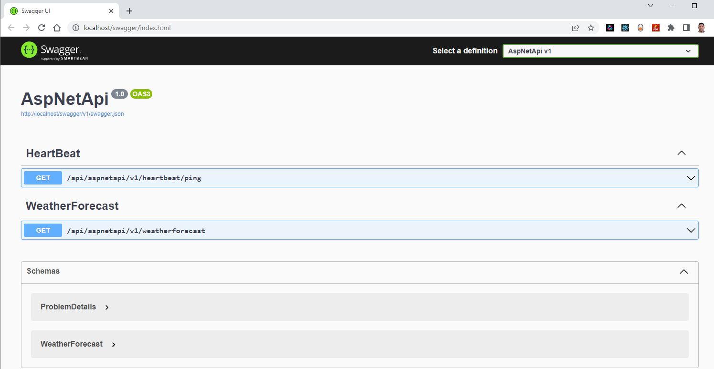
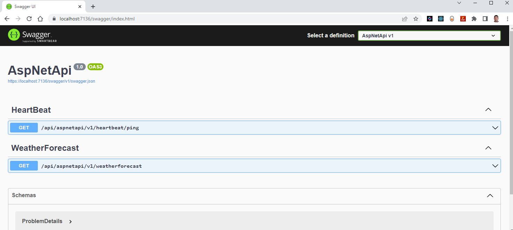

To deploying an application to Azure Kubernetes Service (AKS) involves several steps. Here's an overview of the process:


1. **Create an AKS cluster:** The first step is to create an AKS cluster on Azure if you haven't already. This can be done through the Azure portal or using Azure CLI or terraform. [Create Azure Kubernetes Service (AKS) using terraform](../azure/10-aks.md)

1. **Prepare an application for AKS deployment:** Next step is to prepare an application for AKS deployment, here you will create ACR and push the Docker container image to  Azure Container Registry (ACR). [Prepare an application for Azure Kubernetes Service (AKS)](1-prepare-app.md)

1. **Create a Kubernetes deployment manifest:** After the Docker image is available in the registry, you will need to create a Kubernetes deployment file that specifies the image, the number of replicas to run, and other settings. You can use the "kubectl create" command to create the deployment.

1. **Create a Kubernetes service manifest:** You will also need to create a Kubernetes service file that exposes your application to the cluster. A Kubernetes service manifest is a YAML file that describes how to expose your application to the outside world. The service manifest should include information such as the port that your application is listening on, and how the service should route traffic to your application.

1. **Apply the manifests to your AKS cluster:** Use the `kubectl` command-line tool to apply the deployment and service manifests to your AKS cluster.

1. **Expose the service externally:** By default, the Kubernetes service will only be accessible within the AKS cluster. To expose the service to the outside world, you'll need to create an Azure Load Balancer, which can be done through the Azure portal.

3. **Verify that the application is running:** Once the Load Balancer is created, you should be able to access your application by navigating to the public IP address of the Load Balancer in a web browser.

4. **Test the application:** Once the deployment and service are created, you can test the application by accessing it through the service's IP address or DNS name. You can use the "kubectl port-forward" command to test the application locally or use a load balancer to access the application from the internet.

By following these steps, you can deploy your application to Azure Kubernetes Service (AKS) and take advantage of the scalability and resiliency of the platform. You can also use Azure DevOps or other tools to automate the deployment process and simplify ongoing management of your application on AKS.


## Prerequisites 

- AKS cluster
- Azure Container Registry (ACR)
- Container Image
- Visual Studio Code

## Implementation details

Open the microservices project folder in Visual Studio code and creating new files for deploying application in Azure Kubernetes services (AKS)


**login to Azure**

Verify that you are logged into the right Azure subscription before start anything in visual studio code

``` sh
# Login to Azure
az login 

# Shows current Azure subscription
az account show

# Lists all available Azure subscriptions
az account list

# Sets Azure subscription to desired subscription using ID
az account set -s "anji.keesari"
```

**Connect to Cluster**
``` sh
# Azure Kubernetes Service Cluster User Role
az aks get-credentials -g "rg-aks-dev" -n "aks-cluster1-dev"

# Azure Kubernetes Service Cluster Admin Role
az aks get-credentials -g "rg-aks-dev" -n "aks-cluster1-dev" --admin

# get nodes
kubectl get no
kubectl get namespace -A
```

## Step-1: Create a new namespace

``` sh
kubectl create namespace sample 
```
## Step-1: Create a Kubernetes deployment manifest

``` yaml
apiVersion: apps/v1
kind: Deployment
metadata:
  name: aspnet-api
  namespace: sample
spec:
  replicas: 1
  selector: 
    matchLabels:
      app: aspnet-api
  strategy:
    type: RollingUpdate
    rollingUpdate:
      maxSurge: 1
      maxUnavailable: 1
  minReadySeconds: 5 
  template:
    metadata:
      labels:
        app: aspnet-api
    spec:
      nodeSelector:
        "kubernetes.io/os": linux
      serviceAccountName: default
      containers:
        - name: aspnet-api
          image: acr1dev.azurecr.io/sample/aspnet-api:20230226.1
          imagePullPolicy: Always
          ports:
            - name: http
              containerPort: 80
              protocol: TCP

# kubectl apply -f deployment.yaml -n sample
```

## Step-2: Create a Kubernetes service manifest

``` yaml
apiVersion: v1
kind: Service
metadata:
  name: aspnet-api
  namespace: sample
  labels: {}
spec:
  type: ClusterIP
  ports:
    - port: 80
      targetPort: 80
      protocol: TCP
      name: http
  selector: 
    app: aspnet-api

# kubectl apply -f service.yaml -n sample
```

## Step-3: Apply the manifests to your AKS cluster

``` sh
kubectl apply -f deployment.yaml -n sample
# deployment.apps/aspnet-api created

kubectl apply -f service.yaml -n sample
# service/aspnet-api created
```
get pods
```
kubectl get pods -n sample
```
output
```
NAME                          READY   STATUS    RESTARTS   AGE
aspnet-api-6b7d8fbf9f-mqtnd   1/1     Running   0          20m
```
get services
```
kubectl get svc -n sample 
```
output
```
NAME         TYPE        CLUSTER-IP   EXTERNAL-IP   PORT(S)   AGE
aspnet-api   ClusterIP   10.25.74.8   <none>        80/TCP    31m
```
## Step-4: Port forwarding

``` sh
kubectl port-forward svc/aspnet-api 80:80 -n sample
```
output
```
Forwarding from 127.0.0.1:80 -> 80
Forwarding from [::1]:80 -> 80
Handling connection for 80
Handling connection for 80
```


## Step-5: Expose the service externally

```

```
## Step-6: Verify that the application is running



That's it! Your application is now running in a container in your AKS cluster, and is accessible from the public internet.

## Reference
- <https://learn.microsoft.com/en-us/azure/aks/tutorial-kubernetes-deploy-application?tabs=azure-cli>