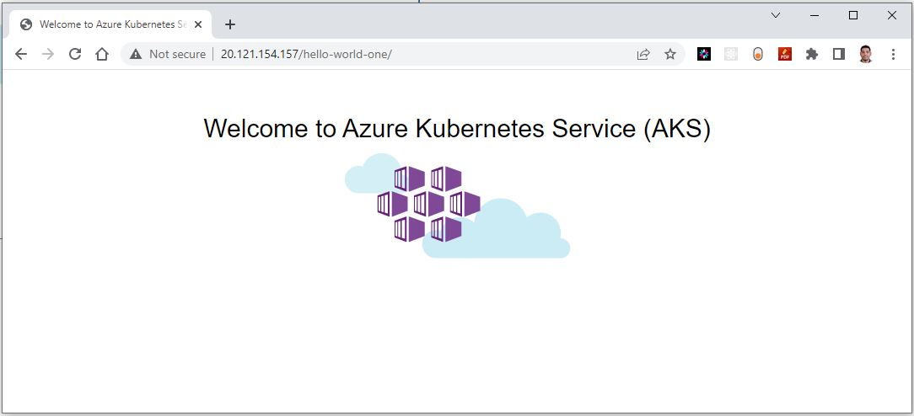

## Introduction

NGINX Ingress Controller is a type of ingress controller, it is a piece of software (configuration) that manages incoming traffic to a Kubernetes cluster. It works as a reverse proxy and load balancer, routing incoming traffic to the appropriate Kubernetes services based on the rules defined in the ingress resources. When you use an ingress controller and ingress rules, a single IP address can be used to route traffic to multiple services in a Kubernetes cluster.

Ingress resources are Kubernetes objects that define rules for routing incoming traffic to specific services. The NGINX Ingress Controller is responsible for reading and interpreting these rules and routing the traffic accordingly.

The NGINX Ingress Controller is a popular choice for Kubernetes users because it is lightweight, highly scalable, and provides advanced features like SSL termination, rate limiting, and WebSockets support.

## Technical Scenario

As a cloud engineer you've been asked to setup the NGINX ingress controller in an Azure Kubernetes Service (AKS) cluster. also deploy couple of applications in the AKS cluster, each of which is accessible over the single IP address.


**Install ingress-nginx controller helm chart using terraform**

Another requirement here is to make sure that installation of Nginx ingress controller in AKS is completely automated, to fulfill this requirement we are going to use terraform configuration to install the ingress-nginx controller in our AKS.

!!! Note
    There are two open source ingress controllers for Kubernetes based on Nginx: 
   
   - One is maintained by the Kubernetes community (kubernetes/ingress-nginx), 
   - Second one is maintained by NGINX, Inc. (nginxinc/kubernetes-ingress). 

Here we will be using the Kubernetes community ingress controller.

## Prerequisites

Ensure that you have a Kubernetes cluster up and running along with following:

- Azure subscription - <https://azure.microsoft.com/en-us/free/>
- Install and configure Terraform - <https://www.terraform.io/downloads>
- Define Terraform providers for Helm Install
    - helm provider
    - Kubernetes provider
    - Kubectl provider
- Install azure CLI - <https://learn.microsoft.com/en-us/cli/azure/install-azure-cli>
- Install and setup kubectl - <https://kubernetes.io/docs/tasks/tools/install-kubectl-windows/>
- Install Helm client
- AKS cluster


<!--
- Install cert-manager
- Create a CA cluster issuer
-->

## Implementation Details

In this exercise we will accomplish & learn how to implement following:

**Step 1.** Create a new namespace for Nginx ingress Controller

**Step 2:** Install ingress nginx controller using terraform 

**Step 3:** Verify ingress-nginx resources in AKS

**Step 4:** Deploy sample applications for Ingress testing

**Step 5:** Create an ingress route

**Step-6:** Test the ingress controller (Browse website URLs)

**Step-7:** Add DNS recordset in DNS Zone

**Step-8:** Create Ingress YAML file (Apply Let's Encrypt changes)


## Architecture diagram

<!--  -->
  

**login to Azure**

Verify that you are logged into the right Azure subscription before start anything in visual studio code

``` sh
# Login to Azure
az login 

# Shows current Azure subscription
az account show

# Lists all available Azure subscriptions
az account list

# Sets Azure subscription to desired subscription using ID
az account set -s "anji.keesari"
```

**Connect to Cluster**
``` sh
# Azure Kubernetes Service Cluster User Role
az aks get-credentials -g "rg-aks-dev" -n "aks-cluster1-dev"

# Azure Kubernetes Service Cluster Admin Role
az aks get-credentials -g "rg-aks-dev" -n "aks-cluster1-dev" --admin

# get nodes
kubectl get no
kubectl get namespace -A
```


## Step-1: Configure Terraform providers 

In order to install any Helmcharts using terraform configuration we need to have following terraform providers.

- helm provider
- Kubernetes provider
- Kubectl provider 

The Helm Provider allows you to manage your Helm charts and releases as part of your Terraform-managed infrastructure. With the Helm Provider, you can define your charts as Terraform resources and manage their installation and updates through Terraform.

With Terraform, you can manage the installation, upgrades, and deletion of your Helm charts in a repeatable, version-controlled manner. This can help simplify your infrastructure management, ensure consistency and repeatability, and reduce the chance of manual errors.

**terraform providers**

You can install the necessary providers by adding the following code in your Terraform configuration file:

Let's update our existing `provider.tf` file with new kubernetes, helm and kubectl providers:

``` tf title="provider.tf"
terraform {

  required_version = ">=0.12"

  required_providers {
    azurerm = {
      source  = "hashicorp/azurerm"
      version = "~>2.0"
    }

    azuread = {
      version = ">= 2.26.0" // https://github.com/terraform-providers/terraform-provider-azuread/releases
    }
     kubernetes = {
      source  = "hashicorp/kubernetes"
      version = ">= 2.0.3"
    }
    helm = {
      source  = "hashicorp/helm"
      version = ">= 2.1.0"
    }
    
     kubectl = {
      source  = "gavinbunney/kubectl"
      version = ">= 1.7.0"
    }
  }
}

provider "kubernetes" {
  host                   = azurerm_kubernetes_cluster.aks.kube_admin_config.0.host
  client_certificate     = base64decode(azurerm_kubernetes_cluster.aks.kube_admin_config.0.client_certificate)
  client_key             = base64decode(azurerm_kubernetes_cluster.aks.kube_admin_config.0.client_key)
  cluster_ca_certificate = base64decode(azurerm_kubernetes_cluster.aks.kube_admin_config.0.cluster_ca_certificate)
  #load_config_file       = false
}

provider "helm" {
  debug = true
  kubernetes {
    host                   = azurerm_kubernetes_cluster.aks.kube_admin_config.0.host
    client_certificate     = base64decode(azurerm_kubernetes_cluster.aks.kube_admin_config.0.client_certificate)
    client_key             = base64decode(azurerm_kubernetes_cluster.aks.kube_admin_config.0.client_key)
    cluster_ca_certificate = base64decode(azurerm_kubernetes_cluster.aks.kube_admin_config.0.cluster_ca_certificate)

  }
}
provider "kubectl" {
  host                   = azurerm_kubernetes_cluster.aks.kube_admin_config.0.host
  client_certificate     = base64decode(azurerm_kubernetes_cluster.aks.kube_admin_config.0.client_certificate)
  client_key             = base64decode(azurerm_kubernetes_cluster.aks.kube_admin_config.0.client_key)
  cluster_ca_certificate = base64decode(azurerm_kubernetes_cluster.aks.kube_admin_config.0.cluster_ca_certificate)
  load_config_file       = false
}
```

If you want to know more information about these provides, you can use following links for further reading.

**helm provider** 

more info -  <https://registry.terraform.io/providers/hashicorp/helm/latest/docs>

**Kubernetes provider**

more info -  <https://registry.terraform.io/providers/hashicorp/kubernetes/latest/docs>

**Kubectl provider** 

more info - <https://registry.terraform.io/providers/gavinbunney/kubectl/latest/docs>

**terraform init** 

Since we added new providers in the terraform providers list, it is necessary to run the terraform init once again.

``` sh
terraform init
```
output
``` sh
Initializing the backend...

Initializing provider plugins...
- Reusing previous version of hashicorp/azurerm from the dependency lock file
- Reusing previous version of hashicorp/azuread from the dependency lock file
- Finding hashicorp/kubernetes versions matching ">= 2.0.3"...
- Reusing previous version of hashicorp/random from the dependency lock file
- Finding hashicorp/helm versions matching ">= 2.1.0"...
- Finding gavinbunney/kubectl versions matching ">= 1.7.0"...
- Installing hashicorp/kubernetes v2.18.1...
- Installed hashicorp/kubernetes v2.18.1 (signed by HashiCorp)
- Using previously-installed hashicorp/random v3.4.3
- Installing hashicorp/helm v2.9.0...
- Installed hashicorp/helm v2.9.0 (signed by HashiCorp)
- Installing gavinbunney/kubectl v1.14.0...
- Installed gavinbunney/kubectl v1.14.0 (self-signed, key ID AD64217B5ADD572F)
- Using previously-installed hashicorp/azurerm v3.31.0
- Using previously-installed hashicorp/azuread v2.33.0


Terraform has been successfully initialized!

```
## Step-2: Create a new namespace for ingress

Create a separate namespace for nginx-ingress so that ingress specific AKS resources together in one single namespace and logically isolated from other Kubernetes resources. let's create a file called `nginx-ingress.tf` and copy following terraform configuration.

``` tf title="nginx-ingress.tf"
resource "kubernetes_namespace" "ingress" {  
  metadata {
    name = "ingress"
  }
}
```
run terraform validate & format

``` sh
terraform validate
terraform fmt
```

run terraform plan

``` sh
terraform plan -out=dev-plan -var-file="./environments/dev-variables.tfvars"
```
output

``` sh
 + create

Terraform will perform the following actions:

  # kubernetes_namespace.ingress will be created
  + resource "kubernetes_namespace" "ingress" {
      + id = (known after apply)
      + metadata {
          + generation       = (known after apply)
          + name             = "ingress"
          + resource_version = (known after apply)
          + uid              = (known after apply)
        }
    }

Plan: 1 to add, 0 to change, 0 to destroy.
```
run terraform apply
```
terraform apply dev-plan
```
``` sh
Apply complete! Resources: 1 added, 0 changed, 0 destroyed.

Outputs:
```

## Step-2: Install ingress resources with helm-chart using terraform

Now it is time to install ingress helm chart in AKS cluster.

We are going to get the ingress helm chart details from official Nginx ingress ArtifactHUB website.

<https://artifacthub.io/packages/helm/ingress-nginx/ingress-nginx> - click on Install button and get following helm-chart details

``` sh
repository = "https://kubernetes.github.io/ingress-nginx"
chart      = "ingress-nginx"
version    = "4.5.2"
```

we are going to use the `helm_release` terraform resource to install the Helm Chart:

``` tf title="nginx-ingress.tf"
# Install ingress helm chart using terraform
resource "helm_release" "ingress" {
  name       = "ingress"
  repository = "https://kubernetes.github.io/ingress-nginx"
  chart      = "ingress-nginx"
  version    = "4.5.2"
  namespace  = kubernetes_namespace.ingress.metadata.0.name
  depends_on = [
    kubernetes_namespace.ingress
  ]
}
```

Let's run terraform plan

```
terraform plan -out=dev-plan -var-file="./environments/dev-variables.tfvars"
```
output
``` sh
# helm_release.ingress will be created
  + resource "helm_release" "ingress" {
      + atomic                     = false
      + chart                      = "ingress-nginx"
      + cleanup_on_fail            = false
      + create_namespace           = false
      + dependency_update          = false
      + disable_crd_hooks          = false
      + disable_openapi_validation = false
      + disable_webhooks           = false
      + force_update               = false
      + id                         = (known after apply)
      + lint                       = false
      + manifest                   = (known after apply)
      + max_history                = 0
      + metadata                   = (known after apply)
      + name                       = "ingress"
      + namespace                  = "ingress"
      + pass_credentials           = false
      + recreate_pods              = false
      + render_subchart_notes      = true
      + replace                    = false
      + repository                 = "https://kubernetes.github.io/ingress-nginx"
      + reset_values               = false
      + reuse_values               = false
      + skip_crds                  = false
      + status                     = "deployed"
      + timeout                    = 300
      + verify                     = false
      + version                    = "4.5.2"
      + wait                       = true
      + wait_for_jobs              = false
    }

Plan: 1 to add, 0 to change, 0 to destroy.
```

run terraform apply

```
terraform apply dev-plan
```
``` sh
helm_release.ingress: Creating...
helm_release.ingress: Still creating... [10s elapsed]
helm_release.ingress: Still creating... [20s elapsed]
helm_release.ingress: Still creating... [30s elapsed]
helm_release.ingress: Still creating... [40s elapsed]
helm_release.ingress: Still creating... [50s elapsed]
helm_release.ingress: Still creating... [1m0s elapsed]
helm_release.ingress: Creation complete after 1m7s [id=ingress]

Apply complete! Resources: 1 added, 0 changed, 0 destroyed.

Outputs:
```

## Step 3. Verify Ingress-Nginx resources in AKS.

Step-2 terraform output shows that helm chart installation is successful therefore in this step we can validate Ingress-Nginx installation by running following commands.

**Connect to AKS cluster**

``` sh
# azure CLI
az aks get-credentials --resource-group <resource-group-name> --name <aks-cluster-name>

# Azure Kubernetes Service Cluster User Role
az aks get-credentials -g "rg-aks-dev" -n "aks-cluster1-dev"

# Azure Kubernetes Service Cluster Admin Role
az aks get-credentials -g "rg-aks-dev" -n "aks-cluster1-dev" --admin
```

Get pods and services related to ingress.

``` sh
kubectl get namespace ingress

kubectl get deployments -n ingress

kubectl get pods -n ingress

kubectl get services -n ingress

kubectl get configmaps -n ingress

kubectl get secrets -n ingress
```

Get all resources related to ingress.

```
kubectl get all -n ingress
```
```
NAME                                                   READY   STATUS    RESTARTS   AGE
pod/ingress-ingress-nginx-controller-f9c49b469-rjdlw   1/1     Running   0          4m32s

NAME                                                 TYPE           CLUSTER-IP      EXTERNAL-IP      PORT(S)                      AGE
service/ingress-ingress-nginx-controller             LoadBalancer   10.25.221.77    20.121.154.157   80:30515/TCP,443:31485/TCP   4m33s
service/ingress-ingress-nginx-controller-admission   ClusterIP      10.25.113.145   <none>           443/TCP                      4m33s

NAME                                               READY   UP-TO-DATE   AVAILABLE   AGE
deployment.apps/ingress-ingress-nginx-controller   1/1     1            1           4m32s

NAME                                                         DESIRED   CURRENT   READY   AGE
replicaset.apps/ingress-ingress-nginx-controller-f9c49b469   1         1         1       4m32s
```

configmaps details
```
kubectl get configmaps -n ingress
```

```
NAME                               DATA   AGE
ingress-ingress-nginx-controller   1      18m
kube-root-ca.crt                   1      18m
```

Ingress secrets 

```
kubectl get secrets -n ingress
```
```
NAME                                TYPE                                  DATA   AGE
default-token-p2kjg                 kubernetes.io/service-account-token   3      19m
ingress-ingress-nginx-admission     Opaque                                3      19m
ingress-ingress-nginx-token-vnpw8   kubernetes.io/service-account-token   3      19m
sh.helm.release.v1.ingress.v1       helm.sh/release.v1                    1      19m
```

```
kubectl get ingress -n ingress
```

output

```
No resources found in argocd namespace.
```

CRDs

``` sh
kubectl get clusterrole -n ingress
kubectl get clusterrolebinding -n ingress
kubectl get CustomResourceDefinition -n ingress
```

outputs from above commands shows that Nginx ingress controller is installed correctly in our AKS cluster and ready to use by deploying a application in AKS.
## Step 4: Deploy sample applications for Ingress testing

Since we confirmed that Nginx ingress controller is successfully install in our AKS, we can now deploy few Microservices which we built in Microservices chapter and test the Ingress controller to make sure it is routing the request to our backend AKS cluster services. 

for now I am going to use sample demo applications from MSDN document and test the ingress controller.

reference - <https://learn.microsoft.com/en-us/azure/aks/ingress-basic?tabs=azure-powershell> 


Create an `aks-helloworld-one.yaml` file and copy in the following example YAML:

``` yaml title="aks-helloworld-one.yaml"
apiVersion: apps/v1
kind: Deployment
metadata:
  name: aks-helloworld-one
  namespace: sample  
spec:
  replicas: 1
  selector:
    matchLabels:
      app: aks-helloworld-one
  template:
    metadata:
      labels:
        app: aks-helloworld-one
    spec:
      containers:
      - name: aks-helloworld-one
        image: mcr.microsoft.com/azuredocs/aks-helloworld:v1
        ports:
        - containerPort: 80
        env:
        - name: TITLE
          value: "Welcome to Azure Kubernetes Service (AKS)"
---
apiVersion: v1
kind: Service
metadata:
  name: aks-helloworld-one  
spec:
  type: ClusterIP
  ports:
  - port: 80
  selector:
    app: aks-helloworld-one

# kubectl apply -f aks-helloworld-one.yaml -n sample
```
Create an `aks-helloworld-two.yaml` file and copy in the following example YAML:

``` yaml title="service.yaml"
apiVersion: apps/v1
kind: Deployment
metadata:
  name: aks-helloworld-two
  namespace: sample
spec:
  replicas: 1
  selector:
    matchLabels:
      app: aks-helloworld-two
  template:
    metadata:
      labels:
        app: aks-helloworld-two
    spec:
      containers:
      - name: aks-helloworld-two
        image: mcr.microsoft.com/azuredocs/aks-helloworld:v1
        ports:
        - containerPort: 80
        env:
        - name: TITLE
          value: "AKS Ingress Demo"
---
apiVersion: v1
kind: Service
metadata:
  name: aks-helloworld-two  
spec:
  type: ClusterIP
  ports:
  - port: 80
  selector:
    app: aks-helloworld-two

# kubectl apply -f aks-helloworld-two.yaml -n sample
```

Run the two demo applications using kubectl apply:

```
kubectl apply -f aks-helloworld-one.yaml -n sample
kubectl apply -f aks-helloworld-two.yaml -n sample
```

Verify both applications are now running on your Kubernetes cluster. 

```
kubectl get pods -n sample
```
output
```
NAME                                  READY   STATUS    RESTARTS   AGE
aks-helloworld-one-6965865b8b-dk6w9   1/1     Running   0          8h
aks-helloworld-two-66c5cf894b-vmztv   1/1     Running   0          7h57m
aspnet-api-6b7d8fbf9f-wf2qb           1/1     Running   0          11h
```

## Step-5: Create an ingress route

Create a new file named `ingress-no-ssl.yaml` and copy in the following YAML.

``` yaml title="ingress-no-ssl.yaml"
apiVersion: networking.k8s.io/v1
kind: Ingress
metadata:
  name: hello-world-ingress
  namespace: sample
  annotations:
    nginx.ingress.kubernetes.io/ssl-redirect: "false"
    nginx.ingress.kubernetes.io/use-regex: "true"
    nginx.ingress.kubernetes.io/rewrite-target: /$2
spec:
  ingressClassName: nginx
  rules:
  - http:
      paths:
      - path: /hello-world-one(/|$)(.*)
        pathType: Prefix
        backend:
          service:
            name: aks-helloworld-one
            port:
              number: 80
      - path: /hello-world-two(/|$)(.*)
        pathType: Prefix
        backend:
          service:
            name: aks-helloworld-two
            port:
              number: 80
      - path: /(.*)
        pathType: Prefix
        backend:
          service:
            name: aks-helloworld-one
            port:
              number: 80
---
apiVersion: networking.k8s.io/v1
kind: Ingress
metadata:
  name: hello-world-ingress-static
  annotations:
    nginx.ingress.kubernetes.io/ssl-redirect: "false"
    nginx.ingress.kubernetes.io/rewrite-target: /static/$2
spec:
  ingressClassName: nginx
  rules:
  - http:
      paths:
      - path: /static(/|$)(.*)
        pathType: Prefix
        backend:
          service:
            name: aks-helloworld-one
            port: 
              number: 80
# kubectl apply -f ingress-no-ssl.yaml -n sample
```
kubectl apply

``` sh
kubectl apply -f ingress-no-ssl.yaml -n sample
ingress.networking.k8s.io/hello-world-ingress unchanged
ingress.networking.k8s.io/hello-world-ingress-static unchanged
```

Get Ingress 

```
kubectl get ingress -n sample
```
```
NAME                         CLASS   HOSTS   ADDRESS          PORTS   AGE
hello-world-ingress          nginx   *       20.121.154.157   80      7h59m
hello-world-ingress-static   nginx   *       20.121.154.157   80      7h58m
```
!!! Note
    Verify same static IP (20.121.154.157) address assigned to both applications here.


## Step-6: Test the ingress controller

To test the routes for the ingress controller, browse two applications with path prefix mentioned in the ingress.

for example 

hello-world-one app

<http://20.121.154.157/> or

<http://20.121.154.157/hello-world-one/>



hello-world-twp app

<http://20.121.154.157/hello-world-two/>


## Step-7: Add DNS Recordset in DNS Zone

There are two types of DNS zones in Azure:

- **Public DNS Zones:** These DNS zones are publicly accessible on the internet and can be used to map domain names to IP addresses. You can use public DNS zones to host your website publicly accessible.

- **Private DNS Zones:** These DNS zones are not publicly accessible on the internet and are used to map domain names to private IP addresses within your virtual network. You can use private DNS zones to enable DNS name resolution between resources in your virtual network.

If you want to browse the URL with your custom domain instead of IP address like above you need create A recordset in one of the DNS zones depending on how you want to access your URL. 

An A record (Address Record) maps a domain name to an IPv4 address. Here we will map A record in DNS Zone.

You can create A recordset in DNS zone using the Azure portal, Azure CLI, or Azure PowerShell. 

To create A record set in a DNS zone in Azure portal, follow these steps:

- Sign in to the Azure portal (https://portal.azure.com).
- In the left-hand menu, click on "All services" and type "DNS zones" in the search box. Click on "DNS zones" when it appears in the results.
- Select the DNS zone in which you want to create the record set.
- Click on the "Record set" button at the top of the page.
- In the "Add record set" blade, enter the following information:
    - Name: The name of the record set
    - Type: The type of DNS record you want to create, such as A, AAAA, CNAME, MX, NS, PTR, SRV, or TXT.
    - TTL: The time-to-live value for the DNS record, in seconds.
    - IP address : The value or values associated with the DNS record, such as an IP address for an A record
- Click the "Add" button to create the record set.

Once the record set is created, it may take a few minutes for the changes to propagate across the internet. You can view and manage your DNS record sets in the Azure portal or by using Azure CLI or PowerShell commands.

<!-- **Install cert-manager**

This step is already completed in previous lab.

**Create a CA cluster issuer**

This step is already completed in previous lab.

## Step-8: Create Ingress YAML file (Apply Let's Encrypt changes)
 -->


Reference:

**Implementation**

- <https://artifacthub.io/packages/helm/ingress-nginx/ingress-nginx> - get helm chart details from here
- <https://learn.microsoft.com/en-us/azure/aks/ingress-basic?tabs=azure-powershell> - get the sample application from here
- <https://kubernetes.github.io/ingress-nginx/> - NGINX Ingress Controller official documentation
- <https://kubernetes.github.io/ingress-nginx/deploy/#azure> Installation Guide

<!-- 

**cert-manager**
- https://learn.microsoft.com/en-us/azure/aks/ingress-tls?tabs=azure-powershell - Install cert-manager
- https://cert-manager.io/docs/tutorials/acme/nginx-ingress/ - Securing NGINX-ingress
- https://cert-manager.io/docs/troubleshooting/
- https://cert-manager.io/docs/ - about cert-manager
- https://cert-manager.io/docs/installation/ -Installation
- https://cert-manager.io/docs/installation/helm/ Installation with Helm
- https://cert-manager.io/docs/tutorials/getting-started-aks-letsencrypt/ - Deploy cert-manager on AKS 

- <https://medium.com/devops-mojo/kubernetes-ingress-overview-what-is-kubernetes-ingress-introduction-to-k8s-ingress-b0f81525ffe2> Kubernetes — Ingress Overview 
- 
- -->