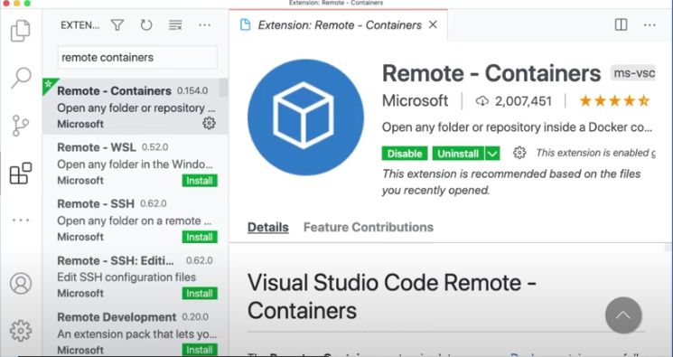

## Overview

In the ever-changing world of software development, maintaining consistent and simple development environments is essential. This practice facilitates smooth collaboration within teams and ensures efficient coding. This is where Dev Containers come into play, transforming traditional development setups into a containerized development environment.

In this article, we will explore the fundamentals of Dev Containers. We'll delve into what they are, why the .devcontainer folder is crucial, how Dev Containers work, and ultimately, we'll learn how to develop applications inside a Dev Container.

## What is Dev Containers?

`Development containers`, or `dev containers` also known as `Remote Container`, are Docker containers that are specifically configured to provide a fully featured development environment. This enables consistent and reproducible development environments across different machines.

Using Dev Containers can significantly enhance the development experience by eliminating the setup overhead, ensuring consistency, and simplifying collaboration across teams. It aligns well with modern development practices, especially in scenarios where teams are distributed, and projects may have diverse dependencies and requirements.

## What is `.devcontainer` folder ?

The `.devcontainer` folder is a special directory in a project that is often used with the Visual Studio Code (VS Code) Dev Containers extension. This folder contains configuration files that define how the development container should be set up when a developer opens the project in VS Code. The configuration details include settings for the container image, runtime, extensions, environment variables, and more.

The purpose of the `.devcontainer` folder is to encapsulate the development environment configuration as code. This enables developers to define and version their development environment settings alongside the project code. When someone opens the project in VS Code, the Dev Containers extension reads the configuration in the .devcontainer folder and automatically configures the development container accordingly.

`.devcontainer` folder typically include:

1. **devcontainer.json:**

    The primary configuration file is `devcontainer.json.` This JSON file outlines the settings for the development container, specifying the Docker image, runtime, environment variables, user settings, and VS Code extensions to be installed.

2. **Dockerfile:**

    Optionally, you may include a Dockerfile in the .devcontainer folder if you need to customize the base Docker image further. This file is used to build the image when the container is created.

3. **docker-compose.yml** (Optional):

    If your project requires additional services or multiple containers, you can include a docker-compose.yml file to define the multi-container configuration.


## How Dev Containers works?

Dev Containers, often associated with Visual Studio Code's `Remote - Containers extension`, works by enabling developers to create and use containerized development environments. These environments are defined within a container and provide a consistent, reproducible setup for coding, building, and running applications. 


Here's a step-by-step explanation of how Dev Containers work:


1. **Project Configuration:**
   
    Developers create a special folder in their project named as `.devcontainer`. Inside this folder, configuration files are added to define the development environment.

2. **Configuration Files:**
   
    The primary configuration file is `devcontainer.json`. This JSON file specifies details about the development container, such as the Docker image to use, runtime settings, environment variables, and Visual Studio Code settings.

3. **Optional Dockerfile:**
   
    Optionally, a `Dockerfile` can be included in the `.devcontainer` folder. This file allows developers to customize the base Docker image further. It is used to build the container image when the development environment is created.

4. **Opening the Project in Visual Studio Code:**
    Developers open the project in Visual Studio Code, and the presence of the `.devcontainer` folder is detected by the "Remote - Containers" extension.

5. **Extension Activation:**
    The "Remote - Containers" extension automatically recognizes the project as a Dev Container project and suggests reopening it in a containerized environment.

6. **Container Creation:**
    When developers choose to reopen the project in a container, Visual Studio Code uses the information from the `devcontainer.json` file to create a Docker container that encapsulates the development environment.

7. **Mounting Project Files:**
    Project files are mounted from the local file system into the container, allowing developers to work with their source code seamlessly.

8. **Extensions Installation:**
    Visual Studio Code extensions specified in `devcontainer.json` are installed and run inside the container. This ensures that developers have the necessary tools and extensions for their development tasks.

9. **Running and Debugging:**
    Developers can run and debug their applications within the container. This allows them to test and iterate in an environment that mirrors production closely.


## Benefits of developing applications inside a Dev Container


Setup local development environment that leverages containerization through Microsoft's DevContainer mechanism allows developers to create and run their development environments within containers, providing a consistent and reproducible setup for coding, testing, and debugging. 

Here are some key benefits of a local development setup using Microsoft's DevContainer:


1. **Container-Based Development:**

    Developers use containers to encapsulate their development environments, ensuring consistency and reproducibility across different machines.

3. **Run Services and Databases together:**

    All the necessary services, databases, and supporting components for the application are containerized. This includes running databases like PostgreSQL, MySQL, or services like Redis or RabbitMQ in separate containers.

4. **Consistent Development Environments:**

    Developers benefit from a consistent development environment, minimizing the "it works on my machine" problem. Everyone working on the project uses the same containerized setup.

5. **Isolation and Portability:**

    Containerization provides isolation for services and dependencies, preventing conflicts between different projects. It also ensures portability, allowing developers to easily share their container configurations.

6. **Ease of Onboarding:**

    New developers can quickly get started by cloning the repository and using the predefined Dev Container configuration. This streamlines the onboarding process, as developers don't need to spend time setting up dependencies manually.

7. **Integrated Development Environment (IDE) Support:**

    Integrated Development Environments (IDEs) like Visual Studio Code support the "Remote - Containers" extension, allowing developers to seamlessly work with containerized environments.

8. **Version Control for Development Environments::**

    The `devcontainer.json` file, along with other configuration files like Dockerfiles, can be version controlled. This allows teams to track changes to the development environment settings and ensures a versioned and documented setup.

9. **Local Testing and Debugging:**

    Developers can locally test and debug their applications within the containerized environment. This includes running and debugging services, APIs, and other components.

10. **Facilitates Microservices Development:**

    Container-based development aligns well with microservices architecture. Each microservice can have its own containerized development environment, simplifying the overall development process for microservices-based applications.

11. **Docker Compose Integration:**

    Docker Compose may be utilized to define and manage multi-container environments locally. It simplifies the orchestration of multiple containers needed for the complete development setup.

## Local development environment setup with Dev Container

 In this guide, I'll walk through the step-by-step process of setting up a local development environment using Dev Containers.

## Prerequisites

Before we begin, make sure you have the following prerequisites installed on your machine:

- [Visual Studio Code](https://code.visualstudio.com/download){:target='_blank'}
- A Project in Azure DevOps [optional]
- Git client tool [optional]

## Step 1: Install Docker

**Windows:**

Download Docker Desktop:

   - Visit the [Docker Desktop for Windows](https://www.docker.com/products/docker-desktop){:target='_blank'} page.
   - Click on the "Download for Windows" button.
   - Follow the on-screen instructions to download the installer.

Install Docker Desktop:

   - Run the installer that you downloaded.
   - Follow the installation wizard, accepting the default options.
   - The installer may require you to restart your computer.

Enable Hyper-V (Windows 10 Pro/Enterprise):

   - If you're running Windows 10 Pro or Enterprise, Docker Desktop will use Hyper-V for virtualization. Ensure that Hyper-V is enabled in the Windows Features.

Start Docker Desktop:

   - Once installed, start Docker Desktop from the Start Menu.
   - The Docker icon will appear in the system tray when Docker Desktop is running.

**macOS:**

Download Docker Desktop:

   - Visit the [Docker Desktop for Mac](https://www.docker.com/products/docker-desktop){:target='_blank'} page.
   - Click on the "Download for Mac" button.
   - Follow the on-screen instructions to download the installer.

Install Docker Desktop:

   - Run the installer that you downloaded.
   - Drag the Docker icon to the Applications folder.
   - Launch Docker from Applications.

Start Docker Desktop:

   - Once installed, Docker Desktop should start automatically.
   - The Docker icon will appear in the menu bar when Docker Desktop is running.

**Verify Docker install:**

To verify that Docker is installed correctly, open a terminal and run the following command:

```bash
docker --version

# or
docker version
```

If you notice this, it indicates that your Docker is not in a running status.

```sh
error during connect: this error may indicate that the docker daemon is not running: Get "http://%2F%2F.%2Fpipe%2Fdocker_engine/v1.24/version": open //./pipe/docker_engine: The system cannot find the file specified.
Client:
 Cloud integration: v1.0.35
 Version:           24.0.2
 API version:       1.43
 Go version:        go1.20.4
 Git commit:        cb74dfc
 Built:             Thu May 25 21:53:15 2023
 OS/Arch:           windows/amd64
 Context:           default
```

After Docker desktop is started and if everything is set up correctly, you should see following message indicating that your Docker installation is working.

```sh
Client:
 Cloud integration: v1.0.35 
 Version:           24.0.2  
 API version:       1.43    
 Go version:        go1.20.4
 Git commit:        cb74dfc
 Built:             Thu May 25 21:53:15 2023
 OS/Arch:           windows/amd64
 Context:           default

Server: Docker Desktop 4.21.1 (114176)
 Engine:
  Version:          24.0.2
  API version:      1.43 (minimum version 1.12)
  Go version:       go1.20.4
  Git commit:       659604f
  Built:            Thu May 25 21:52:17 2023
  OS/Arch:          linux/amd64
  Experimental:     false
 containerd:
  Version:          1.6.21
  GitCommit:        3dce8eb055cbb6872793272b4f20ed16117344f8
 runc:
  Version:          1.1.7
  GitCommit:        v1.1.7-0-g860f061
 docker-init:
  Version:          0.19.0
  GitCommit:        de40ad0
```


Docker is now installed on your machine, and you can start using it to containerize your applications.

## Step 2: Install the remote - containers extension

Open Visual Studio Code and navigate to the Extensions view by clicking on the Extensions icon in the Activity Bar on the side of the window (or press `Ctrl+Shift+X`). Search for "Remote - Containers" and install the extension provided by Microsoft.

[](images/image-1.png){:target="_blank"}

## Step 3: Create a new project or open an existing one

Create a new project or open an existing one in Visual Studio Code.

## Step 4: Add Dev Container configuration to a project

In the root of your project, create a folder named `.devcontainer` if it doesn't already exist. Inside this folder, create a file named `devcontainer.json`. This file will contain the configuration for your Dev Container.

Here is a basic example for a Node.js project:

```json
// .devcontainer/devcontainer.json
{
  "name": "Node.js Dev Container",
  "image": "node:14",
  "extensions": ["dbaeumer.vscode-eslint"],
  "forwardPorts": [3000],
  "settings": {
    "terminal.integrated.shell.linux": "/bin/bash"
  }
}
```

Adjust the configuration according to your project's requirements and dependencies.

## Step 5: Running a project in a dev container

Reopen a project in a container


When you choose to "Reopen in Container" in Visual Studio Code, it triggers the Remote - Containers extension to rebuild and reopen your project within a containerized environment. 

Open the Command Palette (`Ctrl+Shift+P`), type "Reopen in Container," and select the option to rebuild the project inside the Dev Container.


## Step 6: Verify the Setup

Once the container is built and the project is reopened, verify that your development environment is running smoothly inside the Dev Container.

Now that your local development environment is containerized, you can start coding with the confidence that everyone on your team will have a consistent setup.


## Sample `docker-compose.yml` 

Here is an example of a Docker Compose file defining a multi-container application with three services. The application consists of ASP.NET Core API services that depend on a SQL Server database. Docker Compose is utilized to orchestrate the deployment of these three containers.


```yaml
version: '3'

services:
  aspnet-api:
    build:
      context: ../aspnet-api
      dockerfile: ../aspnet-api/Dockerfile
      args:
        - ARG1=value1
        - ARG2=value2
    container_name: aspnet-api-container
    ports:
      - "80:80"
    networks:
      - default
    environment:
      ASPNETCORE_ENVIRONMENT: Production
      API_VERSION: v1
    depends_on:
      - sqlserver-db

  aspnet-app:
    build:
      context: ../aspnet-app
      dockerfile: ../aspnet-app/Dockerfile
      args:
        - ARG1=value3
        - ARG2=value4
    container_name: aspnet-app-container
    ports:
      - "5000:5000"
    networks:
      - default
    environment:
      ASPNETCORE_ENVIRONMENT: Development
      APP_NAME: MyApp
    depends_on:
      - sqlserver-db

  sqlserver-db:
    build:
      context: ../sqlserver-db
      dockerfile: ../sqlserver-db/Dockerfile
    container_name: sqlserver-db-container
    environment:
      SA_PASSWORD: YourStrongPassword
    ports:
      - "1433:1433"
    networks:
      - default
    command: sh -c "sleep 20 && /opt/mssql-tools/bin/sqlcmd -S localhost -U SA -P YourStrongPassword -Q 'CREATE DATABASE YourDatabase'"

```


- The `docker-compose.yml` file describes a multi-container application with three services: `aspnet-api`, `aspnet-app`, and `sqlserver-db`.
- `aspnet-api` and `aspnet-app` are ASP.NET Core applications, each with its own Dockerfile and build arguments.
- `sqlserver-db` is a SQL Server container with a specific command to initialize a database after starting.
- Services are connected to the default network for communication.
- Dependencies are specified using the `depends_on` key, ensuring that services wait for others to start before launching.

## docker-compose commands

Below are some commonly used Docker Compose commands:

**Starts services**

```bash
docker-compose up
```

Starts the services defined in your `docker-compose.yml` file. It creates and starts containers as specified in the configuration.


```bash
docker-compose up -d
```

Starts the services in the background (detached mode).

**Stops services**

```bash
docker-compose down
```
Stops and removes containers, networks, volumes, and other services defined in your `docker-compose.yml` file.


```bash
docker-compose down -v
```
Stops and removes containers, networks, volumes, and other services while also removing volumes.
    

```bash
docker-compose down --volumes --rmi all
```
Stops and removes containers, networks, volumes, and other services, while also removing volumes and images.    

```bash
docker-compose stop
```

Stops the services defined in your `docker-compose.yml` file without removing them.

**Lists the containers**

```bash
docker-compose ps
```

Lists the containers that are part of your Docker Compose setup, showing their status.
    
```bash
docker-compose ps -a
```
Lists all containers, including stopped ones, that are part of your Docker Compose setup.

**Displays log**

```bash
docker-compose logs
```
Displays log output from services. You can use the `-f` option to follow the logs in real-time.

```bash
docker-compose logs webserver
```

Displays logs for a specific service.

**Executes a command**

```bash
docker-compose exec webserver ls -l
```
Executes a command in a running service container.

**Builds services**

```bash
docker-compose build
```
Builds or rebuilds services defined in your `docker-compose.yml` file.


**Restarts services**

```bash
docker-compose restart
```
Restarts services.


**Displays configuration**

```bash
docker-compose config
```
Validates and displays the configuration of your `docker-compose.yml` file.

**Pauses services**

```bash
docker-compose pause
```
Pauses all services. Containers remain running, but they stop processing requests.

```bash
docker-compose unpause
```
Unpauses services after they have been paused.

```bash
docker-compose top
```
Displays the running processes of a service.

**Scales service**

```bash
docker-compose scale webserver=3
```
Scales a service to the specified number of instances.

**Display events**

```bash
docker-compose events
```
Streams real-time events from your services.


For more comprehensive details on Docker commands, please refer to the [Docker Commands Cheat Sheet](https://anjikeesari.com/developertools/cheatsheets/docker-cheat-sheet/){:target='_blank'} on our website.

## References

- [Development Containers](https://containers.dev/){:target="_blank"}
- [Use a Docker container](https://learn.microsoft.com/en-us/training/modules/use-docker-container-dev-env-vs-code/){:target="_blank"}
- [Beginner's Series to: Dev Containers](https://www.youtube.com/watch?v=61M2takIKl8){:target="_blank"}
