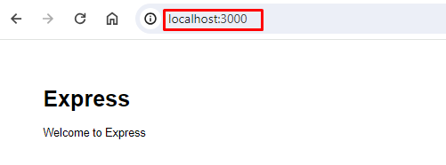

#  Create Your Second Microservice with Node.js

## Introduction

Welcome to the second lab in our Microservices chapter. In this session, I will guide you through the creation of a simple RESTful service using the Node.js `npx express-generator` project template.

This lab aims to illustrate the process of building a RESTful service and generating a Docker container using a Dockerfile. By following this example, you will gain a solid understanding of the fundamentals involved in creating RESTful APIs with Node.js.

## Technical Scenario

As a `Backend (BE)` developer, you have been tasked with creating a RESTful service using Node JS, which is one of the services on our microservices list. This lab will serve as your introduction to the Microservices Architecture, starting with the basics of setting up a repository, creating a small API project, and ultimately containerizing the microservice you build. The containerized microservice will then be pushed to the Azure Container Registry (ACR).

The primary objective of this lab is to prepare an application for deployment on Kubernetes. The microservices you create in this lab will be utilized in subsequent labs, such as the creation of DevOps pipelines or the deployment to Azure Kubernetes Services (AKS). By completing this lab, you will gain a foundational understanding of how microservices can be developed, containerized, and integrated into a Kubernetes environment.

## Objective

In this exercise, our objective is to accomplish and learn the following tasks:

- **Step-1:** Setup repository in Azure DevOps.
- **Step-2:** Create a new Node.js API project.
- **Step-3:** Test Node.js API project.
- **Step-4:** Add Dockerfiles to the project.
- **Step-5:** Docker build locally.
- **Step-5:** Docker run locally.
- **Step-7:** Publish the Docker container to ACR.

## Prerequisites

Before starting this lab, ensure you have the following prerequisites in place:

- Node.js and npm:  - [Node.js Downloads](https://nodejs.org/en/download/){:target="_blank"}.
- Docker and the VS Code Docker extension :  - [Docker Downloads](https://docs.docker.com/get-docker/){:target="_blank"}.
- Git Client tool:  - [Git Downloads](https://git-scm.com/downloads){:target="_blank"}.
- A project in Azure DevOps and Git Repository: Initialize a Git repository for your Node.js application.
- Azure Container Registry (ACR)

## Architecture Diagram

The following diagram shows the high level steps to create the Rest API using Node JS.

[](images/image-10.png){:target="_blank"}

## Step-1: Setup repository in Azure DevOps.

For this project, you can either leverage an existing Git repository created in our first chapter or initiate a new one.

To clone an existing repository, execute the following command:

```sh
git clone https://keesari.visualstudio.com/Microservices/_git/microservices
```

## Step-2: Create a new `Node JS` API project

In this step, we will set up a new Node.js API project using a basic Express application as our example. To expedite the process, we'll utilize Express's scaffolding tool to generate the necessary directory structure and essential files.


Open your terminal and execute the following commands:

```sh
$ npx express-generator --no-view src
$ cd src
$ npm install
```

npx express-generator:

The npx express-generator command initializes the project, creating a structure that includes directories like 'bin' and 'routes'.

[](images/image-3.png){:target="_blank"}

npm install:

Ensure you run npm install to set up and configure all required Node.js modules.

This step ensures that your project is equipped with the necessary dependencies, allowing seamless integration with Docker and efficient containerization of your Node.js application.

[](images/image-4.png){:target="_blank"}

folder structure

you've established the foundation for your Node.js API project, complete with a standardized directory structure and essential files.

[](images/image-5.png){:target="_blank"}

This should have created a number of files in your directory, including bin and routes directories. Make sure to run npm install so that npm can get all of your Node.js modules set up and ready to use.

## Step-3: Test the Node JS API project

Now, let's verify that our Node.js API project is functioning correctly. We'll initiate the application for the first time, utilizing the default routes defined in `app.js`.

Ensure you are in the project directory, and in your terminal, execute the following command to start the application:
```sh
npm start
```

This command launches the Node.js application, making it accessible locally.

Open your web browser and navigate to [http://localhost:3000](http://localhost:3000){:target="_blank"}

[](images/image-2.png){:target="_blank"}


You confirm that your Node.js API project is up and running on your local environment. This preliminary test ensures the initial functionality of your application before proceeding with additional configurations or containerization.

## Step-4: Add Dockerfiles to the MVC project

To seamlessly containerize our Node.js API project, let's create a Dockerfile in the root directory of your project and incorporate the following code. The Dockerfile provides instructions for building a container image of our Node.js API.

``` Dockerfile
# Use the official Node.js image from Docker Hub with a specific version
FROM node:18.16.0-alpine3.17

# Create a directory for the application in the container
RUN mkdir -p /opt/app

# Set the working directory inside the container to /opt/app
WORKDIR /opt/app

# Copy package.json and package-lock.json to the container's working directory
COPY src/package.json src/package-lock.json .

# Install Node.js dependencies based on the package.json and package-lock.json
RUN npm install

# Copy the entire contents of the 'src' directory to the container's working directory
COPY src/ .

# Expose port 3000 to allow external access to the application
EXPOSE 3000

# Specify the command to run when the container starts (start the application)
CMD ["npm", "start"]

```


!!! Note
    Read inline comments of the Dockerfile for understanding the Dockerfile instructions

[](images/image-6.png){:target="_blank"}


## Step-5: Docker build locally

We will build the Docker container locally using the Dockerfiles and ensure that the containerized application functions as expected.

The `docker build` command is used to build Docker images from a Dockerfile.  

```
docker build -t sample/node-api:20240101.1 .
```

output

[](images/image-7.png){:target="_blank"}


When you run the `docker build` command, Docker looks for a Dockerfile in the specified directory (PATH) and reads the instructions in the file to build a new image. 

The Dockerfile contains a series of instructions that define how to build the image, such as copying files, running commands, and setting environment variables. 

## Step-6: Docker run locally

Run the Docker container locally to verify that the application functions correctly within a containerized environment. This step ensures that the containerized application operates as expected on your local machine.

Run the `docker run` command to start a container based on the image:

```
docker run --rm -p 3000:3000 sample/node-api:20240101.1 .
```
output

``` sh
Compiled successfully!

You can now view node-api in the browser.

  Local:            http://localhost:3000
  On Your Network:  http://172.17.0.2:3000

Note that the development build is not optimized.
To create a production build, use npm run build.

webpack compiled successfully
Compiling...
Compiled successfully!
webpack compiled successfully
```
if you open the docker desktop you will notice the new image & container started running.

**Image**


**Container**


This will start the ReactJS application in the Docker container and map the container's port 3000 to your local machine's port 3000. 

Your ReactJS application is now running inside a Docker container.

Open your favorite browser and enter the following URL to see the running application in port 3000

<http://localhost:3000/>


[](images/image-2.png){:target="_blank"}


You now have a basic Node.js application up and running. From here, you can continue building out your application by adding more and more code as per your requirements.

## Step-7: Push docker container to ACR

Now that we have Docker containers ready locally, it's time to push them to the Container Registry for future deployment on Azure Kubernetes Services (AKS). This step is crucial for preparing the container for deployment in a cloud environment.

To publish a Docker container to Azure Container Registry (ACR), you will need to have the following:

1. Create an Azure Container Registry. If you don't have one, you can create one by following the instructions in the Azure Portal or using Azure CLI.
2. Log in to your Azure Container Registry using the Docker command-line interface. You can do this by running the following command:
``` sh
# azure Login
az login

# set the azure subscription
az account set -s "anji.keesari"

# Log in to the container registry
az acr login --name acr1dev
# Login Succeeded
# To get the login server address for verification
az acr list --resource-group rg-acr-dev --query "[].{acrLoginServer:loginServer}" --output table

# output should look similar to this.

# AcrLoginServer    
# ------------------
# acr1dev.azurecr.io
```
list all the Docker images that are available on the local system
```
docker images
```
output
```
REPOSITORY                                                TAG                                                                          IMAGE ID       CREATED         SIZE
sample/aspnet-app                                         20230312.1                                                                   587f347206bc   8 minutes ago   216MB
.
.
.
```
1. `Tag` your Docker container image with the full name of your Azure Container Registry, including the repository name and the version tag. You can do this by running the following command:
```
docker tag sample/node-api:20240101.1 acr1dev.azurecr.io/sample/node-api:20240101.1
```
1. Push your Docker container image to your Azure Container Registry using the Docker command-line interface. You can do this by running the following command:
```
docker push acr1dev.azurecr.io/sample/node-api:20240101.1
```
Output
``` sh
The push refers to repository [acr1dev.azurecr.io/sample/node-api]
649a035a1734: Pushed
4061bd2dd536: Pushed
c0257b3030b0: Pushed
912a3b0fc587: Pushed
a36186d93e25: Pushed
a3d997b065bc: Pushed
65d358b7de11: Pushed
f97384e8ccbc: Pushed
d56e5e720148: Pushed
beee9f30bc1f: Pushed
20240101.1: digest: sha256:73f0669d18c6cae79beb81edc8c523191710f9ec4781d590884b46326f9ad6f9 size: 2419
```
1. Wait for the push to complete. Depending on the size of your Docker container image and the speed of your internet connection, this may take a few minutes.
1. Verify the newly pushed image to ACR.
``` sh
az acr repository list --name acr1dev --output table
```
Output
```
Result
-------------------------------
mcr.microsoft.com/dotnet/aspnet
mcr.microsoft.com/dotnet/sdk
sample/aspnet-api
sample/aspnet-app
sample/node-api
```
1. Show the new tags of a image in the acr
```
az acr repository show-tags --name acr1dev --repository sample/node-api --output table
```
output
```
Result
----------
20240101.1
```

You've successfully pushed your Docker container image to Azure Container Registry. You can now use the Azure Portal or Azure CLI to manage your container images and deploy them to Azure services like Azure Kubernetes Service (AKS).

## Conclusion


So, we've covered Docker and learned how to run a basic Node.js application inside a container. Now, you should feel confident and ready to create your own Dockerfile, tapping into the cool features that Docker brings to your development experience.


## Reference

- [Containerize a Node.js application](https://docs.docker.com/language/nodejs/containerize/){:target="_blank"}
- [Dockerizing a Node.js Web Application](https://semaphoreci.com/community/tutorials/dockerizing-a-node-js-web-application#h-next-steps){:target="_blank"}
