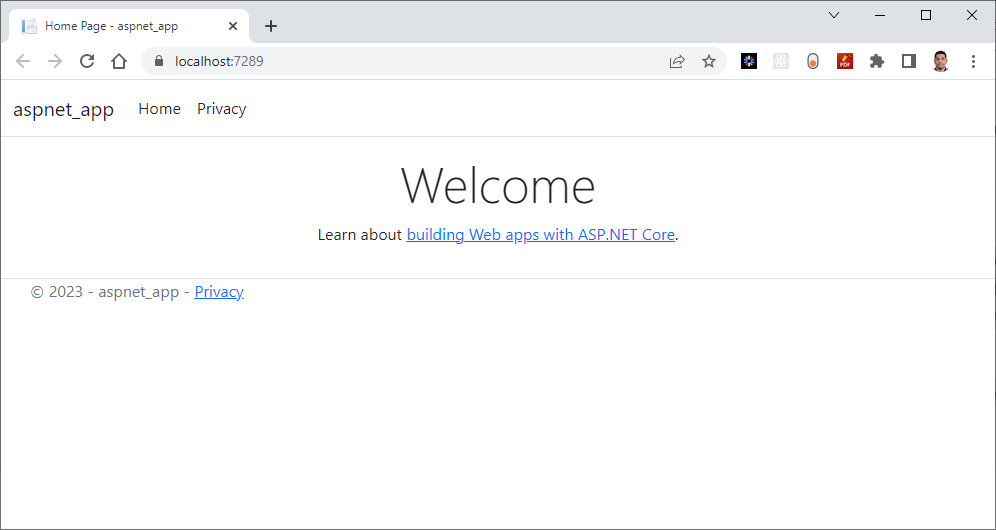

# Create Your First Containerized Website using .NET Core MVC

## Introduction

In our previous labs, we have explored the creation of Microservices to demonstrate the Microservices architecture pattern. In this lab and the next, we will shift our focus to the MicroFrontend architecture pattern by creating a couple of MicroFrontend UI applications.

## Technical Scenario

As a **Frontend (FE)** developer, your task is to develop a website or UI application using ASP.NET Core MVC technology. This application represents one of the small Website (UI) components in our MicroFrontend applications list.

This lab will guide you through the process of building an ASP.NET Core MVC application. We will begin by creating a new Git repository or utilizing an existing one. Next, we will generate an MVC project template and proceed to containerize the UI application. Finally, we will push the containerized UI application to the Azure Container Registry (ACR) in preparation for deployment to Azure Kubernetes Services (AKS).

The objective is to prepare a UI application for deployment on Kubernetes. The UI applications developed in this lab will be utilized in subsequent labs, such as the creation of DevOps pipelines or the deployment to Azure Kubernetes Services.


## Objective

In this exercise, our objective is to accomplish and learn the following tasks:

- **Step-1:** Create a new ASP.NET Core Web App (MVC project)
- **Step-2:** Test ASP.NET MVC project
- **Step-3:** Update home page contents [optional]
- **Step-4:** Add Dockerfiles to MVC project
- **Step-5:** Docker Build locally
- **Step-6:** Docker Run locally
- **Step-7:** Publish docker container to ACR

## Prerequisites

Before starting this lab, make sure you have the following prerequisites in place:

- Clone existing Microservices repo
- Download and install software for .NET development 
- Docker desktop
- VS Code Docker extension
- Azure Container Registry (ACR)

## Architecture Diagram

The following diagram shows the high level steps to create the website using ASP.NET Core MVC.

[](images/image-9.png){:target="_blank"}

## Step-1: Create a new ASP.NET Core Web App (MVC project)

Create a new ASP.NET Core Web App using the MVC project template. This will serve as the foundation for our UI application.

To create new ASP.NET Core Web App (Model-View-Controller) project you can use either Visual Studio Code or Visual Studio 2022 (latest version).

**Using Visual Studio Code**

Assuming you already have the .NET Core SDK installed in your system, follow these steps to create a new .NET Core MVC project:

Open Visual Studio Code and open the terminal and use following command to see list of templates.

```bash
dotnet new --list
```

**output**

```sh
These templates matched your input: 

Template Name                                 Short Name           Language    Tags
--------------------------------------------  -------------------  ----------  -------------------------------------
ASP.NET Core Empty                            web                  [C#],F#     Web/Empty
ASP.NET Core gRPC Service                     grpc                 [C#]        Web/gRPC
ASP.NET Core Web API                          webapi               [C#],F#     Web/WebAPI
ASP.NET Core Web App                          razor,webapp         [C#]        Web/MVC/Razor Pages
ASP.NET Core Web App (Model-View-Controller)  mvc                  [C#],F#     Web/MVC
ASP.NET Core with Angular                     angular              [C#]        Web/MVC/SPA
ASP.NET Core with React.js                    react                [C#]        Web/MVC/SPA
ASP.NET Core with React.js and Redux          reactredux           [C#]        Web/MVC/SPA
Blazor Server App                             blazorserver         [C#]        Web/Blazor
Blazor WebAssembly App                        blazorwasm           [C#]        Web/Blazor/WebAssembly/PWA
Class Library                                 classlib             [C#],F#,VB  Common/Library
Console App                                   console              [C#],F#,VB  Common/Console
.
.
and more....
```

Pick the following template for our MVC project from the list.

```bash
ASP.NET Core Web App (Model-View-Controller)  mvc                  [C#],F#     Web/MVC
```
Use `dotnet new` command to create new MVC project

```bash
dotnet new mvc -o aspnet-app
```

**output**

```sh
The template "ASP.NET Core Web App (Model-View-Controller)" was created successfully.
This template contains technologies from parties other than Microsoft, see https://aka.ms/aspnetcore/6.0-third-party-notices for details.

Processing post-creation actions...
Running 'dotnet restore' on C:\Source\Repos\microservices\aspnet-app\aspnet-app.csproj...
  Determining projects to restore...
  Restored C:\Source\Repos\microservices\aspnet-app\aspnet-app.csproj (in 95 ms).
Restore succeeded.
```


**Using Visual Studio 2022**

In case if you want to use Visual Studio only then, here are the steps to create a new ASP.NET Core Web App using the Model-View-Controller (MVC) architectural pattern:

- Open Visual Studio and select "Create a new project".
- In the "Create a new project" window, select "ASP.NET Core Web Application" and click "Next".
- Choose a name and location for your project and click "Create".
- In the "Create a new ASP.NET Core Web Application" window, select "Web Application (Model-View-Controller)" and click "Create".

Visual Studio will create a new project for you with the necessary files and folders to get started.

Once the MVC project is created successfully you will see the project folder structure like below:

[](images/image-13.jpg){:target="_blank"}


cd to the new folder here `aspnet-app`

```bash
cd .\aspnet-app\
```

## Step-2: Test the new ASP.NET core Web App project

Perform testing of the ASP.NET MVC project to ensure its functionality and identify any issues or bugs that may need to be addressed.

Run the following command to build the project:

`dotnet build` command will look for the project or solution file in the current directory and compile the code in it. It will also restore any dependencies required by the project and create the output files in the bin directory. 

```bash
dotnet build
```

**output**

```sh
Microsoft (R) Build Engine version 17.0.1+b177f8fa7 for .NET
Copyright (C) Microsoft Corporation. All rights reserved.

  Determining projects to restore...
  All projects are up-to-date for restore.
  aspnet-app -> C:\Source\Repos\microservices\aspnet-app\bin\Debug\net6.0\aspnet-app.dll

Build succeeded.
    0 Warning(s)
    0 Error(s)

Time Elapsed 00:00:05.07
```
Run the following command to start the development server:

`dotnet run` command will look for the project or solution file in the current directory and compile the code in it. After compiling, it will run the application and any output will be displayed in the console.

```bash
dotnet run
```

**output**

```sh
Building...
info: Microsoft.Hosting.Lifetime[14]
      Now listening on: https://localhost:7289
info: Microsoft.Hosting.Lifetime[14]
      Now listening on: http://localhost:5023
info: Microsoft.Hosting.Lifetime[0]
      Application started. Press Ctrl+C to shut down.
info: Microsoft.Hosting.Lifetime[0]
      Hosting environment: Development
info: Microsoft.Hosting.Lifetime[0]
      Content root path: C:\Source\Repos\microservices\aspnet-app\
```

You will notice the URL in the output, copy the URL and paste it in your favorite browser.
<https://localhost:7289/>

[](images/image-14.jpg){:target="_blank"}


For the first time if you are able to see this page in your browser that means ASP.NET MVC project is created as expected.

Use these git commands to push the source code to remote git.

```bash
git add .
git commit -a -m "My fist mvc app commit."
git push --set-upstream origin main
git status
```

!!! Note

    For the simplicity I am creating all the applications in the same repo called `microservices` but in reality you may need to follow your organization standards for creating git repos

New folder structure will look like below in the microservices git repo. you will notice the new `aspnet-app` folder with MVC project source code. 

[](images/image-15.jpg){:target="_blank"}


## Step-3: Update home page contents

Let's update our landing page to show .NET version, Operating System, processor, CPU core etc.. this information will provide us some technical details of the application when we deploy it in our AKS in the upcoming labs.  

 We are going to update the `Index.html` file with following code.

``` c# title="Index.html"
@page
@using System.Runtime.InteropServices
@using System.IO
@using System.Diagnostics
@{
    //ViewData["Title"] = "Home page";
    var hostName = System.Net.Dns.GetHostName();
    var ipList = await System.Net.Dns.GetHostAddressesAsync(hostName);

    const long Mebi = 1024 * 1024;
    const long Gibi = Mebi * 1024;
    GCMemoryInfo gcInfo = GC.GetGCMemoryInfo();
    string totalAvailableMemory = GetInBestUnit(gcInfo.TotalAvailableMemoryBytes);

    bool cgroup = RuntimeInformation.OSDescription.StartsWith("Linux") && Directory.Exists("/sys/fs/cgroup/memory");
    string memoryUsage = string.Empty;
    string memoryLimit = string.Empty;

    if (cgroup)
    {
        string usage = System.IO.File.ReadAllLines("/sys/fs/cgroup/memory/memory.usage_in_bytes")[0];
        string limit = System.IO.File.ReadAllLines("/sys/fs/cgroup/memory/memory.limit_in_bytes")[0];
        memoryUsage = GetInBestUnit(long.Parse(usage));
        memoryLimit = GetInBestUnit(long.Parse(limit));
    }
}
<div align="center">
    <table class="table table-striped table-hover">
        <tr>
            <td>.NET version</td>
            <td>@RuntimeInformation.FrameworkDescription</td>
        </tr>
        <tr>
            <td>Operating system</td>
            <td>@RuntimeInformation.OSDescription</td>
        </tr>
        <tr>
            <td>Processor architecture</td>
            <td>@RuntimeInformation.OSArchitecture</td>
        </tr>
        <tr>
            <td>CPU cores</td>
            <td>@Environment.ProcessorCount</td>
        </tr>
        <tr>
            <td>Containerized</td>
            <td>@(Environment.GetEnvironmentVariable("DOTNET_RUNNING_IN_CONTAINER") is null ? "false" : "true")</td>
        </tr>
        <tr>
            <td>Memory, total available GC memory</td>
            <td>@totalAvailableMemory</td>
        </tr>
        @if (cgroup)
        {
            <tr>
                <td>cgroup memory usage</td>
                <td>@memoryUsage</td>
            </tr>
            <tr>
                <td>cgroup memory limit</td>
                <td>@memoryLimit</td>
            </tr>
        }
        <tr>
            <td>Host name</td>
            <td>@hostName</td>
        </tr>
        <tr>
            <td style="vertical-align: top">Server IP address</td>
            <td>
                @{
                    foreach (var ip in ipList)
                    {
                        @ip
                        <br />
                    }
                }
            </td>
        </tr>
    </table>
</div>

@{
    string GetInBestUnit(long size)
    {
        if (size < Mebi)
        {
            return $"{size} bytes";
        }
        else if (size < Gibi)
        {
            decimal mebibytes = Decimal.Divide(size, Mebi);
            return $"{mebibytes:F} MiB";
        }
        else
        {
            decimal gibibytes = Decimal.Divide(size, Gibi);
            return $"{gibibytes:F} GiB";
        }
    }
}

```
Here is the home page with new details:

[](images/image-16.jpg){:target="_blank"}


Now it is time to commit our source code 

```bash
git add .
git commit -am "updated landing page"
git push 
```
## Step-4: Add Dockerfiles to the MVC project

This file define the necessary instructions to build Docker images for the application.

Create a Dockerfile in the root directory of the MVC project and copy following code.

``` Dockerfile
#See https://aka.ms/containerfastmode to understand how Visual Studio uses this Dockerfile to build your images for faster debugging.
# Use the official Microsoft ASP.NET Core runtime image as a parent image
FROM mcr.microsoft.com/dotnet/aspnet:6.0 AS base
WORKDIR /app
EXPOSE 80
EXPOSE 443

# Copy the project files and restore dependencies
FROM mcr.microsoft.com/dotnet/sdk:6.0 AS build
WORKDIR /src
COPY ["aspnet-app.csproj", "."]
RUN dotnet restore "./aspnet-app.csproj"

# Copy the remaining files and build the application
COPY . .
WORKDIR "/src/."
RUN dotnet build "aspnet-app.csproj" -c Release -o /app/build

# Publish the application
FROM build AS publish
RUN dotnet publish "aspnet-app.csproj" -c Release -o /app/publish

# Final image
FROM base AS final
WORKDIR /app
COPY --from=publish /app/publish .
# Start the application
ENTRYPOINT ["dotnet", "aspnet-app.dll"]
```

!!! Note
    Read inline comments of the Dockerfile for understanding the Dockerfile instructions
## Task-5: Docker Build locally

Build Docker images locally using the Dockerfiles added to the MVC project. This process will generate container images ready for deployment.

The `docker build` command is used to build Docker images from a Dockerfile. The Dockerfile contains a set of instructions that Docker uses to create a new image. 

```bash
docker build -t sample/aspnet-app:20230312.1 .
```
`-t` to specify a name and optionally a tag for the image,

output

```bash
[+] Building 49.9s (18/18) FINISHED
 => [internal] load build definition from Dockerfile
 => => transferring dockerfile: 696B                
 => [internal] load .dockerignore                   
 => => transferring context: 2B                     
 => [internal] load metadata for mcr.microsoft.com/dotnet/sdk:6.0        
 => [internal] load metadata for mcr.microsoft.com/dotnet/aspnet:6.0 
 .
 .
 .
 => exporting to image 
 => => exporting layers
 => => writing image sha256:587f347206bcc67dafe3c0b53047862f11b6e52b1b61bce15b8432cc3a488e24
 => => naming to docker.io/sample/aspnet-app:20230312.1  
```

When you run the `docker build` command, Docker looks for a Dockerfile in the specified directory (PATH) and reads the instructions in the file to build a new image. The Dockerfile contains a series of instructions that define how to build the image, such as copying files, running commands, and setting environment variales. 

**Error & troubleshooting**

In case if you are getting following error while running `docker build` command, that means the docker desktop is not running locally. make sure that run the docker desktop locally to fix this issue.

```bash
error during connect: This error may indicate that the docker daemon is not running.: Post "http://%2F%2F.%2Fpipe%2Fdocker_engine/v1.24/build?buildargs=%7B%7D&cachefrom=%5B%5D&cgroupparent=&cpuperiod=0&cpuquota=0&cpusetcpus=&cpusetmems=&cpushares=0&dockerfile=Dockerfile&labels=%7B%7D&memory=0&memswap=0&networkmode=default&rm=1&shmsize=0&t=sample%2Faspnet-app%3A20230312.1&target=&ulimits=null&version=1": open //./pipe/docker_engine: The system cannot find the file specified.
```
## Step-6: Docker Run locally

Run the Docker container locally to verify that the application functions correctly within a containerized environment. This step ensures that the containerized application operates as expected on your local machine.

Run the `docker run` command to start a container based on the image:

```bash
docker run --rm -p 8080:80 sample/aspnet-app:20230312.1
```

_output_
```sh
warn: Microsoft.AspNetCore.DataProtection.Repositories.FileSystemXmlRepository[60]
      Storing keys in a directory '/root/.aspnet/DataProtection-Keys' that may not be persisted outside of the container. Protected data will be unavailable when container is destroyed.
warn: Microsoft.AspNetCore.DataProtection.KeyManagement.XmlKeyManager[35]
      No XML encryptor configured. Key {90c41ec3-18a3-434a-8d4b-1d0cc5f140af} may be persisted to storage in unencrypted form.
info: Microsoft.Hosting.Lifetime[14]  
      Now listening on: http://[::]:80
info: Microsoft.Hosting.Lifetime[0]
      Application started. Press Ctrl+C to shut down.
info: Microsoft.Hosting.Lifetime[0]
      Hosting environment: Production
info: Microsoft.Hosting.Lifetime[0]
      Content root path: /app/
warn: Microsoft.AspNetCore.HttpsPolicy.HttpsRedirectionMiddleware[3]
      Failed to determine the https port for redirect.
```
if you open the docker desktop you will notice the new container started running.

[](images/image-19.jpg){:target="_blank"}


<http://localhost:8080/>


[](images/image-16.jpg){:target="_blank"}


You now have a basic ASP.NET Core Web App using the MVC pattern up and running. From here, you can continue building out your application by adding more controllers, views, and models as needed.

## Step-7: Push docker container to ACR

Publish the Docker container to the Azure Container Registry (ACR) for future deployment to Azure Kubernetes Services (AKS). This step prepares the container for deployment to the cloud environment.

Now we've Docker Containers ready locally for push to Container Registry so that we can use them in future labs.

To publish a Docker container to Azure Container Registry (ACR), you will need to have the following:

Create an Azure Container Registry. If you don't have one, you can create one by following the instructions in the Azure Portal or using Azure CLI.

Log in to your Azure Container Registry using the Docker command-line interface. You can do this by running the following command:

``` sh
# azure Login
az login

# set the azure subscription
az account set -s "anji.keesari"

# Log in to the container registry
az acr login --name acr1dev

# To get the login server address for verification
az acr list --resource-group rg-acr-dev --query "[].{acrLoginServer:loginServer}" --output table

# output should look similar to this.

# AcrLoginServer    
# ------------------
# acr1dev.azurecr.io
```

list all the Docker images that are available on the local system

```bash
docker images
```

_output_

```sh
REPOSITORY                                                TAG                                                                          IMAGE ID       CREATED         SIZE
sample/aspnet-app                                         20230312.1                                                                   587f347206bc   8 minutes ago   216MB
.
.
.
```
`Tag` your Docker container with the full name of your Azure Container Registry, including the repository name and the version tag. You can do this by running the following command:

```bash
docker tag sample/aspnet-app:20230312.1 acr1dev.azurecr.io/sample/aspnet-app:20230312.1
```
Push your Docker container to your Azure Container Registry using the Docker command-line interface. You can do this by running the following command:

```bash
docker push acr1dev.azurecr.io/sample/aspnet-app:20230312.1
```

_Output_

```sh
The push refers to repository [acr1dev.azurecr.io/sample/aspnet-app]
f9c45e227c3a: Pushed
5f70bf18a086: Mounted from sample/aspnet-api
478d6dc381e4: Pushed
355b7bb8c23e: Pushed
ff13768cb51e: Pushed
fe674e2b138c: Pushed
f30d150c0152: Pushed
4695cdfb426a: Pushed
20230312.1: digest: sha256:049b736aa29e9574010dfe1fc2ef5bb44ed76d54757a8f190b967fa0f854567e size: 1995
```
1. Wait for the push to complete. Depending on the size of your Docker containers and the speed of your internet connection, this may take a few minutes.
1. Verify the newly pushed image to ACR.
```bash
az acr repository list --name acr1dev --output table
```

_Output_

```sh
Result
-------------------------------
mcr.microsoft.com/dotnet/aspnet
mcr.microsoft.com/dotnet/sdk
sample/aspnet-api
sample/aspnet-app
```

Show the new tags of a image in the acr

```bash
az acr repository show-tags --name acr1dev --repository sample/aspnet-api --output table
```

_output_

```sh
Result
----------
20230312.1
```

You've successfully pushed your Docker container to Azure Container Registry. You can now use the Azure Portal or Azure CLI to manage your container and deploy them to Azure services like Azure Kubernetes Service (AKS).

