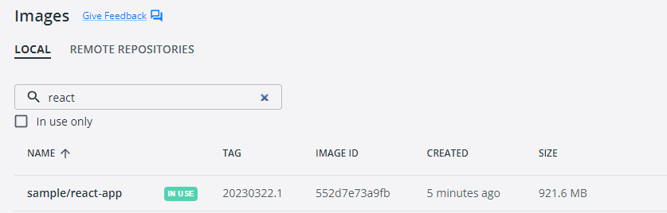
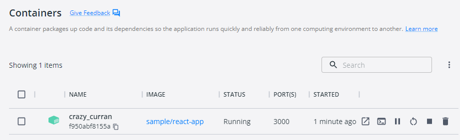

# Create your second containerized website using React JS

## Introduction

In this lab, we will create our second website using React JS, which serves as another MicroFrontend application in our Microservices architecture.

Our goal is to prepare a React JS application for deployment on Kubernetes. The UI applications developed in this lab will be utilized in subsequent labs, including the creation of DevOps pipelines and the deployment to Azure Kubernetes Services.

Let's dive into the lab and begin our journey by creating a React JS application as part of the Microservices Architecture!

## Technical Scenario

As a `Frontend (FE)` developer, you have been assigned the task of developing a website or UI application using React JS technology. This website will be one of the small Website (UI) components in our MicroFrontend applications list.

This lab aims to provide you with hands-on experience in creating a React JS application as part of the Microservices Architecture. We will begin by utilizing an existing Git repository and proceed to create a new React JS project within it. Finally, we will containerize this website and push it to the Azure Container Registry (ACR) in preparation for deployment to Azure Kubernetes Services (AKS).

## Objective

In this exercise, our objective is to accomplish and learn the following tasks:

- **Step 1:** Install Node.js and NPM
- **Step-2:** Create new React JS application
- **Step-3:** Add Dockerfiles to the React JS project
- **Step-4:** Docker Build locally
- **Step-5:** Docker Run locally
- **Step-6:** Publish docker container to ACR

## Prerequisites

- Git Repository
- Clone existing Microservices repo
- Download and install software for React Development 
- Docker desktop
- VS Code with Docker extension
- Azure Container Registry (ACR)
 
## Step-1: Install Node.js and NPM

Before you can create a React app, you'll need to install Node.js and NPM (Node Package Manager) on your system. You can download the latest version of Node.js and NPM from the official website: <https://nodejs.org/en/download/>

**Manual install**

Click on the Installer as per your Operating system preference to install Node.js & NPM both in your system.

**install using commands**

- **Windows OS**

Install Node.js & NPM using Chocolatey (choco) for windows users, assuming you already installed choco in your system, run these commands as administrator from command prompt

``` sh
# This command will download and install the latest version of Node.js. 
choco install nodejs

# install a specific version
choco install nodejs --version=14.17.6
```

- **Mac OS**

Install Node.js & NPM using Homebrew for Mac users, assuming you already installed Homebrew in your system:

```sh
# install latest version
brew install node
# install a specific version
brew install node@14
```

verify that Node.js is installed correctly

``` sh
node --version
npm version
```
output

``` sh
v19.8.1
```
verify that npm version is installed correctly

``` sh
npm version
```
output
``` sh
{
  npm: '9.5.1',
  node: '19.8.1',
  acorn: '8.8.2',
  ada: '1.0.4',
  ares: '1.19.0',
  brotli: '1.0.9',
  cldr: '42.0',
  icu: '72.1',
  llhttp: '8.1.0',
  modules: '111',
  napi: '8',
  nghttp2: '1.52.0',
  nghttp3: '0.7.0',
  ngtcp2: '0.8.1',
  openssl: '3.0.8+quic',
  simdutf: '3.2.2',
  tz: '2022g',
  undici: '5.21.0',
  unicode: '15.0',
  uv: '1.44.2',
  uvwasi: '0.0.16',
  v8: '10.8.168.25-node.12',
  zlib: '1.2.13'
}
```
## Step-2: Create a new React JS application

Once you have Node.js installed, you can create a new React JS application using the `create-react-app` command. Open a terminal window and run the following command:

``` sh
npx create-react-app react-app
```
Wait for few mins for completing the installation.


This command will create a new React JS application with all the necessary files and directories in a folder named `react-app` in your current directory.


output

``` sh
Need to install the following packages:
  create-react-app@5.0.1
Ok to proceed? (y) Y
npm WARN deprecated tar@2.2.2: This version of tar is no longer supported, and will not receive security updates. Please upgrade asap.

Creating a new React app in C:\Source\Repos\Microservices\react-app.
Installing packages. This might take a couple of minutes.
Installing react, react-dom, and react-scripts with cra-template...

added 1419 packages in 2m
.
.
.
```

If you closely look at the output produced by installer, it has some details to get start by React JS application.

<!-- Here is the list of files created by the installer. -->


**Run the Application**

``` sh
cd react-app
npm start
```

output

``` sh

Compiled successfully!

You can now view react-app in the browser.

  Local:            http://localhost:3000
  On Your Network:  http://172.21.128.1:3000

Note that the development build is not optimized.
To create a production build, use npm run build.

webpack compiled successfully
```


## Step-3: Add Dockerfiles to the MVC project

Create a Dockerfile in the root directory of your project and copy following code. Dockerfile will provide instructions for building a container image of our React JS Website.

``` Dockerfile
# pull official base image
FROM node:13.12.0-alpine

# set working directory
WORKDIR /app

# add `/app/node_modules/.bin` to $PATH
ENV PATH /app/node_modules/.bin:$PATH

# install app dependencies
COPY package.json ./
COPY package-lock.json ./
RUN npm install --silent
RUN npm install react-scripts@3.4.1 -g --silent

# add app
COPY . ./

# start app
CMD ["npm", "start"]
```

!!! Note
    Read inline comments of the Dockerfile for understanding the Dockerfile instructions

## Step-4: Docker Build locally

We will build the Docker container locally using the Dockerfiles and ensure that the containerized application functions as expected.

The `docker build` command is used to build Docker images from a Dockerfile.  

```
docker build -t sample/react-app:20230322.1 .
```

output

``` sh
=> [6/7] RUN npm install react-scripts@3.4.1 -g
=> [7/7] COPY .
=> exporting to image
=> => exporting layers
=> => writing image sha256:552d7e73a9fbecf6f51397becc9af1b69df05429b3731513f53f6e89dd8a7cab 
=> => naming to docker.io/sample/react-app:20230322.

Use 'docker scan' to run Snyk tests against images to find vulnerabilities and learn how to fix them

```

When you run the `docker build` command, Docker looks for a Dockerfile in the specified directory (PATH) and reads the instructions in the file to build a new image. 

The Dockerfile contains a series of instructions that define how to build the image, such as copying files, running commands, and setting environment variables. 

## Step-5: Docker Run locally

Run the Docker container locally to verify that the application functions correctly within a containerized environment. This step ensures that the containerized application operates as expected on your local machine.

Run the `docker run` command to start a container based on the image:

```
docker run --rm -p 3000:3000 sample/react-app:20230322.1
```
output

``` sh
Compiled successfully!

You can now view react-app in the browser.

  Local:            http://localhost:3000
  On Your Network:  http://172.17.0.2:3000

Note that the development build is not optimized.
To create a production build, use npm run build.

webpack compiled successfully
Compiling...
Compiled successfully!
webpack compiled successfully
```
if you open the docker desktop you will notice the new image & container started running.

**Image**



**Container**



This will start the ReactJS application in the Docker container and map the container's port 3000 to your local machine's port 3000. 

Your ReactJS application is now running inside a Docker container.

Open your favorite browser and enter the following URL to see the running application in port 3000

<http://localhost:3000/>


You now have a basic React JS application up and running. From here, you can continue building out your application by adding more and more code as per your requirements.

## Step-6: Push docker container to ACR

Now we've Docker Containers ready locally for push to Container Registry so that we can use them in future deployment to Azure Kubernetes Services (AKS). This step prepares the container for deployment to the cloud environment.

To publish a Docker container to Azure Container Registry (ACR), you will need to have the following:

1. Create an Azure Container Registry. If you don't have one, you can create one by following the instructions in the Azure Portal or using Azure CLI.
2. Log in to your Azure Container Registry using the Docker command-line interface. You can do this by running the following command:
``` sh
# azure Login
az login

# set the azure subscription
az account set -s "anji.keesari"

# Log in to the container registry
az acr login --name acr1dev
# Login Succeeded
# To get the login server address for verification
az acr list --resource-group rg-acr-dev --query "[].{acrLoginServer:loginServer}" --output table

# output should look similar to this.

# AcrLoginServer    
# ------------------
# acr1dev.azurecr.io
```
list all the Docker images that are available on the local system
```
docker images
```
output
```
REPOSITORY                                                TAG                                                                          IMAGE ID       CREATED         SIZE
sample/aspnet-app                                         20230312.1                                                                   587f347206bc   8 minutes ago   216MB
.
.
.
```
1. `Tag` your Docker container image with the full name of your Azure Container Registry, including the repository name and the version tag. You can do this by running the following command:
```
docker tag sample/react-app:20230322.1 acr1dev.azurecr.io/sample/react-app:20230322.1
```
1. Push your Docker container image to your Azure Container Registry using the Docker command-line interface. You can do this by running the following command:
```
docker push acr1dev.azurecr.io/sample/react-app:20230322.1
```
Output
``` sh
The push refers to repository [acr1dev.azurecr.io/sample/react-app]
649a035a1734: Pushed
4061bd2dd536: Pushed
c0257b3030b0: Pushed
912a3b0fc587: Pushed
a36186d93e25: Pushed
a3d997b065bc: Pushed
65d358b7de11: Pushed
f97384e8ccbc: Pushed
d56e5e720148: Pushed
beee9f30bc1f: Pushed
20230322.1: digest: sha256:73f0669d18c6cae79beb81edc8c523191710f9ec4781d590884b46326f9ad6f9 size: 2419
```
1. Wait for the push to complete. Depending on the size of your Docker container image and the speed of your internet connection, this may take a few minutes.
1. Verify the newly pushed image to ACR.
``` sh
az acr repository list --name acr1dev --output table
```
Output
```
Result
-------------------------------
mcr.microsoft.com/dotnet/aspnet
mcr.microsoft.com/dotnet/sdk
sample/aspnet-api
sample/aspnet-app
sample/react-app
```
1. Show the new tags of a image in the acr
```
az acr repository show-tags --name acr1dev --repository sample/react-app --output table
```
output
```
Result
----------
20230322.1
```

You've successfully pushed your Docker container image to Azure Container Registry. You can now use the Azure Portal or Azure CLI to manage your container images and deploy them to Azure services like Azure Kubernetes Service (AKS).

