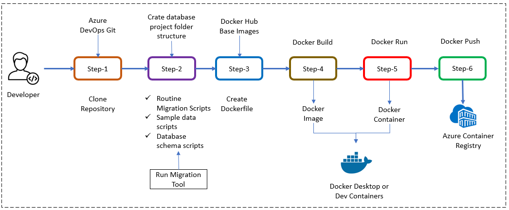

#  Create a container for executing PostgreSQL database scripts

## Introduction

Welcome to the new lab in our Microservices chapter! In this session, we will guide you through the creation of a simple PostgreSQL database. Specifically, we will explore how to create a Docker container designed for executing PostgreSQL database scripts within the PostgreSQL Flexible Server—a PaaS managed by Microsoft Azure. This container will be triggered as a job in Azure Kubernetes Service (AKS) and automatically deleted after execution.


## Technical Scenario

As a `Database Administrator` (DBA), you have been tasked with creating a Docker container using a Dockerfile and pushing the container to Azure Container Registry (ACR). Subsequently, this container will be utilized as an AKS job to execute SQL scripts stored in a designated folder. The job will be automatically deleted post-execution, seamlessly integrated into the deployment workflow using Helm charts.

The containerized database, once prepared, will be pushed to the Azure Container Registry (ACR).

The key objective of this lab is to prepare a database for deployment on PostgreSQL Flexible Database Server through AKS. By completing this lab, you will gain a foundational understanding of how a database can be created, automated through scripts, containerized, seamlessly integrated into a Kubernetes environment, and ultimately executed within the PostgreSQL server.

## Objective

In this exercise, our objective is to accomplish and learn the following tasks:

- **Step-1:** Setup repository for databases in Azure DevOps.
- **Step-2:** Create folder structure for database scripts
- **Step-3:** Add Dockerfiles to the database project.
- **Step-4:** Docker build locally.
- **Step-5:** Docker run locally.
- **Step-6:** Publish the Docker container to ACR.

## Prerequisites

You'll need to ensure that your system has the necessary prerequisites. Here's a checklist of prerequisites:

- `Docker`:  - [Docker Downloads](https://docs.docker.com/get-docker/){:target="_blank"}.
- `Git Client`:  - [Git Downloads](https://git-scm.com/downloads){:target="_blank"}.
- `Git Repository`: Initialize a Git repository for your Node.js application.

## Architecture Diagram

The following diagram shows the high level steps to create container for executing PostgreSQL database scripts.

[](images/image-12.png){:target="_blank"}

## Step-1: Setup repository for databases in Azure DevOps.

For this project, you can either leverage an existing Git repository created in our first chapter or initiate a new one.

To clone an existing repository, execute the following command:

```sh
git clone https://keesari.visualstudio.com/Microservices/_git/microservices
```

## Step-2: Create folder structure for database scripts

In this step, we'll create and organize the folder structure for managing PostgreSQL database scripts. first we will start with creating a parent folder named `postgresql-db`, serving as the project directory for all PostgreSQL database-related files and folders.

Folder Structure:

1. **migrations:** folder

    - This is the first folder which houses all PostgreSQL script files related to database migrations. Adhering to a strict naming convention is crucial to avoid duplicate runs.
    - Some files with naming convention:
        - `1.0.0.0_migration.psql` (Initial version)
        - `1.0.0.1_migration.psql` (Minor changes)
        - `1.0.0.2_migration.psql` (Subsequent changes)

    Let's looks into some sample scripts placed in each file:

   ```sql title="1.0.0.0_migration.psql"
   -- Table: public.table1

   CREATE TABLE IF NOT EXISTS public.table1 (
       "table1ID" uuid NOT NULL,
       "table1Name" character varying(50) COLLATE pg_catalog."default" NOT NULL,
       "Features" json,
       "CreatedDate" timestamp with time zone NOT NULL DEFAULT now(),
       "UpdatedDate" timestamp with time zone NOT NULL DEFAULT now(),
       "ProvisioningType" smallint NOT NULL,
       "SubscriptionType" smallint NOT NULL,
       "Provisioned" boolean NOT NULL DEFAULT false,
       CONSTRAINT table1_pkey PRIMARY KEY ("table1ID")
   );

   -- Additional Tables and Views...

   CREATE OR REPLACE VIEW schema_version
   AS
   SELECT '1.0.0.1'::text AS version;
   ```

   The `schema_version` view update at the end of every script is mandatory to prevent duplicate runs.


   ```sql title="1.0.0.1_migration.psql"
   -- Extending the schema and inserting data into the table created in the previous script

   INSERT INTO public.feature("FeatureName", "IsMandatory", "CreatedDate", "UpdatedDate")
   VALUES
     ('Feature1', false, now(), now()),
     ('Feature2', false, now(), now()),
     -- Additional Data...

   CREATE OR REPLACE VIEW schema_version
   AS
   SELECT '1.0.0.2'::text AS version;
   ```

   Continue adding new script files to extend the database scripts.

2. **sample_data:** folder

    - This is the second folder which contains scripts for inserting sample data into the database, specifically for testing purposes in development and test environments.

    - files in this folder:
        - `1.0.0_sample_data_table1.psql`
        - `1.0.1_sample_data_table2.psql`
        - `1.0.2_sample_data_table3.psql`

3. **create_schema.psql:** file

    - This file encapsulates the database shcema (DDL) related script.

4. **Dockerfile:** file

    - The Dockerfile contains instructions related to the database container. Further details will be discussed in the subsequent task.

5. **run_migrations.sh:** file

    - This crucial shell script plays a significant role in executing database scripts. It connects to the database, passing necessary parameters during AKS job execution.

    - this shell script streamlines the execution of PostgreSQL migration scripts within a Docker container. It handles authentication, schema version checking, initialization, and the iterative execution of migration scripts, ensuring a seamless and automated database schema evolution process during an AKS job execution.

    - The purpose of this shell script is to automate the execution of PostgreSQL database migration scripts within a Docker container. Let's break down its functionalities:

    ```bash
    #!/bin/sh

    # Set up PostgreSQL connection parameters in .pgpass file
    echo "${POSTGRES_HOST}":*:*:"${POSTGRES_USER}":"${POSTGRES_PASSWORD}" > ~/.pgpass
    chmod 0600 ~/.pgpass

    # Change working directory to /migrations where migration scripts are located
    cd /migrations

    # Retrieve the current schema version from the database
    version=$(psql -h ${POSTGRES_HOST} -U ${POSTGRES_USER} -w ${POSTGRES_DB} -t -c "select version from schema_version" | xargs) 2> /dev/null

    # Check if schema version exists or if the query fails
    if [ $? -ne 0 ] || [ "$version" == "" ]
    then
        # If no version found, run the initial schema creation script
        echo "Running create_schema.psql"
        psql -h ${POSTGRES_HOST} -U ${POSTGRES_USER} -w ${POSTGRES_DB} -f "create_schema.psql"
    else
        # If version exists, echo the existing schema version
        echo "Schema version found: $version"
    fi

    # Loop to test and execute upgrade scripts
    while : 
    do
        # Retrieve the current schema version in the loop
        version=$(psql -h ${POSTGRES_HOST} -U ${POSTGRES_USER} -w ${POSTGRES_DB} -t -c "select version from schema_version" | xargs)
        
        # Echo the current schema version and test for an upgrade script
        echo "Schema version found: $version; testing for upgrade script ${version}_migration.psql"
        
        # Execute the upgrade script if found
        psql -h ${POSTGRES_HOST} -U ${POSTGRES_USER} -w ${POSTGRES_DB} -f "${version}_migration.psql"
        
        # Check if the execution of the upgrade script fails
        if [ $? -ne 0 ]
        then
            break
        else
            # If upgrade script executed successfully, echo a success message
            echo "${version}_migration.psql run"
        fi
    done

    # Echo the final schema version
    echo "Schema version is: ${version}"

    # Exit with a status of 0 (success)
    exit 0

    ```

Detailed explanations for each segment of the script will be explained here:


1. **`.pgpass` File Creation:**

    - The script starts by creating a `.pgpass` file in the user's home directory, which contains the PostgreSQL connection parameters such as host, user, and password. This ensures secure and automated authentication during database operations.

2. **Permissions Configuration:**

    - The script then sets the appropriate permissions (`chmod 0600`) for the `.pgpass` file to restrict access and enhance security.

3. **Navigation to Migrations Folder:**

    - The script changes the working directory to `/migrations`, where the PostgreSQL migration scripts are located.

4. **Database Version Check:**

    - It retrieves the current schema version from the database by executing a SQL query (`select version from schema_version`). If the query fails or no version is found, it indicates that the database schema needs to be initialized.

5. **Schema Initialization or Version Retrieval:**

    - If no schema version is found, the script echoes a message indicating the execution of `create_schema.psql` for initializing the database schema.
    - If a schema version is found, the script echoes the existing version.

6. **Migration Script Execution Loop:**

    - The script enters a loop where it repeatedly checks for the latest schema version and attempts to execute the corresponding migration script (`${version}_migration.psql`).
    - If the execution of a migration script fails, the loop breaks, indicating that all available migration scripts have been executed.

7. **Final Output:**

    - The script concludes by echoing the final schema version, providing visibility into the applied database schema version.

8. **Exit Status:**

    - The script exits with a status of `0`, indicating successful execution.


## Step-3: Add Dockerfiles to the database project.

To seamlessly containerize our database project, let's create a Dockerfile in the root directory of your project and incorporate the following code. The Dockerfile provides instructions for building a container image of our database.

``` Dockerfile
# Define an argument for environment (default: prod)
ARG ENV=prod

# Use Alpine Linux 3.7 as the base image
FROM alpine:3.7 AS prod

# Install PostgreSQL client in the Alpine image
RUN apk --update add postgresql-client && rm -rf /var/cache/apk/*

# Copy migration scripts into the /migrations/ directory in the image
COPY migrations/* /migrations/

# Copy the run_migrations.sh script into the root directory in the image
COPY run_migrations.sh /

# Set executable permissions for the run_migrations.sh script
RUN chmod +x /run_migrations.sh

# Define the default command to execute when the container starts
CMD ["sh", "-c", "/run_migrations.sh"]

```

## Step-4: Docker build locally

We will build the Docker container locally using the Dockerfiles and ensure that the containerized application functions as expected.

The `docker build` command is used to build Docker images from a Dockerfile.  

```
docker build -t sample/postgresql-db:20240101.1 .
```

output

```sh
Docker build output goes here
```


When you run the `docker build` command, Docker looks for a Dockerfile in the specified directory (PATH) and reads the instructions in the file to build a new image. 

The Dockerfile contains a series of instructions that define how to build the image, such as copying files, running commands, and setting environment variables. 

## Step-5: Docker run locally

Run the Docker container locally to verify that the application functions correctly within a containerized environment. This step ensures that the containerized application operates as expected on your local machine.

Run the `docker run` command to start a container based on the image:

```
docker run --rm -p 3000:3000 sample/postgresql-db:20240101.1 .
```
output

``` sh
Docker run output goes here
```
if you open the docker desktop you will notice the new image & container started running.

## Step-6: Push docker container to ACR

Now that we have Docker containers ready locally, it's time to push them to the Container Registry for future deployment on Azure Kubernetes Services (AKS). This step is crucial for preparing the container for deployment in a cloud environment.

To publish a Docker container to Azure Container Registry (ACR), you will need to have the following:

1. Create an Azure Container Registry. If you don't have one, you can create one by following the instructions in the Azure Portal or using Azure CLI.
2. Log in to your Azure Container Registry using the Docker command-line interface. You can do this by running the following command:
``` sh
# azure Login
az login

# set the azure subscription
az account set -s "anji.keesari"

# Log in to the container registry
az acr login --name acr1dev
# Login Succeeded
# To get the login server address for verification
az acr list --resource-group rg-acr-dev --query "[].{acrLoginServer:loginServer}" --output table

# output should look similar to this.

# AcrLoginServer    
# ------------------
# acr1dev.azurecr.io
```
list all the Docker images that are available on the local system
```
docker images
```
output
```
REPOSITORY                                                TAG                                                                          IMAGE ID       CREATED         SIZE
sample/aspnet-app                                         20230312.1                                                                   587f347206bc   8 minutes ago   216MB
.
.
.
```
1. `Tag` your Docker container image with the full name of your Azure Container Registry, including the repository name and the version tag. You can do this by running the following command:
```
docker tag sample/postgresql-db:20240101.1 acr1dev.azurecr.io/sample/postgresql-db:20240101.1
```
1. Push your Docker container image to your Azure Container Registry using the Docker command-line interface. You can do this by running the following command:
```
docker push acr1dev.azurecr.io/sample/postgresql-db:20240101.1
```
Output
``` sh
The push refers to repository [acr1dev.azurecr.io/sample/postgresql-db]
649a035a1734: Pushed
4061bd2dd536: Pushed
c0257b3030b0: Pushed
912a3b0fc587: Pushed
a36186d93e25: Pushed
a3d997b065bc: Pushed
65d358b7de11: Pushed
f97384e8ccbc: Pushed
d56e5e720148: Pushed
beee9f30bc1f: Pushed
20240101.1: digest: sha256:73f0669d18c6cae79beb81edc8c523191710f9ec4781d590884b46326f9ad6f9 size: 2419
```
1. Wait for the push to complete. Depending on the size of your Docker container image and the speed of your internet connection, this may take a few minutes.
1. Verify the newly pushed image to ACR.
``` sh
az acr repository list --name acr1dev --output table
```
Output
```
Result
-------------------------------
mcr.microsoft.com/dotnet/aspnet
mcr.microsoft.com/dotnet/sdk
sample/aspnet-api
sample/aspnet-app
sample/postgresql-db
```
1. Show the new tags of a image in the acr
```
az acr repository show-tags --name acr1dev --repository sample/postgresql-db --output table
```
output
```
Result
----------
20240101.1
```

You've successfully pushed your Docker container image to Azure Container Registry. You can now use the Azure Portal or Azure CLI to manage your container images and deploy them to Azure services like Azure Kubernetes Service (AKS).

## Conclusion

You have successfully created a Docker container for executing PostgreSQL database scripts, allowing for efficient management and deployment of your database schema. container created as part of this task will be used in the future labs in AKS to exeucte these scripts in PostgreSQL flexible server.


<!-- ## Reference -->
