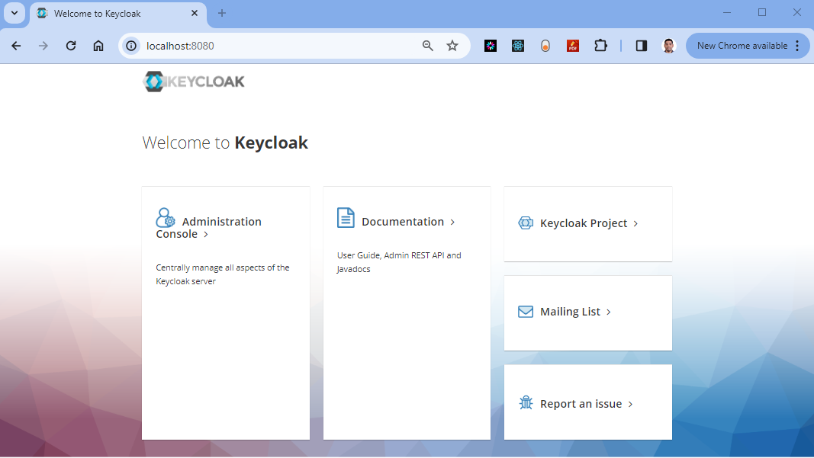
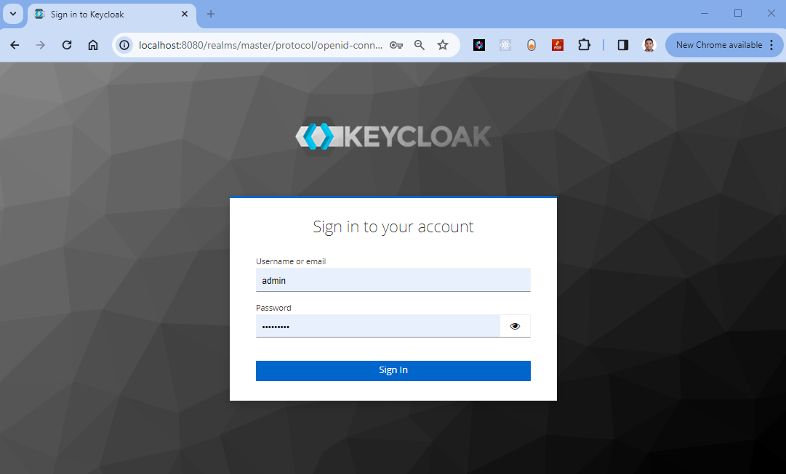
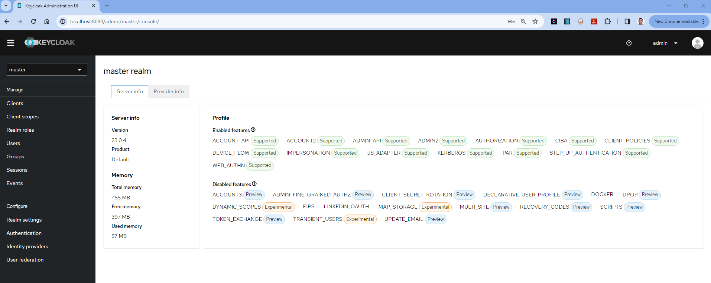

#  Setting up Keycloak in a Docker Container

## Introduction


As part of this chapter, I will introduce Keycloak as one of the applications in the microservices landscape for Security, which is a common requirement across many organizations. Keycloak is a free, open-source, powerful, and flexible popular open-source identity and access management solution that enables you to secure your applications and services.

If you are new to Keycloak and would like to learn more, you can refer to my article on [Getting Started with Keycloak](https://anjikeesari.com/articles/keycloak/){:target="_blank"}

In this lab, I will guide you through the process of creating Docker container for Keycloak, and finally accessing the Keycloak application in the web browser.

Running Keycloak in a Docker container provides greater control and flexibility over its configuration and deployment, allowing us to tailor authentication, authorization, and identity management features to meet specific organizational requirements. This approach enables seamless customization of realms, themes, user federation, and integration with external identity providers, all while maintaining consistency across environments through containerized infrastructure.

The objective is to establish a local development environment for the Keycloak application, securing Microservices with Keycloak in a Microservices Architecture,  our goal is to implement authentication and authorization mechanisms across the microservices, ensuring that only authorized users and services can access specific resources. To accomplish this, you will create a Dockerfile or Docker Compose files, run them locally, and subsequently push the image to an Azure Container Registry (ACR). All of these tasks we are doing here will be useful in later chapters when deploying to the Azure Kubernetes Service (AKS).

Here are some Keycloak requirements within microservices architecture:

- **Keycloak integration**:
   Integrate Keycloak into the microservices architecture to provide authentication and authorization capabilities.
   Keycloak should act as the central identity provider for all microservices.

- **User management**:
   Implement user management within Keycloak, allowing users to sign up, log in, and manage their profiles.
   Define user roles and groups for fine-grained access control.

- **Secure API endpoints**:
   Protect API endpoints to ensure that only authenticated users or services with the appropriate permissions can access them.
   Implement OAuth 2.0 or OpenID Connect for securing APIs.

- **Single Sign-On (SSO)**:
   Keycloak can serve as a versatile solution for enabling SSO between companies by establishing federated trust relationships between IdPs and SPs. This approach simplifies user access across organizations, enhances security, and provides a seamless user experience when accessing services and applications from different companies.

- **JWT Tokens**:
   Utilize JSON Web Tokens (JWT) for secure communication between microservices and Keycloak.
   Configure token expiration, signing, and validation.

## Objective

In this exercise, our objective is to accomplish and learn the following tasks:

- **Step-1:** Setup repository for Keycloak in Azure devops.
- **Step-2:** Create Keycloak Folder.
- **Step-3:** Add Dockerfiles to the Keycloak project.
- **Step-4:** Docker build locally.
- **Step-5:** Docker run locally.
- **Step-6:** Publish the Keycloak docker container to container registry.

## Prerequisites

Before starting this lab, ensure you have the following prerequisites in place:

- Docker and the VS Code Docker extension :  - [Docker Downloads](https://docs.docker.com/get-docker/){:target="_blank"}.
- Git Client tool:  - [Git Downloads](https://git-scm.com/downloads){:target="_blank"}.
- Azure devops and Git Repository: Initialize a Git repository for your Keycloak application.
- Azure Container Registry (ACR)
- Docker compose installed

Verify the docker installation by running following commands:
```sh
docker version
# or
docker --version
# or
docker -v
```

Verify the docker compose by running following commands:

```sh
docker-compose version
```

## Architecture Diagram

The following diagram shows the high level steps to create docker container for Keycloak application.

[](images/image-13.png){:target="_blank"}

## Step-1: Setup repository for Keycloak in Azure DevOps

Before you begin with the Keycloak setup, it's necessary to have a version control repository to manage your project. 

- Create azure devops project
- Initialize repository

For this Keycloak application, we can either use an existing git repository created in our first chapter or initiate a new one.

To clone an existing repository, run the following command:

```sh
git clone https://keesari.visualstudio.com/Microservices/_git/microservices
```

## Step-2: Create Keycloak project

In this step, we'll create a dedicated Folder for our Keycloak application

Create a new Folder: Inside our Git repository, create a new directory or folder specifically for your Keycloak application. This folder will contain all the necessary files for Keycloak, including Dockerfiles and configurations.

[](images/image-14.png){:target="_blank"}


## Step-3: Keycloak setup with docker compose 

Setup Keycloak Service:

To setup the Keycloak with docker compose you need to first create a docker compose file that defines the Keycloak service and any necessary dependencies, such as a PostgreSQL database. 
 
Here's a step-by-step explanation of how to set up Keycloak with docker compose:

Create a file named `docker-compose.yml` in your project directory. This file will define the services and configurations for your Keycloak setup.

In the docker-compose.yml file, define the Keycloak service. Use the official Keycloak Docker image and specify any necessary configurations. Here's an example of a Keycloak service definition:


```yml title="docker-compose.yml"
services:
  auth:
    image: quay.io/keycloak/keycloak
    ports:
      - "8080:8080"
    environment:
      KEYCLOAK_ADMIN: admin 
      KEYCLOAK_ADMIN_PASSWORD: admin
    command: 
      - start-dev 
      - --import-realm
    volumes:
      - /home/keycloak/realm.json:/opt/keycloak/data/import/realm.json
```

This definition:

- Uses the `quay.io/keycloak/keycloak` Docker image.
- Maps port 8080 on your host to port 8080 in the Keycloak container.
- Sets up an initial admin user and password for Keycloak.

```sh
docker-compose up
# or
docker-compose up -d

#output
[+] Running 1/0
 ✔ Container keycloak-auth-1  Created                                                                                                                                                                                   0.0s 
Attaching to keycloak-auth-1
.
.
.
Running the server in development mode. DO NOT use this configuration in production.
```

```sh
docker ps

# output

CONTAINER ID   IMAGE                                COMMAND                  CREATED              STATUS              PORTS                              NAMES
d3ee7cef046e   quay.io/keycloak/keycloak            "/opt/keycloak/bin/k…"   About a minute ago   Up About a minute   0.0.0.0:8080->8080/tcp, 8443/tcp   keycloak-auth-1
```
```sh
docker image ls

# output
REPOSITORY                                TAG                                        IMAGE ID       CREATED         SIZE  
quay.io/keycloak/keycloak                 latest                                     273d68e6fb8c   6 days ago      459MB 
```

```sh
docker container ls

# output
CONTAINER ID   IMAGE                                COMMAND                  CREATED          STATUS          PORTS                              NAMES
d3ee7cef046e   quay.io/keycloak/keycloak            "/opt/keycloak/bin/k…"   22 minutes ago   Up 22 minutes   0.0.0.0:8080->8080/tcp, 8443/tcp   keycloak-auth-1
```
```sh
docker network ls

# output
NETWORK ID     NAME                           DRIVER    SCOPE
e71f9c6bd718   bridge                         bridge    local
d08c17ea4f0e   docker-nodejs-sample_default   bridge    local
cfb02a162739   host                           host      local
c8fb8d726406   keycloak_default               bridge    local
8bba86e6ad07   none                           null      local
```

Access Keycloak: 

Once the Keycloak service is up and running, you can access the Keycloak admin console by opening a web browser and navigating to [http://localhost:8080](http://localhost:8080). You can log in using the admin user and password you defined in the Keycloak service configuration.


Keycloal admin console

[](images/image-15.png){:target="_blank"}

Keycloak Login page

[](images/image-16.png){:target="_blank"}

Keycloak master relm

[](images/image-17.png){:target="_blank"}


Setup Keycloak Service with PostgreSQL database:

If you want to use a PostgreSQL database as Keycloak's backend, define a PostgreSQL service in the same `docker-compose.yml` file. 

Here's a complete `docker-compose.yml` file that sets up Keycloak with a PostgreSQL database:

```yml title="docker-compose.yml"
version: '3'
services:
  keycloak:
    image: quay.io/keycloak/keycloak
    container_name: keycloak
    ports:
      - "8080:8080"
    environment:
      - KEYCLOAK_ADMIN=admin
      - KEYCLOAK_ADMIN_PASSWORD=admin
    command: 
      - start-dev 
      - --import-realm
    volumes:
      - /home/keycloak/realm.json:/opt/keycloak/data/import/realm.json
    depends_on:
      - postgres
    networks:
      - keycloak_network

  postgres:
    image: postgres:latest
    container_name: postgres
    ports:
      - "5432:5432"
    environment:
      - POSTGRES_DB=keycloak
      - POSTGRES_USER=keycloak
      - POSTGRES_PASSWORD=keycloak
    networks:
      - keycloak_network

networks:
  keycloak_network:
    driver: bridge
```

In this `docker-compose.yml` file:

- The `keycloak` service uses the official Keycloak Docker image, maps port 8080 on your host to port 8080 in the Keycloak container, and sets up an initial admin user and password.
- The `postgres` service uses the official PostgreSQL Docker image, specifies the database name, username, and password for PostgreSQL, and maps port 5432 on your host to port 5432 in the PostgreSQL container.
- `depends_on` ensures that the `keycloak` service starts only after the `postgres` service is up and running, as Keycloak relies on the PostgreSQL database.
- Both services are connected to a custom network called `keycloak_network` for communication between containers.

[](images/image-18.png){:target="_blank"}

Once both services are up and running, you can access the Keycloak admin console by opening a web browser and navigating to `http://localhost:8080/auth`. Log in using the admin user and password you specified in the Keycloak service configuration.


## Step-4: Keycloak setup with Dockerfile


**Step-4.1: Create Dockerfile**

Let's create a Dockerfile in the root directory of our project and include the following code. We are going to use this Dockerfile to containerize our Keycloak application as per our need.


``` Dockerfile title="Dockerfile"
FROM quay.io/keycloak/keycloak:latest as builder

# Enable health and metrics support
ENV KC_HEALTH_ENABLED=true
ENV KC_METRICS_ENABLED=true

# Configure a database vendor
ENV KC_DB=postgres

WORKDIR /opt/keycloak
# for demonstration purposes only, please make sure to use proper certificates in production instead
RUN keytool -genkeypair -storepass password -storetype PKCS12 -keyalg RSA -keysize 2048 -dname "CN=server" -alias server -ext "SAN:c=DNS:localhost,IP:127.0.0.1" -keystore conf/server.keystore
RUN /opt/keycloak/bin/kc.sh build

FROM quay.io/keycloak/keycloak:latest
COPY --from=builder /opt/keycloak/ /opt/keycloak/

# change these values to point to a running postgres instance
ENV KC_DB=postgres
ENV KC_DB_URL=<DBURL>
ENV KC_DB_USERNAME=<DBUSERNAME>
ENV KC_DB_PASSWORD=<DBPASSWORD>
ENV KC_HOSTNAME=localhost
ENTRYPOINT ["/opt/keycloak/bin/kc.sh"]
```

**Step-4.2: Docker build locally**

We will build the Docker container locally using the Dockerfiles and ensure that the containerized application working as expected.

The `docker build` command is used to build Docker images from a Dockerfile.  

```sh
docker build -t sample/keycloak-app:20240101.1 .
```

output

```sh
Docker build output goes here
```

When you run the `docker build` command, Docker looks for a Dockerfile in the specified directory and reads the instructions in the file to build a new image. 

The Dockerfile contains a series of instructions that define how to build the image, such as copying files, running commands, and setting environment variables. 

**Step-4.3: Docker run locally**

Run the Docker container locally to verify that the keycloak application working correctly within a containerized environment. This step ensures that the containerized keycloak application works as expected on your local machine.

Run the `docker run` command to start a container based on the image:

```sh
docker run --rm -p 8080:8080 sample/keycloak-app:20240101.1 .
```
output

``` sh
Docker run output goes here
```
if you open the docker desktop you will notice the new image & container started running.

## Step-5: Publish the Keycloak docker container to container registry

Now that we have Keycloak Docker container ready locally, it's time to push them to the Container Registry for future deployment on Azure Kubernetes Services (AKS). This step is important for preparing the container for deployment in a cloud environment.

To publish a Keycloak Docker container to Azure Container Registry (ACR), you will need to have the following:

Create an Azure Container Registry. If you don't have one, you can create one by following the instructions in the Azure Portal or using Azure CLI.

Log in to your Azure Container Registry using the Docker command-line interface. You can do this by running the following command:

``` sh
# azure Login
az login

# set the azure subscription
az account set -s "anji.keesari"

# Log in to the container registry
az acr login --name acr1dev
# Login Succeeded
# To get the login server address for verification
az acr list --resource-group rg-acr-dev --query "[].{acrLoginServer:loginServer}" --output table

# output should look similar to this.

# AcrLoginServer    
# ------------------
# acr1dev.azurecr.io
```

list all the Docker images that are available on the local system

```sh
docker images

# output

REPOSITORY                                                TAG                                                                          IMAGE ID       CREATED         SIZE
sample/keycloak-app                                         20230312.1                                                                   587f347206bc   8 minutes ago   216MB
.
.
.
```

`Tag` your Docker container image with the full name of your Azure Container Registry, including the repository name and the version tag. You can do this by running the following command:

```sh
docker tag sample/keycloak-app:20240101.1 acr1dev.azurecr.io/sample/keycloak-app:20240101.1
```

Push your Docker container image to your Azure Container Registry using the Docker command-line interface. You can do this by running the following command:

```sh
docker push acr1dev.azurecr.io/sample/keycloak-app:20240101.1

#Output
The push refers to repository [acr1dev.azurecr.io/sample/keycloak-app]
649a035a1734: Pushed
4061bd2dd536: Pushed
c0257b3030b0: Pushed
912a3b0fc587: Pushed
a36186d93e25: Pushed
a3d997b065bc: Pushed
65d358b7de11: Pushed
f97384e8ccbc: Pushed
d56e5e720148: Pushed
beee9f30bc1f: Pushed
20240101.1: digest: sha256:73f0669d18c6cae79beb81edc8c523191710f9ec4781d590884b46326f9ad6f9 size: 2419
```


Wait for the push to complete. Depending on the size of your Docker container image and the speed of your internet connection, this may take a few minutes.


Verify the newly pushed image to ACR.

``` sh
az acr repository list --name acr1dev --output table

# Output

Result
-------------------------------
mcr.microsoft.com/dotnet/aspnet
mcr.microsoft.com/dotnet/sdk
sample/aspnet-api
sample/aspnet-app
sample/node-api
sample/postgresql-db
sample/keycloak-app
```


Show the new tags of a image in the acr

```sh
az acr repository show-tags --name acr1dev --repository sample/keycloak-app --output table
```


You've successfully pushed your Docker container image to Azure Container Registry. You can now use the Azure Portal or Azure CLI to manage your container images and deploy them to Azure services like Azure Kubernetes Service (AKS).

## Conclusion

You have successfully created a Docker container for keycloak application, container created as part of this task will be used in the future labs in AKS.

## References

- [keycloak Docker image](https://hub.docker.com/r/keycloak/keycloak){:target="_blank"}
- [Keycloak Official Documentation](https://www.keycloak.org/documentation) 
- [GitHub repository](https://github.com/keycloak/keycloak)
- [Stack Overflow](https://stackoverflow.com/questions/tagged/keycloak) 

<!-- ## Reference 
- https://www.mastertheboss.com/keycloak/keycloak-with-docker/
- https://www.youtube.com/watch?v=HUpIoF_conA
- https://hub.docker.com/r/keycloak/keycloak
- https://www.youtube.com/watch?v=Fl6-RI2JaGE
- https://www.youtube.com/watch?v=KA4Qs6v-0uo&list=PLQZfys2xO5kgpa9-qpJly78d-t7_Fnjec
-->

-