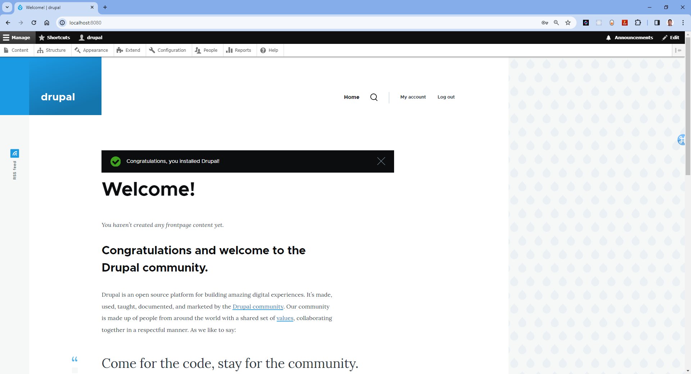

#  Setting up Drupal in a Docker Container


## Introduction

`Drupal` is a free open-source powerful and flexible content management system (CMS) written in PHP that allows you to create and manage websites. 

If you are new to Drupal and would like to learn more, you can refer to my article on [Getting Started with Drupal: A Beginner's Guide](https://anjikeesari.com/articles/drupal/){:target="_blank"}

In this lab, I will guide you through the process of creating Docker container for Drupal and run PostgreSQL database in the backend, and finally accessing the drupal website in the web browser.

The objective is to establish a local development environment for the drupal website. To accomplish this, you will create a docker Compose file, run them locally. All of these tasks we are doing here will be useful in later chapters when deploying to the Azure Kubernetes Service (AKS).


## Technical Scenario

 As an `Application Architect`, your responsibility is to design a content management system (CMS) that provides you with enhanced control and flexibility. By creating a custom Docker container with Drupal, you gain the ability to make modifications. You can adapt the Dockerfile to include additional packages, configurations, or custom modules/themes as per your project's specific requirements. This approach guarantees that your Drupal environment aligns with your project's needs while simultaneously utilizing Docker's advantages, including isolation, portability, and scalability.


## Objective

In this exercise, our objective is to accomplish and learn the following tasks:

- **Step-1:** Setup Git Repository for Drupal.
- **Step-2:** Create Drupal Project locally.
- **Step-3:** Create Docker Compose file
- **Step-4:** Build Drupal locally.
- **Step-5:** Run Drupal Container locally.


## Prerequisites

Before starting this lab, ensure you have the following prerequisites in place:

- Docker Desktop: - [Docker Downloads](https://docs.docker.com/get-docker/){:target="_blank"}.
- Git Client tool: - [Git Downloads](https://git-scm.com/downloads){:target="_blank"}.
- Git Repository: Initialize a Git repository for your Drupal website.
- Docker installed
- Docker compose installed
- PostgreSQL installed - this will allow you to run `psql` command line tool

Verify the docker installation by running following commands:
```sh
docker version
# or
docker --version
# or
docker -v
```

Verify the docker compose by running following commands:

```sh
docker-compose version
```

## Architecture Diagram

The following diagram shows the high level steps to create docker container for Drupal website.

[](images/drupal/drupal-9.png){:target="_blank"}

## Step-1: Setup Git Repository for Drupal

Setting up a Git repository for your Drupal project allows you to manage your code effectively, work in teams, and track the changes of your website's codebase.

- Create azure devops project
- Initialize repository

For this Drupal website, we can either use an existing git repository created in our first chapter or initiate a new one.

For example to clone an existing repository, run the following command:

```sh
git clone https://keesari.visualstudio.com/Microservices/_git/microservices
```

## Step-2: Create Drupal Project

In this step, we'll create a dedicated project or folder for our Drupal Website

*Create a new project:*

Inside our Git repository, create a new directory or folder specifically for your Drupal website. This folder will contain all the necessary files for Drupal website, including docker compose & Dockerfile and configurations.

[](images/drupal/drupal-7.png){:target="_blank"}


## Step-3:  Create Docker Compose file

To setup the Drupal with docker compose you need to first create a docker compose file that defines the drupal service and any necessary dependencies, such as a PostgreSQL database. 
 
Create a file named `docker-compose.yml` in your project directory. This file will define the services and configurations for your Drupal setup.

In the docker-compose.yml file, define the Drupal service. Use the official Drupal Docker image and specify any necessary configurations. Here's an example of a Drupal service definition:


```yml title="docker-compose.yml"
# Drupal with PostgreSQL
#
# Access via "http://localhost:8080"
#   (or "http://$(docker-machine ip):8080" if using docker-machine)
#
# During initial Drupal setup,
# Database type: PostgreSQL
# Database name: postgres
# Database username: postgres
# Database password: example
# ADVANCED OPTIONS; Database host: postgres

version: '3.1'

services:

  drupal:
    image: drupal:10-apache
    ports:
      - 8080:80
    volumes:
      - /var/www/html/modules
      - /var/www/html/profiles
      - /var/www/html/themes
      # this takes advantage of the feature in Docker that a new anonymous
      # volume (which is what we're creating here) will be initialized with the
      # existing content of the image at the same location
      - /var/www/html/sites
    restart: always

  postgres:
    image: postgres:16
    environment:
      POSTGRES_USER : postgres
      POSTGRES_PASSWORD: example   
    # ports:
    #     - "5432:5432"
    restart: always
```


- Uses the `drupal:10-apache` Docker image.
- Maps port 8080 on your host to port 8080 in the drupal container.
- Sets up an initial admin user and password for drupal.

## Step-4: Build Drupal locally

The `docker-compose up` command is used to start and initialize the services defined in a Docker Compose file. We will build the Docker container locally using the docker compose and ensure that the containerized application working as expected.

```sh
docker-compose up

# or - -d flag, it tells Docker Compose to run the containers in detached mode
docker-compose up -d

#output
[+] Running 33/2
 ✔ postgres 14 layers [⣿⣿⣿⣿⣿⣿⣿⣿⣿⣿⣿⣿⣿⣿]      0B/0B      Pulled
 ✔ drupal 17 layers [⣿⣿⣿⣿⣿⣿⣿⣿⣿⣿⣿⣿⣿⣿⣿⣿⣿]      0B/0B      Pulled
[+] Running 3/3
 ✔ Network drupal_default       Created
 ✔ Container drupal-drupal-1    Started
 ✔ Container drupal-postgres-1  Started
```

List running Docker containers on your system. 

```sh
docker ps

# output
CONTAINER ID   IMAGE                       COMMAND                  CREATED          STATUS          PORTS                    NAMES
b2701f4c0b44   postgres:16                 "docker-entrypoint.s…"   24 minutes ago   Up 24 minutes   5432/tcp                 drupal-postgres-1
5141598054d3   drupal:10-apache            "docker-php-entrypoi…"   24 minutes ago   Up 24 minutes   0.0.0.0:8080->80/tcp     drupal-drupal-1
```

List Docker images that are currently available on your local system.

```sh
docker image ls

# output
REPOSITORY                                                TAG                                                                          IMAGE ID       CREATED         SIZE
drupal                                                    10-apache                                                                    48fb247e75d6   2 weeks ago     594MB
postgres                                                  16                                                                           b0b90c1d9579   4 weeks ago     425MB
```


## Step-4.3: Run Drupal Container locally.

Run the Docker container locally to verify that the drupal website working correctly within a containerized environment. This step ensures that the containerized drupal website works as expected on your local machine.


List the running Docker containers on your system

```sh
docker container ls

# output
CONTAINER ID   IMAGE                       COMMAND                  CREATED          STATUS          PORTS                    NAMES
b2701f4c0b44   postgres:16                 "docker-entrypoint.s…"   25 minutes ago   Up 25 minutes   5432/tcp                 drupal-postgres-1
5141598054d3   drupal:10-apache            "docker-php-entrypoi…"   25 minutes ago   Up 25 minutes   0.0.0.0:8080->80/tcp     drupal-drupal-1
```

List the Docker networks that are available on your local system

```sh
docker network ls

# output
026de34a62dc   bridge                         bridge    local
0dcb9a6803a2   drupal_default                 bridge    local
```


if you open the docker desktop you will notice the new image & container started running.


<!-- 

docker run b0b90c1d9579 --env=POSTGRES_PASSWORD=example

docker run b0b90c1d9579 POSTGRES_HOST_AUTH_METHOD=trust

docker run -d -p 5432:5432 --name drupal-postgres -e POSTGRES_PASSWORD=example postgres:16

docker run --name postgres -e POSTGRES_PASSWORD=example -d postgres -p 5432:5432

docker run --name postgres-test -e POSTGRES_PASSWORD=password \
    -p 5432:5432 -v postgres-data:/var/lib/postgresql/data \
    -d postgres:latest

psql -h localhost -U postgres -d postgres -->
!!!note
    Ensure that you test the PostgreSQL connection using either the pgAdmin tool or the `psql` command-line tool.

[](images/drupal/drupal-8.png){:target="_blank"}

*Access Drupal Webstie*

Once the Drupal service is up and running, you can access the Drupal website by opening a web browser and navigating to http://localhost:8080. You can log in using the admin user and password you defined in the Drupal service configuration.


Drupal website > language

[](images/drupal/drupal-1.png){:target="_blank"}

Drupal > Installation Profile

[](images/drupal/drupal-2.png){:target="_blank"}

Drupal > Database configuration

[](images/drupal/drupal-3.png){:target="_blank"}


Drupal > configure site

[](images/drupal/drupal-4.png){:target="_blank"}

Drupal > welcome page

[](images/drupal/drupal-5.png){:target="_blank"}

Drupal > Users page

[](images/drupal/drupal-6.png){:target="_blank"}

## Conclusion

You have successfully created a Docker container for Drupal Website, container created as part of this task will be used in the future labs in AKS.

## References

For further information and resources related to setting up Drupal in a Docker container, refer to the following:

1. [Drupal Docker Official Repository](https://hub.docker.com/_/drupal){:target="_blank"}
2. [Docker Documentation](https://docs.docker.com/){:target="_blank"}
3. [Docker Compose Documentation](https://docs.docker.com/compose/){:target="_blank"}
4. [Drupal.org - Official Drupal Website](https://www.drupal.org/){:target="_blank"}

<!-- 

https://www.linode.com/docs/guides/how-to-install-drupal-with-docker-compose-ubuntu-18-04/ 
https://www.digitalocean.com/community/tutorials/how-to-install-drupal-with-docker-compose#prerequisites
-->
