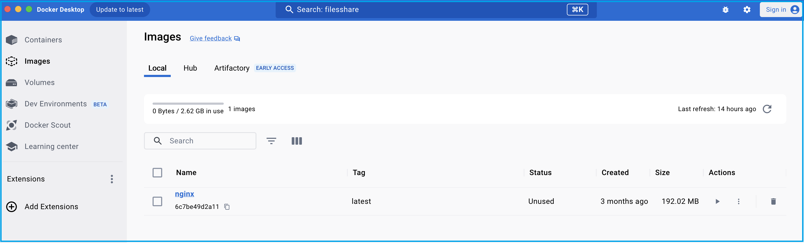
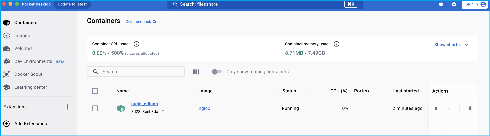
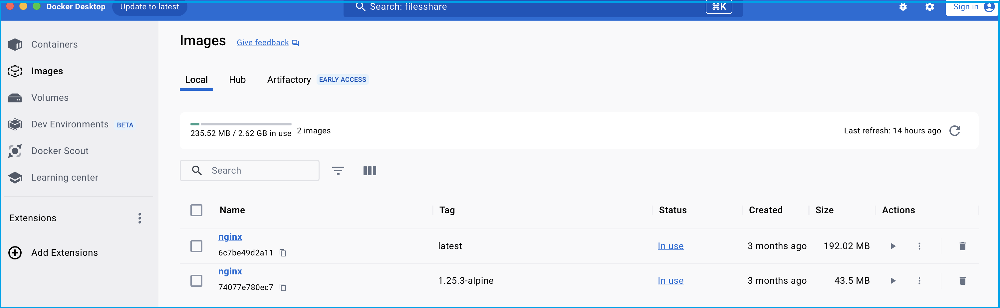
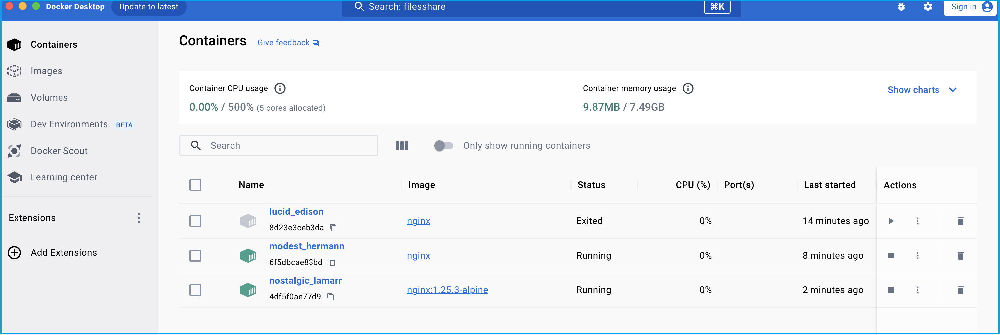
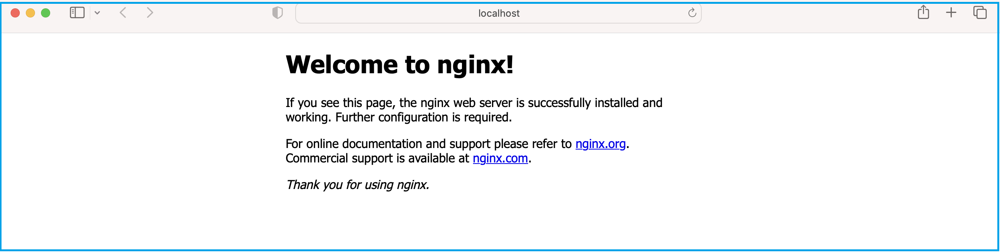
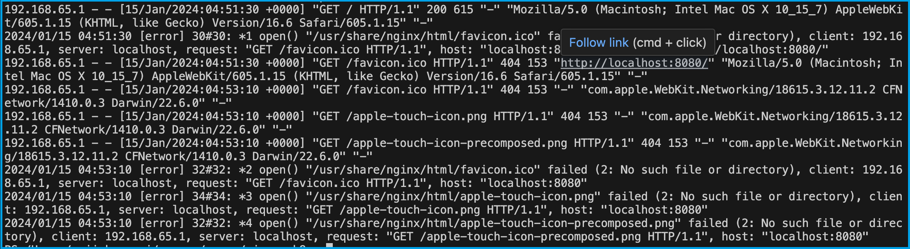

# **Chapter-3: Getting Started with Docker**

Docker is a platform for developing, shipping, and running applications in containers. Containers allow you to package an application and its dependencies into a single unit, making it easy to deploy consistently across different environments.  

In this lab, I will guide you through the process of creating Docker images, containers, and finally accessing the sample application in the web browser.

If you are new to Docker and want to learn its fundamental concepts, please visit our website. - [Exploring Docker Fundamentals](https://anjikeesari.com/articles/docker-fundamentals/){:target='_blank'} 

## Objective

In this exercise, our objective is to accomplish and learn the following tasks:

1. [Step 1: Get the Sample Application](#step-1-get-the-sample-application)
2. [Step 2: Create Docker Image](#step-2-create-docker-image)
3. [Step 3: Create Docker Container](#step-3-create-docker-container)
4. [Step 4: Port Binding](#step-4-port-binding)
5. [Step 5: Browse the Frontend Application](#step-5-browse-the-frontend-application)
6. [Step 6: View Docker Logs](#step-6-view-docker-logs)
7. [Step 7: Docker Commands](#step-7-docker-commands)


## Prerequisites

Before starting this lab, ensure you have the following prerequisites in place:

- Visual Studio Code :  - [Visual Studio Code Downloads](https://code.visualstudio.com/download){:target="_blank"}.
- Docker desktop :  - [Docker Downloads](https://docs.docker.com/get-docker/){:target="_blank"}.
- Git Client tool:  - [Git Downloads](https://git-scm.com/downloads){:target="_blank"}.

Verify the docker installation by running following commands:

```sh
docker version
# or
docker --version
# or
docker -v
```

## Step 1: Get the Sample Application

To begin, you'll need a sample application to work with. You can either use an existing application or create a simple one. 

In this task, we'll start by searching for an image to run locally. For example, we'll use the `Nginx` image from Docker Hub using the following URL: [Docker Hub Search](https://hub.docker.com/search?q=)


## Step 2: Create Docker Image

Now that we've identified the image we want to use, let's pull it from Docker Hub into our local Docker Desktop and run it locally.

```sh
docker pull nginx

# output
Using default tag: latest
latest: Pulling from library/nginx
a5573528b1f0: Pull complete 
8897d65c8417: Pull complete 
fbc138d1d206: Pull complete 
06f386eb9182: Pull complete 
aeb2f3db77c3: Pull complete 
64fb762834ec: Pull complete 
e5a7e61f6ff4: Pull complete 
Digest: sha256:4c0fdaa8b6341bfdeca5f18f7837462c80cff90527ee35ef185571e1c327beac
Status: Downloaded newer image for nginx:latest
docker.io/library/nginx:latest
```
[](images/docker/image-0.png){:target="_blank"}

List Docker images from Docker Desktop:

```sh
docker images

# output
REPOSITORY   TAG       IMAGE ID       CREATED        SIZE
nginx        latest    6c7be49d2a11   2 months ago   192MB
```

## Step 3: Create Docker Container

In this step, we'll create a Docker container by running the `docker run` command for the image.

```sh
docker run nginx

# output
/docker-entrypoint.sh: /docker-entrypoint.d/ is not empty, will attempt to perform configuration
/docker-entrypoint.sh: Looking for shell scripts in /docker-entrypoint.d/
/docker-entrypoint.sh: Launching /docker-entrypoint.d/10-listen-on-ipv6-by-default.sh
10-listen-on-ipv6-by-default.sh: info: Getting the checksum of /etc/nginx/conf.d/default.conf
10-listen-on-ipv6-by-default.sh: info: Enabled listen on IPv6 in /etc/nginx/conf.d/default.conf
/docker-entrypoint.sh: Sourcing /docker-entrypoint.d/15-local-resolvers.envsh
/docker-entrypoint.sh: Launching /docker-entrypoint.d/20-envsubst-on-templates.sh
/docker-entrypoint.sh: Launching /docker-entrypoint.d/30-tune-worker-processes.sh
/docker-entrypoint.sh: Configuration complete; ready for start up
2024/01/15 04:27:56 [notice] 1#1: using the "epoll" event method
2024/01/15 04:27:56 [notice] 1#1: nginx/1.25.3
2024/01/15 04:27:56 [notice] 1#1: built by gcc 12.2.0 (Debian 12.2.0-14) 
2024/01/15 04:27:56 [notice] 1#1: OS: Linux 6.3.13-linuxkit
2024/01/15 04:27:56 [notice] 1#1: getrlimit(RLIMIT_NOFILE): 1048576:1048576
2024/01/15 04:27:56 [notice] 1#1: start worker processes
2024/01/15 04:27:56 [notice] 1#1: start worker process 29
2024/01/15 04:27:56 [notice] 1#1: start worker process 30
2024/01/15 04:27:56 [notice] 1#1: start worker process 31
2024/01/15 04:27:56 [notice] 1#1: start worker process 32
2024/01/15 04:27:56 [notice] 1#1: start worker process 33
```

[](images/docker/image-1.png){:target="_blank"}

Open a new terminal and run the following command to list containers:

```sh
dockder ps

# output
CONTAINER ID   IMAGE     COMMAND                  CREATED         STATUS         PORTS     NAMES
8d23e3ceb3da   nginx     "/docker-entrypoint.…"   3 minutes ago   Up 2 minutes   80/tcp    lucid_edison

```

You can watch the `container logs` in the first terminal.

To exit the container, press `Ctrl + C`.


```sh
2024/01/15 04:28:00 [notice] 1#1: signal 28 (SIGWINCH) received
2024/01/15 04:28:00 [notice] 1#1: signal 28 (SIGWINCH) received
2024/01/15 04:30:50 [notice] 1#1: signal 28 (SIGWINCH) received
2024/01/15 04:30:50 [notice] 1#1: signal 28 (SIGWINCH) received
```

```sh
docker run -d nginx 

# output 
6f5dbcae83bd3ac6a0ea8bdb45f753bf72a723179503d4b4ebce4ddeae2378e2

# Now, you can run the following command to see the list of running containers:
docker ps
```

Alternatively, you can also run the image directly from Docker Hub. Here are the example commands:

```sh
docker run nginx:1.25.3-alpine

# output
Unable to find image 'nginx:1.25.3-alpine' locally
1.25.3-alpine: Pulling from library/nginx
2c03dbb20264: Pull complete 
0ed066aadd11: Pull complete 
4eeb1ddd7404: Pull complete 
9ba8827f116b: Pull complete 
2bc60ecca38f: Pull complete 
11d942ec6258: Pull complete 
fed1b403bb45: Pull complete 
392e92e0a8e8: Pull complete 
Digest: sha256:a59278fd22a9d411121e190b8cec8aa57b306aa3332459197777583beb728f59
Status: Downloaded newer image for nginx:1.25.3-alpine
/docker-entrypoint.sh: /docker-entrypoint.d/ is not empty, will attempt to perform configuration
/docker-entrypoint.sh: Looking for shell scripts in /docker-entrypoint.d/
/docker-entrypoint.sh: Launching /docker-entrypoint.d/10-listen-on-ipv6-by-default.sh
10-listen-on-ipv6-by-default.sh: info: Getting the checksum of /etc/nginx/conf.d/default.conf
10-listen-on-ipv6-by-default.sh: info: Enabled listen on IPv6 in /etc/nginx/conf.d/default.conf
/docker-entrypoint.sh: Sourcing /docker-entrypoint.d/15-local-resolvers.envsh
/docker-entrypoint.sh: Launching /docker-entrypoint.d/20-envsubst-on-templates.sh
/docker-entrypoint.sh: Launching /docker-entrypoint.d/30-tune-worker-processes.sh
/docker-entrypoint.sh: Configuration complete; ready for start up
2024/01/15 04:39:23 [notice] 1#1: using the "epoll" event method
2024/01/15 04:39:23 [notice] 1#1: nginx/1.25.3
2024/01/15 04:39:23 [notice] 1#1: built by gcc 12.2.1 20220924 (Alpine 12.2.1_git20220924-r10) 
2024/01/15 04:39:23 [notice] 1#1: OS: Linux 6.3.13-linuxkit
2024/01/15 04:39:23 [notice] 1#1: getrlimit(RLIMIT_NOFILE): 1048576:1048576
2024/01/15 04:39:23 [notice] 1#1: start worker processes
2024/01/15 04:39:23 [notice] 1#1: start worker process 29
2024/01/15 04:39:23 [notice] 1#1: start worker process 30
2024/01/15 04:39:23 [notice] 1#1: start worker process 31
2024/01/15 04:39:23 [notice] 1#1: start worker process 32
2024/01/15 04:39:23 [notice] 1#1: start worker process 33
```
Now, you'll see two containers running, one from local Docker Desktop and the second one from the remote Docker Hub registry.

```sh
docker ps

# output
CONTAINER ID   IMAGE                 COMMAND                  CREATED              STATUS              PORTS     NAMES
4df5f0ae77d9   nginx:1.25.3-alpine   "/docker-entrypoint.…"   About a minute ago   Up About a minute   80/tcp    nostalgic_lamarr
6f5dbcae83bd   nginx                 "/docker-entrypoint.…"   6 minutes ago        Up 6 minutes        80/tcp    modest_hermann
```

docker images from docker desktop

[](images/docker/image-2.png){:target="_blank"}

docker containers from docker desktop

[](images/docker/image-3.png){:target="_blank"}

you can also run following commnds to see images and containers running locally.

```sh
docker image ls

# output
REPOSITORY   TAG             IMAGE ID       CREATED        SIZE
nginx        latest          6c7be49d2a11   2 months ago   192MB
nginx        1.25.3-alpine   74077e780ec7   2 months ago   43.5MB
```


```sh
docker container ls

# output
CONTAINER ID   IMAGE                 COMMAND                  CREATED          STATUS          PORTS     NAMES
4df5f0ae77d9   nginx:1.25.3-alpine   "/docker-entrypoint.…"   5 minutes ago    Up 5 minutes    80/tcp    nostalgic_lamarr
6f5dbcae83bd   nginx                 "/docker-entrypoint.…"   10 minutes ago   Up 10 minutes   80/tcp    modest_hermann
```

## Step 4: Port Binding

Your application is now running inside the Docker container, and you've mapped port 8080 from the container to your host. This means you can access your application using `http://localhost:8080` in your web browser.


```sh
# list the containers
docker ps

# then stop the container 
docker stop 6f5dbcae83bd
```

```sh
docker run -d -p 8080:80 nginx:1.25.3-alpine

# output
f21ada11af57b799c9b834d0a6c8e6e1628c6289d64cf65fdc0968cbe94500fd

```

## Step 5: Browse the Frontend Application

Open your web browser and navigate to `http://localhost:8080` to access your Node.js application running in the Docker container.

[](images/docker/image-4.png){:target="_blank"}

## Step 6: View Docker Logs

To view the logs of your running container, use the following command:

This will display the logs generated by your application.

```sh
docker logs f21ada11af57
```
[](images/docker/image-5.png){:target="_blank"}

```sh
docker ps -a 

# output
CONTAINER ID   IMAGE                 COMMAND                  CREATED          STATUS                      PORTS                  NAMES
f21ada11af57   nginx:1.25.3-alpine   "/docker-entrypoint.…"   7 minutes ago    Up 7 minutes                0.0.0.0:8080->80/tcp   nifty_goldberg
4df5f0ae77d9   nginx:1.25.3-alpine   "/docker-entrypoint.…"   19 minutes ago   Up 19 minutes               80/tcp                 nostalgic_lamarr
6f5dbcae83bd   nginx                 "/docker-entrypoint.…"   25 minutes ago   Exited (0) 10 minutes ago                          modest_hermann
8d23e3ceb3da   nginx                 "/docker-entrypoint.…"   31 minutes ago   Exited (0) 25 minutes ago                          lucid_edison
```

Naming the Container:

You can also name the container using the `--name` flag:

```sh
docker run --name nginx-app -d -p 8080:80 nginx:1.25.3-alpine

# output
58e464680a8da16b717171732fb1b67b678b1c8efb115f9adad8d3257c6cc875

# run following command to see the name
docker ps
docker logs nginx-app
```

## Step 7: Docker Commands

For more comprehensive details on Docker commands, please refer to the [Docker Commands Cheat Sheet](https://anjikeesari.com/developertools/cheatsheets/docker-cheat-sheet/){:target='_blank'} on our website.

## Conclusion

In summary, this guide introduced you to Docker, a tool that simplifies how we build, package, and run applications. We've covered essential steps, like getting an example application (nginx), creating Docker images and running containers. We've also learned how to manage ports, access apps in web browsers, and check what's happening behind the scenes with Docker logs. Plus, we touched on some common Docker commands.

Docker is a powerful tool for containerization, enabling you to package and deploy applications with ease. By following these steps, you've created your first Docker application. 


## References

- [Getting started guide](https://docs.docker.com/get-started/){:target="_blank"}
- [Docker images](https://hub.docker.com/search?q=){:target="_blank"}
- [Docker Documentation](https://docs.docker.com/){:target="_blank"}
- [Docker Hub](https://hub.docker.com/){:target="_blank"}
- [Nginx Docker Official Images](https://hub.docker.com/_/nginx){:target="_blank"}
