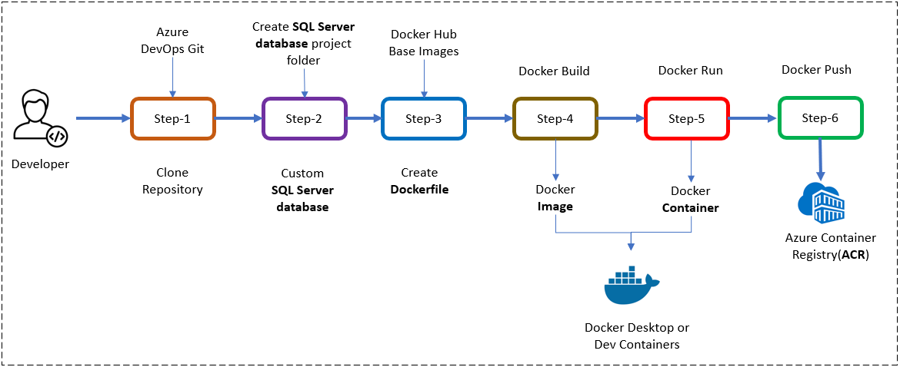
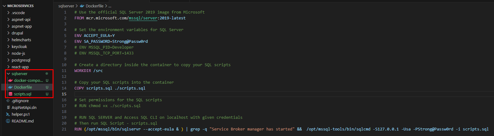
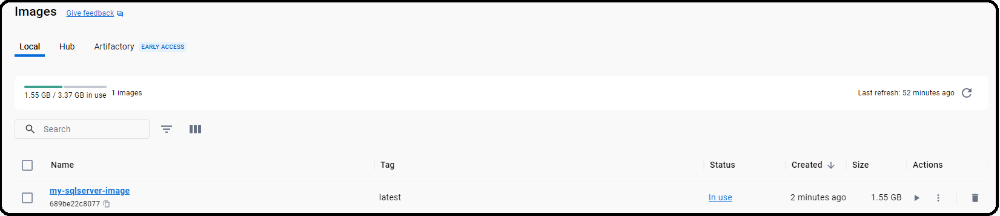
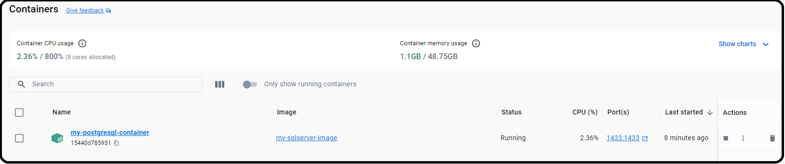
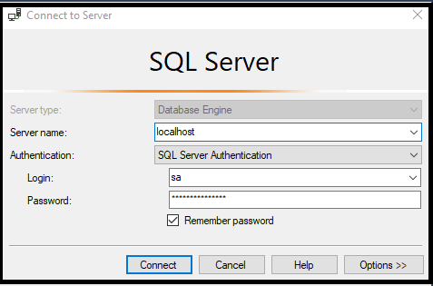
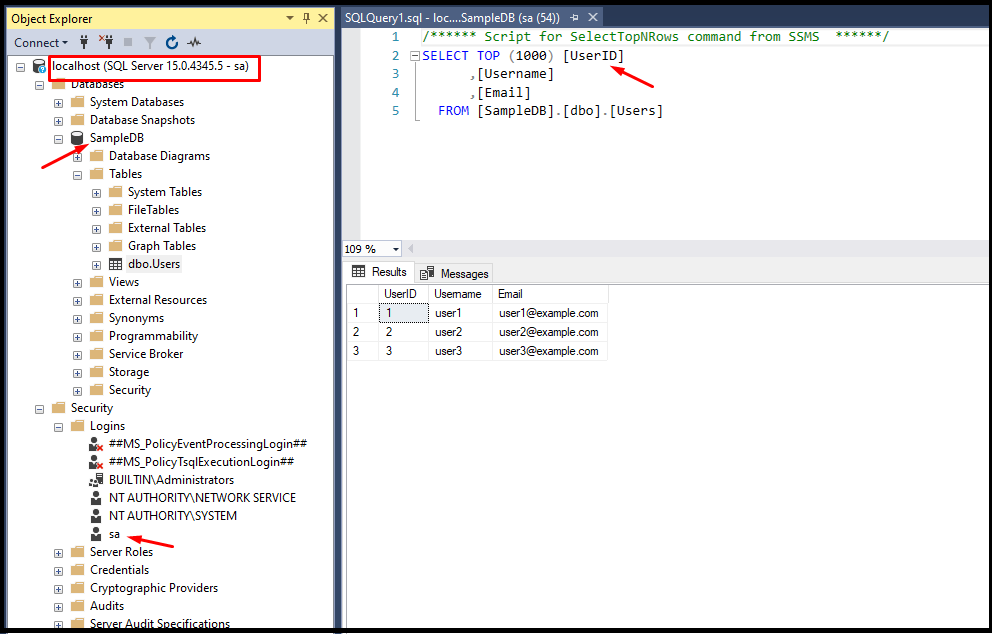
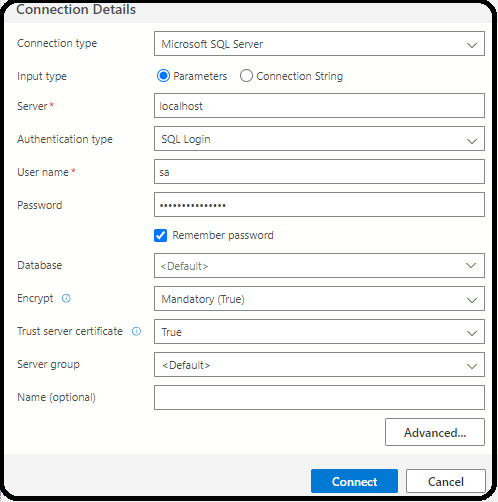
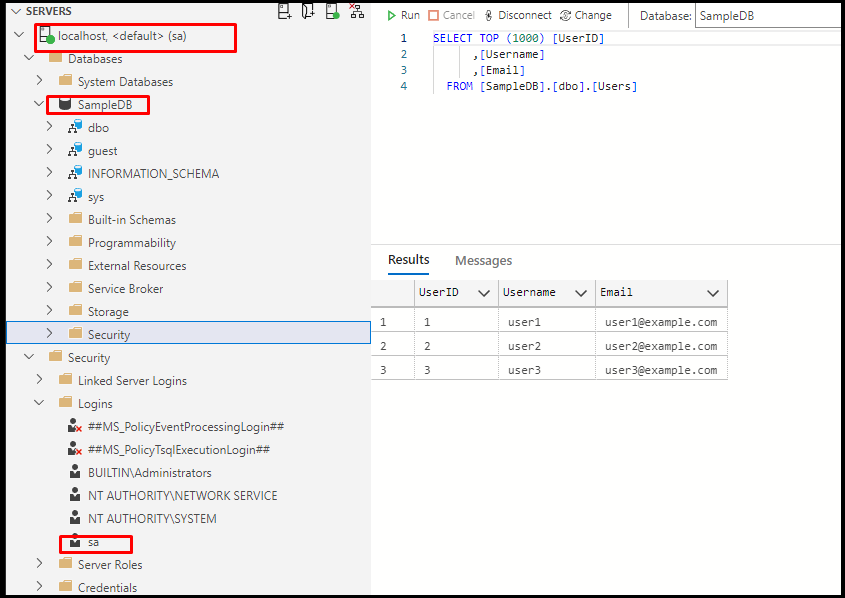

#  **Setting up SQL Server database in a Docker Container**

## Introduction

`SQL Server` is a relational database management system (RDBMS) developed by Microsoft. SQL Server is widely used by organizations of all sizes for managing their data and building mission-critical applications.

In this lab, I will guide you through the process of creating Docker container for SQL Server database and run SQL Server database in the docker, and finally accessing the SQL Server database using SQL Server Management Studio (`SSMS`) and `Azure Data Studio` tools.


## Benefits of SQL Server Container

Creating a Docker container for SQL Server database offers several benefits:

- **Portability**: Docker containers encapsulate the SQL Server database and its dependencies, making it easy to deploy and run the database on any system that supports Docker, regardless of the underlying operating system or hardware. This portability ensures consistency in development, testing, and production environments.

- **Isolation**: Docker containers provide a lightweight and isolated environment for running applications, including databases like SQL Server. Each container operates independently of other containers and the host system, reducing potential conflicts and dependencies.

3. **Consistency**: Docker containers use a declarative approach to define the environment and dependencies required for running the SQL Server database. This ensures consistency across different environments, such as development, testing, and production, reducing the risk of configuration errors and deployment issues.

4. **Scalability**: Docker containers allow for easy scaling of SQL Server databases by spinning up multiple instances of the containerized database as needed. Container orchestration tools like Kubernetes can automate the deployment and management of containerized databases to meet varying workload demands.

5. **Ease of Deployment**: Docker containers simplify the deployment process for SQL Server databases by packaging the database and its dependencies into a single unit that can be easily distributed and deployed across different environments. This streamlines the deployment workflow and reduces the time and effort required for provisioning and configuring databases.

## Objective


The objective is to establish a local development environment for the SQL Server database. To accomplish this, you will create a Dockerfile file, run them locally. All of these tasks we are doing here will be useful in later chapters when deploying to the Azure Kubernetes Service (AKS).

In this exercise, our objective is to accomplish and learn the following tasks:

- **Step-1:** Setup Git Repository for SQL Server database.
- **Step-2:** Create Folder Structure for SQL Server database.
- **Step-3:** Add Dockerfiles to the Database Project
   - **Step-3.1:** Docker Build Locally
   - **Step-3.2:** Docker Run Locally
<!-- - **Step-4:** Create Docker Compose file
   - **Step-4.1:** Build SQL Server database locally.
   - **Step-4.2:** Run SQL Server database Container locally. -->
- **Step-4:** Test the SQL Server database connection using SSMS
- **Step-5:** Test the SQL Server database connection using Azure Data Studio
- **Step-6:** Push Docker Container to ACR

By the end of this lab, you will have a SQL Server database running in a Docker container, managed through Azure DevOps, and ready for use in your development and production environments.


## Prerequisites

Before starting this lab, ensure you have the following prerequisites in place:

- Docker Desktop: - [Docker Downloads](https://docs.docker.com/get-docker/){:target="_blank"}.
- Docker compose installed
- SQL Server Management Studio installed - this will allow you to manage the SQL Server databases
- Azure Data Studio installed - this will allow you to connect to SQL server databases
- Basic understanding of Docker and SQL Server.
- Access to an Azure Container Registry (ACR).

Verify the docker installation by running following commands:

```sh
docker version
# or
docker --version
# or
docker -v
```

Verify the docker compose by running following commands:

```sh
docker-compose version
```

## Architecture Diagram

The following diagram shows the high level steps to create docker container for SQL Server database.

[](images/sqlserver/image-8.png){:target="_blank"}

## Step-1: Setup Git Repository for SQL Server database

Setting up a Git repository for your SQL Server database project allows you to manage your code effectively, work in teams, and track the changes of your database codebase.

- Create a new project in Azure DevOps for your database-related work.
- Create a repository within the project to store your database scripts and Dockerfiles.

For example to clone an existing repository, run the following command:

```sh
git clone https://keesari.visualstudio.com/Microservices/_git/microservices
```

## Step-2: Create Folder Structure for SQL Server database

In this step, we'll create a dedicated project or folder for our SQL Server database

*Create a new database project:*

Inside our Git repository, create a new directory or folder specifically for your SQL Server database. This folder will contain all the necessary files for SQL Server database, including databaseschema scripts, sample data scripts, docker compose & Dockerfile and other sql files.

Here's a suggestion for a folder structure for a SQL Server database project:

```sh
your-project-name/
│
├── sql/
│   ├── scripts/
│   │   ├── schema/
│   │   │   ├── tables/
│   │   │   │   ├── table1.sql
│   │   │   │   ├── table2.sql
│   │   │   │   └── ...
│   │   │   ├── views/
│   │   │   │   ├── view1.sql
│   │   │   │   ├── view2.sql
│   │   │   │   └── ...
│   │   │   ├── functions/
│   │   │   │   ├── function1.sql
│   │   │   │   ├── function2.sql
│   │   │   │   └── ...
│   │   │   └── procedures/
│   │   │       ├── procedure1.sql
│   │   │       ├── procedure2.sql
│   │   │       └── ...
│   │   └── data/
│   │       ├── seed_data.sql
│   │       └── ...
│   └── migrations/
│       ├── version1/
│       │   ├── up.sql
│       │   └── down.sql
│       ├── version2/
│       │   ├── up.sql
│       │   └── down.sql
│       └── ...
│
├── Dockerfile
└── README.md
```

Explanation:

- `sql/`: This folder contains all SQL-related files for your project.
  - `scripts/`: Contains scripts for creating database objects like tables, views, functions, and stored procedures.
    - `schema/`: Contains subfolders for different types of database objects.
      - `tables/`, `views/`, `functions/`, `procedures/`: Each of these folders contains SQL scripts for the respective database objects.
  - `data/`: Contains data scripts such as seed data.
- `migrations/`: Contains SQL migration scripts for managing database schema changes over time. Each migration version should have an `up.sql` script for applying the migration and a `down.sql` script for reverting it.
- `Dockerfile`: The Dockerfile for building a Docker image for your SQL Server database.
- `README.md`: Documentation for your project.

You can adjust this structure based on the specific needs of your project. For instance, if you have additional folders or files, you can add them accordingly.

[](images/sqlserver/image-7.png){:target="_blank"}
<!-- 
**Dockerfile vs Docker Compose**

A `Dockerfile` contains a set of instructions and commands used by Docker to automatically build a new container image.

The `docker-compose.yaml` file is a configuration file used by Docker Compose, a tool for defining and running multi-container Docker applications. With a single command, Docker Compose uses the docker-compose.yaml file to create and start all the services defined in the file.

In this lab I'll show you both approaches for creating SQL Server database. -->

## Step-3: Add Dockerfiles to the Database Project

To build a Docker image for SQL Server, create a Dockerfile in your project's root directory:

```Dockerfile
# Use the official SQL Server 2019 image from Microsoft
FROM mcr.microsoft.com/mssql/server:2019-latest

# Set the environment variables for SQL Server
ENV ACCEPT_EULA=Y
ENV SA_PASSWORD=Strong@Passw0rd
# ENV MSSQL_PID=Developer
# ENV MSSQL_TCP_PORT=1433

# Create a directory inside the container to copy your SQL scripts
WORKDIR /src

# Copy your SQL scripts into the container [optional]
COPY scripts.sql ./scripts.sql

# Set permissions for the SQL scripts
# RUN chmod +x ./scripts.sql

# RUN SQL SERVER and Access SQL CLI on localhost with given credentials
# Then run SQL Script - scripts.sql
RUN (/opt/mssql/bin/sqlservr --accept-eula & ) | grep -q "Service Broker manager has started" &&  /opt/mssql-tools/bin/sqlcmd -S127.0.0.1 -Usa -PStrong@Passw0rd -i scripts.sql
```


In this Dockerfile:

- We start with the official SQL Server 2019 image provided by Microsoft.
- Set environment variables `ACCEPT_EULA` to 'Y' and `SA_PASSWORD` to the desired strong password for the 'sa' account.
- Create a directory inside the container to copy your SQL scripts (`/src` in this case).
- Copy your SQL scripts into the container (assuming you have them in the same directory as your Dockerfile).
- Set permissions for the SQL scripts (if needed).
- Finally, specify the command to start SQL Server when the container starts.

You would replace `"./scripts.sql"` with the path to your actual SQL script file.

```sh
USE master;
GO

-- Create SampleDB
CREATE DATABASE SampleDB;
GO

USE SampleDB;
GO

-- Create Users table
CREATE TABLE Users (
    UserID INT PRIMARY KEY,
    Username NVARCHAR(50),
    Email NVARCHAR(100)
);
GO

-- Insert some sample data into Users table
INSERT INTO Users (UserID, Username, Email) VALUES (1, 'user1', 'user1@example.com');
INSERT INTO Users (UserID, Username, Email) VALUES (2, 'user2', 'user2@example.com');
INSERT INTO Users (UserID, Username, Email) VALUES (3, 'user3', 'user3@example.com');
GO
```

**Step-3.1: Docker Build Locally**

To build the Docker image, navigate to the directory containing the Dockerfile and your SQL script, then run:

```bash
docker build -t my-sqlserver-image .
```

**Docker desktop > Image**

[](images/sqlserver/image-1.png){:target="_blank"}

**Step-3.2: Docker Run Locally**

To run your SQL Server container locally for testing and development, use the following command:

```bash
docker run -d --name my-sqlserver-container -p 5432:5432 my-sqlserver-image
```

This command creates a container named `my-sqlserver-container` and maps port 5432 from the container to the host.

**Docker desktop > Container**

[](images/sqlserver/image-2.png){:target="_blank"}


<!-- ## Step-4:  Create Docker Compose file

To setup the SQL Server database with docker compose you need to first create a docker compose file that defines the SQL Server database service and any necessary dependencies.

Create a file named `docker-compose.yml` in your project directory. This file will define the services and configurations for your SQL Server database setup.

In the docker-compose.yml file, define the SQL Server database service. Use the official SQL Server database Docker image and specify any necessary configurations. Here's an example of a SQL Server database service definition:


```yml title="docker-compose.yml"
# Database type: SQL Server
# Database name: postgres
# Database username: postgres
# Database password: example
# ADVANCED OPTIONS; Database host: postgres

version: '3'

services:
  postgres:
    image: postgres:16
    environment:
      POSTGRES_USER : postgres
      POSTGRES_PASSWORD: example
    # ports:
    #     - "5432:5432"
    restart: always
```


- Uses the `postgres:16` Docker image.
- Maps port 5432 on your host to port 5432 in the SQL Server database container.
- Sets up an initial user and password for SQL Server database.

**Step-4.1: Build SQL Server database locally**

The `docker-compose up` command is used to start and initialize the services defined in a Docker Compose file. We will build the Docker container locally using the docker compose and ensure that the containerized application working as expected.

```sh
docker-compose up

# or - -d flag, it tells Docker Compose to run the containers in detached mode
docker-compose up -d

#output
[+] Running 33/2
 ✔ postgres 14 layers [⣿⣿⣿⣿⣿⣿⣿⣿⣿⣿⣿⣿⣿⣿]      0B/0B      Pulled
[+] Running 3/3
 ✔ Network sqlserver_default       Created
 ✔ Container sqlserver-postgres-1  Started
```

List running Docker containers on your system.

```sh
docker ps

# output
CONTAINER ID   IMAGE         COMMAND                  CREATED          STATUS          PORTS                    NAMES
a433ad35d0a1   postgres:16   "docker-entrypoint.s…"   20 seconds ago   Up 19 seconds   0.0.0.0:5432->5432/tcp   sqlserver-postgres-1
```

List Docker images that are currently available on your local system.

```sh
docker image ls

# output
REPOSITORY   TAG       IMAGE ID       CREATED       SIZE
postgres     16        488c2842403b   4 weeks ago   448MB
```


**Step-4.2: Run SQL Server database Container locally**

Run the Docker container locally to verify that the SQL Server database  working correctly within a containerized environment. This step ensures that the containerized SQL Server database  works as expected on your local machine.


List the running Docker containers on your system

```sh
docker container ls

# output
CONTAINER ID   IMAGE         COMMAND                  CREATED          STATUS          PORTS                    NAMES
a433ad35d0a1   postgres:16   "docker-entrypoint.s…"   42 seconds ago   Up 41 seconds   0.0.0.0:5432->5432/tcp   sqlserver-postgres-1
```

List the Docker networks that are available on your local system

```sh
docker network ls

# output
NETWORK ID     NAME      DRIVER    SCOPE
a63fce88f432   bridge    bridge    local
3a43b39f60b0   host      host      local
21fbef3d5c78   none      null      local
```


if you open the docker desktop you will notice the new image & container started running.


<!--

docker run b0b90c1d9579 --env=POSTGRES_PASSWORD=example

docker run b0b90c1d9579 POSTGRES_HOST_AUTH_METHOD=trust

docker run -d -p 5432:5432 --name SQL Server database-postgres -e POSTGRES_PASSWORD=example postgres:16

docker run --name postgres -e POSTGRES_PASSWORD=example -d postgres -p 5432:5432

docker run --name postgres-test -e POSTGRES_PASSWORD=password \
    -p 5432:5432 -v postgres-data:/var/lib/sqlserver/data \
    -d postgres:latest

psql -h localhost -U postgres -d postgres 
!!!note
    Ensure that you test the SQL Server connection using either the pgAdmin tool or the `psql` command-line tool.
 -->

## Step-4: Test the SQL Server database connection using SSMS

Testing the SQL Server database connection using SQL Server Management Studio (SSMS) ensures that the database server is accessible and that users can connect to it successfully.

Launch SQL Server Management Studio (SSMS) and provide the necessary credentials to connect to the SQL Server instance.

SSMS > Login Page

[](images/sqlserver/image-5.png){:target="_blank"}

SSMS > After Login

[](images/sqlserver/image-6.png){:target="_blank"}

## Step-5: Test the SQL server database connection using Azure Data Studio

Azure Data Studio is a cross-platform database tool that offers features similar to SQL Server Management Studio (SSMS) but with additional support for Azure services and extensions.

Launch Azure Data Studio and provide the necessary credentials to connect to the SQL Server instance.


SSMS > Login Page

[](images/sqlserver/image-3.png){:target="_blank"}


SSMS > After Login

[](images/sqlserver/image-4.png){:target="_blank"}

## Step-6: Push Docker Container to ACR

Push your SQL Server container image to Azure Container Registry (ACR) for use in AKS. Follow these steps:

**Log in** to your Azure account using the Azure CLI:

```bash
az login
```

**Authenticate** to your ACR:

```bash
az acr login --name myacr
```

Replace `myacr` with your ACR name.

**Tag** your local Docker image with the ACR login server:

```bash
docker tag my-sqlserver-image myacr.azurecr.io/my-sqlserver-image:v1
```

**Push** the Docker image to ACR:

```bash
docker push myacr.azurecr.io/my-sqlserver-image:v1
```

Replace `myacr` and `v1` with your ACR name and desired image version.

Now, your SQL Server container image is stored in Azure Container Registry and can be easily pulled and deployed from AKS to Azure Database for SQL Server - Flexible Server.

## Conclusion

You have successfully created a Docker container for SQL Server database, container created as part of this task will be used in the future labs in AKS.

## References
- [Docker Hub](https://hub.docker.com/search?q=){:target="_blank"}
- [Docker Hub - Microsoft SQL Server image](https://hub.docker.com/_/microsoft-mssql-server){:target="_blank"}
- [Microsoft MSDN- Install SQL Server](https://hub.docker.com/_/microsoft-mssql-server){:target="_blank"}
- [Microsoft Github- mssql-docker](https://github.com/microsoft/mssql-docker/blob/master/linux/mssql-server-linux/Dockerfile){:target="_blank"}

<!-- ## Reference
https://medium.com/bright-days/basic-docker-image-dockerfile-sql-server-with-custom-prefill-db-script-8f12f197867a
https://github.com/brightdays/dockersqlgen/blob/master/Dockerfile
https://learn.microsoft.com/en-us/sql/linux/quickstart-install-connect-docker?view=sql-server-linux-2017&pivots=cs1-bash&source=post_page-----8f12f197867a--------------------------------#pullandrun2017
https://learn.microsoft.com/en-us/sql/linux/quickstart-install-connect-ubuntu?view=sql-server-linux-2017&tabs=ubuntu2004
https://www.sqlshack.com/creating-your-own-sql-server-docker-image/
https://github.com/microsoft/mssql-docker/blob/master/linux/mssql-server-linux/Dockerfile
https://www.youtube.com/watch?v=fFpDf5si_Hw
-->
